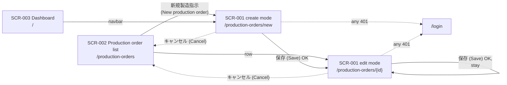
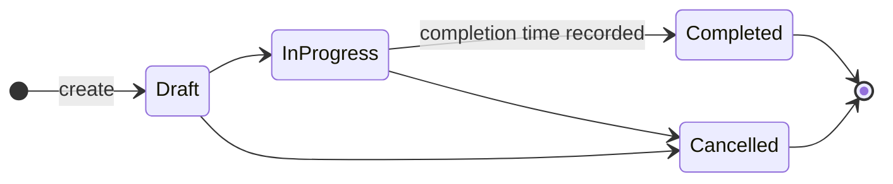
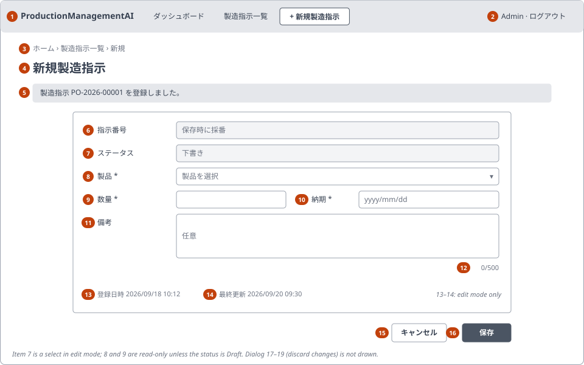
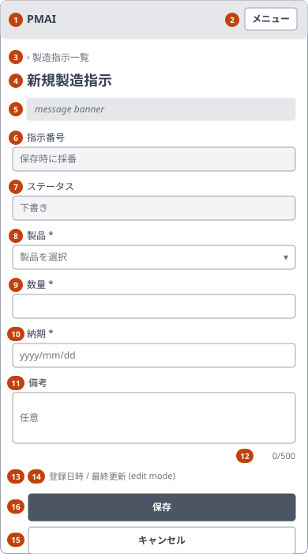

<!-- Based on ai/templates/basic-design.md (revision at commit e7e0d36). -->

# Production Order Create/Edit — Basic Design Document (基本設計書)

## Document control (改版履歴)

| Field | Value |
| --- | --- |
| Document ID | 001_BD |
| Category | UI |
| System name | ProductionManagementAI |
| Subsystem name | Production orders |
| Work item | WI-002 |
| Based on brief.md revision | 1 |
| Created by | Claude (for ThanhTN) |
| Created date | 2026-09-18 |
| Last updated by | Claude (for ThanhTN) |
| Last updated date | 2026-09-23 |

| Version | Date | Author | Revision content |
| --- | --- | --- | --- |
| 1 | 2026-09-18 | Claude (for ThanhTN) | Initial creation (WI-002 restart against the rewritten BD template; supersedes the scrapped first-pass 001_BD) |
| 2 | 2026-09-18 | Claude (for ThanhTN) | DEC-009–DEC-012 resolved: due-date check condition, stale-save rejection (V-08), plant timezone, `PO-YYYY-NNNNN` order number |
| 3 | 2026-09-18 | Claude (for ThanhTN) | DEC-017–DEC-020: plant timezone `Asia/Tokyo`; Cancel confirmation when edited (REQ-019, items 17–19, E-07/E-09); 30 seeded products; CSRF approach decided |
| 4 | 2026-09-18 | Claude (for ThanhTN) | Aligned with 001_DD: quantity upper bound (V-02, DEC-024) |
| 5 | 2026-09-22 | Claude (for ThanhTN) | Screen B exists (WI-003): the screen's entry point and every exit that used to lead to the home page now lead to the production-order list |
| 6 | 2026-09-22 | Claude (for ThanhTN) | Completion tracking for Screen C (WI-004 REQ-033, DEC-002/DEC-003): saving `InProgress → Completed` records the completion time (FN-006, Actions and business rules, Data design overview). No visible change to SCR-001 |
| 7 | 2026-09-22 | Claude (for ThanhTN) | WI-004 (DEC-016, DEC-021): the shared header now carries the application navbar specified in 003_BD "Shared application header"; items 1–2 point to it. The breadcrumb stays. WI-004 DEC-022: the discard-changes confirmation (FN-009, dialog 17) now also guards leaving an edited form through any in-app link — navbar, breadcrumb, app name — not only Cancel (E-07a); Discard then goes to that link's destination. No field, rule, validation or API changes |
| 8 | 2026-09-23 | Claude (for ThanhTN) | Diagrams redrawn for the revised BD template (RFC 0009): screen transition and status state machine in Mermaid; PC and SP layouts as SVG wireframes under `wireframes/`. The screen transition now matches the screen list: Cancel returns to SCR-002, which the text diagram had not shown since version 5. No field, rule, validation, event or API changes |
| 9 | 2026-09-23 | Claude (for ThanhTN) | WI-005: the UI is Japanese. Quoted UI text and messages give the implemented Japanese text with an English gloss (WI-005 DEC-003); status labels (M-01, M-02), timestamp format (M-04, `YYYY/MM/DD HH:mm`), page titles and wireframes updated; demo products are automobile parts with Japanese names; two screen-transition edges drawn longer so their labels don't overlap in the PDF. No field, rule, validation, event or API changes |

## System overview

One screen, SCR-001, lets a signed-in Admin or Operator create a new production order or edit an existing one, including moving it through its status workflow. It is the harness's first end-to-end business screen ("Screen A").

| Requirement ID | Description | Covered by section |
| --- | --- | --- |
| REQ-010 | Create a production order | Business flow; §3 screen items; §6 events; Success and exception flows |
| REQ-011 | Edit an existing production order | Business flow; 0-3 URL parameters; §5 V-08; §6 events; Success and exception flows |
| REQ-012 | Only authenticated Admin/Operator | 0-1 basic information; Actions and business rules; Exception flows |
| REQ-013 | Quantity positive whole number | §5 validation V-02 |
| REQ-014 | Due date today or later | §5 validation V-03, V-04 |
| REQ-015 | Product must exist | §5 validation V-01; Data design overview |
| REQ-016 | Notes ≤ 500 characters | §5 validation V-05 |
| REQ-017 | Fixed status state machine | Screen transition (status diagram); §3 item 6; §4 M-02; §5 V-06 |
| REQ-018 | Product/quantity locked after Draft | §3 display conditions; §5 V-07; Exception flows |
| REQ-019 | Confirm before discarding changes on Cancel | §3 items 17–19; §6 E-07, E-09 |

## Overall configuration and architecture

Uses the confirmed stack (`ai/project.md`): a React (Vite + TypeScript + Tailwind CSS v4) page calling the .NET 10 backend's JSON API over the same origin, layered Domain/Application/Infrastructure/Api (0001_ADR), persisted in PostgreSQL 17. Access is gated by WI-001's cookie session and role checks (0002_ADR): `ProtectedRoute` on the frontend, an authorization policy on the backend. No new architecture boundary or external system is introduced.

## Function list

| Function ID | Function name | Description | Related requirement ID |
| --- | --- | --- | --- |
| FN-001 | Create production order | Save a new order with a system-generated order number and status `Draft` | REQ-010 |
| FN-002 | Edit production order | Save changes to an existing order's editable fields | REQ-011, REQ-018 |
| FN-003 | Load production order | Fetch an existing order for display in edit mode | REQ-011 |
| FN-004 | List products | Provide the product choices for the product dropdown | REQ-015 |
| FN-005 | Validate order input | Enforce product, quantity, due date and notes rules (client for feedback, server authoritative) | REQ-013, REQ-014, REQ-015, REQ-016 |
| FN-006 | Enforce status transitions | Allow only the defined state-machine edges; on `InProgress → Completed`, record the completion time (WI-004 FN-021) | REQ-017; WI-004 REQ-033 |
| FN-007 | Enforce field lock by status | Reject product/quantity changes once the order is not `Draft` | REQ-018 |
| FN-008 | Enforce authentication and role | Reject unauthenticated (401) and non-Admin/Operator (403) requests | REQ-012 |
| FN-009 | Confirm discard on leaving | Ask before discarding unsaved changes, whether the user leaves by Cancel or by an in-app link (WI-004 DEC-022) | REQ-019 |

## Actors and business flow

Actors: Admin, Operator — both already signed in through WI-001's login screen (DEC-001).

**Create (UC-001)**

1. User opens the create route → system loads the product list (FN-004) and shows an empty form; status shows `Draft`, order number shows 「保存時に採番」 (Assigned on save).
2. User selects a product and enters quantity, due date and optional notes → system shows field errors as fields lose focus (FN-005).
3. User presses **保存** (Save) → system validates all fields client-side; if valid, sends the request; the server re-validates (FN-005, FN-008) and saves (FN-001).
4. On success → system navigates to the edit route of the new order and shows 「製造指示 {order number} を登録しました。」 (Production order {order number} created.)

**Edit (UC-002, UC-003)**

1. User opens the edit route for an order → system loads the order (FN-003) and products (FN-004) and shows the form pre-filled; product/quantity are read-only unless status is `Draft`; the status dropdown offers only the current status and its valid next states (DEC-008).
2. User changes editable fields and/or status → client-side validation as above.
3. User presses **保存** (Save) → server re-validates (FN-005–FN-008) and saves (FN-002).
4. On success → form shows the saved values and 「製造指示 {order number} を保存しました。」 (Production order {order number} saved.)

**Cancel (REQ-019)**: **キャンセル** (Cancel) returns to the production-order list, SCR-002 (`/production-orders`), without saving. If the form has unsaved changes, the system first asks 「変更を破棄しますか？」 (Discard your changes?) (FN-009); **編集を続ける** (Keep editing) returns to the form with all values kept.

## Screen list and screen transition

| Screen ID | Screen name | Entry point | Exit / next screen |
| --- | --- | --- | --- |
| SCR-001 | Production Order Create/Edit | Create mode: `/production-orders/new`, from the 「新規製造指示」 (New production order) action on SCR-002 or on the home page. Edit mode: `/production-orders/{id}`, from a row on SCR-002 (or the direct route). | Save (create) → SCR-001 edit mode for the new order. Save (edit) → stays on SCR-001. Cancel → SCR-002 `/production-orders`. Session expired / 401 → `/login`. |

Screen transition:

Order status state machine (REQ-017, DEC-003):

`Completed` and `Cancelled` are terminal.

## Screen design detail

### SCR-001 Production Order Create/Edit

#### 0-1. Basic information (基本情報)

| No | Item | Content | Reference |
| --- | --- | --- | --- |
| 1 | Route / path | `/production-orders/new` (create), `/production-orders/{id}` (edit) | 0-3 |
| 2 | API base path | `/api/production-orders`, `/api/products` | Exact contract in 001_DD |
| 3 | Character encoding | UTF-8 | |
| 4 | Error page / fallback | Load failure or unknown `{id}`: in-page error panel with a link back to `/`; no separate error route | Exception flows |
| 5 | Responsive | Yes — PC (≥ 640px) and SP (< 640px, Tailwind `sm` breakpoint) | §1 |
| 6 | Authentication required | Yes | REQ-012 |
| 7 | Authorization / role restriction | `Admin`, `Operator` (DEC-001) | REQ-012 |
| 8 | Applicable channel(s) | Single web app — not applicable | |

#### 0-2. Page metadata (head)

The app's common head (`src/frontend/index.html`: charset, viewport, favicon, bundled module script) is not restated.

##### 0-2-1. Title

| No | Title |
| --- | --- |
| 1 | Create mode: `新規製造指示 — ProductionManagementAI` (New production order) |
| 2 | Edit mode: `製造指示 {order number} — ProductionManagementAI` (Production order {order number}) |

##### 0-2-2. Base

Not applicable — no `<base>` override.

##### 0-2-3. Link

Not applicable — no screen-specific `<link>` tags; styles are bundled.

##### 0-2-4. Meta

Not applicable — no screen-specific meta tags (internal, authenticated screen; no SEO metadata needed).

##### 0-2-5. Style

Not applicable — no inline `<style>` block; all styling via Tailwind classes.

##### 0-2-6. Script

Not applicable — no extra `<script>` tags; app JS is bundled.

#### 0-3. URL parameters

| No | Parameter name | Content | Required / Optional | Reference |
| --- | --- | --- | --- | --- |
| 1 | `id` (path segment) | Production order identifier; present only in edit mode | required in edit mode; absent in create mode | Unknown/invalid `id` → not-found exception flow |

#### 1. Layout and mockup

Layout-level sketch only; the rendered per-state mockup belongs in 001_DD.

##### PC / desktop

| Item No. | Region / element | Notes (behavior, condition) |
| --- | --- | --- |
| 1 | App header with navbar | Shared application header, specified once in 003_BD "Shared application header" (H-1–H-5, E-29–E-31, WI-004 DEC-016): app name, navbar (「ダッシュボード」 (Dashboard), 「製造指示一覧」 (Production orders), 「新規製造指示」 (New production order); current entry marked), user and 「ログアウト」 (Sign out), a 「メニュー」 (Menu) button on SP. Current entry here: 「新規製造指示」 on create mode; 「製造指示一覧」 on edit mode |
| 2 | Signed-in user + 「ログアウト」 (Sign out) | Shared header (003_BD H-3; WI-001 behavior unchanged) |
| 3 | Breadcrumb | Last segment 「新規」 (New) (create) or the order number (edit) |
| 4 | Page heading | Text by mode, same as 0-2-1 minus the app suffix |
| 5 | Message banner | Hidden unless there is a success or form-level error message; announced to assistive tech |
| 6–14 | Form fields | See §3; form card max width ~ 720px, centered |
| 15 | 「キャンセル」 (Cancel) button | Secondary style |
| 16 | 「保存」 (Save) button | Primary style; disabled while saving; reads 「保存中…」 (Saving…) meanwhile |
| 17–19 | Discard-changes dialog | Modal, centered; shown only by E-07 when the form has changes (not drawn above) |

##### SP / mobile

Same item numbers as PC. Differences: single column; quantity and due date stacked; buttons full width, 「保存」 above 「キャンセル」; breadcrumb collapses to a back link; the navbar collapses behind the header's Menu button (003_BD H-4, H-5).

#### 2. Content block definition (CMS)

None — no externally managed content blocks.

#### 3. Screen item definition

| No | Item (label) | Variable name | Control type | I/O | Data type | Width / length | Initial value | Placeholder | Display condition | Data source | Reference |
| --- | --- | --- | --- | --- | --- | --- | --- | --- | --- | --- | --- |
| 4 | Page heading | — | label | O | text | — | By mode (0-2-1) | — | Always | Mode + `orderNumber` | |
| 5 | Message banner | — | label | O | text | — | Hidden | — | After save success or form-level error | Save/load result | §6 E-05, E-06 |
| 6 | 「指示番号」 (Order number) | `orderNumber` | label | O | text | — | Create: 「保存時に採番」 (Assigned on save); edit: saved value | — | Always | ProductionOrder.order number | `PO-YYYY-NNNNN` (DEC-012) |
| 7 | 「ステータス」 (Status) | `status` | select (edit) / label (create) | I/O | enum | — | Create: `Draft` (label); edit: saved value | — | Always; select disabled when status is `Completed` or `Cancelled` | ProductionOrder.status | §4 M-01, M-02; DEC-008 |
| 8 | 「製品」 (Product) | `productId` | select | I/O | identifier | — | Create: none selected; edit: saved value | 「製品を選択」 (Select a product) | Always; read-only unless status is `Draft` (REQ-018) | Product list (FN-004) | §4 M-03 |
| 9 | 「数量」 (Quantity) | `quantity` | textbox (numeric) | I/O | integer | up to 9 digits | Create: empty; edit: saved value | — | Always; read-only unless status is `Draft` (REQ-018) | ProductionOrder.quantity | |
| 10 | 「納期」 (Due date) | `dueDate` | date picker | I/O | date | — | Create: empty; edit: saved value | — | Always; editable in every status (DEC-004) | ProductionOrder.due date | |
| 11 | 「備考」 (Notes) | `notes` | textarea | I/O | text | ≤ 500 chars | Create: empty; edit: saved value | 「任意」 (Optional) | Always; editable in every status (DEC-004) | ProductionOrder.notes | |
| 12 | Notes counter | — | label | O | text | — | "0/500" | — | Always | Live length of item 11 | |
| 13 | 「登録日時」 (Created) | `createdAt` | label | O | datetime | — | Saved value | — | Edit mode only | ProductionOrder.created timestamp | §4 M-04 |
| 14 | 「最終更新」 (Last updated) | `updatedAt` | label | O | datetime | — | Saved value | — | Edit mode only | ProductionOrder.updated timestamp | §4 M-04 |
| 15 | 「キャンセル」 (Cancel) | — | button | I | — | — | — | — | Always | — | §6 E-07 |
| 16 | 「保存」 (Save) | — | button | I | — | — | — | — | Always; disabled while a save is in progress | — | §6 E-04 |
| 17 | Discard-changes dialog | — | modal dialog | O | text | — | Hidden | — | After Cancel when the form has unsaved changes | — | Title 「変更を破棄しますか？」 (Discard your changes?), body 「この製造指示の変更は保存されていません。」 (Your changes to this production order haven't been saved.); REQ-019 |
| 18 | 「破棄」 (Discard) | — | button | I | — | — | — | — | Inside dialog 17 | — | §6 E-09 |
| 19 | 「編集を続ける」 (Keep editing) | — | button | I | — | — | — | — | Inside dialog 17; receives initial focus | — | §6 E-09 |

Required fields (8, 9, 10) are marked with `*` and `aria-required`, with the legend 「* は必須項目です。」 (* marks a required field). Once the order leaves `Draft`, items 8 and 9 carry the hint 「下書き以外の製造指示では変更できません。」 (Can't be changed once the order leaves Draft).

#### 4. Item value mapping

| No | Item | Source value | Displayed value | Reference |
| --- | --- | --- | --- | --- |
| M-01 | (7) Status | `Draft` / `InProgress` / `Completed` / `Cancelled` | 「下書き」 / 「進行中」 / 「完了」 / 「取消」 (Draft / In progress / Completed / Cancelled) | WI-005 DEC-004 |
| M-02 | (7) Status options | Current status | `Draft` → {下書き, 進行中, 取消}; `InProgress` → {進行中, 完了, 取消}; `Completed` → {完了} (disabled); `Cancelled` → {取消} (disabled). Labels as M-01 | REQ-017, DEC-008 |
| M-03 | (8) Product | Product ID | "{SKU} — {name}", e.g. `P-1004 — ドライブシャフト` | DEC-005; WI-005 DEC-002 |
| M-04 | (13)(14) Timestamps | UTC timestamp | `YYYY/MM/DD HH:mm`, 24-hour, in the browser's timezone, after the label: 「登録日時 2026/09/18 10:02」 | WI-005 DEC-006 |

#### 5. Validation rules

Client-side checks give early feedback; the server repeats every check and is authoritative. Error message texts are drafts; final IDs/wording are fixed in 001_DD.

| No | Item | Check content | Validation rule | Check condition | Error message (ID) | Reference |
| --- | --- | --- | --- | --- | --- | --- |
| V-01 | (8) Product | Required; must be an existing product | Not empty; exists in Product | Create; edit while `Draft` | MSG-E001 「製品を選択してください。」 (Select a product.) / MSG-E002 「選択した製品は存在しません。」 (The selected product no longer exists.) | REQ-015 |
| V-02 | (9) Quantity | Required positive whole number | Integer 1–999,999,999 | Create; edit while `Draft` | MSG-E003 「1以上の整数を入力してください。」 (Enter a whole number of 1 or more.) / MSG-E010 「数量は999,999,999以下で入力してください。」 (Quantity can't exceed 999,999,999.) | REQ-013, DEC-024 |
| V-03 | (10) Due date | Required valid date | Not empty; valid date | Always | MSG-E004 「納期を入力してください。」 (Enter a due date.) | REQ-014 |
| V-04 | (10) Due date | Today or later | ≥ today, where "today" is the date in the configured plant timezone, `Asia/Tokyo` (DEC-011, DEC-017) | On create; on edit only when the due date differs from the saved value (DEC-009) | MSG-E005 「納期に過去の日付は指定できません。」 (Due date can't be in the past.) | REQ-014, DEC-009, DEC-011 |
| V-05 | (11) Notes | Length | ≤ 500 characters | Always | MSG-E006 「備考は500文字以内で入力してください。」 (Notes can't exceed 500 characters.) | REQ-016 |
| V-06 | (7) Status | Allowed transition | New status is the current status or a valid next state (M-02) | Edit | MSG-E007 「このステータス変更は許可されていません。」 (This status change isn't allowed.) | REQ-017 |
| V-07 | (8)(9) Product, Quantity | Locked fields unchanged | If saved status ≠ `Draft`, product and quantity must equal saved values; otherwise the whole request is rejected | Edit | MSG-E008 「下書き以外の製造指示では、製品と数量を変更できません。」 (Product and quantity can't be changed after the order leaves Draft.) | REQ-018, DEC-007 |
| V-08 | Whole order | Not changed by someone else since loaded | Saved version equals the version the form was loaded with | Edit (server only) | MSG-E009 「この製造指示は他のユーザーによって変更されました。再読み込みして最新の内容を確認してください。」 (This order was changed by someone else. Reload to see the latest version.) | REQ-011, DEC-010 |

#### 6. Item events

| No | Item | Event | Event content | Reference |
| --- | --- | --- | --- | --- |
| E-01 | Screen | load | Create: load products, show empty form. Edit: load order and products; on unknown `id` show not-found panel; on 401 go to `/login`; show a loading indicator until both loads finish | FN-003, FN-004 |
| E-02 | (8)(9)(10)(11) fields | blur | Run that field's client-side checks (§5) and show/clear its inline error | FN-005 |
| E-03 | (11) Notes | input | Update counter (12) | |
| E-04 | (16) Save | click | Run all client checks; if any fail, show inline errors and move focus to the first invalid field; otherwise send the request, disable Save, and handle the result (E-05/E-06) | FN-001, FN-002 |
| E-05 | (16) Save — success | response | Create: navigate to `/production-orders/{new id}` and show success banner. Edit: refresh the form with saved values (including status options and lock state) and show success banner | REQ-010, REQ-011 |
| E-06 | (16) Save — failure | response | Field errors → inline under each field; form-level errors (transition, lock, not found, server error) → error banner (5); 401 → `/login`; entered values are kept | Exception flows |
| E-07 | (15) Cancel | click | If any field differs from the loaded (edit) or initial (create) values, open dialog 17. Otherwise navigate to `/production-orders` (SCR-002) without saving | REQ-019, DEC-018 |
| E-08 | (7) Status | change | Only selectable options per M-02; no immediate save — takes effect on Save | DEC-008 |
| E-07a | Navbar, breadcrumb or app-name link | click / Enter | If the form has unsaved changes (as E-07), cancel the navigation and open dialog 17, remembering the link's destination. Otherwise navigate normally. Browser Back, reload and closing the tab are not guarded (unchanged; WI-004 DEC-022) | REQ-019; WI-004 DEC-022 |
| E-09 | (18) Discard / (19) Keep editing | click / Escape | Discard: close the dialog and navigate — to the remembered destination when opened by E-07a, otherwise to `/production-orders` — without saving. Keep editing or Escape: close the dialog, return focus to Cancel, keep all values | REQ-019 |

#### 7. External identity linkage

None — no external identity linkage.

## Actions and business rules

| Action | Trigger | Business rule | Related requirement ID |
| --- | --- | --- | --- |
| Open screen / call API | Any request to SCR-001 or its API | Requires a valid session (else 401 → `/login`) and role `Admin` or `Operator` (else 403) — enforced server-side, not only in the UI | REQ-012 |
| Create order | Save in create mode | All V-01–V-05 pass; order gets a system-generated unique order number `PO-YYYY-NNNNN` (year of creation in the `Asia/Tokyo` plant timezone, sequence restarts yearly — DEC-012) and status `Draft`; created/updated timestamps set | REQ-010, REQ-013–REQ-016 |
| Edit order | Save in edit mode | Applicable V-01–V-08 pass; only editable fields for the saved status are changed; updated timestamp set | REQ-011, REQ-013–REQ-018 |
| Change status | Save with a different status | Only `Draft→InProgress`, `Draft→Cancelled`, `InProgress→Completed`, `InProgress→Cancelled` | REQ-017 |
| Record completion | Save of `InProgress→Completed` | The order's completion time is set to the time of this save, in the same save as the status change; server-set, never entered or shown on SCR-001, never changed afterwards (`Completed` is terminal). A rejected save records nothing. Consumed by the dashboard, SCR-003 (003_BD) | WI-004 REQ-033 |
| Change product/quantity | Save in edit mode | Allowed only while saved status is `Draft`; otherwise the whole request is rejected | REQ-018, DEC-007 |
| Cancel / leave | Cancel button, or any in-app link | Unsaved changes are discarded only after the user confirms | REQ-019, DEC-018; WI-004 DEC-022 |

## Success and exception flows

| Flow | Trigger condition | System behavior | Resulting state |
| --- | --- | --- | --- |
| Success — create | Valid input, authorized user | Order saved as `Draft` with new order number | SCR-001 edit mode for the new order, success banner |
| Success — edit | Valid input and transition | Changes saved | SCR-001 edit mode with saved values, success banner |
| Exception — unauthenticated | No valid session (including expiry mid-edit) | 401, nothing saved | Redirect to `/login` |
| Exception — forbidden | Signed in without `Admin`/`Operator` role | 403, nothing saved | Error panel 「製造指示を管理する権限がありません。」 (You don't have permission to manage production orders.) |
| Exception — validation | Any V-01–V-05 fails | Rejected, nothing saved | Inline field errors; values kept |
| Exception — invalid transition | V-06 fails (e.g. crafted request) | Rejected, nothing saved | Error banner; status unchanged |
| Exception — locked field changed | V-07 fails | Whole request rejected (DEC-007) | Error banner; values kept |
| Exception — order not found | Edit route/API with unknown `id` | 404 | Not-found panel with a link back to the list |
| Exception — products unavailable | Product list empty or fails to load | Save not possible in create mode | Product select shows 「利用可能な製品がありません。」 (No products available.) / load error banner |
| Exception — concurrent change | V-08 fails: order was changed by someone else after it was loaded | Whole request rejected, nothing saved (DEC-010) | Error banner MSG-E009 with a Reload action; entered values kept until reload |
| Exception — server/network error | Unexpected failure | Nothing assumed saved | Error banner 「問題が発生しました。もう一度お試しください。」 (Something went wrong. Try again.); values kept |

## Data design overview

- **ProductionOrder** — order number (system-generated, unique, `PO-YYYY-NNNNN`), reference to exactly one Product, quantity, due date, status (`Draft`/`InProgress`/`Completed`/`Cancelled`), notes, created/updated timestamps, and the completion time — present exactly when the status is `Completed` (added by WI-004, 003_DB).
- **Product** — name, SKU; a minimal reference table seeded with 30 sample automobile parts with Japanese names, such as `P-1001` ブレーキキャリパー (brake caliper), no catalog UI (DEC-005, DEC-019; WI-005 DEC-002).

Relationship: many ProductionOrders → one Product (required). Column types, keys, constraints and order-number generation belong to the database-design document.

## External interfaces

None — only this application's own backend API.

## Non-functional requirements

- **Security:** the role check (`Admin`/`Operator`) gates state-changing actions and must be enforced server-side. No field is PII or a secret. CSRF: no extra anti-forgery token; `SameSite=Lax` cookie, no CORS policy and JSON-only request bodies (DEC-020).
- **Accessibility (WCAG 2.2 AA, `ai/rules/frontend.md`):** every control has a visible label; required fields use `aria-required`; inline errors are linked via `aria-describedby`; the message banner uses a live region; focus moves to the first invalid field on failed save; the discard-changes dialog traps focus, starts on **編集を続ける** (Keep editing) and closes on Escape; read-only (locked) fields remain focusable and announced as read-only; visible focus indicators and sufficient contrast; fully keyboard-operable (including the date picker).
- **Observability:** create/edit endpoints are traced and logged per project defaults; exact spans/metrics are specified in 001_DD.
- **Language:** the UI is Japanese only (`<html lang="ja">`, Japanese font stack); every text comes from the frontend catalog (WI-005 DEC-001, DEC-007).
- Performance/availability: inherits project defaults.

## Open questions and linked DD

| Question | Linked DD section | Status |
| --- | --- | --- |
| Does the due-date ≥ today rule apply when an existing order's past due date is left unchanged? | 001_DD validation | answered in decisions.md (DEC-009) |
| Concurrent edits: reject stale save or last write wins? | 001_DD processing flow / API contract | answered in decisions.md (DEC-010); mechanism decided in 001_DB (DEC-014) |
| Which timezone defines "today"? | 001_DD validation / configuration | answered in decisions.md (DEC-011) |
| Order-number format | Database design (001_DB) | answered in decisions.md (DEC-012); generation and overflow handling decided in 001_DB (DEC-013) |
| CSRF protection for the new endpoints | 001_DD security | answered in decisions.md (DEC-020) |
| Plant timezone value; Cancel with unsaved changes; demo products | 001_DD configuration / events; 001_DB seed | answered in decisions.md (DEC-017–DEC-019) |
