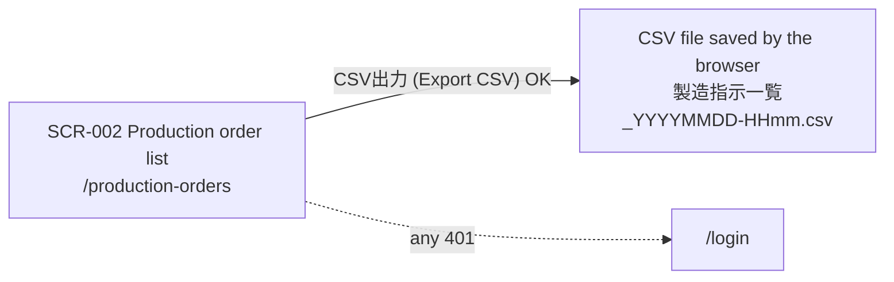
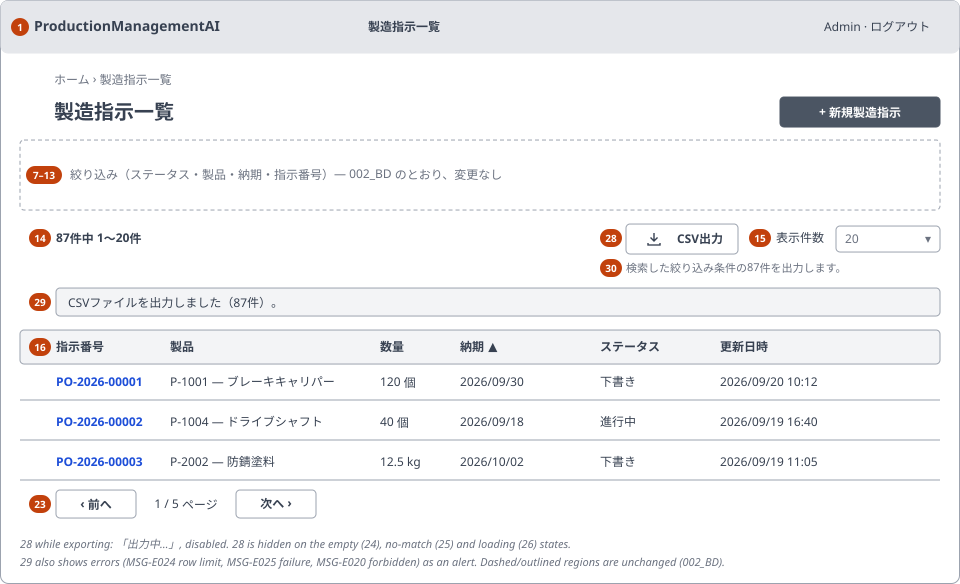
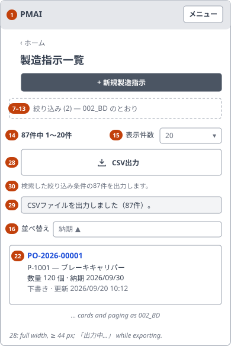

<!-- Based on ai/templates/basic-design.md. Additive to 002_BD (WI-003), which stays unedited (WI-016 DEC-001). -->

# Production Order List — CSV Export — Basic Design Document (基本設計書)

## Document control (改版履歴)

| Field | Value |
| --- | --- |
| Document ID | 002_BD-CSV |
| Category | UI + API (file download) |
| System name | ProductionManagementAI |
| Subsystem name | Production orders |
| Work item | WI-016 |
| Based on brief.md revision | 1 |
| Created by | Claude (for ThongTM) |
| Created date | 2026-10-07 |
| Last updated by | Claude (for ThongTM) |
| Last updated date | 2026-10-07 |

| Version | Date | Author | Revision content |
| --- | --- | --- | --- |
| 1 | 2026-10-07 | Claude (for ThongTM) | Initial creation: 「CSV出力」 (Export CSV) on SCR-002 (WI-016 DEC-001–DEC-008) |
| 2 | 2026-10-07 | Claude (for ThongTM) | Review: the export keeps using the applied (searched) filters; a visible hint, item 30, now says so next to the button (WI-016 DEC-009). Wireframes updated |

This document adds one action to SCR-002 製造指示一覧 (Production orders). Everything it does not mention — filters,
sort, paging, rows, empty/no-match states, header and navigation — stays exactly as specified in
[002_BD](002_BD_製造指示一覧.md), which is not edited. Item numbers continue 002_BD's numbering (1–27), so new
items start at 28.

## System overview

A signed-in Admin or Operator can download the production orders they are looking at on SCR-002 as a CSV file
that opens directly in Japanese Excel. The export contains every order that matches the applied filters, in the
applied sort order, across all pages (DEC-002), with a fixed set of columns (DEC-003). It reads data only.

| Requirement ID | Description | Covered by section |
| --- | --- | --- |
| REQ-085 | 「CSV出力」 downloads all orders matching the applied filters, in the current sort, across all pages | Business flow; §3 item 28; §6 E-30; Actions and business rules |
| REQ-086 | Fixed Japanese columns with values formatted as on screen | §4 M-11–M-15; CSV file layout |
| REQ-087 | Opens correctly in Japanese Excel: UTF-8 with BOM, CRLF, RFC 4180 quoting, timestamped filename | CSV file layout; §4 M-16 |
| REQ-088 | Admin/Operator only, same validation as the list, formula-injection neutralised, 10,000-row limit | §5 V-14, V-15; Actions and business rules; Exception flows; Non-functional requirements |
| REQ-089 | Busy, success and error feedback; what will be exported is stated; accessible on PC and SP | §1; §3 items 28–30; §4 M-18; §6 E-30–E-33; Non-functional requirements |

## Overall configuration and architecture

No new component boundary. The browser calls one new read-only endpoint under the existing
`/api/production-orders` path; the .NET backend reuses the list's filter validation and query (002_BD FN-010,
FN-011) without paging, writes the rows as CSV and returns them as a file download. The CSV is produced on the
server, so filtering, sorting and formatting have one implementation and the browser never has to page through the
whole result set. Authentication and roles are WI-001's cookie session and policy, unchanged. The exact endpoint,
headers and status codes are fixed in 002_DD-CSV.

## Function list

| Function ID | Function name | Description | Related requirement ID |
| --- | --- | --- | --- |
| FN-041 | Export production orders | Return every order matching the given filters in the given sort as one CSV file, refusing the request when more than 10,000 orders match | REQ-085, REQ-088 |
| FN-042 | Write CSV safely | Write the header and rows: fixed columns, display formats, UTF-8 with BOM, CRLF, RFC 4180 quoting, and neutralising of text cells a spreadsheet would run as a formula | REQ-086, REQ-087, REQ-088 |
| FN-043 | Download from the list | Send the screen's applied view to FN-041, save the returned file under its timestamped name, and show progress, success and failure on the screen | REQ-085, REQ-089 |

Reused unchanged: FN-011 (validate query parameters) and FN-016 (enforce authentication and role) from 002_BD;
FN-013 (mark overdue) supplies the 「納期遅れ」 column.

## Actors and business flow

Actors: Admin, Operator, signed in (WI-002 DEC-001). Same users as SCR-002; no new permission.

**Export the listed orders (UC-022)**

1. User narrows the list with filters and sort as today (002_BD UC-005, UC-006) → the screen shows the result
   summary, e.g. 「87件中 1〜20件」 (1–20 of 87 orders).
2. User presses **CSV出力** (Export CSV) → the system takes the *applied* view from the URL (not unsubmitted edits
   in the filter panel; the hint under the button, item 30, says 「検索した絞り込み条件の87件を出力します。」 (Exports
   the 87 orders matching the searched filters.)), ignores page and page size, and requests the export (FN-043). The button shows
   「出力中…」 (Exporting…) and is disabled until the request ends.
3. System checks the session, role and parameters (FN-016, FN-011), counts the matches and, if there are at most
   10,000, writes them as CSV in the screen's sort order (FN-041, FN-042).
4. Browser saves `製造指示一覧_YYYYMMDD-HHmm.csv` (plant time of the export); the screen announces
   「CSVファイルを出力しました（87件）。」 (Exported 87 orders to CSV.). The list itself does not change.
5. User opens the file in Excel: Japanese text, dates and quantities display correctly without an import wizard.

Alternative: if more than 10,000 orders match, nothing is downloaded and the screen shows
「出力件数が上限（10,000件）を超えています。条件を絞り込んでから、もう一度お試しください。」 (The export exceeds the
10,000-order limit. Narrow the filters and try again.). The user narrows the filters and exports again.

## Screen list and screen transition

| Screen ID | Screen name | Entry point | Exit / next screen |
| --- | --- | --- | --- |
| SCR-002 | Production Order List (unchanged entries, 002_BD) | `/production-orders` | 「CSV出力」 (Export CSV) → the browser saves a CSV file; the user stays on SCR-002. Session expired / 401 → `/login`. All other exits as 002_BD |

No new screen or route is added. Screen transition for the new action:

## Screen design detail

### SCR-002 Production Order List — CSV export additions

#### 0-1. Basic information (基本情報)

| No | Item | Content | Reference |
| --- | --- | --- | --- |
| 1 | Route / path | `/production-orders` (unchanged) | 002_BD 0-1 |
| 2 | API base path | `/api/production-orders` — adds the export endpoint `/api/production-orders/export` | Exact contract in 002_DD-CSV |
| 3 | Character encoding | Screen UTF-8; CSV file UTF-8 with BOM (DEC-004) | CSV file layout |
| 4 | Error page / fallback | Export failure: inline message next to the button (item 29); the list stays usable | Exception flows |
| 5 | Responsive | Yes — PC (≥ 640px) and SP (< 640px), as 002_BD | §1 |
| 6 | Authentication required | Yes | REQ-088 |
| 7 | Authorization / role restriction | `Admin`, `Operator` | REQ-088 |
| 8 | Applicable channel(s) | Single web app — not applicable | |

#### 0-2. Page metadata (head)

Not applicable — no change to 002_BD 0-2. The download does not change the page title.

#### 0-3. URL parameters

No new screen parameter. The export sends the screen's applied filter and sort parameters (002_BD 0-3 Nos 1–7:
`status`, `productId`, `dueFrom`, `dueTo`, `orderNumber`, `sort`, `dir`) to the export endpoint with the same names
and meanings. `page` and `pageSize` are not sent: the export covers all pages (DEC-002).

#### 1. Layout and mockup

Layout-level sketch only; the rendered per-state mockup belongs in 002_DD-CSV. Only the result header area changes;
the wireframes draw the rest of the screen in outline for orientation.

##### PC / desktop

| Item No. | Region / element | Notes (behavior, condition) |
| --- | --- | --- |
| 1–13 | Header, breadcrumb, heading, banner, filter panel | Unchanged (002_BD) |
| 14 | Result summary | Unchanged; tells the user how many orders the export will contain (「87件中 1〜20件」) |
| 15 | 「表示件数」 (Rows per page) | Unchanged; does not affect the export |
| 28 | 「CSV出力」 (Export CSV) | New. Secondary (outlined) button with a download icon, in the result header row to the left of item 15. Shown whenever rows are shown (`total` ≥ 1); disabled while the list query or an export is in flight; reads 「出力中…」 (Exporting…) during an export |
| 30 | Export hint | New. Small grey text directly under the result header row, always shown with item 28: what the export will contain, from the applied filters and the shown total (M-18). It is also item 28's accessible description. It does not reflect unsubmitted edits in the filter panel; pressing 「検索」 (Search) updates it (DEC-009) |
| 29 | Export message | New. One line under item 30: the success announcement (MSG-I009) or an export error (MSG-E024, MSG-E025, MSG-E020). Hidden until an export finishes; cleared by the next export or list query |
| 16–23 | Table and paging | Unchanged; the export never changes the page shown |

##### SP / mobile

Same item numbers as PC. Difference: item 28 takes a full-width row of its own under the summary/「表示件数」 row,
so the 390 px row does not overflow and the button stays at least 44 px high for touch; items 30 and 29 sit under it,
in that order.

#### 2. Content block definition (CMS)

None — no externally managed content blocks.

#### 3. Screen item definition

| No | Item (label) | Variable name | Control type | I/O | Data type | Width / length | Initial value | Placeholder | Display condition | Data source | Reference |
| --- | --- | --- | --- | --- | --- | --- | --- | --- | --- | --- | --- |
| 28 | 「CSV出力」 (Export CSV) | — | button | I | — | — | Enabled | — | Whenever rows are shown (`total` ≥ 1); hidden on the empty (24), no-match (25) and loading (26) states; disabled while a list query or export is in flight | Applied view state (URL) | §6 E-30; §5 V-14 |
| 30 | Export hint | — | label | O | text | — | M-18 | — | With item 28 | Applied view state (URL) + shown `total` | §4 M-18; DEC-009 |
| 29 | Export message | — | label (live region) | O | text | — | Hidden | — | After an export finishes | Export result | §6 E-31, E-32; MSG-I009, MSG-E020, MSG-E024, MSG-E025 |

#### CSV file layout

One header row, then one row per order, in the applied sort order (002_BD V-13 keys; order number ascending as the
tie-breaker, as on screen). Columns (DEC-003):

| Col | Header (Japanese) | Gloss | Content | Mapping |
| --- | --- | --- | --- | --- |
| 1 | 指示番号 | Order no. | Order number, e.g. `PO-2026-00001` | as stored |
| 2 | 製品コード | Product code | Product SKU | as stored |
| 3 | 製品名 | Product name | Product name | as stored |
| 4 | 生産ライン | Production line | Assigned line | M-14 |
| 5 | 数量 | Quantity | Exact quantity | M-12 |
| 6 | 単位 | Unit | Product unit, e.g. 個, kg, m | as stored |
| 7 | 納期 | Due date | Plant-local due date | M-13 |
| 8 | ステータス | Status | Japanese status label | M-11 (= 002_BD M-05) |
| 9 | 納期遅れ | Overdue | 「納期遅れ」 or empty | M-15 (= 002_BD M-08) |
| 10 | 備考 | Notes | Order notes, may contain commas, quotes and line breaks | as stored, quoted per FN-042 |
| 11 | 作成日時 | Created | Creation timestamp | M-13 |
| 12 | 更新日時 | Updated | Last update timestamp | M-13 |
| 13 | 完了日時 | Completed | Completion timestamp; empty unless the order was completed | M-13 |

File format (DEC-004): UTF-8 with a byte-order mark, CRLF line ends, comma separator. A field is enclosed in double
quotes when it contains a comma, a double quote, CR or LF, and a double quote inside it is doubled (RFC 4180).
A text field that begins with `=`, `+`, `-`, `@`, a tab or a CR gets a leading apostrophe `'` so a spreadsheet shows
it as text instead of running it as a formula (FN-042). Numbers and dates are never altered by this rule.

#### 4. Item value mapping

| No | Item | Source value | Displayed value | Reference |
| --- | --- | --- | --- | --- |
| M-11 | Col 8 ステータス | `Draft` / `InProgress` / `Completed` / `Cancelled` | 下書き / 進行中 / 完了 / 取消 | 002_BD M-05 |
| M-12 | Col 5 数量 | Stored decimal quantity | Exact decimal with no thousands separator and no trailing zeros, e.g. `120`, `12.5`, `0.125` (kg/m keep up to 3 decimals, WI-006) — so Excel reads it as a number | REQ-086 |
| M-13 | Cols 7, 11–13 dates | Stored plant-local date / UTC timestamp | Due date `YYYY/MM/DD`; timestamps `YYYY/MM/DD HH:mm`, 24-hour, in plant time `Asia/Tokyo` (DEC-008); empty when absent | 002_BD M-10; DEC-008 |
| M-14 | Col 4 生産ライン | Assigned line or none | `{code} — {name}`, with 「 (使用停止)」 (retired) appended for a retired line, as on screen; empty when no line is assigned | WI-009 |
| M-15 | Col 9 納期遅れ | Due date, status, plant today at export time | 「納期遅れ」 when due date < plant today and status is `Draft` or `InProgress`; otherwise empty | 002_BD M-08, FN-013 |
| M-16 | Download file name | Plant-local time of the export | `製造指示一覧_YYYYMMDD-HHmm.csv`, e.g. `製造指示一覧_20261007-1345.csv`; an ASCII fallback `production-orders_YYYYMMDD-HHmm.csv` for clients that cannot take a Japanese name | REQ-087 |
| M-18 | Item 30 export hint | Applied filters (URL) and shown `total` | With any filter applied: 「検索した絞り込み条件の{total}件を出力します。」 (Exports the {total} orders matching the searched filters.); with no filter: 「すべての製造指示{total}件を出力します。」 (Exports all {total} production orders.). Sort is not mentioned; rows follow the list's order | DEC-009 |
| M-17 | Item 29 success | Number of exported rows | 「CSVファイルを出力しました（{count}件）。」 (Exported {count} orders to CSV.) | MSG-I009 |

#### 5. Validation rules

The export endpoint repeats every list check (002_BD V-09–V-13 for the filter and sort parameters) and is
authoritative. The screen only exports a view that the list has already loaded successfully, so in normal use these
checks pass; a crafted request that fails them gets the same 400 as the list.

| No | Item | Check content | Validation rule | Check condition | Error message (ID) | Reference |
| --- | --- | --- | --- | --- | --- | --- |
| V-14 | (28) Export | Row limit | At most 10,000 orders match the filters (DEC-005). The screen checks the shown `total` first and shows the message without a request; the server counts again and refuses if over | On click (client); on export (server) | MSG-E024 「出力件数が上限（10,000件）を超えています。条件を絞り込んでから、もう一度お試しください。」 (The export exceeds the 10,000-order limit. Narrow the filters and try again.) | REQ-088 |
| V-15 | Export parameters | Same rules as the list | 002_BD V-09–V-13 for `status`, `productId`, `dueFrom`, `dueTo`, `orderNumber`, `sort`, `dir`; `page` and `pageSize` are not accepted parameters of the export | On export (server) | As 002_BD: MSG-E002, MSG-E015–MSG-E019 | REQ-088 |

Messages. New IDs continue the single catalog (`messages.ts`), which ends at MSG-E023 and MSG-I008:

| ID | Text (draft) | Shown when | New or reused |
| --- | --- | --- | --- |
| MSG-I009 | 「CSVファイルを出力しました（{count}件）。」 (Exported {count} orders to CSV.) | Export succeeded (item 29) | new |
| MSG-E024 | 「出力件数が上限（10,000件）を超えています。条件を絞り込んでから、もう一度お試しください。」 (The export exceeds the 10,000-order limit. Narrow the filters and try again.) | V-14 fails | new |
| MSG-E025 | 「CSV出力に失敗しました。もう一度お試しください。」 (The CSV export failed. Try again.) | Network, server or unexpected error during the export | new — more specific than MSG-E013, so the user knows the list itself is fine |
| MSG-E020 | 「製造指示を閲覧する権限がありません。」 (You don't have permission to view production orders.) | 403 on the export | reused from 002_BD |
| MSG-E002, MSG-E015–MSG-E019 | as 002_BD | V-15 fails (crafted request) | reused from 002_BD |

#### 6. Item events

| No | Item | Event | Event content | Reference |
| --- | --- | --- | --- | --- |
| E-30 | (28) 「CSV出力」 (Export CSV) | click / Enter / Space | If the shown `total` > 10,000, show MSG-E024 in item 29 and stop (V-14). Otherwise clear item 29, set the button to 「出力中…」 (Exporting…) and disabled, and request the export with the applied filter and sort parameters (0-3). Focus stays on the button | FN-043; REQ-085 |
| E-31 | Export | success | The browser saves the file under the name in M-16; item 29 announces MSG-I009 with the exported row count; the button returns to 「CSV出力」. The list, URL and page are unchanged | FN-043; REQ-089 |
| E-32 | Export | failure | 401 → the existing session handling sends the user to `/login`. 403 → MSG-E020; row limit → MSG-E024; 400 → the list's messages for the rejected parameters; anything else → MSG-E025. Shown in item 29 as an alert; nothing is saved; the button is enabled again | REQ-088, REQ-089 |
| E-33 | List query | starts / finishes (Search, Clear, sort, page, page size, Back/Forward) | Items 28 and 30 are hidden while the query runs (002_BD item 26) and item 29 is cleared, so an old message never describes a new view; when the query finishes, item 30 is rebuilt from the new applied filters and total | REQ-089 |

No event writes order data.

#### 7. External identity linkage

None — no external identity linkage.

## Actions and business rules

| Action | Trigger | Business rule | Related requirement ID |
| --- | --- | --- | --- |
| Call the export API | Item 28 | Requires a valid session (else 401) and role `Admin` or `Operator` (else 403), enforced server-side as for the list | REQ-088 |
| Select rows | Export request | Same filters, combined with AND, as the list query with the same parameters; absent filters place no restriction; no paging | REQ-085 |
| Order rows | Export request | The requested `sort`/`dir` (default `dueDate` ascending), order number ascending as the tie-breaker — identical to the screen | REQ-085 |
| Limit size | Export request | Refuse with MSG-E024 when more than 10,000 orders match; never send a partial file | REQ-088; DEC-005 |
| Write cells | Each row | Display formats M-11–M-15; formula-like text neutralised; quoting per RFC 4180 | REQ-086–REQ-088 |
| Read only | Any export | Changes no order data and does not alter the screen's view state | REQ-085 |

## Success and exception flows

| Flow | Trigger condition | System behavior | Resulting state |
| --- | --- | --- | --- |
| Success — filtered export | Rows shown, ≤ 10,000 match | File with header + all matching rows, in screen order | File saved; MSG-I009; list unchanged |
| Success — unfiltered export | No filter set, ≤ 10,000 orders exist | Every order exported | As above |
| Not offered — nothing to export | Empty state (24) or no-match state (25) | Item 28 is not shown | No action possible |
| Exception — over the limit | > 10,000 match (shown total, or server count) | Request not sent, or refused by the server; no file | MSG-E024 in item 29; list unchanged |
| Exception — unauthenticated | Session expired | 401, no data | Redirect to `/login` |
| Exception — forbidden | Signed in without `Admin`/`Operator` (crafted request) | 403, no data | MSG-E020 |
| Exception — invalid parameter | V-15 fails (crafted request) | 400, no data | The list's validation messages in item 29 |
| Exception — server/network error | Unexpected failure, or the connection drops | No file is saved; a partial download is discarded | MSG-E025 in item 29; button enabled again |
| Data changed during export | Another user edits an order between the list query and the export | The export reflects the data at export time; its count may differ from the shown total | MSG-I009 states the exported count |

## Data design overview

No new entity, column, index or migration, so no 002_DB amendment is needed. The export reads **ProductionOrder**
(order number, quantity, due date, status, notes, created/updated/completed timestamps) joined to its **Product**
(SKU, name, unit) and, when assigned, its **ProductionLine** (code, name, active state). The filter and sort run on
the indexes of [002_DB](../../database/002/002_DB_製造指示一覧.md) and WI-004; the export only drops `OFFSET/LIMIT` and adds a count check
capped by DEC-005. Notes are included in the export although the list does not show them.

## External interfaces

None — only this application's own backend API. The file is consumed by spreadsheet tools such as Microsoft Excel,
which is why the file format above is fixed.

## Non-functional requirements

- **Security:** server-side role check as for the list (REQ-088). Parameters are allow-listed and bound exactly as
  the list's (002_BD non-functional requirements), so no client value reaches SQL. Formula injection
  (CWE-1236) is neutralised in every text cell. The response is marked not cacheable (`no-store`) so a shared
  machine's browser cache does not keep the file. The export contains no PII or secrets, but it does contain all
  matching orders' notes; access is the same as reading each order on SCR-001. CSRF does not apply to this
  read-only `GET`. Reviewed against `ai/checklists/security-review.md` in 002_DD-CSV.
- **Accessibility (WCAG 2.2 AA):** item 28 is a real button with a visible text label (the icon is decorative);
  its accessible description is the visible hint, item 30 (M-18); its busy state is
  exposed (`aria-busy`/disabled with the 「出力中…」 label); item 29 is a polite live region for success and an
  alert for errors; focus stays on the button; the SP button is at least 44 px high; text never relies on colour.
- **Performance:** the server streams rows instead of building the whole file in memory. Target: 10,000 rows within
  5 seconds on the local Compose stack; the 124-order demo data exports in well under a second. Measured in the
  implementation revision.
- **Observability:** each export logs one structured entry (user, filter and sort parameters, row count, duration,
  outcome) and is traced like the list query; order contents are not logged. Exact names are fixed in 002_DD-CSV.
- Availability: inherits project defaults.

## Open questions and linked DD

| Question | Linked DD section | Status |
| --- | --- | --- |
| Scope, columns, encoding, row limit | — | answered in decisions.md (DEC-002–DEC-005) |
| Timestamps in plant time vs. browser time | — | answered in decisions.md (DEC-008) — plant time |
| HTTP status and Problem Details `code` for the row limit | 002_DD-CSV API | open — fixed in 002_DD-CSV |
| How the browser receives the row count for MSG-I009 (response header) | 002_DD-CSV API | open — fixed in 002_DD-CSV |
| Streaming approach and how a mid-stream failure is detected by the browser | 002_DD-CSV processing | open — fixed in 002_DD-CSV |
