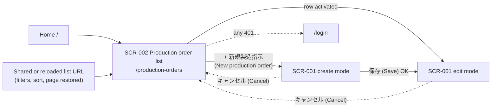
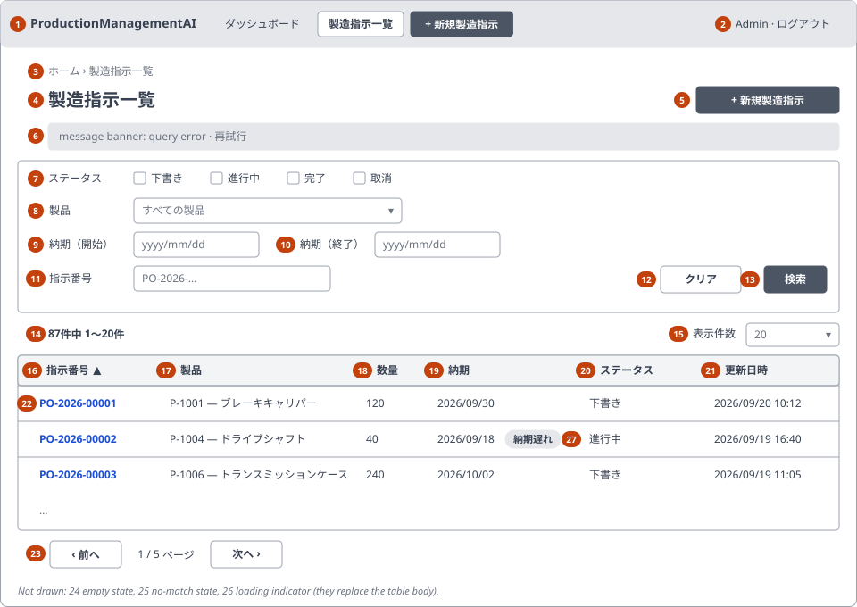
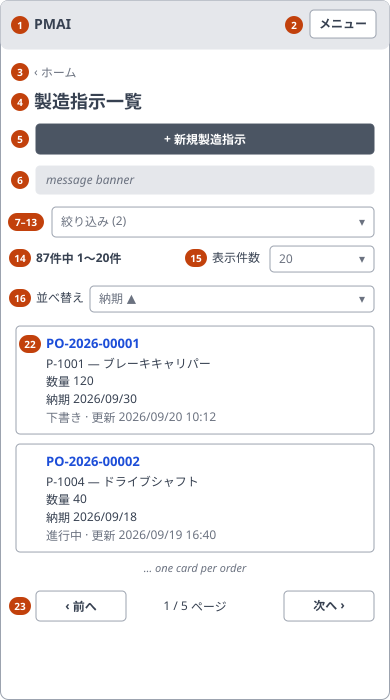

<!-- Based on ai/templates/basic-design.md (revision at commit e7e0d36). -->

# Production Order List — Basic Design Document (基本設計書)

## Document control (改版履歴)

| Field | Value |
| --- | --- |
| Document ID | 002_BD |
| Category | UI |
| System name | ProductionManagementAI |
| Subsystem name | Production orders |
| Work item | WI-003 |
| Based on brief.md revision | 1 |
| Created by | Claude (for ThanhTN) |
| Created date | 2026-09-22 |
| Last updated by | Claude (for ThanhTN) |
| Last updated date | 2026-09-23 |

| Version | Date | Author | Revision content |
| --- | --- | --- | --- |
| 1 | 2026-09-22 | Claude (for ThanhTN) | Initial creation (Screen B, production-order list; WI-003 DEC-001–DEC-009) |
| 2 | 2026-09-22 | Claude (for ThanhTN) | Reconciled with 002_DB: V-09 fragment bound clarified and `\` added to the escaped characters (DEC-010); status sort defined as workflow order, not alphabetical |
| 3 | 2026-09-22 | Claude (for ThanhTN) | Message IDs renumbered to MSG-E015–MSG-E020 / MSG-I003–MSG-I004: the drafted IDs collided with 001_DD's catalog, which already defines MSG-E001–MSG-E014 and MSG-I001–MSG-I002; MSG-E002 and MSG-E013 reused instead of duplicated |
| 4 | 2026-09-22 | Claude (for ThanhTN) | WI-004 (DEC-016, DEC-021): the shared header now carries the application navbar specified in 003_BD "Shared application header"; items 1–2 point to it. The breadcrumb stays. No field, rule, validation, event or API of this screen changes |
| 5 | 2026-09-23 | Claude (for ThanhTN) | Diagrams redrawn for the revised BD template (RFC 0009): screen transition in Mermaid; PC and SP layouts as SVG wireframes under `wireframes/`. No field, rule, validation, event or API changes |
| 6 | 2026-09-23 | Claude (for ThanhTN) | WI-005: the UI is Japanese. Quoted UI text and messages give the implemented Japanese text with an English gloss (WI-005 DEC-003); status labels (M-05), result summary (M-09), date and timestamp formats (M-10, `YYYY/MM/DD`, `YYYY/MM/DD HH:mm`), page title and wireframes updated. No field, rule, validation, event or API changes |

## System overview

One screen, SCR-002, lets a signed-in Admin or Operator find production orders: a server-paged, sortable, filterable list of every order, from which an order is opened in SCR-001 (001_BD) for editing. It is "Screen B" on the locked roadmap and the screen that makes SCR-001 reachable by normal use instead of by a typed URL. SCR-002 is read-only: it changes no order data (DEC-003).

| Requirement ID | Description | Covered by section |
| --- | --- | --- |
| REQ-020 | Open the list and see existing orders | Business flow; §3 items 14, 22, 24, 26, 28; §6 E-10; Success and exception flows |
| REQ-021 | Row shows the order's identifying and planning fields | §3 items 16–22; §4 M-05–M-09 |
| REQ-022 | Filter by status, product, due-date range and order number | 0-3 URL parameters; §3 items 7–13; §4 M-05, M-06; §5 V-09–V-12; §6 E-11, E-12 |
| REQ-023 | Sort by any listed column, ascending or descending | §3 items 16–21; §5 V-13; §6 E-13 |
| REQ-024 | Server-side paging with a user-chosen page size | §3 items 14, 15, 23; §5 V-13; §6 E-14, E-15 |
| REQ-025 | Open an order in SCR-001, or start a new one | Screen list and screen transition; §3 items 5, 22; §6 E-16, E-17 |
| REQ-026 | Only authenticated Admin/Operator | 0-1 basic information; Actions and business rules; Exception flows |
| REQ-027 | Filters, sort, page and page size kept in the URL | 0-3 URL parameters; §6 E-10 to E-15 |

## Overall configuration and architecture

Uses the confirmed stack (`ai/project.md`) exactly as 001_BD does: a React (Vite + TypeScript + Tailwind CSS v4) page calling the .NET 10 backend's JSON API over the same origin, layered Domain/Application/Infrastructure/Api (0001_ADR), persisted in PostgreSQL 17, gated by WI-001's cookie session and role checks (0002_ADR) — `ProtectedRoute` on the frontend, the same authorization policy on the backend. No new architecture boundary, external system or trust boundary is introduced.

SCR-002 adds one read-only query endpoint under the existing `/api/production-orders` path and reuses the existing product-list endpoint for its product filter. Every filter, sort key and page bound is resolved server-side; the browser never receives more than one page of rows. The exact contract is fixed in 002_DD-API; index and query-plan support is fixed in 002_DB.

## Function list

| Function ID | Function name | Description | Related requirement ID |
| --- | --- | --- | --- |
| FN-010 | Query production orders | Return one page of orders matching the current filters, in the requested order, with the total count of matches | REQ-020, REQ-022, REQ-023, REQ-024 |
| FN-011 | Validate query parameters | Reject an unknown status, unknown product, malformed or inverted date range, over-long order-number fragment, unsupported sort key/direction, or out-of-range page/page size | REQ-022, REQ-023, REQ-024 |
| FN-012 | Provide filter choices | Supply the product options (existing product list, FN-004) and the fixed status options for the filter panel | REQ-022 |
| FN-013 | Mark overdue orders | Flag a listed order whose due date is before the plant-timezone today and whose status is `Draft` or `InProgress` | REQ-021 |
| FN-014 | Keep view state in the URL | Read the view (filters, sort, page, page size) from the URL on load and write it back on every change | REQ-027 |
| FN-015 | Navigate to SCR-001 | Open the selected order in edit mode, or open create mode from the New action | REQ-025 |
| FN-016 | Enforce authentication and role | Reject unauthenticated (401) and non-Admin/Operator (403) requests to the screen and its query endpoint | REQ-026 |

FN-004 (list products) is reused from 001_BD and is not redefined here.

## Actors and business flow

Actors: Admin, Operator — both already signed in through WI-001's login screen (WI-002 DEC-001, carried into this screen unchanged).

**Browse the list (UC-004)**

1. User opens `/production-orders` from the home page → system reads the view state from the URL (empty on a plain link, FN-014), queries the first page with the default sort (FN-010) and loads the product filter choices (FN-012), showing a loading indicator until both finish.
2. System shows the page of rows, the range and total (「87件中 1〜20件」, "1–20 of 87 orders"), and the active sort. No filter is pre-applied, so orders of every status are listed, including `Completed` and `Cancelled` (DEC-006).
3. If no order exists at all, the system shows the empty state with a **+ 新規製造指示** (New production order) action instead of an empty table.

**Find an order (UC-005)**

1. User sets any combination of status (multi-select, DEC-005), product, due-date range and order-number fragment, then presses **検索** (Search) (DEC-008) → system validates the filter values (FN-011); invalid values are shown as field errors and no query is sent.
2. System queries with the filters applied, returns to page 1 and updates the range, total and URL (FN-010, FN-014).
3. If nothing matches, the system shows the "no orders match" state with a **絞り込みをクリア** (Clear filters) action — not the unfiltered list.

**Order and page through results (UC-006)**

1. User clicks a column header → system sorts the whole result set by that column, returns to page 1 and marks the header with the direction; clicking the same header again reverses it (FN-010).
2. User changes the page size or moves between pages → system requests that page at that size; a page-size change returns to page 1 (FN-010).

**Act on an order (UC-007)**

1. User activates a row (click, or the order-number link by keyboard) → system opens SCR-001 in edit mode for that order (FN-015).
2. User presses **+ 新規製造指示** (New production order) → system opens SCR-001 in create mode (FN-015).

## Screen list and screen transition

| Screen ID | Screen name | Entry point | Exit / next screen |
| --- | --- | --- | --- |
| SCR-002 | Production Order List | `/production-orders` — a 「製造指示一覧」 (Production orders) link on the home page `/` (DEC-004). Also reached by Back from SCR-001, and by opening a shared list URL. | Row activated → SCR-001 edit mode `/production-orders/{id}`. 「+ 新規製造指示」 (New production order) → SCR-001 create mode `/production-orders/new`. Session expired / 401 → `/login`. |

Screen transition:

SCR-001's Cancel currently returns to the home page `/` (001_BD, "until Screen B exists"). With SCR-002 in place, SCR-001's exit target becomes the list; that single change to 001_BD's screen transition is made when SCR-002 is implemented, and is the only Screen A behavior WI-003 touches.

The order status state machine is unchanged and is not restated here — see 001_BD, REQ-017. SCR-002 displays status but never changes it (DEC-003).

## Screen design detail

### SCR-002 Production Order List

#### 0-1. Basic information (基本情報)

| No | Item | Content | Reference |
| --- | --- | --- | --- |
| 1 | Route / path | `/production-orders` | 0-3 |
| 2 | API base path | `/api/production-orders` (query), `/api/products` (filter choices) | Exact contract in 002_DD-API |
| 3 | Character encoding | UTF-8 | |
| 4 | Error page / fallback | Query failure: in-page error panel with a **再試行** (Retry) action, keeping the filter panel usable; no separate error route | Exception flows |
| 5 | Responsive | Yes — PC (≥ 640px) and SP (< 640px, Tailwind `sm` breakpoint) | §1 |
| 6 | Authentication required | Yes | REQ-026 |
| 7 | Authorization / role restriction | `Admin`, `Operator` (WI-002 DEC-001) | REQ-026 |
| 8 | Applicable channel(s) | Single web app — not applicable | |

#### 0-2. Page metadata (head)

The app's common head (`src/frontend/index.html`: charset, viewport, favicon, bundled module script) is not restated.

##### 0-2-1. Title

| No | Title |
| --- | --- |
| 1 | `製造指示一覧 — ProductionManagementAI` (Production orders) |

##### 0-2-2. Base

Not applicable — no `<base>` override.

##### 0-2-3. Link

Not applicable — no screen-specific `<link>` tags; styles are bundled.

##### 0-2-4. Meta

Not applicable — no screen-specific meta tags (internal, authenticated screen; no SEO metadata needed).

##### 0-2-5. Style

Not applicable — no inline `<style>` block; all styling via Tailwind classes.

##### 0-2-6. Script

Not applicable — no extra `<script>` tags; app JS is bundled.

#### 0-3. URL parameters

All parameters are query-string parameters on `/production-orders`; every one is optional and the whole view state is reproducible from them (REQ-027). The frontend uses the same names as the API query (002_DD-API) so the two never drift.

| No | Parameter name | Content | Required / Optional | Reference |
| --- | --- | --- | --- | --- |
| 1 | `status` | Status filter; repeatable, one value per selected status (`Draft`, `InProgress`, `Completed`, `Cancelled`). Absent = no status restriction (DEC-005, DEC-006) | optional | §5 V-11 |
| 2 | `productId` | Product filter; a single product identifier. Absent = all products | optional | §5 V-12 |
| 3 | `dueFrom` | Start of the due-date range, inclusive, plant-local date `YYYY-MM-DD` | optional | §5 V-10 |
| 4 | `dueTo` | End of the due-date range, inclusive, plant-local date `YYYY-MM-DD` | optional | §5 V-10 |
| 5 | `orderNumber` | Case-insensitive fragment of the order number | optional | §5 V-09 |
| 6 | `sort` | Sort key: `orderNumber`, `product`, `quantity`, `dueDate`, `status`, `updatedAt`. Absent = `dueDate` | optional | §5 V-13 |
| 7 | `dir` | Sort direction `asc` or `desc`. Absent = `asc` | optional | §5 V-13 |
| 8 | `page` | 1-based page number. Absent = 1 | optional | §5 V-13 |
| 9 | `pageSize` | Rows per page; one of 10, 20, 50, 100. Absent = 20 (DEC-002) | optional | §5 V-13 |

An unreadable or out-of-range value in the URL falls back to that parameter's default and the screen still renders (REQ-027 failure criterion); it does not produce an error page. A rejected value sent directly to the API is a different case — see §5 V-09–V-13 and the exception flows.

#### 1. Layout and mockup

Layout-level sketch only; the rendered per-state mockup belongs in 002_DD.

##### PC / desktop

| Item No. | Region / element | Notes (behavior, condition) |
| --- | --- | --- |
| 1 | App header with navbar | Shared application header, specified once in 003_BD "Shared application header" (H-1–H-5, E-29–E-31, WI-004 DEC-016): app name, navbar (「ダッシュボード」 (Dashboard), 「製造指示一覧」 (Production orders), 「新規製造指示」 (New production order); current entry marked), user and 「ログアウト」 (Sign out), a 「メニュー」 (Menu) button on SP. Current entry here: 「製造指示一覧」 |
| 2 | Signed-in user + 「ログアウト」 (Sign out) | Shared header (003_BD H-3; WI-001 behavior unchanged) |
| 3 | Breadcrumb | 「ホーム > 製造指示一覧」 (Home > Production orders) |
| 4 | Page heading | 「製造指示一覧」 (Production orders) |
| 5 | 「+ 新規製造指示」 (New production order) | Primary action, top right; opens SCR-001 create mode |
| 6 | Message banner | Hidden unless the query failed; carries the **再試行** (Retry) action; announced to assistive tech |
| 7–13 | Filter panel | See §3; one card above the results, collapsible on SP |
| 14 | Result summary | 「{total}件中 {first}〜{last}件」 ({first}–{last} of {total} orders); the live region that announces a finished query |
| 15 | Page-size select | 10 / 20 / 50 / 100, default 20 |
| 16–21 | Sortable column headers | Each a button; the active one shows ▲/▼ and `aria-sort` |
| 22 | Result row | One per order; the order number is a link to SCR-001 edit mode (DEC-009) |
| 23 | Paging controls | 「‹ 前へ」 / 「次へ ›」 (Previous / Next) and 「{n} / {m} ページ」 (Page {n} of {m}); disabled at the ends |
| 24 | Empty state | Replaces 14–23 when the system holds no orders at all: message MSG-I003 and a **+ 新規製造指示** (New production order) action |
| 25 | No-match state | Replaces the table body when filters match nothing: message MSG-I004 and a **絞り込みをクリア** (Clear filters) action; the filter panel stays filled in |
| 26 | Loading indicator | 「製造指示を読み込み中…」 (Loading production orders…), shown in place of the table body while a query is in flight; the previous rows are not left on screen as if they were the result |
| 27 | Overdue marker | 「納期遅れ」 (Overdue), shown next to the due date of an overdue row (§4 M-08) |

##### SP / mobile

Same item numbers as PC. Differences: the table becomes one card per order, each card as a whole being the link to SCR-001; the filter panel collapses behind a **絞り込み** (Filters) disclosure showing how many filters are active; the sortable column headers collapse into a single sort select (item 16) offering the same keys and directions as items 16–21.

#### 2. Content block definition (CMS)

None — no externally managed content blocks.

#### 3. Screen item definition

| No | Item (label) | Variable name | Control type | I/O | Data type | Width / length | Initial value | Placeholder | Display condition | Data source | Reference |
| --- | --- | --- | --- | --- | --- | --- | --- | --- | --- | --- | --- |
| 4 | Page heading | — | label | O | text | — | 「製造指示一覧」 (Production orders) | — | Always | — | |
| 5 | 「+ 新規製造指示」 (New production order) | — | button (link) | I | — | — | — | — | Always | — | §6 E-17 |
| 6 | Message banner | — | label | O | text | — | Hidden | — | On query failure | Query result | §6 E-18 |
| 7 | 「ステータス」 (Status) filter | `status` | checkbox group | I | enum list | 4 options | None checked (DEC-006) | — | Always | Fixed status list | §4 M-05; DEC-005 |
| 8 | 「製品」 (Product) filter | `productId` | select | I | identifier | — | 「すべての製品」 (All products) | — | Always | Product list (FN-004, FN-012) | §4 M-06 |
| 9 | 「納期（開始）」 (Due from) | `dueFrom` | date picker | I | date | — | Empty | — | Always | — | §5 V-10 |
| 10 | 「納期（終了）」 (Due to) | `dueTo` | date picker | I | date | — | Empty | — | Always | — | §5 V-10 |
| 11 | 「指示番号」 (Order number) | `orderNumber` | textbox | I | text | ≤ 20 chars | Empty | "PO-2026-…" | Always | — | §5 V-09 |
| 12 | 「クリア」 (Clear) | — | button | I | — | — | — | — | Always; disabled when no filter is set | — | §6 E-12 |
| 13 | 「検索」 (Search) | — | button (submit) | I | — | — | — | — | Always; disabled while a query is in flight | — | §6 E-11 |
| 14 | Result summary | — | label (live region) | O | text | — | — | — | Whenever rows are shown | Query result `total`, `page`, `pageSize` | §4 M-09 |
| 15 | 「表示件数」 (Rows per page) | `pageSize` | select | I | integer | — | 20 | — | Whenever rows are shown | Fixed list 10/20/50/100 | §5 V-13; §6 E-15 |
| 16 | 「指示番号」 (Order no.) header | `sort=orderNumber` | button (column header) | I | — | — | — | — | PC; on SP an option of item 16's sort select | — | §6 E-13 |
| 17 | 「製品」 (Product) header | `sort=product` | button (column header) | I | — | — | — | — | as item 16 | — | Sorts by SKU then name |
| 18 | 「数量」 (Qty) header | `sort=quantity` | button (column header) | I | — | — | — | — | as item 16 | — | |
| 19 | 「納期」 (Due date) header | `sort=dueDate` | button (column header) | I | — | — | Active by default, ascending | — | as item 16 | — | Default sort (DEC-002) |
| 20 | 「ステータス」 (Status) header | `sort=status` | button (column header) | I | — | — | — | — | as item 16 | — | §4 M-07; sorts in workflow order (下書き, 進行中, 完了, 取消 — Draft, In progress, Completed, Cancelled), not alphabetically — 002_DB sort-key mapping |
| 21 | 「更新日時」 (Updated) header | `sort=updatedAt` | button (column header) | I | — | — | — | — | as item 16 | — | |
| 22 | Result row | — | table row (order number is a link) | O | — | — | — | — | One per returned order | Query result rows | §4 M-05–M-08; §6 E-16 |
| 23 | Paging controls | `page` | buttons + label | I/O | integer | — | Page 1 | — | Whenever rows are shown | Query result `total`, `page`, `pageSize` | §6 E-14 |
| 24 | Empty state | — | label + button | O | text | — | Hidden | — | Only when the system holds no orders at all | Query result (`total` = 0, no filter set) | MSG-I003 |
| 25 | No-match state | — | label + button | O | text | — | Hidden | — | Only when filters are set and match nothing | Query result (`total` = 0, filter set) | MSG-I004; §6 E-12 |
| 26 | Loading indicator | — | label | O | text | — | Hidden | — | While a query is in flight | — | §6 E-10 |
| 27 | Overdue marker | — | label | O | text | — | Hidden | — | Per row, per M-08 | Row due date + status + plant today | §4 M-08 |

Every row shows, in order: order number (item 22's link text), product, quantity, due date (with the overdue marker where applicable), status and last updated (REQ-021).

#### 4. Item value mapping

| No | Item | Source value | Displayed value | Reference |
| --- | --- | --- | --- | --- |
| M-05 | (7) Status filter options / (22) row status | `Draft` / `InProgress` / `Completed` / `Cancelled` | 「下書き」 / 「進行中」 / 「完了」 / 「取消」 (Draft / In progress / Completed / Cancelled) | Same labels as 001_BD M-01 |
| M-06 | (8) Product filter / (22) row product | Product ID | "{SKU} — {name}", ordered by SKU; the filter's first option is 「すべての製品」 (All products) with an empty value | 001_BD M-03, WI-002 DEC-022 |
| M-07 | (22) Row status | Status value | Status label (M-05) rendered as a badge whose styling distinguishes active (`Draft`, `InProgress`) from terminal (`Completed`, `Cancelled`) states; the label alone carries the meaning, never color alone | WCAG 1.4.1 |
| M-08 | (27) Overdue marker | Row due date, row status, plant-local today | Marked 「納期遅れ」 (Overdue) when due date < today in `Asia/Tokyo` (WI-002 DEC-011, DEC-017) **and** status is `Draft` or `InProgress`; never for `Completed` or `Cancelled` | REQ-021; FN-013 |
| M-09 | (14) Result summary | `page`, `pageSize`, `total` | 「{total}件中 {first}〜{last}件」, where first = (page−1)×pageSize + 1 and last = min(page×pageSize, total) ({first}–{last} of {total} orders); with `total` = 0 the summary is replaced by item 24 or 25 | REQ-024 |
| M-10 | (22) Row updated / due date | Stored timestamp (UTC) / stored date | Updated: `YYYY/MM/DD HH:mm`, 24-hour, in the browser's timezone (as 001_BD M-04). Due date: the stored plant-local date as `YYYY/MM/DD`, with no timezone conversion | WI-005 DEC-006 |

#### 5. Validation rules

The filter panel checks values client-side for early feedback; the server repeats every check on the query endpoint and is authoritative. A value rejected by the server returns an error rather than silently falling back to a default, so a crafted request cannot widen the query (REQ-022–REQ-024 failure criteria). Error message texts are drafts; final IDs and wording are fixed in 002_DD.

| No | Item | Check content | Validation rule | Check condition | Error message (ID) | Reference |
| --- | --- | --- | --- | --- | --- | --- |
| V-09 | (11) Order number | Length and content of the search fragment | ≤ 20 characters after trimming (a bound, not a format check — a full order number is 13 characters); matched case-insensitively as a fragment of the order number; the wildcard characters `%`, `_` and `\` are treated as literal text, not as patterns | On Search; on query | MSG-E015 「指示番号の検索は20文字以内で入力してください。」 (Order number search can't exceed 20 characters.) | REQ-022; 002_DD-API fixes the escaping |
| V-10 | (9)(10) Due from / Due to | Valid dates, ordered range | Each a valid date; if both are set, `dueFrom` ≤ `dueTo`; range inclusive at both ends; either end may be left empty | On Search; on query | MSG-E016 「有効な日付を入力してください。」 (Enter a valid date.) / MSG-E017 「納期（開始）は納期（終了）以前の日付にしてください。」 ('Due from' must be on or before 'Due to'.) | REQ-022 |
| V-11 | (7) Status filter | Known status values | Every submitted value is one of `Draft`, `InProgress`, `Completed`, `Cancelled`; none submitted = no restriction; duplicates collapse to one | On query (server) | MSG-E018 「不明なステータスです。」 (Unknown order status.) | REQ-022, DEC-005 |
| V-12 | (8) Product filter | Existing product | The submitted product identifier exists in Product | On query (server) | MSG-E002 「選択した製品は存在しません。」 (The selected product no longer exists.) (reused from 001_DD — same meaning, same wording) | REQ-022; 001_BD V-01 |
| V-13 | (15)(16–21)(23) Paging and sorting | Bounded, allow-listed query controls | `sort` ∈ {orderNumber, product, quantity, dueDate, status, updatedAt}; `dir` ∈ {asc, desc}; `page` an integer ≥ 1; `pageSize` ∈ {10, 20, 50, 100}. Rejected — not defaulted — when sent explicitly with an invalid value | On query (server) | MSG-E019 「対応していない並べ替えまたはページングの指定です。」 (Unsupported sort or paging option.) | REQ-023, REQ-024; DEC-002 |

Message IDs continue 001_DD's single catalog (`src/frontend/src/features/production-orders/messages.ts`), which already uses MSG-E001–MSG-E014 and MSG-I001–MSG-I002. Screen B's new IDs therefore start at MSG-E015 and MSG-I003; where 001_DD already has a message with the same meaning, it is reused rather than duplicated.

| ID | Text (draft) | Shown when | New or reused |
| --- | --- | --- | --- |
| MSG-E015 | 「指示番号の検索は20文字以内で入力してください。」 (Order number search can't exceed 20 characters.) | V-09 fails | new |
| MSG-E016 | 「有効な日付を入力してください。」 (Enter a valid date.) | V-10, malformed date | new |
| MSG-E017 | 「納期（開始）は納期（終了）以前の日付にしてください。」 ('Due from' must be on or before 'Due to'.) | V-10, inverted range | new |
| MSG-E018 | 「不明なステータスです。」 (Unknown order status.) | V-11 fails (crafted request) | new |
| MSG-E019 | 「対応していない並べ替えまたはページングの指定です。」 (Unsupported sort or paging option.) | V-13 fails (crafted request) | new |
| MSG-E020 | 「製造指示を閲覧する権限がありません。」 (You don't have permission to view production orders.) | 403 on the list | new — MSG-E012 says "manage", which is wrong for a read-only screen |
| MSG-E002 | 「選択した製品は存在しません。」 (The selected product no longer exists.) | V-12 fails | reused from 001_DD |
| MSG-E013 | 「問題が発生しました。もう一度お試しください。」 (Something went wrong. Try again.) | Query/network failure (item 6) | reused from 001_DD |
| MSG-I003 | 「製造指示はまだありません。最初の1件を登録してください。」 (No production orders yet. Create the first one.) | The system holds no orders at all (item 24) | new |
| MSG-I004 | 「絞り込みに一致する製造指示はありません。」 (No orders match your filters.) | Filters are set and match nothing (item 25) | new |

#### 6. Item events

| No | Item | Event | Event content | Reference |
| --- | --- | --- | --- | --- |
| E-10 | Screen | load | Read the view state from the URL (0-3), falling back per parameter to its default; load the product filter choices (FN-012) and run the query (FN-010); show item 26 while in flight; on 401 go to `/login`; on failure show item 6 with **再試行** (Retry) | FN-010, FN-012, FN-014 |
| E-11 | (13) Search | click / Enter in the filter panel | Run the client-side filter checks (V-09, V-10); if any fail, show inline errors, keep the previous rows and send no query. Otherwise return to page 1, keep the current sort and page size, run the query and write the new view state to the URL as a new history entry | REQ-022, REQ-027; DEC-008 |
| E-12 | (12) 「クリア」 (Clear) / (25) 「絞り込みをクリア」 (Clear filters) | click | Reset items 7–11 to their initial values, return to page 1, keep sort and page size, query and update the URL | REQ-022 |
| E-13 | (16–21) Column header | click / Enter / Space | If the header is already the active sort key, reverse `dir`; otherwise make it the sort key with `asc`. Return to page 1, query, update the URL and `aria-sort` | REQ-023 |
| E-14 | (23) 「‹ 前へ」 / 「次へ ›」 (Previous / Next) | click | Move one page within 1…last page; the control is disabled at either end. Query and update the URL | REQ-024 |
| E-15 | (15) Page size | change | Apply the new page size, return to page 1, query and update the URL | REQ-024, DEC-002 |
| E-16 | (22) Result row | click (row) / Enter on the order-number link | Open `/production-orders/{id}` (SCR-001 edit mode). The order-number cell is a real link, so the row is reachable and activatable by keyboard; the whole-row click is a mouse convenience that resolves to the same link and never fires on a text selection (DEC-009) | REQ-025, FN-015 |
| E-17 | (5) 「+ 新規製造指示」 (New production order) | click | Open `/production-orders/new` (SCR-001 create mode) | REQ-025, FN-015 |
| E-18 | (6) 「再試行」 (Retry) | click | Re-run the last query unchanged | Exception flows |
| E-19 | Browser Back / Forward, or a pasted list URL | popstate / load | Re-read the view state from the URL and re-run the query, so history navigation reproduces the earlier view | REQ-027 |

No event on this screen writes order data (DEC-003).

#### 7. External identity linkage

None — no external identity linkage.

## Actions and business rules

| Action | Trigger | Business rule | Related requirement ID |
| --- | --- | --- | --- |
| Open screen / call the query API | Any request to SCR-002 or its query endpoint | Requires a valid session (else 401 → `/login`) and role `Admin` or `Operator` (else 403) — enforced server-side, not only in the UI | REQ-026 |
| Query orders | Screen load, Search, Clear, sort, page, page-size change | Filters combine with AND; an absent filter places no restriction; the total reported is the number of orders matching the same filters, independent of the page | REQ-020, REQ-022 |
| Sort results | Column header (item 16–21) or SP sort select | Only the six allow-listed keys, ascending or descending, applied to the whole result set before paging; order number ascending is the tie-breaker so paging never repeats or skips a row | REQ-023 |
| Page results | Paging controls, page-size select | Every query is bounded by the page size; the page size is one of the four allowed values; a page beyond the last returns no rows rather than an error | REQ-024 |
| Open an order | Row activation | Navigation only — the list reads order data and never writes it | REQ-025, DEC-003 |
| Mark overdue | Row rendering | Due date < plant-local today and status ∈ {`Draft`, `InProgress`} | REQ-021 |

## Success and exception flows

| Flow | Trigger condition | System behavior | Resulting state |
| --- | --- | --- | --- |
| Success — first load | Authorized user opens the screen with no filters | First page returned in the default sort with the total | Table with rows, summary, sort marker, paging controls |
| Success — filtered | Valid filters submitted | Matching page and total returned, page reset to 1, URL updated | Table with the filtered rows; filter panel keeps its values |
| Success — sorted / paged | Sort, page or page-size change | Requested slice returned | Table updated; summary, sort marker and URL agree with it |
| Success — restored view | A shared or reloaded list URL, or Back/Forward | View state read from the URL and re-queried | Same view as when the URL was produced |
| Empty — no orders at all | The system holds no production orders | Empty state instead of a table | MSG-I003 with **+ 新規製造指示** (New production order) |
| Empty — no match | Filters set, nothing matches | No-match state instead of rows | MSG-I004 with **絞り込みをクリア** (Clear filters); filter values kept |
| Exception — unauthenticated | No valid session (including expiry while browsing) | 401, no data returned | Redirect to `/login` |
| Exception — forbidden | Signed in without `Admin`/`Operator` | 403, no data returned | Error panel MSG-E020 「製造指示を閲覧する権限がありません。」 (You don't have permission to view production orders.) |
| Exception — invalid filter value | V-09–V-12 fails | Query rejected; no rows replaced by wrong ones | Inline field error (client) or error banner (crafted request); previous rows stay |
| Exception — invalid sort/paging option | V-13 fails on an explicit value | Query rejected rather than defaulted | Error banner; previous rows stay |
| Exception — page beyond the last | `page` > last page for the current filters | Query succeeds with no rows | Empty page with paging controls intact; no error |
| Exception — product choices unavailable | The product list fails to load | The product filter is disabled and shows a load error; every other filter still works | Rest of the screen usable |
| Exception — query/server/network error | Unexpected failure | Nothing shown as a result | Error banner with **再試行** (Retry); filter values kept |

## Data design overview

No new entity. The UI is Japanese only (WI-005 DEC-001); product names are Japanese automobile parts (WI-005 DEC-002). SCR-002 reads the entities 001_BD already defined: **ProductionOrder** (order number, product reference, quantity, due date, status, notes, created/updated timestamps) joined to its **Product** (SKU, name) for the displayed and sortable product column. Notes are not shown in the list.

What database design has to add (002_DB), rather than restate:

- Index support for the default sort (due date, order number) and for each filter — status, product, due-date range and the case-insensitive order-number fragment — so the list stays index-backed as the table grows.
- The count query that produces the total alongside the page.
- The demo seed of roughly 60–100 production orders across statuses, products and due dates (DEC-007), including past due dates so the overdue marker is demonstrable.

Column-level detail, index definitions and the seed's environment scope belong to 002_DB.

## External interfaces

None — only this application's own backend API.

## Non-functional requirements

- **Security:** the role check (`Admin`/`Operator`) gates the query endpoint server-side, not only in the UI (REQ-026). The sort key, sort direction and page size are allow-listed rather than interpolated, so no client value reaches the query as SQL; the page size is capped at 100 so no request can pull an unbounded result set; every filter value is bound as a parameter, and `%` and `_` in the order-number fragment are escaped so a search cannot widen itself into a full scan. No field shown on this screen is PII or a secret. CSRF is not a concern for this read-only `GET` endpoint, and the WI-002 posture is unchanged (WI-002 DEC-020).
- **Accessibility (WCAG 2.2 AA, `ai/rules/frontend.md`):** the results are a real `<table>` with a caption and header cells; sortable headers are buttons carrying `aria-sort` on the active column; every row is reachable by keyboard through its order-number link, so the mouse-only whole-row click adds no keyboard-inaccessible behavior (DEC-009); the result summary is a live region that announces the new total when a query finishes; the loading state is announced rather than shown only as a spinner; status badges and the overdue marker carry text, never color alone; filter fields have visible labels, inline errors linked by `aria-describedby`, and focus moves to the first invalid filter when Search fails; paging controls state their target (「前のページ」 "Previous page", 「次のページ」 "Next page") and are disabled — not hidden — at the ends; visible focus indicators and sufficient contrast throughout.
- **Performance:** every query returns at most one page of rows plus a count; both are index-backed per 002_DB. The demo target is a first page rendered well within a second on the seeded data set; no client-side filtering or sorting of a full result set is performed.
- **Observability:** the query endpoint is traced and logged per project defaults, as 001_BD's endpoints are; exact spans and metrics are specified in 002_DD-FN.
- Availability: inherits project defaults.

## Open questions and linked DD

| Question | Linked DD section | Status |
| --- | --- | --- |
| Status filter single- or multi-select | 002_DD-API query contract | answered in decisions.md (DEC-005) — multi-select |
| Whether the default view hides terminal statuses | 002_DD initial state | answered in decisions.md (DEC-006) — shows all |
| Whether filters apply instantly or on an explicit Search | 002_DD events | answered in decisions.md (DEC-008) — explicit Search |
| How a row is activated without breaking keyboard access | 002_DD events / accessibility | answered in decisions.md (DEC-009) — order-number link plus mouse row click |
| Exact wording and IDs of the new messages | 002_DD message list | answered — renumbered to MSG-E015–MSG-E020 and MSG-I003–MSG-I004 in version 3, after 001_DD's catalog was checked; final wording confirmed in 002_DD |
| Order-number fragment matching: escaping and index strategy | 002_DD-API; 002_DB | open — 002_DB decides the index; 002_DD-API fixes the escaping |
| Seeded demo orders: count, spread and environment scope | 002_DB seed section | answered in principle (DEC-007); detail fixed in 002_DB |
