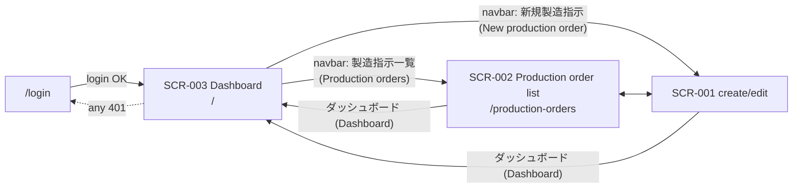
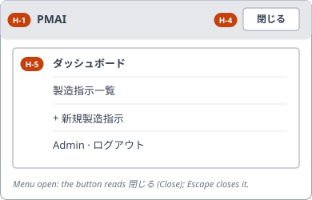
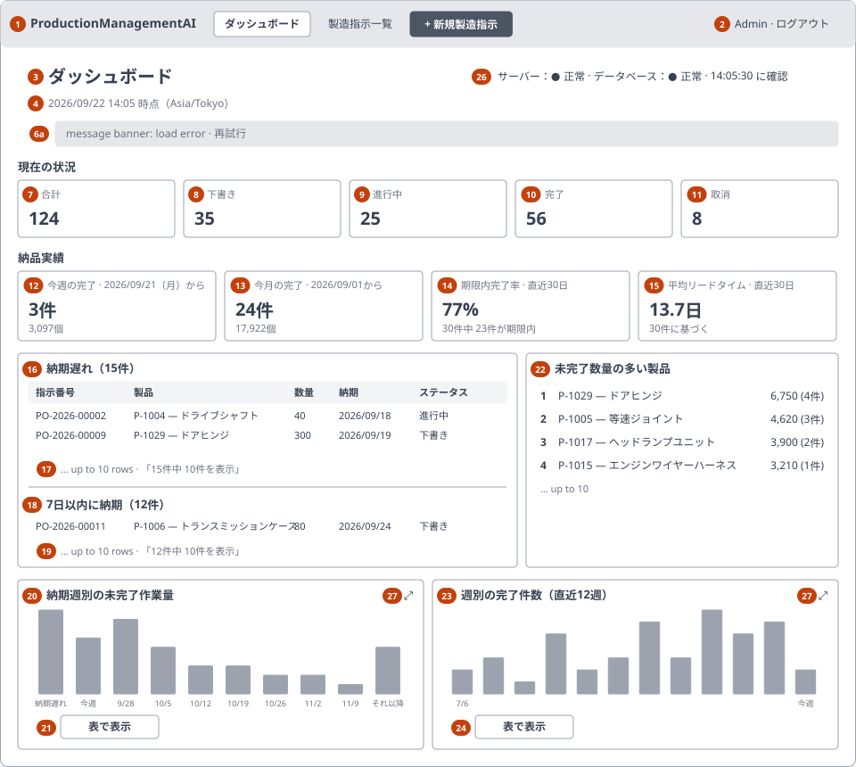
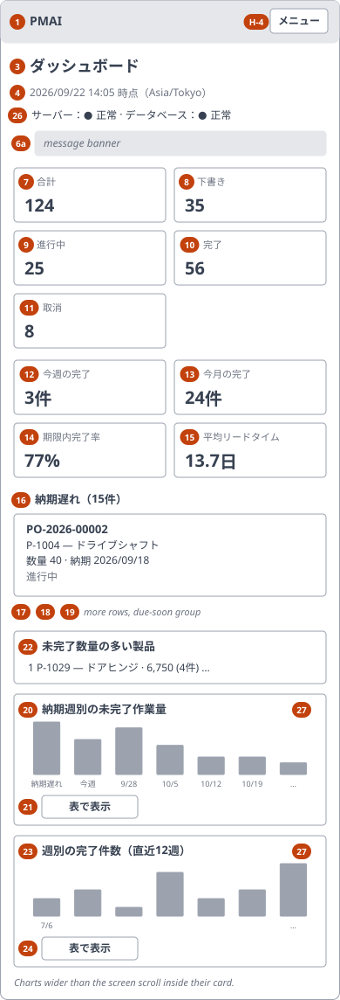

<!-- Based on ai/templates/basic-design.md (revision at commit c3747ed). -->

# Production Dashboard — Basic Design Document (基本設計書)

## Document control (改版履歴)

| Field | Value |
| --- | --- |
| Document ID | 003_BD |
| Category | UI |
| System name | ProductionManagementAI |
| Subsystem name | Production orders |
| Work item | WI-004 |
| Based on brief.md revision | 2 |
| Created by | Claude (for ThanhTN) |
| Created date | 2026-09-22 |
| Last updated by | Claude (for ThanhTN) |
| Last updated date | 2026-09-23 |

| Version | Date | Author | Revision content |
| --- | --- | --- | --- |
| 1 | 2026-09-22 | Claude (for ThanhTN) | Initial creation (Screen C, production dashboard; WI-004 DEC-001–DEC-012) |
| 2 | 2026-09-22 | Claude (for ThanhTN) | Mockup review (brief revision 2): navbar in the shared header on every screen replaces page actions 5–6 (DEC-016); server/database health indicator, polled (DEC-017, DEC-019, DEC-020); chart maximize/restore (DEC-018); sketch figures updated to 003_DB's seed; breadcrumbs kept (DEC-021) |
| 3 | 2026-09-22 | Claude (for ThanhTN) | Icons (DEC-023): M-21 icon mapping from `lucide-react`; accessibility note; the shared header's links carry icons |
| 4 | 2026-09-23 | Claude (for ThanhTN) | Diagrams redrawn for the revised BD template (RFC 0009): screen transition in Mermaid; the shared header and the PC and SP layouts as SVG wireframes under `wireframes/`. No field, rule, validation, event or API changes |
| 5 | 2026-09-23 | Claude (for ThanhTN) | WI-005: the UI is Japanese. Quoted UI text and messages give the implemented Japanese text with an English gloss (WI-005 DEC-003); tile, widget and chart labels, status labels (M-11), number and date formats (M-13–M-19: 件, 個, 日, `YYYY/MM/DD`, `M/D` bar labels), health texts (M-20), page title and wireframes updated. No field, rule, validation, event or API changes |

## System overview

One screen, SCR-003, is the production dashboard at `/`: the page a signed-in Admin or Operator lands on after login, replacing WI-001's placeholder home page (DEC-005). It shows eight read-only widgets computed from one consistent snapshot of the production orders — four about the current state (status counts, overdue and due-soon orders, the open workload by due week, the products with the most open quantity) and four about delivery (orders completed this week and month, the on-time completion rate, the weekly completion trend, the average lead time). It is "Screen C" on the locked roadmap. SCR-003 changes no data and links into no other screen from its widgets (DEC-006). It also shows whether the server and the database are reachable (DEC-017), and each chart can be maximized to the full window (DEC-018).

Navigation moves into a navbar in the shared application header, on every authenticated screen (DEC-016). It is specified once, in "Shared application header" below, and 001_BD and 002_BD refer to it.

The delivery widgets depend on a new fact about each order — when it was completed — recorded by SCR-001 (001_BD) at the moment it saves the `InProgress → Completed` transition (DEC-002, DEC-003). That rule belongs to Screen A and is specified there, in 001_BD's next version (plan revision 1, step 5); this document only consumes it.

| Requirement ID | Description | Covered by section |
| --- | --- | --- |
| REQ-028 | The dashboard is the landing page at `/`, with a failure and an empty state | Screen list and screen transition; 0-1; §1 items 3, 4, 6a, 25; §6 E-20, E-21; Success and exception flows |
| REQ-029 | Status count tiles | §3 items 7–11; §4 M-11 |
| REQ-030 | Overdue and due-soon lists | Metric definitions D-01, D-02; §3 items 16–19; §4 M-11, M-12, M-15 |
| REQ-031 | Due-date workload chart with overdue, 8 week and later bars | D-03; §3 items 20, 21; §4 M-16; DEC-009, DEC-010 |
| REQ-032 | Top 10 products by open quantity | D-04; §3 item 22; §4 M-12 |
| REQ-033 | The completion time is recorded | Data design overview; Actions and business rules (consumed here, specified in 001_BD) |
| REQ-034 | Orders completed this week and this month | D-05, D-06; §3 items 12, 13 |
| REQ-035 | On-time completion rate over 30 days | D-07; §3 item 14; §4 M-13 |
| REQ-036 | Weekly completion trend over 12 weeks | D-08; §3 items 23, 24; §4 M-16; DEC-010 |
| REQ-037 | Average lead time over 30 days | D-09; §3 item 15; §4 M-14 |
| REQ-038 | Only authenticated Admin/Operator | 0-1; Actions and business rules; Exception flows |
| REQ-040 | Navbar on every authenticated screen | Shared application header (H-1–H-5, E-29–E-31); Screen list and screen transition |
| REQ-041 | Server and database health indicator | Health definitions; §3 item 26; §4 M-20; §6 E-26–E-28; Actions; flows |
| REQ-042 | Maximize and restore a chart | §3 items 27–29; §6 E-24, E-25; Non-functional (accessibility) |
| REQ-039 | Read-only, no drill-down | §6 (no writing or linking event); Actions and business rules |

## Overall configuration and architecture

Same stack and boundaries as 001_BD and 002_BD (`ai/project.md`, 0001_ADR, 0002_ADR): a React page behind `ProtectedRoute`, calling the .NET backend's JSON API over the same origin, gated by the same cookie session and the same `Admin`/`Operator` policy server-side. No new trust boundary, external system or runtime dependency is introduced.

SCR-003 calls **one** read-only endpoint that returns every widget's figures together (DEC-011). The server computes "today", the week and month boundaries and every window from the plant clock (`Asia/Tokyo`, WI-002 DEC-011/DEC-017); the browser does no date arithmetic on the figures and never receives order rows beyond the at most 10 + 10 it lists. The response carries the moment the snapshot was taken, which the screen shows. The exact path and contract are fixed in 003_DD-API; the queries, their bucketing and their index support in 003_DB.

Charts are drawn as inline SVG by the page itself, with no charting library (DEC-010).

## Function list

| Function ID | Function name | Description | Related requirement ID |
| --- | --- | --- | --- |
| FN-017 | Compute the dashboard snapshot | Return every widget's figures from one consistent read of the orders, with the snapshot time and the plant-local today they were computed for | REQ-028, REQ-029–REQ-032, REQ-034–REQ-037 |
| FN-018 | Classify active orders by due date | Place each active order in exactly one of: overdue, due soon (D-01, D-02), and in exactly one workload bar (D-03) | REQ-030, REQ-031 |
| FN-019 | Rank products by open quantity | Sum the quantity of active orders per product and keep the top 10 (D-04) | REQ-032 |
| FN-020 | Compute delivery metrics | From completion times: completed this week and month, on-time rate, weekly trend, average lead time (D-05–D-09) | REQ-034–REQ-037 |
| FN-021 | Record the completion time | On SCR-001's save of `InProgress → Completed`, store the save's UTC time as the order's completion time; set once, never changed. Specified in 001_BD (amends FN-006); listed here for traceability | REQ-033 |
| FN-022 | Backfill completion times | When tracking is introduced, give every already-`Completed` order a completion time: seeded demo orders plausible values, any other its last update time (DEC-004). Specified in 003_DB | REQ-033 |
| FN-023 | Enforce authentication and role | Reject unauthenticated (401) and non-Admin/Operator (403) requests to the screen and its endpoints | REQ-038 |
| FN-024 | Check system health | Report whether the database answers a trivial round trip within the timeout; the server's own status is that it answered at all (Health definitions). The check never renews the session (DEC-019) | REQ-041 |
| FN-025 | Navigate the application | The shared header's navbar: 「ダッシュボード」 (Dashboard), 「製造指示一覧」 (Production orders), 「新規製造指示」 (New production order), current entry marked, a menu on SP | REQ-040 |
| FN-026 | Maximize a chart | Show a chart and its table in a full-window view from the snapshot already loaded, and restore the dashboard | REQ-042 |

## Metric definitions

Every definition uses **T**, the plant-local date (`Asia/Tokyo`) at the moment the snapshot is taken, and **W(d)**, the Monday on or before date *d* (weeks run Monday–Sunday, DEC-008). An order is **active** when its status is `Draft` or `InProgress`. The **completion date** of an order is its completion time converted to a plant-local date. Each rule is stated here once; the rest of this document and 003_DD refer to these IDs.

| ID | Figure | Definition | Window / size | Empty value | Requirement |
| --- | --- | --- | --- | --- | --- |
| D-01 | Overdue orders | Active orders with due date < T. Listed by due date ascending, then order number ascending | first 10 rows + total count | 「納期遅れの製造指示はありません。」 (No overdue orders.) (MSG-I005), count 0 | REQ-030 |
| D-02 | Due-soon orders | Active orders with T ≤ due date ≤ T + 7 days (DEC-007). Same order as D-01. D-01 and D-02 never overlap | first 10 rows + total count | 「7日以内に納期の製造指示はありません。」 (No orders due in the next 7 days.) (MSG-I006), count 0 | REQ-030 |
| D-03 | Workload by due week | Active orders in 10 bars, each order in exactly one (DEC-009): **Overdue** (「納期遅れ」) = due < T; **week k** (k = 0…7) = W(T) + 7k ≤ due ≤ W(T) + 7k + 6 and due ≥ T; **Later** (「それ以降」) = due ≥ W(T) + 56. Each bar: order count and total quantity. The bars' counts sum to the number of active orders (items 8 + 9) | overdue + current week + 7 weeks + later | every bar 0; MSG-I007 「未完了の製造指示はありません。」 (No open orders.) shown over the chart | REQ-031 |
| D-04 | Top products | Per product, the sum of quantity and the count of its active orders; products with no active order excluded; ordered by open quantity descending, then SKU ascending | top 10 | 「未完了の製造指示はありません。」 (No open orders.) (MSG-I007) | REQ-032 |
| D-05 | Completed this week | Orders with a completion date in W(T) … T: count and total quantity | current Monday–Sunday week to date | 0 and 0 | REQ-034 |
| D-06 | Completed this month | Orders with a completion date from the 1st of T's month to T: count and total quantity | current calendar month to date | 0 and 0 | REQ-034 |
| D-07 | On-time completion rate | Of orders with a completion date in T − 29 … T (*y*), those whose completion date ≤ due date (*x*). Rate = *x* / *y*. `Cancelled` orders have no completion time, so they are in neither *x* nor *y* | last 30 days, today included | "—", with 「直近30日に完了した製造指示はありません。」 (No orders completed in the last 30 days.) (MSG-I008) | REQ-035 |
| D-08 | Completion trend | For each of the 12 Monday–Sunday weeks W(T) − 77 … W(T), the count of orders whose completion date falls in that week. The current week is to date | 12 weeks, current included | every week 0 | REQ-036 |
| D-09 | Average lead time | Over the same orders as D-07's *y*: the mean of (completion time − creation time), in days (elapsed hours ÷ 24), with the number of orders it is based on | last 30 days, today included | "—", with MSG-I008 | REQ-037 |

An order completed on its due date is on time (D-07: ≤). An order completed early is on time however early. Neither the rate nor the lead time is weighted by quantity.

## Health definitions

The health indicator (item 26, FN-024) reports two components. The browser runs the check (DEC-020):

| ID | Component | Status | Condition |
| --- | --- | --- | --- |
| HS-01 | Server (「サーバー」) | OK (「正常」) | The health endpoint answered 200 within 5 seconds |
| HS-02 | Server | Unreachable (「接続不可」) | No answer within 5 seconds, a network failure, or a 5xx |
| HS-03 | Database (「データベース」) | OK (「正常」) | The server reports that a trivial database round trip (`SELECT 1`) completed within 2 seconds |
| HS-04 | Database | Unavailable (「利用不可」) | The server reports that the round trip failed or exceeded 2 seconds |
| HS-05 | Database | Unknown (「不明」) | The server was unreachable (HS-02), so the database's status cannot be known — never the last good value |

The check runs when the dashboard opens and every 30 seconds while it stays open and visible. It pauses while the browser tab is hidden, and runs at once when the tab becomes visible again. The indicator also shows the time of the last completed check. A failing check never changes the widgets: it is not a reload, and the figures stay those of the snapshot they came from, as the snapshot time says. The check never renews the sign-in session (DEC-019): an open dashboard signs out exactly when it would have without the poll, and the next check's 401 then goes to `/login`.

## Actors and business flow

Actors: Admin, Operator — already signed in through WI-001's login screen, whose successful login navigates to `/` (unchanged).

**See where production stands (UC-008)**

1. User signs in, or opens `/` or the app name in the header → system requests the dashboard snapshot (FN-017) and shows a loading state until it returns.
2. System shows the status tiles (count per status and total) and the snapshot time.

**Spot what needs attention (UC-009)**

1. System shows the overdue and due-soon groups (D-01, D-02, FN-018), each with its total and its first 10 orders.
2. System shows the workload chart by due week (D-03), with its table equivalent available.

**See where material and capacity go (UC-010)**

1. System shows the top 10 products by open quantity (D-04, FN-019).

**Judge delivery performance (UC-011)**

1. System shows completed this week and this month, the on-time rate, the average lead time (D-05–D-07, D-09, FN-020) and the 12-week completion trend (D-08).
2. After the user completes an order in SCR-001 and returns to `/`, the completion figures include it (FN-021).

**See whether the system is healthy (UC-012)**

1. System checks health on load and every 30 seconds while visible (FN-024) and shows server and database status with the last check time (item 26).

**Look closer at a chart (UC-009, UC-011)**

1. User activates **拡大** (Expand) on a chart (item 27) → system shows the chart enlarged in a full-window view with its table alongside, from the snapshot already loaded (FN-026).
2. User activates **元に戻す** (Restore) or presses Escape → the dashboard returns with focus on the same Expand control.

The user leaves the dashboard only through the navbar or the header's app name — never through a widget (DEC-006).

## Screen list and screen transition

| Screen ID | Screen name | Entry point | Exit / next screen |
| --- | --- | --- | --- |
| SCR-003 | Production Dashboard | `/` — after login (WI-001's login navigates to `/`); the navbar's **ダッシュボード** (Dashboard) entry and the app name on every screen; the 「ホーム」 (Home) breadcrumb on SCR-001 and SCR-002 | Navbar **製造指示一覧** (Production orders) → SCR-002 `/production-orders`. Navbar **新規製造指示** (New production order) → SCR-001 create mode `/production-orders/new`. Session expired / 401 → `/login`. No widget navigates anywhere (DEC-006) |

Screen transition:

SCR-003 takes over the route of the placeholder home page. The home page's two entry points — 「製造指示一覧」 (Production orders) and 「新規製造指示」 (New production order) — move into the navbar, together with 「ダッシュボード」 (Dashboard), on every authenticated screen (DEC-016, superseding DEC-012's page actions). SCR-001's and SCR-002's own behavior is unchanged; their breadcrumbs stay (DEC-021), and their 「ホーム」 (Home) and the header's app-name link target `/`, which is now the dashboard.

## Shared application header

The header (`AppHeader`) is shared by SCR-001, SCR-002 and SCR-003 and is not shown on `/login`. It is specified here once; 001_BD and 002_BD refer to this section.

PC (≥ 640px):

SP (< 640px), with the menu open:

| Item No. | Element | Notes (behavior, condition) |
| --- | --- | --- |
| H-1 | App name | Links to `/` (unchanged) |
| H-2 | Navbar entries | A `<nav>` named 「メインメニュー」 (Main menu) with three links: **ダッシュボード** (Dashboard, `/`), **製造指示一覧** (Production orders, `/production-orders`), **新規製造指示** (New production order, `/production-orders/new`, styled as the primary action). The entry for the current screen is marked visually and with `aria-current="page"`: ダッシュボード on `/`; 製造指示一覧 on `/production-orders` and on an order's edit route `/production-orders/{id}`; 新規製造指示 on `/production-orders/new` |
| H-3 | Signed-in user + 「ログアウト」 (Sign out) | Unchanged behavior (WI-001) |
| H-4 | Menu button (SP) | Replaces H-2 and H-3 below `sm`; a `<button aria-expanded aria-controls>` labelled 「メニュー」 (Menu), and 「閉じる」 (Close) while the panel is open |
| H-5 | Menu panel (SP) | The same three links, then the user and 「ログアウト」 (Sign out), stacked; closes on a link activation, on Escape (focus returns to H-4) and on navigation |

| No | Item | Event | Event content | Reference |
| --- | --- | --- | --- | --- |
| E-29 | (H-2)(H-5) navbar link | click / Enter | Navigate to the entry's route; on SP also close the panel | REQ-040 |
| E-30 | (H-4) Menu | click / Enter / Space | Toggle the panel and `aria-expanded`; on open, focus stays on the button and the first link is next in tab order | REQ-040 |
| E-31 | (H-5) panel | Escape | Close the panel and return focus to H-4 | REQ-040 |

The navbar changes no behavior of any screen. Note: SCR-001's unsaved-change confirmation (001_BD E-07/E-09) is attached to its Cancel button only, so until WI-004 a breadcrumb link left an edited form without asking. DEC-022 extends that confirmation to every in-app link, the navbar's included (001_BD v7 E-07a).

## Screen design detail

### SCR-003 Production Dashboard

#### 0-1. Basic information (基本情報)

| No | Item | Content | Reference |
| --- | --- | --- | --- |
| 1 | Route / path | `/` | DEC-005 |
| 2 | API base path | One read-only dashboard endpoint (`/api/dashboard`) and one health endpoint (`/api/system/health`); exact contracts in 003_DD-API | DEC-011, DEC-017, DEC-020 |
| 3 | Character encoding | UTF-8 | |
| 4 | Error page / fallback | Load failure: in-page error panel with a **再試行** (Retry) action, no figures shown; no separate error route | Exception flows |
| 5 | Responsive | Yes — PC (≥ 640px) and SP (< 640px, Tailwind `sm` breakpoint), as 002_BD | §1 |
| 6 | Authentication required | Yes | REQ-038 |
| 7 | Authorization / role restriction | `Admin`, `Operator` (WI-002 DEC-001) | REQ-038 |
| 8 | Applicable channel(s) | Single web app — not applicable | |

#### 0-2. Page metadata (head)

The app's common head (`src/frontend/index.html`) is not restated.

##### 0-2-1. Title

| No | Title |
| --- | --- |
| 1 | `ダッシュボード — ProductionManagementAI` (Dashboard) |

##### 0-2-2. Base

Not applicable — no `<base>` override.

##### 0-2-3. Link

Not applicable — no screen-specific `<link>` tags; styles are bundled.

##### 0-2-4. Meta

Not applicable — no screen-specific meta tags (internal, authenticated screen).

##### 0-2-5. Style

Not applicable — no inline `<style>` block; all styling via Tailwind classes, including the SVG charts' fills.

##### 0-2-6. Script

Not applicable — no extra `<script>` tags; app JS is bundled, and no charting library is loaded (DEC-010).

#### 0-3. URL parameters

None — the screen takes no URL parameters. Every window is fixed (DEC-008) and computed server-side from the plant clock; user-selectable ranges are out of scope.

#### 1. Layout and mockup

Layout-level sketch only; the rendered per-state mockup belongs in 003_DD.

##### PC / desktop

| Item No. | Region / element | Notes (behavior, condition) |
| --- | --- | --- |
| 1 | App header with navbar | Shared application header (H-1–H-5); the 「ダッシュボード」 entry is marked current |
| 2 | Signed-in user + 「ログアウト」 (Sign out) | Shared header (H-3) |
| 3 | Page heading | 「ダッシュボード」 (Dashboard) |
| 4 | Snapshot time | 「{date} {time} 時点（Asia/Tokyo）」 (As of {date} {time} (Asia/Tokyo)) — the moment the figures were computed |
| 5, 6 | (removed in version 2) | The page actions moved into the navbar (DEC-016); the numbers are not reused |
| 6a | Message banner | Hidden unless the load failed; carries **再試行** (Retry); announced to assistive tech |
| 7–11 | Status tiles | 「合計」 (Total) and one per status, M-11 labels, under the heading 「現在の状況」 (Current state) |
| 12–15 | Delivery tiles | D-05, D-06, D-07, D-09, under the heading 「納品実績」 (Delivery) |
| 16–19 | Attention list | 「要注意」 (Needs attention): 「納期遅れ」 (Overdue, D-01) and 「7日以内に納期」 (Due in the next 7 days, D-02) groups, each with its count in the heading, e.g. 「納期遅れ（15件）」, and a shown note (M-19) when the total exceeds 10 |
| 20, 21 | Workload chart | 「納期週別の未完了作業量」 (Open workload by due week): D-03, ten bars; value labels on the bars; **表で表示** (View as table) disclosure |
| 22 | Top products | 「未完了数量の多い製品」 (Top products by open quantity): D-04, a ranked list |
| 23, 24 | Completion trend chart | 「週別の完了件数（直近12週）」 (Completed per week, last 12 weeks): D-08, twelve bars; **表で表示** (View as table) disclosure |
| 25 | Loading state | 「ダッシュボードを読み込み中…」 (Loading dashboard…), shown in place of every widget while the snapshot loads; no previous figures are left on screen |
| 26 | Health indicator | Beside the heading: server status, database status, last-check time (HS-01–HS-05, M-20). Checking for the first time shows 「確認中…」 (Checking…) |
| 27 | Expand (per chart) | Icon button with the accessible name 「{chart title}を拡大」 (Expand {chart title}) in each chart's heading row |
| 28 | Maximized chart view | Full-window dialog: chart title, the chart enlarged to the window width, its table alongside (beside it at `lg`, below it otherwise), and **元に戻す** (Restore) (29) |
| 29 | 「元に戻す」 (Restore) | Closes item 28; Escape does the same |

##### SP / mobile

Same item numbers as PC. Differences: the navbar collapses behind **メニュー** (Menu) (H-4, H-5); the health indicator wraps under the snapshot time; the maximized chart view (28) fills the screen, with its table below the chart; tiles flow two per row; the attention-list rows become one card per order; widgets stack in one column in the order status tiles → delivery tiles → attention list → top products → workload → trend; a chart wider than the screen scrolls horizontally inside its own card, never the page.

#### 2. Content block definition (CMS)

None — no externally managed content blocks.

#### 3. Screen item definition

| No | Item (label) | Variable name | Control type | I/O | Data type | Width / length | Initial value | Placeholder | Display condition | Data source | Reference |
| --- | --- | --- | --- | --- | --- | --- | --- | --- | --- | --- | --- |
| 3 | Page heading | — | label | O | text | — | 「ダッシュボード」 (Dashboard) | — | Always | — | |
| 4 | Snapshot time | `asOf` | label | O | timestamp | — | — | — | When figures are shown | Snapshot | §4 M-17 |
| 6a | Message banner | — | label + button | O | text | — | Hidden | — | On load failure or 403 | — | §6 E-21 |
| 7 | 「合計」 (Total orders) | `statusCounts.total` | label (tile) | O | integer | — | — | — | When figures are shown | FN-017 | Sum of items 8–11 |
| 8 | 「下書き」 (Draft) | `statusCounts.draft` | label (tile) | O | integer | — | — | — | as item 7 | FN-017 | §4 M-11 |
| 9 | 「進行中」 (In progress) | `statusCounts.inProgress` | label (tile) | O | integer | — | — | — | as item 7 | FN-017 | §4 M-11 |
| 10 | 「完了」 (Completed) | `statusCounts.completed` | label (tile) | O | integer | — | — | — | as item 7 | FN-017 | §4 M-11 |
| 11 | 「取消」 (Cancelled) | `statusCounts.cancelled` | label (tile) | O | integer | — | — | — | as item 7 | FN-017 | §4 M-11 |
| 12 | 「今週の完了」 (Completed this week), window 「{Monday}（月）から」 | `completedThisWeek` | label (tile) | O | count + quantity | — | — | — | as item 7 | FN-020, D-05 | §4 M-18 |
| 13 | 「今月の完了」 (Completed this month), window 「{1st}から」 | `completedThisMonth` | label (tile) | O | count + quantity | — | — | — | as item 7 | FN-020, D-06 | §4 M-18 |
| 14 | 「期限内完了率」 (On time), window 「直近30日」 (last 30 days) | `onTime` | label (tile) | O | percentage + counts | — | — | — | as item 7 | FN-020, D-07 | §4 M-13 |
| 15 | 「平均リードタイム」 (Average lead time), window 「直近30日」 | `leadTime` | label (tile) | O | decimal days + count | — | — | — | as item 7 | FN-020, D-09 | §4 M-14 |
| 16 | 「納期遅れ」 (Overdue) group | `overdue` | table (PC) / cards (SP) | O | order rows + total | ≤ 10 rows | — | — | as item 7 | FN-018, D-01 | §4 M-11, M-12, M-15; MSG-I005 |
| 17 | Overdue — shown note | — | label | O | text | — | — | — | When the overdue total > 10 | `overdue.total` | §4 M-19 |
| 18 | 「7日以内に納期」 (Due soon) group | `dueSoon` | table (PC) / cards (SP) | O | order rows + total | ≤ 10 rows | — | — | as item 7 | FN-018, D-02 | §4 M-11, M-12, M-15; MSG-I006 |
| 19 | Due soon — shown note | — | label | O | text | — | — | — | When the due-soon total > 10 | `dueSoon.total` | §4 M-19 |
| 20 | Workload chart | `workload` | chart (SVG bars) | O | 10 buckets × (count, quantity) | — | — | — | as item 7 | FN-018, D-03 | §4 M-16; DEC-009, DEC-010 |
| 21 | Workload — 「表で表示」 / 「表を隠す」 (View / Hide table) | — | disclosure button + table | I/O | — | — | Collapsed | — | as item 7 | same as item 20 | §6 E-23 |
| 22 | Top products | `topProducts` | ordered list / table | O | ≤ 10 × (product, open qty, active orders) | ≤ 10 rows | — | — | as item 7 | FN-019, D-04 | §4 M-12; MSG-I007 |
| 23 | Completion trend chart | `completionTrend` | chart (SVG bars) | O | 12 weeks × count | — | — | — | as item 7 | FN-020, D-08 | §4 M-16; DEC-010 |
| 24 | Trend — 「表で表示」 / 「表を隠す」 (View / Hide table) | — | disclosure button + table | I/O | — | — | Collapsed | — | as item 7 | same as item 23 | §6 E-23 |
| 25 | Loading state | — | label | O | text | — | Shown on load | — | While the snapshot is loading | — | §6 E-20 |
| 26 | Health indicator | `health` | label (status, live region) | O | 2 statuses + time | — | 「確認中…」 (Checking…) | — | Always, except in the forbidden state | FN-024 | HS-01–HS-05; §4 M-20; §6 E-26–E-28 |
| 27 | 「{chart title}を拡大」 (Expand) | — | icon button | I | — | — | — | — | Per chart, when figures are shown | — | §6 E-24 |
| 28 | Maximized chart view | — | modal dialog | O | chart + table | — | Closed | — | After E-24 | Same snapshot as the card | §6 E-24, E-25 |
| 29 | 「元に戻す」 (Restore) | — | button | I | — | — | — | — | In item 28 | — | §6 E-25 |

The attention-list rows (items 16, 18) show, in order: order number, product, quantity, due date and status — plain text, not links (DEC-006).

#### 4. Item value mapping

Message and mapping IDs continue the catalogs of 001_BD/002_BD: M-11 onward, MSG-E021 and MSG-I005 onward.

| No | Item | Source value | Displayed value | Reference |
| --- | --- | --- | --- | --- |
| M-11 | (8–11) tile labels / (16)(18) row status | `Draft` / `InProgress` / `Completed` / `Cancelled` | 「下書き」 / 「進行中」 / 「完了」 / 「取消」 (Draft / In progress / Completed / Cancelled) — 001_BD M-01's labels; the row status badge follows 002_BD M-07 (text carries the meaning, never color alone) | REQ-029, REQ-030 |
| M-12 | (16)(18)(22) product | Product SKU and name | "{SKU} — {name}" (001_BD M-03), e.g. `P-1029 — ドアヒンジ` | REQ-030, REQ-032 |
| M-13 | (14) On-time rate | *x*, *y* (D-07) | "{round(100·x/y)}%" rounded half up to a whole percent, with 「{y}件中 {x}件が期限内」 ({x} of {y} on time) beneath; *y* = 0 → "—" and MSG-I008 | REQ-035 |
| M-14 | (15) Average lead time | Mean in days, order count (D-09) | 「{mean, one decimal}日」 ({mean} days) with 「{n}件に基づく」 (based on {n} orders) beneath; Japanese has no plural, so 1.0 and 1 need no special form; *n* = 0 → "—" and MSG-I008 | REQ-037 |
| M-15 | (16)(18) due date | Stored plant-local date | `YYYY/MM/DD`, no timezone conversion, as 002_BD M-10 (WI-005 DEC-006). Overdue rows need no separate marker: the group heading says they are overdue | REQ-030 |
| M-16 | (20)(23) bar labels | Bucket start dates | Workload: 「納期遅れ」 (Overdue), 「今週」 (This week), then the Monday date of each following week as `M/D` (e.g. `9/28`), then 「それ以降」 (Later). Trend: the Monday date of each week, the last labelled 「今週」 (This week). Each bar shows its value as text; the table equivalent gives the full date range of each week (`YYYY/MM/DD〜YYYY/MM/DD`) and, for workload, both count and quantity | REQ-031, REQ-036 |
| M-17 | (4) Snapshot time | Snapshot UTC timestamp | Plant-local date and time 「`YYYY/MM/DD HH:mm` 時点（Asia/Tokyo）」 — the same zone the figures were computed in, so "today" on the screen and in the figures always agree | |
| M-18 | (12)(13) completed tiles, (7–11)(20)(22) quantities | Count, quantity sum | 「{count}件」 ({count} orders) with 「{quantity}個」 ({quantity} units) beneath; numbers use thousands separators | REQ-034; WI-005 DEC-006 |
| M-19 | (17)(19) shown note | Group total | 「{total}件中 10件を表示」 (Showing 10 of {total}) when total > 10; hidden otherwise | REQ-030 |
| M-21 | Icons (DEC-023) | Element | Lucide icon, 16 px, `currentColor`, `aria-hidden` next to its visible text — see the table below | usability |
| M-20 | (26) Health indicator | Server and database status (HS-01–HS-05), last-check time | 「サーバー：正常」 / 「サーバー：接続不可」 (Server: OK / Unreachable); 「データベース：正常」 / 「データベース：利用不可」 / 「データベース：不明」 (Database: OK / Unavailable / Unknown); 「{HH:mm:ss} に確認」 (Checked {HH:mm:ss}) in plant time, or 「最終応答 {HH:mm:ss}」 (Last answered) while the server is unreachable. Each status has a dot whose shape also differs (filled ● for OK, hollow ○ for Unknown, ✕ for a failure), so the state never rests on color alone | REQ-041 |

Icon mapping (M-21). Each icon sits before its text; none replaces text, and none carries a state on its own:

| Element | Lucide icon | Where |
| --- | --- | --- |
| Navbar: Dashboard / Production orders / New production order | `LayoutDashboard` / `ClipboardList` / `Plus` | 003_BD H-2, H-5 |
| Sign out; Menu / Close (SP) | `LogOut`; `Menu` / `X` | H-3, H-4 |
| Expand / Restore | `Maximize2` / `Minimize2` | items 27, 29 |
| Retry; View as table / Hide table | `RotateCw`; `Table2` | item 6a; items 21, 24 |
| Status tiles: Total, Draft, In progress, Completed, Cancelled | `Layers`, `FilePenLine`, `Clock`, `CircleCheck`, `CircleX` | items 7–11 |
| Delivery tiles: this week, this month, on time, lead time | `CalendarCheck`, `CalendarDays`, `Target`, `Timer` | items 12–15 |
| Widget headings: Needs attention, Overdue, Due soon, Top products, Workload, Trend | `TriangleAlert`, `AlarmClock`, `CalendarClock`, `Package`, `ChartColumn`, `TrendingUp` | items 16, 18, 20, 22, 23 |
| States: empty / "none" messages, load error, forbidden | `Inbox`, `CircleAlert`, `ShieldX` | MSG-I005–I008, MSG-E013, MSG-E021 |
| Health: server, database | `Server`, `Database` (beside the shape-coded status dots) | item 26 |

#### 5. Validation rules

Not applicable — SCR-003 has no input field and its endpoint takes no parameters (§0-3); there is nothing for the user or a client to submit. A query string sent to the endpoint is ignored and cannot change a window or a size.

#### 6. Item events

| No | Item | Event | Event content | Reference |
| --- | --- | --- | --- | --- |
| E-20 | Screen | load | Request the snapshot (FN-017); show item 25 while in flight; on success render every widget from that one response; on 401 go to `/login`; on 403 show MSG-E021; on any other failure show item 6a with MSG-E013 and **再試行** (Retry), and no figures | REQ-028, REQ-038 |
| E-21 | (6a) 「再試行」 (Retry) | click | Request the snapshot again, showing item 25 | REQ-028 |
| E-22 | (removed in version 2) | — | Navigation moved to the shared header, E-29–E-31 (DEC-016) | — |
| E-23 | (21)(24) 「表で表示」 (View as table) | click / Enter / Space | Toggle the chart's table equivalent below the chart; the button states whether it will show or hide the table (`aria-expanded`) | REQ-031, REQ-036; DEC-010 |
| E-24 | (27) 「拡大」 (Expand) | click / Enter / Space | Open item 28 as a modal dialog showing that chart and its table from the snapshot already loaded — no request; focus moves into the dialog (to 「元に戻す」 Restore) and cannot leave it while open | REQ-042, DEC-018 |
| E-25 | (29) 「元に戻す」 (Restore) / Escape | click / Enter / Escape | Close item 28; focus returns to the Expand control that opened it | REQ-042 |
| E-26 | (26) Health — first check | screen load | Show 「確認中…」 (Checking…); run the check (FN-024); render HS-01–HS-05 | REQ-041 |
| E-27 | (26) Health — poll | every 30 s while the tab is visible | Run the check again; update item 26; announce a change of status politely, but not an unchanged repeat. On 401 go to `/login`; on 403 stop polling | REQ-041, DEC-019 |
| E-28 | Browser tab | visibility change | Hidden → pause polling; visible → check at once, then resume the 30 s interval | REQ-041 |

No event on this screen writes data, and no widget, row, tile or bar navigates (REQ-039, DEC-006). Reloading the page, or returning to `/`, takes a new snapshot. The health check (E-26–E-28) never reloads the snapshot.

#### 7. External identity linkage

None — no external identity linkage.

## Actions and business rules

| Action | Trigger | Business rule | Related requirement ID |
| --- | --- | --- | --- |
| Open screen / call the dashboard API | Any request to SCR-003 or its endpoint | Requires a valid session (else 401 → `/login`) and role `Admin` or `Operator` (else 403) — enforced server-side, not only in the UI | REQ-038 |
| Take a snapshot | Screen load, Retry | Every figure comes from one consistent read, so tiles, lists and charts agree with each other (e.g. the workload bars sum to Draft + In progress); T is fixed once per snapshot and every definition D-01–D-09 uses it | REQ-028–REQ-032, REQ-034–REQ-037 |
| Record a completion | SCR-001 saves `InProgress → Completed` | The save's UTC time becomes the order's completion time, in the same save; set once, never changed, never taken from the client. Owned by 001_BD (FN-021) | REQ-033 |
| Show a figure | Rendering | Rates and averages with nothing to average show "—", never 0 or an error; counts with nothing to count show 0 | REQ-028, REQ-035, REQ-037 |
| Navigate | Navbar, header | Only the shared header (navbar, app name) navigates; widgets never do | REQ-039, REQ-040, DEC-006, DEC-016 |
| Check health | Load, every 30 s while visible, tab becomes visible | Same authorization as the dashboard; reports only the HS statuses and a timestamp; never renews the session; never reloads the figures | REQ-041, DEC-017, DEC-019 |
| Maximize a chart | Expand | Shows the snapshot already loaded; no request; one chart at a time | REQ-042, DEC-018 |

## Success and exception flows

| Flow | Trigger condition | System behavior | Resulting state |
| --- | --- | --- | --- |
| Success — load | Authorized user opens `/` or signs in | Snapshot returned | Every widget populated, snapshot time shown |
| Success — after a completion | An order was completed in SCR-001, user returns to `/` | New snapshot includes it | Completed tile +1, In progress tile −1, completed-this-week/month, trend's current week and (if in the window) on-time and lead-time figures updated |
| Empty — no orders at all | The system holds no production orders | Snapshot of zeros | Tiles 0; attention groups MSG-I005/MSG-I006; workload and top products MSG-I007; on-time and lead time "—" with MSG-I008; trend all zero. No error |
| Empty — no recent completions | No order completed in the last 30 days | D-07 and D-09 have nothing to measure | Items 14 and 15 show "—" with MSG-I008; other widgets unaffected |
| Exception — unauthenticated | No valid session (including expiry) | 401, no figures returned | Redirect to `/login` |
| Exception — forbidden | Signed in without `Admin`/`Operator` | 403, no figures returned | Error panel MSG-E021 「ダッシュボードを閲覧する権限がありません。」 (You don't have permission to view the dashboard.) |
| Exception — load failure | Server, database or network error | Nothing shown as figures | Error banner MSG-E013 with **再試行** (Retry); the navbar still usable; the health indicator shows which component is failing |
| Exception — database down while the dashboard is open | The poll's database check fails | Figures already shown stay, labelled by their snapshot time | Indicator 「データベース：利用不可」 (Database: Unavailable); the next Retry or reload may fail with MSG-E013 |
| Exception — server unreachable while open | The poll gets no answer or a 5xx | Figures already shown stay | Indicator 「サーバー：接続不可」 · 「データベース：不明」 (Server: Unreachable · Database: Unknown) |
| Exception — session expired while open | The poll gets 401 | The session is not renewed by polling (DEC-019) | Redirect to `/login` |

## Data design overview

SCR-003 reads **ProductionOrder** (status, quantity, due date, creation time, and the new completion time) joined to **Product** (SKU, name). It adds no entity.

What database design has to add (003_DB), rather than restate:

- **Completion time** on ProductionOrder: a nullable UTC timestamp, present exactly when the status is `Completed`, never earlier than the order's creation time (so no lead time is negative, REQ-037), set by SCR-001's save (DEC-003).
- **Backfill** for orders already `Completed`: seeded demo orders get plausible completion times — spread over the 12-week trend window, some on time and some late — and any other completed order takes its last update time (DEC-004). Where a seeded order's creation time would fall after its completion time, the seed adjusts it.
- **Seed coverage** so every widget shows a non-trivial figure on the demo data: orders completed this week and this month, in most of the 12 trend weeks, both on time and late in the last 30 days; active orders overdue, due soon, in several of the 8 weeks and later; more than 10 products with open quantity. Whether the existing 80 seeded orders suffice or more are needed is decided in 003_DB.
- **The aggregate queries** for D-01–D-09 in one consistent snapshot, bucketed by plant-local date, with an index or cost argument for each.

## External interfaces

None — only this application's own backend API.

## Non-functional requirements

- **Security:** the role check gates the dashboard endpoint and the health endpoint server-side (REQ-038, REQ-041). The health endpoint returns only fixed status values and a timestamp — no version, host name, connection string, latency figure or exception text — and its failures are logged server-side only. It never renews the sign-in session (DEC-019), so leaving a dashboard open does not keep a login alive. The existing anonymous `/health` (container liveness) is unchanged and still checks no database. The endpoint takes no parameters, so there is no input to validate or bind; every window is a server constant. It returns aggregates plus at most 20 order rows, never an unbounded set. No figure is PII or a secret. The completion time is written only by the server during SCR-001's save and is never accepted from a request (REQ-033). CSRF is not a concern for this read-only `GET`; the WI-002 posture is unchanged (WI-002 DEC-020).
- **Consistency:** all figures come from one snapshot (DEC-011), so a reviewer can cross-check them — the tiles sum to the total; the workload bars sum to Draft + In progress; the Completed tile is at least the completed-this-month count.
- **Accessibility (WCAG 2.2 AA, `ai/rules/frontend.md`):** each widget is a titled region (`section` with a heading) so the page can be navigated by headings; tile values are text, not images; each chart is an SVG with `role="img"` and an accessible name summarizing it (e.g. 「納期週別の未完了作業量：納期遅れ 15件、今週 9件、…それ以降 5件」, "Open workload by due week: 15 overdue, 9 this week, … 5 later"), every bar carries its value as visible text, and a **表で表示** (View as table) disclosure exposes a real `<table>` with the same figures (DEC-010); bars never rely on color alone; the attention lists are real tables with captions on PC; the loading state and the error banner are announced; the navbar is a labelled `<nav>` whose current entry carries `aria-current="page"`, and its SP menu button reports `aria-expanded` and closes on Escape; the health indicator is a polite live region that announces changes, not repeats, and states status in text with a shape-coded dot; the maximized chart is a modal dialog (focus contained, Escape closes, focus returns to Expand, title as its accessible name); contrast meets AA for text and for bars against their background (non-text contrast 3:1).
- **Icons (DEC-023):** Lucide glyphs are decorative (`aria-hidden="true"`) beside visible text; icon-only controls keep their accessible names; icon color follows the text and meets 3:1 non-text contrast; no status is shown by an icon alone.
- **Performance:** one snapshot request per load, plus one health request every 30 seconds while the tab is visible, each running one `SELECT 1` with a 2-second timeout; a bounded number of aggregate queries on the server, each index-backed or cheap at the expected volume (003_DB). Demo target: the dashboard rendered well within a second on the seeded data.
- **Observability:** the endpoint is traced and logged per project defaults, as 001_BD's and 002_BD's are; exact spans and metrics in 003_DD-FN.
- **Time:** every date boundary uses the plant clock (`Asia/Tokyo`), never the server's or the browser's zone; tests pin the clock to exercise week, month and 30-day boundaries.
- **Language:** the UI is Japanese only (`<html lang="ja">`, Japanese font stack); every text, including chart summaries and table captions, comes from the frontend catalog (WI-005 DEC-001, DEC-007).
- Availability: inherits project defaults.

## Open questions and linked DD

| Question | Linked DD section | Status |
| --- | --- | --- |
| Which widgets and metrics | 003_DD | answered in decisions.md (DEC-001, DEC-002) |
| Windows and sizes | 003_DD, 003_DB | answered in decisions.md (DEC-008, DEC-009) |
| Chart rendering approach and accessible equivalent | 003_DD-SPD | answered in decisions.md (DEC-010) — inline SVG, no library, table disclosure |
| One snapshot endpoint or one endpoint per widget | 003_DD-API | answered in decisions.md (DEC-011) — one endpoint, one snapshot |
| Where the placeholder home's two links go | 003_DD-SPD | answered in decisions.md (DEC-012), superseded by DEC-016 — a navbar in the shared header on every screen |
| Health indicator: states, interval, timeout, endpoint | 003_DD-API, 003_DD-FN | answered in decisions.md (DEC-017, DEC-020) |
| Whether the health poll renews the session | 003_DD-FN | answered in decisions.md (DEC-019) — never |
| Whether SCR-001/SCR-002 keep their breadcrumbs next to the navbar | 001_BD, 002_BD | answered in decisions.md (DEC-021) — kept |
| How a chart goes full screen | 003_DD-SPD | answered in decisions.md (DEC-018) — full-window modal dialog |
| How the one-snapshot read is achieved (transaction isolation or a single statement) | 003_DD-FN; 003_DB | open — 003_DB decides |
| Exact wording of MSG-E021 and MSG-I005–MSG-I008 | 003_DD message list | drafted here; confirmed in 003_DD |
