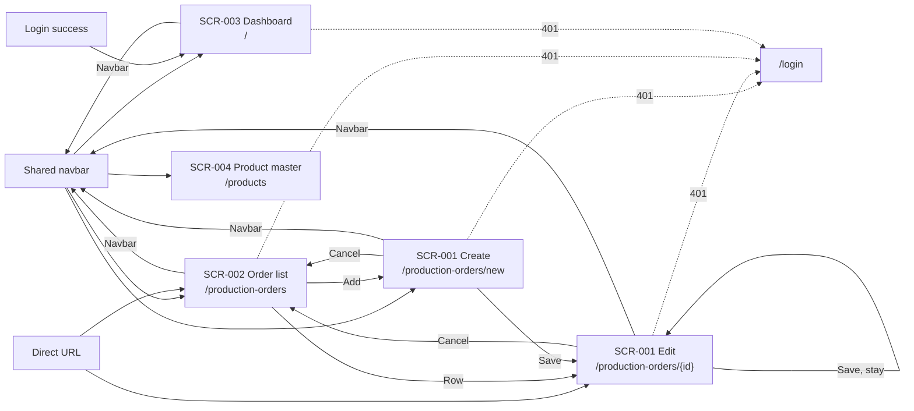
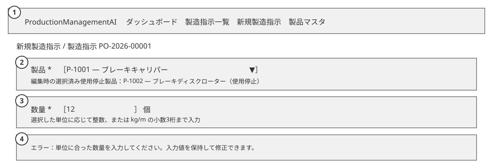
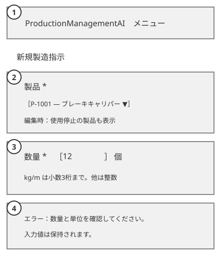
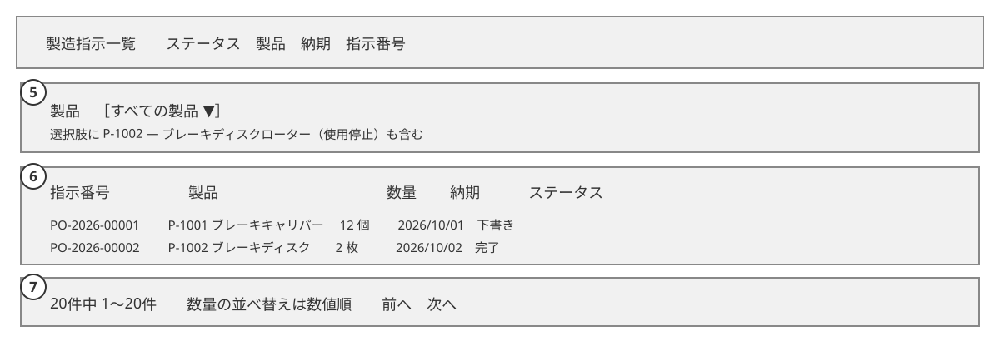
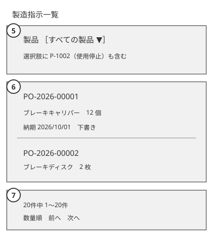
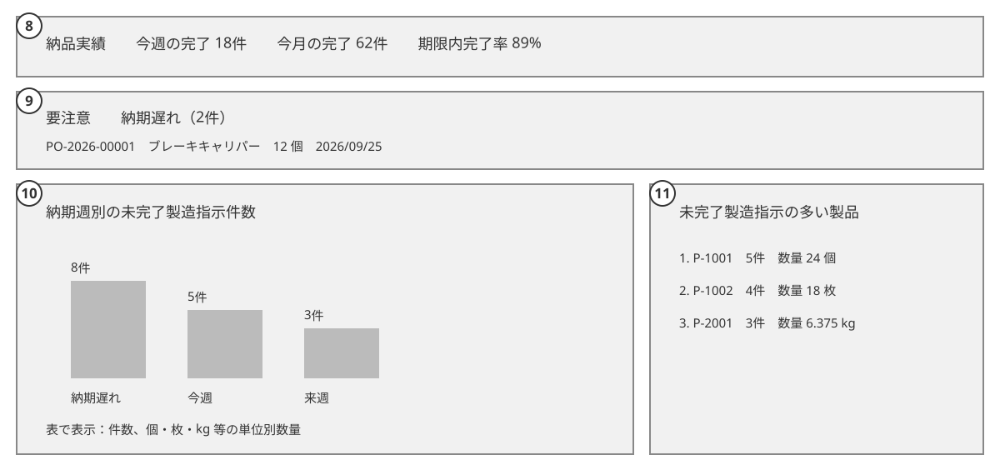
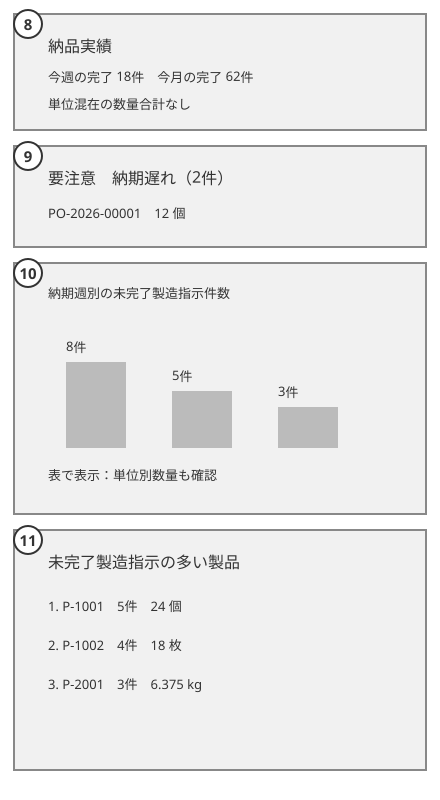

# ProductionManagementAI — Product master impact on existing screens — Basic Design Addendum (基本設計追補)

## Document control

| Field | Value |
| --- | --- |
| Document ID | 004_BD-EXISTING-SCREENS |
| Work item | WI-006 |
| Version | 1 — Product master impact on SCR-001–SCR-003 |
| Created / updated | Codex, 2026-09-29 |
| Source of truth | [WI-006 brief](../../../../work-items/WI-006/brief.md), [decisions](../../../../work-items/WI-006/decisions.md) DEC-003–DEC-004 and DEC-007–DEC-011, [004_BD](004_BD_製品マスタ.md) version 2 |
| Approved baselines extended | [001_BD](../001/001_BD_製造指示登録・編集.md) (WI-002), [002_BD](../002/002_BD_製造指示一覧.md) (WI-003), [003_BD](../003/003_BD_ダッシュボード.md) (WI-004); those files and their PDFs remain unchanged |

## Purpose and requirement coverage

This new WI-006 document describes the **delta** to the approved production-order and dashboard designs when products have active state and units. It does not supersede the baseline documents. Existing order status transitions, due-date rules, route names, list filters/paging, plant-time windows, health behavior, and read-only dashboard posture remain as their approved baselines specify. Exact API, persistence, message IDs and interaction details belong to later WI-006 DB/DD documents.

| Requirement | Added design coverage |
| --- | --- |
| REQ-052, REQ-056 | Retired product is historical/readable; an old order may retain it unchanged, but no new selection may use it |
| REQ-057 | Referenced product unit remains fixed so historical quantities keep their meaning |
| REQ-058 | Positive `kg`/`m` order quantities allow up to three fractional digits; discrete units remain whole numbers; all remain at most 999,999,999 |
| REQ-059 | SCR-001 and SCR-002 show the quantity's product unit |
| REQ-060 | SCR-003 never sums different units; cross-unit figures and rankings use order counts |

## Shared flow and screen transition

The shared navbar gains 「製品マスタ」 (Product master), pointing to SCR-004. Existing routes and the SCR-001/SCR-002 transition remain. Dashboard widgets remain read-only and do not link to orders. An expired session still exits to `/login`. Product retirement changes choice eligibility and displayed data, not navigation.

| Screen / mode | Entry | Exit and unchanged route behavior |
| --- | --- | --- |
| SCR-001 create/edit | Shared navbar's 「新規製造指示」 (New production order), SCR-002 Add/row, or a direct edit route | Create Save → edit route; edit Save → stays; Cancel → SCR-002; shared navbar → its destination; 401 → `/login` |
| SCR-002 list | Shared navbar, SCR-001 Cancel, or direct list URL | Add/row → SCR-001; shared navbar → its destination; 401 → `/login` |
| SCR-003 dashboard | Login landing page `/` or shared navbar | Shared navbar → its destination; 401 → `/login`; widgets have no route exit |
| SCR-004 Product master | Shared navbar's new 「製品マスタ」 entry | The Product master modes and exits are in [004_BD](004_BD_製品マスタ.md) |

The old Draft → InProgress/Cancelled → Completed status rules remain in [001_BD](../001/001_BD_製造指示登録・編集.md). Product and quantity stay locked once an order leaves Draft. The Product master screens use their own transition diagram in 004_BD.

## SCR-001 — Production order create/edit impact

### Business and exception flows

1. On create, load product choices with active state and unit. Only active products can be chosen. Until a product is selected, quantity displays no unit and prompts for a product first.
2. On edit, load the order's saved product even if it is retired. If Draft, that saved retired product remains a visible, marked choice and can be retained for an unrelated edit. Choosing another product is allowed only if the new one is active. If the order is no longer Draft, product and quantity stay read-only as before, including a retired saved product.
3. Show the selected product's unit next to 「数量」 (Quantity). For `kg` or `m`, accept a positive value with at most three fractional digits; for `個`, `本`, `枚`, `台`, or `セット`, accept a positive integer. Apply the existing 999,999,999 upper bound to both. Revalidate when product selection changes; a fractional value cannot be saved after switching to a discrete unit. Show the saved decimal without rounding away meaningful digits.
4. Save keeps the baseline success routes. The server repeats unit-specific validation and rejects a newly selected retired product. A race with retirement results in an actionable error; no invalid order is committed. A Draft edit retaining its unchanged retired product remains savable when other fields are valid.

| State | Visible behavior |
| --- | --- |
| No product selected | Quantity has no implied `個` default; unit help asks the user to select a product |
| Active discrete product | Unit shown; whole-number rule explained and validated |
| Active `kg` or `m` product | Unit shown; decimal precision of at most three places explained and validated |
| Saved retired product on old Draft order | Product remains selected with 「使用停止」 (Retired); saving with that original product ID is allowed, while a different retired product ID is rejected |
| Product/quantity locked by status | Saved product, unit and quantity remain readable; no new selection or quantity edit |
| Product list or order load failure | Existing error/retry behavior; never silently replace a missing product with another choice |
| Unit-specific validation or retirement conflict | Error associated with the field and summary; form values remain for correction |

### Layout deltas

| No. | Region | New or changed behavior |
| --- | --- | --- |
| 1 | Shared navbar | Adds Product master entry; existing current-page, unsaved-change guard and SP Menu behavior stay |
| 2 | Product field | Active choices; selected retired historical product is explicitly marked in edit mode |
| 3 | Quantity field | Unit beside label/value; integer or decimal help and errors depend on selected unit |
| 4 | Error/status area | Announces unit validation or retired-product conflict and keeps typed values |

## SCR-002 — Production order list impact

The product filter still contains **all** products, including retired ones, so historical orders remain findable. A retired filter option is marked 「使用停止」 (Retired). Each row pairs its quantity with the product's unit, including decimal values for `kg` and `m`; PC and SP preserve the existing order number, due date, status, updated time, search, paging and navigation. The existing `quantity` sort remains numeric by stored value; its displayed unit prevents the result from being mistaken for a common physical measure. No quantity total is added to the result summary.

| State | Visible behavior |
| --- | --- |
| Retired product filter selected | Historical matching orders are returned; the filter remains selected in the URL |
| Row uses retired product | Product identity and unit remain readable; the row still opens SCR-001 |
| Empty, loading, failed query | Baseline states remain; no placeholder unit such as `個` is fabricated |
| Missing product/unit after migration | Show the baseline recoverable error state and log an integrity failure; do not show a unitless quantity as valid data |

| No. | Region | New or changed behavior |
| --- | --- | --- |
| 5 | Product filter | Includes retired products with text marker |
| 6 | Quantity column/card line | Shows each row's own unit, including decimal measured quantities |
| 7 | Result summary/sort | Continues to show order count; numeric quantity sort does not assert a cross-unit total |

## SCR-003 — Dashboard impact

The dashboard still reads one consistent snapshot, uses the existing plant-local time windows, preserves order-count status/attention/trend metrics, and stays read-only. The old quantity suffix `個` is removed from mixed-product totals. A quantity appears only with its product's unit or in a breakdown keyed by unit.

| Baseline widget / metric | WI-006 meaning and label | Reason |
| --- | --- | --- |
| Status tiles and attention group counts (D-01, D-02) | Keep 「件」 (orders); attention rows show `quantity + unit` | Counts remain comparable; each row has its own unit |
| Open workload by due week (D-03) | Rename to 「納期週別の未完了製造指示件数」 (Open order count by due week); chart bar height and labels are order counts. The accessible table also shows per-unit quantity subtotals, each headed by its unit; no mixed-unit subtotal | Each active order still belongs to exactly one existing due-date bucket |
| Top products (D-04) | Rename to 「未完了製造指示の多い製品」 (Products with most open orders); rank by active order count descending, then SKU ascending. Show each product's open quantity with **that product's unit** as secondary information | A single cross-unit quantity ranking is invalid; one product has one fixed unit once ordered |
| Completed this week/month (D-05, D-06) | Show the order count and time window; remove the formerly aggregated `個` quantity line | The tile spans multiple product units |
| On-time rate, completion trend, lead time (D-07–D-09) | Preserve percentage, order-count and elapsed-day meanings | These metrics do not aggregate unlike units |

The workload's ten buckets and the trend's twelve buckets remain the baseline periods. Workload bars sum to the active-order count (Draft + InProgress). Top products exclude products with zero active orders. Equal counts use SKU order for stable ranking. A product's quantity subtotal is internally homogeneous because its unit cannot change after the first order references it (REQ-057). Per-unit breakdowns use the seven approved unit labels and omit empty units; `kg` and `m` show up to three fractional digits. Exact response fields and aggregation query belong to WI-006 DD/API/DB.

| State | Visible behavior |
| --- | --- |
| Zero active orders | Existing empty messages; workload and top products show no fabricated quantity/unit |
| Zero recent completions | On-time and lead-time placeholders remain as approved; completed tiles show `0件` only |
| Mixed units in a workload bucket | One count bar; accessible table shows any per-unit subtotals separately |
| Snapshot/API failure | Existing retry/error state; never reuse stale totals as current data |
| Maximized chart or SP layout | Existing modal and keyboard behavior; count labels and per-unit table remain available |

The wireframe figures are illustrative; `P-2001` is an example of a newly registered `kg` product, not one of the 30 seeded parts.

| No. | Region | New or changed behavior |
| --- | --- | --- |
| 8 | Delivery tiles | Completed this week/month show order counts without mixed-unit quantity |
| 9 | Attention rows | Quantity carries each row's product unit |
| 10 | Workload chart/table | Bars show order counts; table can show subtotals by unit |
| 11 | Top products | Ranked by open order count; each product quantity labelled with its unit |

## Data, security and accessibility implications

- **Data:** Order quantity becomes a positive decimal-capable value, but migrated whole-number history retains its value. Product ID/FK and prior order statuses remain. A referenced product's unit cannot change; retired products and their identity remain readable. Schema/migration details belong to WI-006 DB documents.
- **Authorization:** Existing SCR-001–SCR-003 `Admin`/`Operator` server checks and same-origin cookie posture remain. No new PII or secret is introduced. Product master write permission is separately specified in 004_BD. No order or dashboard client control can bypass server-side product eligibility or quantity checks.
- **Accessibility:** Unit is visible text associated with each quantity, not color or an unlabeled suffix. Changing product announces the new unit/rule; an invalid amount is linked to its field and focus moves to the first error. Retired choices have text markers. Dashboard charts keep accessible names, visible values and equivalent tables; responsive layouts do not require horizontal page scrolling. WCAG 2.2 AA remains the target.
- **Observability:** A rejected retired selection or unit-specific quantity is a validation outcome, without logging product name or full request body. Dashboard snapshot failures retain the existing failure signal; new count/per-unit aggregations are traced in WI-006 DD-FN.

## Open design handoff

No further business decision is required for this BD: the cross-unit rule is DEC-007 and decimal/unit-lock rules are DEC-008–DEC-010. WI-006 DB and DD documents will resolve exact storage, API fields, concurrency, messages, sorting implementation, and formatting. Those details must match this screen-level behavior before application implementation.
