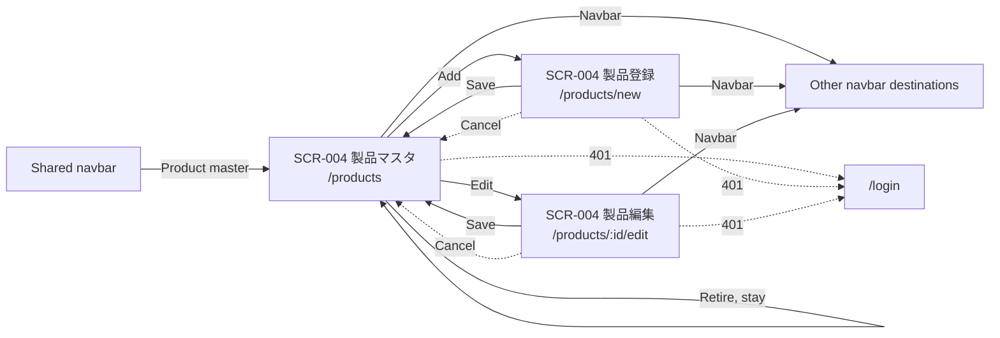
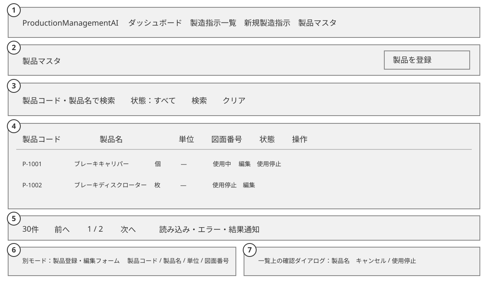
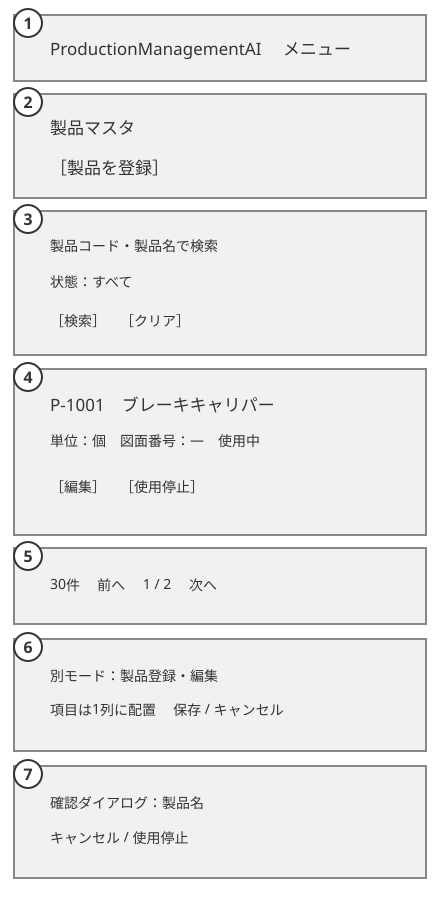

# ProductionManagementAI — Product master — Basic Design Document (基本設計書)

## Document control (改版履歴)

| Field | Value |
| --- | --- |
| Document ID | 004_BD |
| Category | UI and product reference data |
| System / subsystem | ProductionManagementAI / Product master |
| Work item | WI-006 |
| Based on brief | [WI-006 brief](../../../../work-items/WI-006/brief.md), design baseline 2026-09-29 |
| Created / updated | Codex, 2026-09-29 |
| Version | 2 — reconciled with DEC-007–DEC-010 (unit-locking rule, measured quantities, mixed-unit impacts) |

## System overview

`SCR-004` lets an `Admin` or `Operator` find, create, edit, and retire automobile parts without changing the database directly. Retiring a part leaves its historical orders readable. It is unavailable as a new product selection, while an old order may retain that product during an unrelated edit ([WI-006 decisions](../../../../work-items/WI-006/decisions.md) DEC-001–DEC-004). To protect historical order integrity, a product's unit cannot change once referenced by any production order (DEC-010, REQ-057).

| Requirement | Coverage |
| --- | --- |
| REQ-049 | List, search, empty and error states |
| REQ-050–REQ-051 | Create/edit form and validation |
| REQ-052, REQ-056 | Retirement, SCR-001 picker, SCR-002 filter, historical orders |
| REQ-053 | Seed and migration design in [004_DB](../../database/004/004_DB_製品マスタ.md) |
| REQ-054–REQ-055 | Role gate, Japanese UI, responsive and accessible behavior |
| REQ-057 | Product unit locked on edit when referenced by orders |

## Overall configuration and architecture

The existing React app calls same-origin ASP.NET Core controllers backed by EF Core and PostgreSQL 17. `SCR-004` uses the shared authenticated header and Japanese message catalog. Product management uses new API operations while the existing `GET /api/products` remains available to production-order screens. No new external service or trust boundary is introduced; the [auth ADR](../../architecture/0002/0002_ADR_auth-rbac-foundation.md) and the existing JSON-only mutation posture apply. The [004_DD-API](../../020_detailed-design/004/004_DD-API_製品マスタ.md) owns the exact contracts.

## Function list

| Function ID | Function | Requirements |
| --- | --- | --- |
| FN-027 | Search and page the product catalog | REQ-049 |
| FN-028 | Create an active product | REQ-050, REQ-054 |
| FN-029 | Edit mutable product fields | REQ-051, REQ-054 |
| FN-030 | Retire an active product | REQ-052, REQ-054 |
| FN-031 | Select a product on an order with retirement rules | REQ-052, REQ-056 |

## Actors and business flow

1. An `Admin` or `Operator` opens 「製品マスタ」 (Product master) from the shared navbar, then searches by SKU or name and filters by active/retired state.
2. The maintainer chooses 「製品を登録」 (Add product), enters SKU, Japanese name, unit, and optional drawing number, then saves. A successful save returns to the catalog with the new row visible.
3. The maintainer chooses 「編集」 (Edit), changes name or drawing number (and unit if no orders reference this product), and saves. SKU is displayed but cannot be changed. If any production order references this product, unit selection is locked (disabled with an explanatory notice) to preserve the historical meaning of order quantities (REQ-057, DEC-010).
4. The maintainer chooses 「使用停止」 (Retire), reviews a confirmation naming the part, and confirms. The row remains in the catalog as retired.
5. On SCR-001, active parts are selectable for new or changed selections; a retired part already on an order remains visible and can be retained. SCR-002's product filter still includes retired parts to find historical orders.

## Screen list and transition

| Screen / mode | Name | Entry | Exit / next state |
| --- | --- | --- | --- |
| SCR-004 list | 「製品マスタ」 (Product master), `/products` | Navbar, create/edit save or cancel | Create mode, edit mode, stay on list after retirement, navbar destinations, `/login` on 401 |
| SCR-004 create | 「製品登録」 (Add product), `/products/new` | List Add | List on save/cancel, `/login` on 401 |
| SCR-004 edit | 「製品編集」 (Edit product), `/products/:id/edit` | List Edit | List on save/cancel, `/login` on 401 |

The shared unsaved-change guard applies when leaving a dirty create/edit form, including navbar navigation. Retire confirmation is a dialog on the list, not a route. A 403 shows a forbidden state without attempting another write.

## Screen design detail — SCR-004 Product master

### 0-1. Basic information

| Item | Design |
| --- | --- |
| Routes | `/products`, `/products/new`, `/products/:id/edit` |
| API base | `/api/product-master`; existing `/api/products` supplies order screens |
| Encoding | UTF-8 |
| Error fallback | Local retry state for fetch failures; `/login` on 401; forbidden state on 403 |
| Responsive | PC and SP layouts; list table becomes cards on SP |
| Authentication / authorization | Cookie session and `Admin` or `Operator` role, enforced by API |
| URL parameters | List query `q`, `state`, `page`; edit route `id` is a UUID |
| Page title | Mode heading followed by ProductionManagementAI |
| Base/link/meta/style/script overrides | Not applicable — shared app document and bundled styles/scripts apply |

### 1. Layout and mockup

| No. | Region | Content and behavior |
| --- | --- | --- |
| 1 | Shared header | Existing application name and navbar, with 「製品マスタ」 entry and current-page marker |
| 2 | Heading/actions | List heading and 「製品を登録」 action; create/edit headings and save/cancel actions in form mode |
| 3 | Search/filter | SKU/name search, active-state filter, apply/clear actions; URL reflects applied values |
| 4 | Catalog | PC table or SP cards showing SKU, name, unit, drawing number, state, Edit, and Retire when active |
| 5 | Pagination/status | Total count, current page, previous/next; loading, empty, fetch error, and success notice |
| 6 | Product form | SKU (read-only in edit), name, fixed unit selection (locked/disabled with helper note in edit if referenced by orders), optional drawing number, field errors |
| 7 | Retire confirmation | Dialog naming the part with Cancel and Retire; focus returns to the invoking action |

### 2. Content blocks and visible states

| State | Visible result |
| --- | --- |
| Loading | Heading and a loading status; actions that depend on fetched data wait. |
| Empty catalog / no search match | Distinct Japanese messages; Add remains available. |
| Ready | Rows/cards and total; retired rows carry 「使用停止」 (Retired) text as well as styling. |
| Fetch failure | Error message and 「再試行」 (Retry), without stale data presented as current. |
| Validation failure | Inline errors, an error summary and focus on the first invalid field. |
| Concurrent edit / retirement | Explain that the record changed; offer reload without silent overwrite. |
| Save/retire success | Return to list or update the row; announce success politely. |

### 3. Screen item definition

| Item | Japanese UI text (English gloss) | Source / type | Rule |
| --- | --- | --- | --- |
| SKU | 「製品コード」 (Product code) | Required text, maximum 50 characters | Trim ends on create, case-insensitive unique; immutable afterward |
| Name | 「製品名」 (Product name) | Required text, maximum 200 characters | Japanese display name; whitespace-only invalid |
| Unit | 「単位」 (Unit) | Required fixed selection | `個`, `本`, `枚`, `台`, `セット`, `kg`, `m`. Mutable on creation; locked (disabled/read-only) in edit mode when any production order references this product (DEC-010, REQ-057) |
| Drawing number | 「図面番号」 (Drawing number) | Optional text, proposed maximum 100 characters | Blank stored as null; exact length confirmed in DD |
| State | 「状態」 (State) | Active / retired | No hard delete; retirement confirmed by user |
| Search | 「製品コード・製品名で検索」 (Search by code or name) | Optional text | Applied only on Search, reset page to 1 |

### 4. Item value mapping

| Value | Display |
| --- | --- |
| Active | 「使用中」 (Active) |
| Retired | 「使用停止」 (Retired) |
| All filter | 「すべて」 (All) |
| Optional drawing number absent | 「—」 (Not provided) |

### 5. Validation checks

| Check | User result | Requirement |
| --- | --- | --- |
| Missing/blank SKU or name, missing unit | Explain at the field and block save | REQ-050–REQ-051 |
| SKU duplicate after trim and case-insensitive comparison | Explain conflict; keep entered values | REQ-050 |
| Unknown unit or too-long field | Explain allowed values/length; backend rejects independently | REQ-050–REQ-051 |
| Attempted unit change on referenced product | Explain that unit cannot be changed because orders already reference this product; block save | REQ-057 |
| Stale edit or retire version | Explain conflict and offer reload | REQ-051–REQ-052 |
| Unauthorized action | Server returns 401/403; UI provides navigation or forbidden message | REQ-054 |

### 6. Item events

| Event | Result |
| --- | --- |
| Apply/Clear filters | Update list URL and fetch page 1. |
| Add/Edit | Navigate to the create/edit mode; preserve list URL for return. |
| Save | Validate, submit once, navigate to list on success; keep form on error. |
| Cancel/navbar while dirty | Use existing unsaved-change confirmation before navigation. |
| Retire | Open named confirmation dialog; only confirmation submits; keep list row visible as retired. |
| 401/403/API failure | Navigate to login, show forbidden state, or show retry/error respectively. |

### 7. External identity linkage

Not applicable — existing cookie authentication and local `Admin`/`Operator` roles are reused; no external identity provider is added.

## Impact on existing screens and data

`GET /api/products` must include active-state and unit information while continuing to supply SKU/name/ID to SCR-001 and SCR-002.
- SCR-001: Filters new selections to active products, but includes its current retired product as a retained choice in edit mode. Displays the product's unit alongside order quantity. Supports measured decimal quantities (up to 3 decimal places) for `kg` and `m`, while enforcing positive integers for discrete units (REQ-058, DEC-008, DEC-009). The server allows an unchanged retired product ID on update and rejects a newly chosen retired ID.
- SCR-002: Keeps retired products in its filter so historical orders remain findable. Displays unit alongside quantities in the table and details (REQ-059).
- SCR-003: Dashboard aggregates order quantities only within the same unit; cross-unit summaries display order counts (REQ-060, DEC-007).
Product ID and FK behavior remain unchanged; see [004_DB](../../database/004/004_DB_製品マスタ.md).

## Non-functional design and open points

- **Accessibility:** keyboard-operable list, form and confirmation; visible focus; explicit labels and error text; no color-only state; PC/SP layouts and WCAG 2.2 AA. Locked unit input in edit mode is clearly identified to screen readers (e.g. `aria-disabled="true"` with helper text). The modern-web-guidance forms reference recommends semantic forms, visible labels, validation after interaction, and clear focus/error behavior.
- **Security:** `Admin`/`Operator` checks on every new API operation, including writes; UI gating alone is insufficient. Product fields contain no expected PII or secrets. Mutations remain JSON-only under the existing same-origin cookie/CSRF posture; revisit if CORS or hosting origins change.
- **Observability:** count list/create/update/retire outcomes without logging SKU, name, drawing number, or full bodies; detailed telemetry names belong in 004_DD-FN.
- **Migration:** additive columns and a per-part unit backfill for the 30 seeded rows; remove EF model-managed seed tracking without deleting the rows. The mapping and handling of any non-seed rows are specified in WI-006 DEC-005 and 004_DB.
