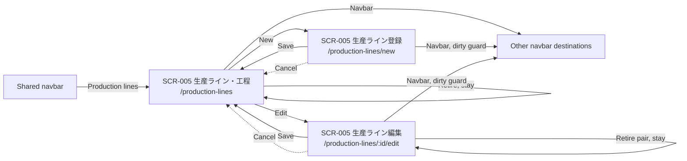
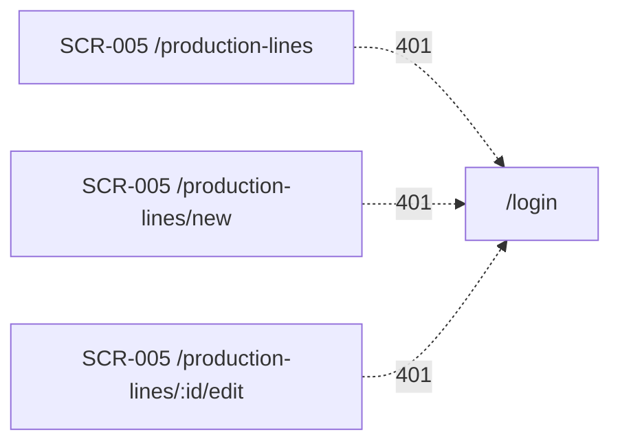

# Production lines — Basic design

## Document control

| Field | Value |
| --- | --- |
| Document ID / version | 005_BD / 1 |
| Category / system / subsystem | UI / ProductionManagementAI / Master data |
| Work item / based on requirements | WI-009 / 005_REQ version 1 |
| Author / created / updated | Agent / 2026-10-01 / 2026-10-01 |
| Review state | Submitted for review; not implemented |

| Version | Date | Author | Change |
| --- | --- | --- | --- |
| 1 | 2026-10-01 | Agent | Initial design from confirmed DEC-001–DEC-009 |

## System overview

SCR-005 maintains production lines, working hours/day and supported products with
minutes per one product unit. Admin and Operator maintain these masters. Orders
may omit a line in Draft but need an eligible line to begin production. This
feature describes capacity; it does not schedule, allocate or detect overload.

| Requirement | Design coverage |
| --- | --- |
| REQ-064 | List, search, paging and visible states |
| REQ-065 | Identity form, uniqueness and concurrency |
| REQ-066 | Hours and product timing editor; unit reconfirmation |
| REQ-067 | Retirement confirmations and historical assignment |
| REQ-068 | Order integration and assignment lock |
| REQ-069 | Role checks, Japanese UI, navigation and accessibility |

[Requirements](../../000_requirements/005/005_REQ_production-lines.md) and
[decisions](../../../../work-items/WI-009/decisions.md) are the business sources.

## Overall configuration and architecture

Reuse React, the Japanese catalog, centralized Lucide icons and same-origin
ASP.NET Core controllers, Application ports/use cases and EF/PostgreSQL storage.
Existing [layering ADR](../../architecture/0001/0001_ADR_backend-layered-structure.md)
and [authentication ADR](../../architecture/0002/0002_ADR_auth-rbac-foundation.md)
remain unchanged; [SA assessment](../../../../work-items/WI-009/architecture-assessment.md)
requires no new ADR. Proposed master API base: `/api/production-lines`.
Exact endpoint/schema/transaction contracts belong to the later DB/API/FN designs.

## Function list and business flow

| ID | Function | Requirements |
| --- | --- | --- |
| FN-032 | Search and page lines | REQ-064 |
| FN-033 | Create/edit line identity and working hours | REQ-065, REQ-066 |
| FN-034 | Maintain product support, time coefficient and unit confirmation | REQ-066, REQ-067 |
| FN-035 | Retire a line with history preserved | REQ-067 |
| FN-036 | Select/validate/lock a line on an order | REQ-068, REQ-069 |

1. Admin/Operator opens 「生産ライン・工程」 (Production lines and processes),
   searches code/name, filters state and opens create or edit.
2. Enter immutable code at creation, mutable name and working hours/day; add
   supported active products with minutes per unit. A line may initially have
   no supported products; it is then unavailable to any order selection.
3. Save line and configured pair changes together. Validation leaves the dirty
   form intact; success returns to the list with a visible/announced notice.
4. Retire a line or a saved product association only after confirmation. Rows
   and historical references remain; unsaved pair rows can be removed locally.
5. On an order, choose a line eligible for its product; begin production only
   after server-side eligibility checks. No scheduling or capacity reservation.

## Screen list and transition

| Screen/mode | Entry | Exit / next state |
| --- | --- | --- |
| SCR-005 list, `/production-lines` | Shared navbar; form Save/Cancel | New, Edit, Retire stays on list, other navbar destinations, `/login` on 401 |
| SCR-005 create, `/production-lines/new` | List New | Save/Cancel to list; other navbar destinations after dirty guard; `/login` on 401 |
| SCR-005 edit, `/production-lines/:id/edit` | List Edit | Save/Cancel to list; pair retirement stays on edit; other navbar destinations after dirty guard; `/login` on 401 |

Session expiry exits (same modes, separated for legible arrows):

Dialog is a mode overlay, not a route. Cancel on clean forms exits directly;
leave/reload on dirty forms requires discard confirmation. A 403 stays on the
current route in a forbidden state without another write.

## Screen design detail — SCR-005

### 0-1. Basic information

| Item | Design |
| --- | --- |
| Routes / API base | Three routes above; proposed `/api/production-lines` |
| Encoding / responsive | UTF-8; PC table and SP cards; shared breakpoint convention |
| Authentication / write roles | Cookie session; Admin or Operator enforced at API and UI |
| Error fallback | Local retry/404/403 state; `/login` on 401 |
| Query / route parameters | List `q`, `state`, `page`; edit `id` UUID; apply/reset starts page 1 |

### 0-2. Page metadata

Title: current mode heading followed by ProductionManagementAI. Base, link,
meta, style and script overrides: not applicable; shared document/bundles apply.
No public indexing, social-preview content or external script required.

### 0-3. URL behavior

Applied filters use the URL and browser navigation restores them. Unsaved field
values are local state, not URL parameters. Invalid page/state/UUID produces
bounded validation or not-found state; exact query limits defined in API DD.

### 1. Layout and mockup

These are design wireframes, not screenshots of a running application. Regions
6–9 show form/overlay states alongside the list for reference, not one combined
product screen. English/Japanese HTML mockups belong to the later SPD package.

| No. | Region | Content and behavior |
| --- | --- | --- |
| 1 | Header | Shared navigation, new line entry, current marker; mobile menu |
| 2 | Heading/action | Mode heading; list New; form heading and dirty-state notices |
| 3 | Search/filter | Code/name search, active-state filter, Search/Clear |
| 4 | Results | Code, name, hours/day, state, Edit and active-line Retire; table/cards |
| 5 | List status/paging | Total, page, previous/next; loading/empty/error/success notices |
| 6 | Identity form | Code (immutable on edit), name, hours/day, validation, Save/Cancel |
| 7 | Product timing | Supported product/unit, minutes per unit, Add and retirement; unsaved remove |
| 8 | Unit reconfirmation | Stale-unit warning, previous/current unit, explicit confirmation action |
| 9 | Confirmation | Centered native dialog for line/pair retirement or discarding draft |

### 2. Content blocks and visible states

| State | Visible response |
| --- | --- |
| Loading / empty | Loading status; distinguish no lines from no search matches; New remains available |
| Ready / retired | Rows/cards; active/retired text, not color alone; retired lines/pairs remain readable |
| Fetch / 404 / 403 | Local Retry for transient failure; not-found or forbidden view; no invented/stale data presented as current |
| Validation | Summary plus field errors; focus first invalid field; retain all entered rows/values |
| Conflict | Explain changed record; explicit reload guarded against dirty-data loss; never overwrite silently |
| Unit changed | Timing row shows configured/current units and cannot be newly used until explicit confirmation |
| Saving / success | Disable repeated writes while pending; announce success and return to list |
| Uncertain write | Preserve entered data; explain outcome unknown; offer list/reload verification, no automatic replay |

### 3. Screen items

The Japanese labels below are proposed catalog additions. Existing order labels
remain unchanged. Technical text length limits follow master conventions and
are reviewable proposals; exact API/DB mapping is finalized later.

| Item | Japanese UI (English gloss) | Rule |
| --- | --- | --- |
| Line code | 「ラインコード」 (Line code) | Required, trim, proposed max 50 Unicode code points; immutable; case-insensitive unique even retired |
| Line name | 「ライン名」 (Line name) | Required, trim, proposed max 200 code points |
| Working hours | 「稼働時間／日」 (Working hours/day) | 0 < hours <=24; <=3 fractional digits; unit 「時間」 (hours) |
| Supported products | 「生産可能な製品」 (Supported products) | Choose active products; one saved association per line/product; saved retired rows kept for history |
| Product timing | 「製造時間／単位」 (Production time/unit) | Positive minutes per one actual product unit, <=3 fractional digits; no implicit batch/unit conversion |
| Pair state | 「使用中」 / 「使用停止」 (Active / Retired) | Retire confirmed; no hard delete or reactivation in this scope |
| Unit warning | 「単位の確認が必要です」 (Unit confirmation required) | Show previous/current unit; change/confirm coefficient for current unit explicitly before Save |
| Confirm unit | 「現在の単位で確認」 (Confirm for current unit) | Enabled after a valid current-unit coefficient; never auto-confirm on load/save |
| Actions | 「新規ライン」 / 「編集」 / 「保存」 / 「キャンセル」 (New line / Edit / Save / Cancel) | Save line and pair edits together; Cancel does not write |
| Pair actions | 「製品を追加」 / 「使用停止」 (Add product / Retire) | Unsaved association can be locally removed; persisted retirement is confirmed |

### 4. Item value mapping

Display hours and minutes with exact decimal formatting and visible units;
never sum unlike product-unit capacities. `IsActive` true/false maps to active/
retired Japanese text. A unit mismatch adds the confirmation-required state,
independent of retirement. Missing historical order line displays 「未設定」
(Unassigned), not an invented default. Proposed names/labels are not implemented.

### 5. Validation and history rules

- API repeats all identity, precision, role and eligibility checks; UI validation
  is assistance, not an authorization boundary. Code remains immutable via API.
- Configured timing is tied to its confirmed product unit. Product-unit edits
  permitted by WI-006 remain permitted; old-unit timing is not reinterpreted.
  Explicit current-unit reconfirmation is required for new selection/production start.
- New/changed assignment requires active product, active line and active pair with
  a matching confirmed unit. Draft -> InProgress applies this check even if the
  Draft retained a historically retired assignment. Explain how to choose a valid line.
- Unchanged historical assignments may be retained during otherwise allowed edits.
  Outside Draft, reject assignment changes; legacy null stays null. New Drafts
  may omit a line; no default/backfill or change to other existing field locks.
- Current timing edits do not recalculate history. No historical duration snapshot
  or derived schedule promised. Retiring a saved pair/line retains its identity.
- Pending local edits are validated together; when a retirement affects dirty
  data, require explicit save/discard resolution instead of silently losing edits.

### 6. Item events

| Event | Result |
| --- | --- |
| Navbar / Search / Clear / Page | Enter line list; apply/reset URL filters; fetch bounded page |
| New / Edit | Enter respective form; focus heading after mount |
| Add product | Append unsaved timing row; selectable products exclude duplicates/inactive products |
| Save | Validate; send one logical line/pair edit; retain on failure, list on confirmed success |
| Retire line/pair | Open centered confirmation naming target; Cancel/Escape no write; confirmed line stays list, pair stays edit |
| Unit confirmation | User explicitly confirms timing for visible current unit; save guarded against another unit-change race |
| Cancel / dirty navigation / Reload | Discard confirmation when dirty; Keep editing retains draft; Escape safe; return focus |

### 7. External identity linkage

Not applicable: no new identity provider, external ID synchronization or SSO.

## Order integration boundaries

SCR-001 adds 「生産ライン」 (Production line) selection in Draft and read-only
display otherwise. SCR-002 shows assigned line or 「未設定」 (Unassigned); line
filters, dashboard by line and schedules are excluded. Product change in Draft
clears/revalidates an incompatible line. Required validation is on beginning
production, not Draft creation. Legacy orders already outside Draft with no
line remain usable under existing field rules. A new WI-009-owned order-impact
DD will specify states/requests without editing prior approved screen designs.

## Accessibility, security and nonfunctional behavior

Target WCAG 2.2 AA: semantic table/cards, associated labels/errors, live statuses,
keyboard-visible focus, 44-pixel touch action targets where practical and usable
200% zoom. Native confirmations fit viewport with 16-pixel margins, centered
both axes including scrolled screens; initial safe action focused, background
inert, Escape/Cancel safe and focus restored. Dirty dialogs follow same rules.
Use a dedicated centralized `Factory` glyph (proposal), distinct from Package
and ClipboardList, decorative aria-hidden with visible text/current marker.

Never log credentials, names/raw search or timing values in metric labels. Exact
bounded operation/outcome spans belong to API/FN DD. Retire/selection and unit
reconfirmation races require transaction-safe server checks; additive schema/FK
preservation and recovery limits belong to DB design. No deployment gate claimed.

## Traceability and next review

| Check group | Acceptance / later verification |
| --- | --- |
| List/forms | REQ-064/065; filters, uniqueness, conflicts, uncertain writes |
| Timing/units | REQ-066; hours/time precision, unit reconfirmation and racing edits |
| Retirement/orders | REQ-067/068; no cancellation writes, historical exceptions, status lock and eligible start |
| Access/mobile | REQ-069; role API/UI checks, axe/keyboard/scroll/zoom/dialog geometry/navigation |

This package is a design proposal, not working application evidence. Submit
005_BD with both PDFs and rendered wireframes; wait for explicit user instruction
before writing 005_DB or any subsequent design Markdown. Application code waits
for the separately approved implementation plan.
