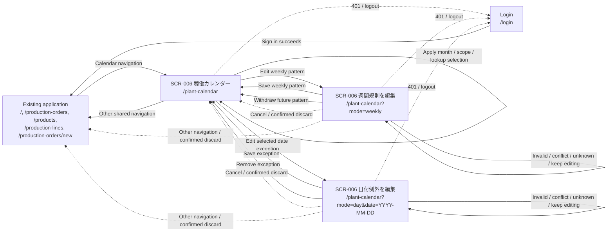
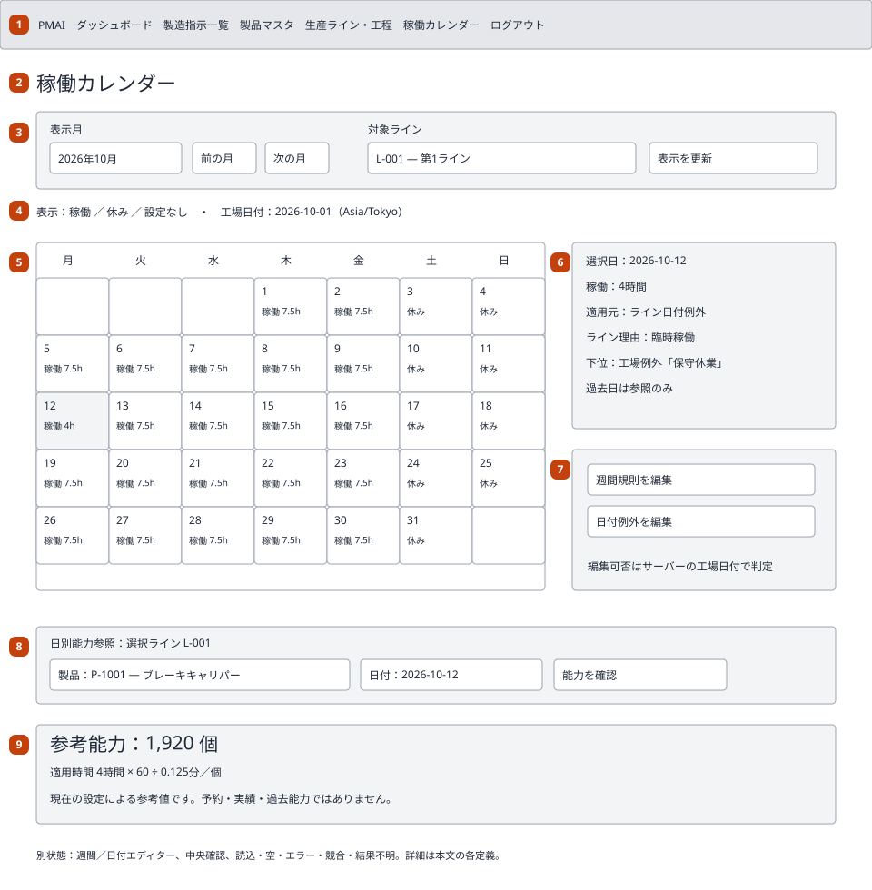
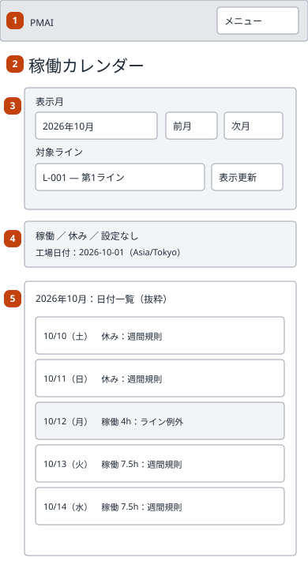
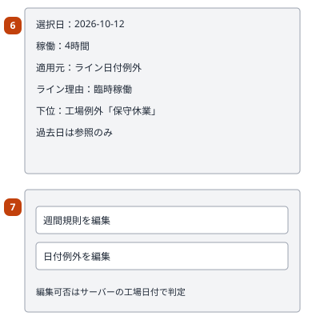
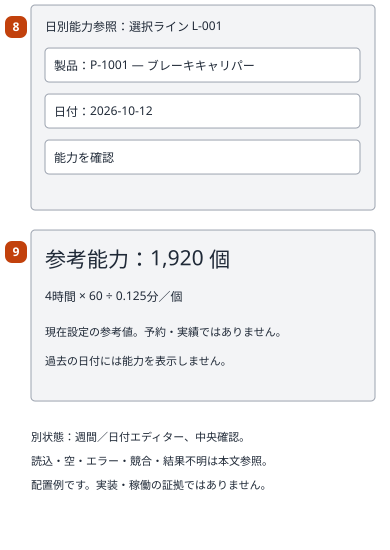

# Plant calendar — Basic design

## Document control

| Field | Value |
| --- | --- |
| Document ID / version | 006_BD / 1 |
| Category / system / subsystem | UI / ProductionManagementAI / Master data |
| Work item / input | WI-010 / approved 006_REQ version 1, DEC-001–007 and RP-01–05 |
| Author / created / updated | Agent / 2026-10-01 / 2026-10-01 |
| Review state | Submitted for review; not implemented |

| Version | Date | Author | Change |
| --- | --- | --- | --- |
| 1 | 2026-10-01 | Agent | Initial BD after explicit 006_REQ review approval |

## System overview and requirements

SCR-006 manages plant-wide weekday rules and dated plant/line exceptions. Its
calendar explains working state and effective hours; capacity lookup describes
current line/product capability for today/future. It changes no order, due-date,
dashboard-window or scheduling behavior.

| Requirement | Coverage |
| --- | --- |
| REQ-070 | Month/scope navigation, state/source display and unavailable dates |
| REQ-071 | Weekly editor, effective dates and retained versions |
| REQ-072 | Plant/line exception editor, manual reasons, remove/restore fallback |
| REQ-073 | Precedence, line-hour fallback and current unit-bearing dated capacity |
| REQ-074 | Role checks, exact validation, concurrency, dirty/unknown states and accessibility |
| REQ-075 | Existing application date and order behavior unchanged |

[Approved requirements](../../000_requirements/006/006_REQ_plant-calendar.md),
[decisions](../../../../work-items/WI-010/decisions.md) and
[plan](../../../../work-items/WI-010/plan.md) are the sources; acceptance criteria
remain authoritative there. RP-01–05 were explicitly accepted in requirements review.

## Overall configuration and architecture

Reuse Japanese React/Tailwind UI, central catalog/icons and navigation guard,
same-origin ASP.NET Core controllers, Application ports and EF/PostgreSQL.
Existing [layering ADR](../../architecture/0001/0001_ADR_backend-layered-structure.md)
and [cookie/RBAC ADR](../../architecture/0002/0002_ADR_auth-rbac-foundation.md)
remain unchanged; [architecture assessment](../../../../work-items/WI-010/architecture-assessment.md)
requires no new ADR or technology. Proposed API base `/api/plant-calendar`.
Calendar persistence is additive; existing line hours/timing/unit generations
remain owned by their master features. Detailed contracts belong to DB/API/FN.

## Function list and business flow

| Function | Name | Requirements |
| --- | --- | --- |
| FN-037 | Read monthly effective calendar and selected day | REQ-070, REQ-074 |
| FN-038 | Maintain effective weekly patterns with retained revisions | REQ-071, REQ-074 |
| FN-039 | Maintain/remove plant and line date exceptions | REQ-072, REQ-074 |
| FN-040 | Read current descriptive line/product capacity for a date | REQ-073, REQ-075 |

1. Admin/Operator opens 「稼働カレンダー」 (Working calendar); select month and
   plant/line scope and apply. Month defaults to the server's plant month.
2. Inspect a day: working/closed/unavailable, effective hours and winning source.
3. Enter weekly mode to configure weekdays and effective date, or date mode to
   set an exception for the selected scope/date. Save uses the observed revision.
4. Review confirmation before removing an exception or withdrawing a future
   weekly version. Successful removal reveals lower-priority configuration.
5. Select current line/product/date for capacity. Display the actual product unit,
   inputs and current-setting disclaimer; no order allocation or historical result.
6. On invalid/conflicting/uncertain write, retain the draft and reconcile before
   further mutation. Calendar never automatically retries a write.

## Screen list and transitions

All feature modes belong to SCR-006; editor modes are not new screen IDs. Applied
month/line/day URL state survives reload; editors initialize from a coherent read.
Transient draft edits, confirmation and verification do not create extra routes.

| Screen / mode | Route | Entry and exit rule |
| --- | --- | --- |
| SCR-006 calendar | `/plant-calendar` | Shared navigation entry; month/scope stays here; weekly/day actions enter respective modes; other navigation leaves; 401/logout to login |
| SCR-006 weekly | `?mode=weekly` | Calendar edit action; save/withdraw/cancel-confirmed-discard returns calendar; invalid/conflict/unknown retains mode; dirty other navigation guarded; 401/logout to login |
| SCR-006 date | `?mode=day&date=YYYY-MM-DD` | Calendar selected-date action; save/remove/cancel-confirmed-discard returns calendar; invalid/conflict/unknown retains mode; dirty other navigation guarded; 401/logout to login |
| Existing application | `/`, `/production-orders`, `/products`, `/production-lines`, `/production-orders/new` | Existing routes and behavior; Calendar entry opens SCR-006; successful sign-in lands on existing app |
| Login | `/login` | 401/logout from any mode; successful sign-in returns existing application |

The exact transition list below is the diagram's edge inventory.

| From | Trigger | To |
| --- | --- | --- |
| Existing application routes | Calendar navigation | SCR-006 calendar |
| SCR-006 calendar | Apply month / scope / lookup selection | SCR-006 calendar |
| SCR-006 calendar | Edit weekly pattern | SCR-006 weekly mode |
| SCR-006 calendar | Edit selected date exception | SCR-006 date mode |
| SCR-006 weekly mode | Save weekly pattern | SCR-006 calendar |
| SCR-006 weekly mode | Withdraw future pattern | SCR-006 calendar |
| SCR-006 weekly mode | Cancel / confirmed discard | SCR-006 calendar |
| SCR-006 weekly mode | Invalid / conflict / unknown / keep editing | SCR-006 weekly mode |
| SCR-006 date mode | Save exception | SCR-006 calendar |
| SCR-006 date mode | Remove exception | SCR-006 calendar |
| SCR-006 date mode | Cancel / confirmed discard | SCR-006 calendar |
| SCR-006 date mode | Invalid / conflict / unknown / keep editing | SCR-006 date mode |
| SCR-006 calendar | Other shared navigation | Existing application routes |
| SCR-006 weekly mode | Other navigation / confirmed discard | Existing application routes |
| SCR-006 date mode | Other navigation / confirmed discard | Existing application routes |
| SCR-006 calendar | 401 / logout | Login |
| SCR-006 weekly mode | 401 / logout | Login |
| SCR-006 date mode | 401 / logout | Login |
| Login | Sign in succeeds | Existing application routes |

## Screen design detail — SCR-006

### 0-1. Basic information

| Item | Design |
| --- | --- |
| Route / API family | `/plant-calendar` / proposed `/api/plant-calendar`; exact endpoints deferred |
| Encoding / channels | UTF-8; one responsive web app; phone emulation is not physical-device proof |
| Authentication / authorization | Existing cookie; Admin or Operator for every feature read/write |
| Responsive layout | Existing application small-screen breakpoint; desktop month table, phone agenda; usable at 320 CSS px and 200% zoom |
| Error fallback | Inline honest error/retry for read; 403 clears feature data and shows forbidden; 401 follows existing auth flow; invalid URL offers explicit reset |

### 0-2. Page metadata

- **0-2-1 Title:** 「稼働カレンダー」 (Working calendar); weekly/day mode may add
  「週間規則を編集」 (Edit weekly pattern) / 「日付例外を編集」 (Edit date exception).
- **0-2-2 Base:** no base override.
- **0-2-3 Link:** no screen-specific external stylesheet, font or asset provider.
- **0-2-4 Meta:** inherit existing viewport/document metadata; no public SEO addition.
- **0-2-5 Style:** existing Tailwind classes/tokens; no new inline style block.
- **0-2-6 Script:** existing bundled React route only; no external calendar script.

### 0-3. URL parameters

| Parameter | Meaning | Invalid / change behavior |
| --- | --- | --- |
| month | Applied `YYYY-MM`, default current plant month | Validate before fetch; explicit reset, no silent fabricated month |
| lineId | Optional selected line identifier; absence means plant scope | Validate identifier/reference; retired line remains readable with restrictions |
| date | Selected/editor `YYYY-MM-DD` | Date-only; selected day associated with displayed month; bounded by later API limits |
| mode | Absent/calendar, weekly or day | Unknown mode rejected with safe return action |
| productId | Optional capacity selection | Current eligible product for selected line; change invalidates previous result |

Changing applied month/scope/lookup invalidates superseded reads and old capacity
results. Draft filter values do not silently relabel old applied data. Editor URL
is never an authorization source or a promise the date remains editable.

### 1. Layout and wireframes

The layout samples show 2026-10-12 on L-001: plant maintenance closure overridden
by a four-hour line working exception. P-1001 has 0.125 minutes/個; reference
capacity is 1,920 個. These are layout samples, not seeded data or runtime evidence.

#### PC / desktop

| No. | Region | Notes |
| --- | --- | --- |
| 1 | Shared header/navigation | New 「稼働カレンダー」 entry; central CalendarRange alias proposed, distinct from Factory/Package/ClipboardList; mobile Menu; current-route indication |
| 2 | Heading and status | Screen/mode heading; saved/pending/error/conflict/unknown messages with announcement |
| 3 | Applied month and scope controls | Previous/next month, month input, plant/line scope and explicit Apply; preserve draft selection independently of applied result |
| 4 | State/source legend and plant date | Working, closed and unavailable distinguished by text; server plant-local today/timezone |
| 5 | Month days | Desktop semantic month table with date buttons; mobile ordered date list with the same state/source; selected day and configured past read-only information |
| 6 | Selected-day details | Effective state/hours, winning source and reason; lower-priority source for explanation; explicit no configuration |
| 7 | Editor entry actions | Weekly pattern / selected-date exception; past-date action disabled with explanation; retired-line new-use restrictions |
| 8 | Dated capacity selection | Current active line/product and today/future date; explicit request; no historical-capacity input |
| 9 | Capacity result / unavailable state | Unit-bearing floor-rounded quantity, hours/minutes basis, current-setting disclaimer; unavailable never fabricated as zero |

#### SP / mobile

The same legend numbers 1–9 apply. The phone layout uses ordered date rows rather
than shrinking seven columns; all effective state/source/details remain available.
Missing visual states (editors, confirmation, loading, empty, forbidden, conflict
and unknown) are specified below and in the SVG note; fuller mockups belong to SPD.

### 2. Content block definition

None: no CMS, remote holiday content, external identity or public text provider.
All Japanese UI strings belong to the existing centralized catalog.

### 3. Screen item definition

| Field / region | Label or meaning | Control / I/O | Initial / source | Conditions and constraints |
| --- | --- | --- | --- | --- |
| F-01 / 3 | 表示月 (Month) | Month input, previous/next, I/O | Applied URL or server plant month | Apply validates month; no write |
| F-02 / 3 | 対象ライン (Line scope) | Plant/line selector, I/O | Applied line/plant scope; current server reference | Active line for new use; existing retired reference readable |
| F-03 / 5–6 | Selected day, state, source and reason | Date buttons/list, output details | Coherent month/day read | Past read-only, unavailable explicit; selected date highlighted |
| F-04 / weekly | 有効開始日 (Effective from) | Date input, input | Server plant today for new definition; retained version when inspecting | Today/future for mutation; old effective result cannot change |
| F-05 / weekly | 稼働曜日 (Working weekdays) | Seven labeled checkboxes, input | Effective definition; first Mon–Fri default | Boolean weekday set; all closed allowed, not guessed as invalid |
| F-06 / weekly | Retained/current/future versions | Definition list, output/select | Server effective versions | Past read-only; future correction/withdrawal preserves earlier records |
| F-07 / date | 対象・日付 (Scope/date) | Read-only labels on existing exception; selection for new, I/O | Captured selected scope/date | Existing identity is not silently moved; new scope/date creates its own exception |
| F-08 / date | 稼働状態 (Working state) | Working/closed choice, input | Existing override or explicit new choice | Closed implies zero effective hours; no contradictory explicit hours |
| F-09 / date | ライン設定を使用 (Use line hours) | Labeled checkbox, input | True if working exception has no explicit hours | Working only; omission uses current line hours, not lower exception hours |
| F-10 / date | 稼働時間 (Working hours) | Exact decimal text input, input | Existing explicit text or blank | Required only when working and not inheriting; >0, <=24, <=3 decimals |
| F-11 / date | 理由 (Reason) | Text input, input | Existing reason or empty | Optional business note; technical bounds in DB/API; never HTML execution |
| F-12 / editors | 保存／キャンセル (Save/Cancel) | Buttons, input | Save disabled until a valid changed draft | Preserve input on invalid/conflict; pending prevents double write |
| F-13 / editors | 削除／予約規則取消 (Remove/withdraw) | Confirmation action, input | Existing editable exception/future definition | Captured identity/version; no past delete; no mutation on Cancel/Escape |
| F-14 / 8 | Line/product/date capacity query | Selector/date/request, input | Current selected active line, eligible product and today/future | No read result reused after selection changes; no past capacity |
| F-15 / 9 | 参考能力 (Reference capacity) | Output | Effective hours/current confirmed timing/unit snapshot | Unit-bearing floor-rounded quantity; unavailable explicit; no cross-product total |
| F-16 / 2 | Messages and verification | Status/alert and guarded read action, output/input | Result of current action | Conflicts/unknown preserve draft; input values not proof a save succeeded |

Technical maximum lengths/date bounds and exact payload transport belong to
DB/API/DD. Hours are not floating-point-coerced or padded to imply precision.
Internal revision tokens are not user-editable business fields.

### 4. Item value mapping and effective resolution

| Situation | Display / behavior |
| --- | --- |
| First weekly activation | Mon–Fri working from plant-local activation date; earlier unavailable when no recorded applicable rule |
| Line date exception exists | Wins wholly over plant exception and weekly pattern; may reopen/close day |
| Otherwise plant exception exists | Wins over effective weekday definition |
| Otherwise effective weekly definition exists | Its weekday state applies |
| No applicable recorded rule | 「設定なし」 (Configuration unavailable), no invented working state/hours/capacity |
| Winning working rule has no explicit hours | Selected line's current WI-009 hours; plant-only view says line-dependent |
| Winning rule closes day | Effective hours zero; usable line/product capacity zero, with nonworking reason |
| Usable working line/product | Hours × 60 ÷ minutes/unit, round down whole discrete units or up to three decimals kg/m |
| Retired/incompatible/stale-unit configuration | Calendar retained reference may remain; capacity unavailable, not fabricated zero |
| Past selected date | Calendar definition where recorded; no capacity or edit action |

A line working exception with inherited hours uses the line baseline even if a
lower-priority plant exception supplied different hours. No partial merging of
a lower-priority exception's working state/time into the winning exception.

### 5. Validation definitions

| Rule | Timing | Error outcome |
| --- | --- | --- |
| Admin/Operator | Every read/write, independent of route/UI | 401 existing auth flow; 403 no feature data |
| Valid date/month/scope/reference | Before query/save and authoritative server check | Field or page error, no synthetic defaults |
| Today/future mutation; future-only weekly withdrawal | At authoritative mutation boundary using plant clock | Past-date/future-version violation, preserve draft and refresh editable context |
| One current exception per scope/date; unambiguous weekly effective rule | Atomic save; DB consistency in later design | Duplicate/conflict identified, no hidden overwrite |
| Exact hours and working/closed consistency | On submit and server | Field error and first-invalid focus; no implicit zero/default |
| Stale observed version | Before transition/removal | Conflict, no partial write; explicit reload with dirty confirmation |
| Active reference/current timing generation for new use or capacity | Current coherent read/mutation validation | Unavailable/rejected, no automatic conversion/reconfirmation |
| Bounded reason/query/payload | Before processing; bounds in API design | Explicit rejection and generic safe diagnostic |

### 6. Item events

| Event | Result |
| --- | --- |
| Apply month/scope | Validate, update applied URL, cancel obsolete reads; announce updated month |
| Select day | Show matching effective state/source; keep the day focus reachable |
| Enter editor | Load observed definition/version and server date; retain context for return |
| Toggle closed/use-line-hours | Update draft explicitly; clear contradictory explicit hours, retain dirty indication |
| Save succeeds | Return calendar with preserved month/scope/day; refresh related state and announce success |
| Remove exception / withdraw future definition | Centered confirm using captured target/version; submit once; reveal fallback on success |
| Cancel or other navigation with dirty draft | Confirm discard; Escape/Cancel retains current values; confirm leaves to intended destination |
| Read retry | Explicit read retry; no write replay; old failed data not labeled current |
| Unknown write verification | Cancel remains available; block further mutation, read current state and require reconciliation |

### 7. External identity linkage

None. Existing cookie login only; no new SSO/payment/provider mapping.

## Success and exception flows

| Flow | Behavior / resulting state |
| --- | --- |
| Month/day read | Matching snapshot shown; unavailable dates honest; errors explicit |
| Weekly/exception save | One atomic transition with retained revisions; refresh calendar after success |
| Removal/withdrawal | Confirmation centered in viewport; target/version captured; fallback revealed after confirmed success |
| Invalid input | Remain in mode, retain values; errors announced and focused |
| Conflict | Preserve draft; no automatic merge; guarded reload/reconciliation |
| Pending | Prevent duplicate mutation and accidental destructive leave; show processing state |
| Unknown committed outcome | Do not announce success or failure as certain; keep draft, block replay, allow cancel/read verification |
| Midnight or reference race | Server may reject now-past/newly invalid input; update explanation without reinterpreting history |
| Dirty navigation | Confirm discard before router/browser history transition; browser exit warning where supported |

## Data design overview and migration boundary

Calendar owns effective weekly patterns and one current scope/date exception,
with prior revisions retained to protect earlier applicable definitions. A line
exception references existing line identity. Derived capacity reads existing
line hours, product unit/generation and confirmed pair timing, coherently with
calendar resolution. No new quantity history or order relation is required.
Additive owner-run migration initializes activation explicitly; dates before
recorded coverage unavailable. Restricted runtime grants; no runtime DDL, historic
backfill, existing line-hours rewrite or live execution in this phase. DB specifies
physical constraints, indexing and recovery/forward-fix limits later.

## External interfaces and non-functional requirements

No external calendar/provider/job. Bounded same-origin month/scope/version reads,
calendar mutations and single line/product/date capacity read; exact endpoint
contract, numeric/date serialization and transaction budgets belong to API/FN.
Queries must be bounded, cancellation-aware and avoid per-day database roundtrips.
Use coherent snapshots and version checks, not fabricated mixed-generation data.

WCAG 2.2 AA design targets: associated labels, text plus color, adequate touch
controls, semantic table/native day buttons or complete keyboard pattern, mobile
agenda, visible focus, errors/status announcements and 320px/200% reflow without
page-wide horizontal overflow. Native fixed confirmation is centered relative to
viewport, traps forward/reverse Tab, starts on safe Cancel, restores trigger focus
and supports Escape when safe. Retired/past restrictions have textual reasons.
These are design targets, not runtime accessibility certification.

Use bounded operation/outcome spans, count/duration metrics and generic traceId
errors; record resolution/validation/transaction outcome without raw date/line/
product/reason/credentials in labels/logs. Precise telemetry and safe error contract
are finalized in API/FN. Existing cookie transport and authorization posture
retained; security design review before implementation.

## Open technical ownership and next documents

| Item | Owner / status |
| --- | --- |
| Core business rules, RP-01–05 | Confirmed/approved by 006_REQ review; no open business blocker |
| Effective-version storage, constraints, activation, indexes/recovery | 006_DB, next sequential document after BD review |
| Endpoint/input/response/version/error/length/date limits | 006_DD-API after main DD |
| Exact resolution, retained history, concurrency/midnight/snapshot/budget logic | 006_DD-FN |
| Full per-state mockups, keyboard calendar mechanics and editor detail | 006_DD-SPD |
| Existing-screen impact addendum | Not required by current screen scope; step 10 records applicability after full designs |

This is BD only. No DB/DD, application code, new dependency, test execution,
commit/PR/deployment or old approved design edits. Source, SVGs and current EN/JA
PDFs form this sequential review package.
