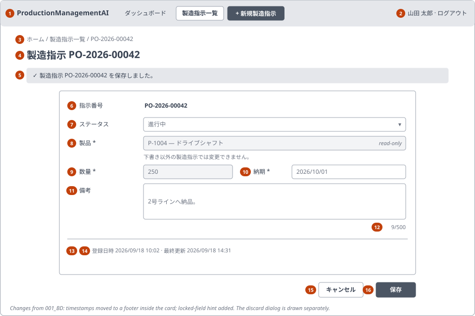
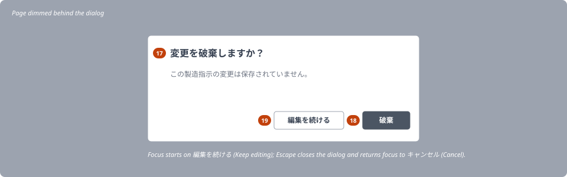
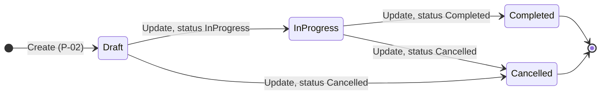

<!-- Based on ai/templates/detailed-design.md (revision at commit e7e0d36). -->

# Production Order Create/Edit — Detailed Design Document (詳細設計書)

001_DD — implements 001_BD (SCR-001), requirements REQ-010–REQ-019.

## Document control (改版履歴)

| Field | Value |
| --- | --- |
| Document ID | 001_DD |
| Category | UI + API |
| System name | ProductionManagementAI |
| Subsystem name | Production orders |
| Work item | WI-002 |
| Implements | 001_BD revision 6 |
| Created by | Claude (for ThanhTN) |
| Created date | 2026-09-18 |
| Last updated by | Claude (for ThanhTN) |
| Last updated date | 2026-09-23 |

| Version | Date | Author | Revision content |
| --- | --- | --- | --- |
| 1 | 2026-09-18 | Claude (for ThanhTN) | Initial creation |
| 2 | 2026-09-18 | Claude (for ThanhTN) | Added the function-design (001_DD-FN) and screen-processing-design (001_DD-SPD) companions; modules 3–5 and flows P-01–P-05 moved there, with pointers left here |
| 3 | 2026-09-18 | Claude (for ThanhTN) | Aligned with implementation (plan revision 2): `AllowedNext()` extension method; OpenTelemetry instrumentation set; test-plan IDs filled in |
| 4 | 2026-09-22 | Claude (for ThanhTN) | Completion tracking (WI-004 REQ-033, 001_BD revision 6, 003_DB): module 1 sets `CompletedAtUtc` on `InProgress → Completed`; state-transition side effect, database mapping and test viewpoints updated |
| 5 | 2026-09-23 | Claude (for ThanhTN) | Diagrams redrawn for the revised DD template (RFC 0009): the layout sketch and the discard dialog as SVG wireframes under `wireframes/`; the order status transitions also drawn as a Mermaid state diagram above the table. No field, rule, API or processing changes |
| 6 | 2026-09-23 | Claude (for ThanhTN) | WI-005: the UI is Japanese. The message catalog lists the Japanese text with an English gloss (WI-005 DEC-003); status options, lock hint, required legend, timestamp format (`YYYY/MM/DD HH:mm`, WI-005 DEC-006), `lang="ja"`, wireframes and mockup updated. A Japanese edition of the mockup was added (`mockups/001_DD_screen-a-mockup.ja.html`). No field, rule, API or processing changes |

## Overview and reference documents (概要・目次)

| Field | Value |
| --- | --- |
| File / component name | Frontend `ProductionOrderPage.tsx` (+ feature components); backend `ProductionOrdersController`, `ProductsController`, `ProductionOrderService`, `ProductionOrder` entity |
| Overview | Create/edit form for one production order, with status transitions, field locking, stale-save protection and discard confirmation, backed by a JSON API over the 001_DB schema |

### Module / method / processing index

| No | Name | Overview | Notes |
| --- | --- | --- | --- |
| 1 | `ProductionOrder` (Domain) | Entity + business invariants: transitions, field lock, quantity/notes rules | Unit-tested without a host (0001_ADR) |
| 2 | `ProductionOrderStatus` (Domain) | Enum + allowed-next-states table | Single source of M-02 / V-06 |
| 3 | `ProductionOrderService` (Application) | Create / get / update use cases, validation orchestration, error mapping | Designed in 001_DD-FN |
| 4 | `IPlantClock` / `PlantClock` | "Today" and current year in the plant timezone | Designed in 001_DD-FN |
| 5 | `IOrderNumberIssuer` / `OrderNumberIssuer` (Infrastructure) | Per-year sequence upsert | Designed in 001_DD-FN |
| 6 | `ProductionOrdersController`, `ProductsController` (Api) | HTTP endpoints, auth policy, Problem Details | Contract in 001_DD-API |
| 7 | `ProductionOrderPage` (frontend) | Route component: load, mode, states, title | |
| 8 | `ProductionOrderForm` (frontend) | Fields, client validation, dirty tracking, save | |
| 9 | `DiscardChangesDialog` (frontend) | Confirmation on Cancel with unsaved changes | REQ-019 |
| 10 | `apiClient` (frontend) | JSON fetch wrapper, Problem Details parsing, 401 handling | Shared |
| 11 | Processing flows P-01–P-05 | Load, create, update, cancel, error handling | Designed in 001_DD-SPD |

### Reference documents

| No | Document | Purpose / use | Notes |
| --- | --- | --- | --- |
| 1 | `docs/en/010_basic-design/001/001_BD_製造指示登録・編集.md` | Screen items, validation V-01–V-08, events E-01–E-09, flows | Item numbers (n) below are 001_BD §3 numbers |
| 2 | `docs/en/database/001/001_DB_製造指示登録・編集.md` (001_DB) | Tables, constraints, counter upsert, `xmin`, privileges | |
| 3 | `docs/en/020_detailed-design/001/001_DD-API_製造指示登録・編集.md` (001_DD-API) | Endpoint request/response/error catalog | Companion |
| 3a | `docs/en/020_detailed-design/001/001_DD-FN_製造指示登録・編集.md` (001_DD-FN) | Shared service/clock/issuer method design | Companion |
| 3b | `docs/en/020_detailed-design/001/001_DD-SPD_製造指示登録・編集.md` (001_DD-SPD) | Per-component processing flows | Companion |
| 4 | `docs/en/architecture/0001/0001_ADR_backend-layered-structure.md` | Layer placement | |
| 5 | `docs/en/architecture/0002/0002_ADR_auth-rbac-foundation.md` | Cookie auth, fallback policy, CSRF (DEC-020) | |
| 6 | `work-items/WI-002/brief.md`, `decisions.md` | REQs, DEC-001–DEC-024 | |

### Referenced by

| No | Document | Purpose / use | Notes |
| --- | --- | --- | --- |
| 1 | 001_DD-API, 001_DD-FN, 001_DD-SPD | Companions; each lists 001_DD as its parent | |
| 2 | `work-items/WI-002/evidence.md` | Traceability | |

### Component / file organization

**X-1. Path structure**

| No | Path / namespace | Purpose | Notes |
| --- | --- | --- | --- |
| 1 | `src/backend/ProductionManagementAI.Domain/ProductionOrders/` | `ProductionOrder`, `ProductionOrderStatus`, `Product`, `DomainRuleViolation` | No external dependencies |
| 2 | `src/backend/ProductionManagementAI.Application/ProductionOrders/` | `ProductionOrderService`, request/response DTOs, `IPlantClock`, `IOrderNumberIssuer`, `IProductionOrderRepository`, `ProductionOrderTelemetry` | |
| 3 | `src/backend/ProductionManagementAI.Infrastructure/ProductionOrders/` | EF configuration, repository, `OrderNumberIssuer`, `PlantClock`; new migration `AddProductionOrders` | |
| 4 | `src/backend/ProductionManagementAI.Api/Controllers/` | `ProductionOrdersController`, `ProductsController` | |
| 5 | `src/frontend/src/features/production-orders/` | `ProductionOrderPage.tsx`, `ProductionOrderForm.tsx`, `DiscardChangesDialog.tsx`, `validation.ts`, `messages.ts`, `api.ts`, `types.ts` | |
| 6 | `src/frontend/src/lib/apiClient.ts` | Shared fetch wrapper | New |
| 7 | `tests/backend/ProductionManagementAI.Application.Tests/ProductionOrders/` | Domain + service unit tests | |
| 8 | `tests/integration/ProductionManagementAI.Integration.Tests/ProductionOrders/` | Endpoint tests (Testcontainers Postgres) | |
| 9 | `src/frontend/tests/unit/production-orders/` | Component tests (Vitest + RTL) | |

**X-2. Shared/common components used**

| No | Name | Purpose | Notes |
| --- | --- | --- | --- |
| 1 | `useAuth` / `ProtectedRoute` (WI-001) | Signed-in user and roles; redirect to `/login` | Existing |
| 2 | `apiClient` | `getJson`/`sendJson`: same-origin credentials, `Content-Type: application/json`, parses RFC 9457 bodies into `ApiProblem`, and on 401 clears the auth state and navigates to `/login` | New; the WI-001 auth calls keep their current code |
| 3 | ASP.NET Core `AddProblemDetails()` + `[ApiController]` | Problem Details for all API errors | New registration in `Program.cs` |

**X-3. Feature-level components used**

| No | Name | Purpose | Notes |
| --- | --- | --- | --- |
| 1 | `ProductionOrderForm` | Items 6–16 | Stateless about routing; receives initial values + callbacks |
| 2 | `DiscardChangesDialog` | Items 17–19 | Native `<dialog>` with `showModal()` (built-in focus trap, Escape) |
| 3 | `FieldError` | Inline error text linked by `aria-describedby` | |
| 4 | `MessageBanner` | Item 5, `role="status"` (success) / `role="alert"` (error) | |

**X-4. External APIs used** — see "APIs used" below.

**X-5. Responsive composition** — one component tree with Tailwind responsive classes: the `sm:` breakpoint (640px) switches quantity and due date to two columns, and buttons to inline right-aligned. Below 640px everything is one column, and the buttons are full width with Save above Cancel (DOM order Cancel, Save; `flex-col-reverse` on mobile keeps the tab order logical).

### Companion design documents

| No | Document | Type | Covers |
| --- | --- | --- | --- |
| 1 | `001_DD-API_製造指示登録・編集.md` | api-design | `GET /api/products`, `POST /api/production-orders`, `GET`/`PUT /api/production-orders/{id}` |
| 2 | `001_DD-FN_製造指示登録・編集.md` | function-design | `ProductionOrderService` (list/get/create/update), `ProductionOrderMapper`, `IPlantClock`, `IOrderNumberIssuer` |
| 3 | `001_DD-SPD_製造指示登録・編集.md` | screen-processing-design | P-01–P-05 per component: page, form, save-response handling, discard dialog, controller boundary |

### Task / design index

| No | Category | File-level task | Function/process-level task | Item-level task | Confirmed | Issue | Reviewer | Reworked | Date | Notes |
| --- | --- | --- | --- | --- | --- | --- | --- | --- | --- | --- |
| 1 | basic-design | 001_BD | SCR-001 all sections | — | yes | — | ThanhTN | yes | 2026-09-18 | revision 4 (V-02 upper bound) |
| 2 | detailed-design | 001_DD | Modules 1–10, P-01–P-05 | Items 4–19 | yes | — | ThanhTN | yes | 2026-09-18 | this document; approved 2026-09-18 |
| 3 | api-design | 001_DD-API | 4 endpoints | request/response fields | yes | — | ThanhTN | no | 2026-09-18 | approved 2026-09-18 |
| 5 | function-design | 001_DD-FN | 7 methods | — | yes | — | ThanhTN | no | 2026-09-18 | approved 2026-09-18 |
| 6 | screen-processing-design | 001_DD-SPD | 5 processing blocks | — | yes | — | ThanhTN | no | 2026-09-18 | approved 2026-09-18 |
| 4 | detailed-design | 001_DB | Tables, counter, `xmin` | — | yes | — | ThanhTN | no | 2026-09-18 | reviewed by user |

## Module design

### 1. `ProductionOrder` (Domain entity)

| Field | Value |
| --- | --- |
| Description | Aggregate for one production order. Owns every invariant that doesn't need I/O: status transitions, the product/quantity lock, and quantity/notes value rules |
| Return type | — (entity) |
| Created by / date | Claude / 2026-09-18 |
| Last modified by / date | — |

Preconditions: none.

Rule type: business invariant.

**Rule references**

| No | Rule / validator | Location | Notes |
| --- | --- | --- | --- |
| 1 | `ProductionOrderStatusExtensions.AllowedNext` | Domain | V-06 |

**Condition / data references**

| No | Key | Source | Notes |
| --- | --- | --- | --- |
| 1 | Saved `Status`, `ProductId`, `Quantity`, `DueDate` | Entity state loaded by the service | V-04 "changed", V-07 |

**Check parameters**

| No | Name | Type | Target field |
| --- | --- | --- | --- |
| 1 | `quantity` | `int` | (9) |
| 2 | `notes` | `string?` | (11) |
| 3 | `newStatus` | `ProductionOrderStatus` | (7) |
| 4 | `productId`, `quantity` vs. saved | `Guid`, `int` | (8)(9) |

**Arguments** (factory and mutator)

| No | Type | Name | Description |
| --- | --- | --- | --- |
| 1 | `Guid` | `productId` | `Create` / `Update` |
| 2 | `int` | `quantity` | 1–999,999,999 (V-02, DEC-024) |
| 3 | `DateOnly` | `dueDate` | Date checks against "today" are done in the service (they need `IPlantClock`) |
| 4 | `string?` | `notes` | Trimmed; empty → `null`; ≤ 500 Unicode code points (V-05) |
| 5 | `ProductionOrderStatus` | `status` | `Update` only |
| 6 | `short`, `int` | `orderYear`, `orderSeq` | `Create` only, from `IOrderNumberIssuer` |

**Dependencies**: none.

Processing overview: `ProductionOrder.Create(...)` returns a new `Draft` order. `Update(...)` first checks the lock and the transition, and throws `DomainRuleViolation` with a code (`MSG-E007`, `MSG-E008`) before changing any state. Value-rule failures (quantity, notes) are reported by the static `Validate...` helpers, which return error lists rather than throwing. The service calls them first so all field errors can be returned together.

**Processing flow (`Update`)**

| Step | Description | Calls |
| --- | --- | --- |
| 1 | If `Status != Draft` and (`productId != ProductId` or `quantity != Quantity`) → throw `DomainRuleViolation("MSG-E008")`; nothing changed (DEC-007) | — |
| 2 | If `status != Status` and `status ∉ AllowedNext(Status)` → throw `DomainRuleViolation("MSG-E007")` | `ProductionOrderStatusExtensions.AllowedNext` |
| 3 | Assign `ProductId`, `Quantity` (only possible while `Draft`), `DueDate`, `Notes`, `Status` | — |
| 4 | Set `UpdatedAtUtc` = the given UTC time | — |
| 5 | If the status moved from `InProgress` to `Completed` in this call, set `CompletedAtUtc` = the same UTC time. Never set otherwise, never cleared; there is no public setter or request field for it (WI-004 REQ-033, 003_DB `ck_production_orders_completed_at_matches_status`) | — |

**Return value**: none — state change or exception.

### 2. `ProductionOrderStatus` (Domain enum)

| Field | Value |
| --- | --- |
| Description | `Draft`, `InProgress`, `Completed`, `Cancelled`, plus the `AllowedNext()` extension method in `ProductionOrderStatusExtensions` (C# enums can't hold methods), whose table is: Draft → {InProgress, Cancelled}; InProgress → {Completed, Cancelled}; Completed, Cancelled → {} |
| Return type | `IReadOnlySet<ProductionOrderStatus>` |

Not applicable — a plain lookup table, not a rule/validator with its own fields. Persisted as a string via EF value conversion (DEC-015). The API returns `allowedNextStatuses` so the frontend never duplicates the table (M-02).

### 3–5. `ProductionOrderService`, `IPlantClock`, `IOrderNumberIssuer` (shared)

These modules will be reused by Screen B, so per `ai/templates/detailed-design.md` they are designed in the function-design companion, **001_DD-FN** (`001_DD-FN_製造指示登録・編集.md`). That document covers the methods, arguments, the fixed check order, telemetry points and value mapping. It is not repeated here.

### 6. Controllers (Api)

| Field | Value |
| --- | --- |
| Description | `ProductionOrdersController` (`api/production-orders`) and `ProductsController` (`api/products`), both `[Authorize(Policy = "ProductionOrderEditor")]`, where the policy is `RequireRole("Admin", "Operator")` (DEC-001). Map `Result` to 200/201/400/404/409/422 Problem Details. `[Consumes("application/json")]` on POST/PUT (DEC-020) |
| Return type | `ActionResult<T>` |

Not applicable — plain handler. Route constraint `{id:guid}`, so a non-GUID id returns 404 without reaching the service.

### 7. `ProductionOrderPage` (frontend)

| Field | Value |
| --- | --- |
| Description | Route component for `/production-orders/new` and `/production-orders/:id`. Decides the mode, runs P-01, holds page state (`loading` \| `ready` \| `notFound` \| `forbidden` \| `loadError`), sets `document.title` (0-2-1), shows the banner, and renders `ProductionOrderForm` |
| Return type | JSX |

Not applicable — plain component. Role check (UX only; the server is authoritative): if `user.roles` includes neither `Admin` nor `Operator`, render the forbidden panel (MSG-E012) without calling the API.

### 8. `ProductionOrderForm` (frontend)

| Field | Value |
| --- | --- |
| Description | Controlled form for items 6–16. Keeps `initialValues` (a snapshot from load or save) and `values`; `isDirty = !equal(values, initialValues)` (with notes compared after trimming). Runs field validators on blur (E-02) and all of them on Save (E-04) |
| Return type | JSX |

Rule type: format check (client-side, advisory; mirrors V-01–V-05 in `validation.ts`, same message IDs).

**Check parameters**

| No | Name | Type | Target field |
| --- | --- | --- | --- |
| 1 | `productId` | string | (8) non-empty |
| 2 | `quantity` | string | (9) `^[0-9]{1,9}$` and ≥ 1 |
| 3 | `dueDate` | `YYYY-MM-DD` | (10) non-empty; ≥ browser-local today when creating or changed (DEC-021) |
| 4 | `notes` | string | (11) `[...notes].length ≤ 500` |

Not applicable for V-06/V-07/V-08: the UI prevents V-06 and V-07 (restricted options, read-only fields), and V-08 is server-only.

### 9. `DiscardChangesDialog` (frontend)

| Field | Value |
| --- | --- |
| Description | Items 17–19. Native `<dialog>` opened with `showModal()`; initial focus on **編集を続ける** (Keep editing) (`autofocus`); Escape/`cancel` event = Keep editing; on close, focus returns to the 「キャンセル」 (Cancel) button |
| Return type | JSX |

Not applicable — plain component.

### 10. `apiClient` (frontend)

| Field | Value |
| --- | --- |
| Description | `getJson<T>(url)`, `sendJson<T>(method, url, body)`. Always sends `credentials: 'same-origin'`, plus `Content-Type: application/json` on bodies. Non-2xx → throws `ApiError { status, problem?: ProblemDetails }`. 401 → calls the auth context's `onUnauthorized` (clears the user; `ProtectedRoute` then redirects to `/login`) |
| Return type | `Promise<T>` |

Not applicable — plain module.

## Screen layout and mockup

Refines the 001_BD §1 wireframe. Changes from BD: the timestamps (13)(14) moved to a footer line inside the card; the locked-field hint text was added; the discard dialog (17–19) is drawn.

Discard dialog (17–19), centered over a dimmed page:

Mockup artifact: https://claude.ai/artifact/FEo1RG27UjZ6vxFCUjxoHq (private; the owner shares it from the page's Share menu). Source: [`mockups/001_DD_screen-a-mockup.html`](mockups/001_DD_screen-a-mockup.html). It has 11 static states: create empty, product list open (30 items), validation errors, created → edit (Draft), in progress (locked), completed (terminal, overdue), stale save (409), discard dialog, not found, SP create, SP locked.

Japanese edition, with the page captions in Japanese too, linked from the Japanese PDF (WI-005): https://claude.ai/artifact/QY4W3yuMnnBXxBkN2XioiD (private). Source: [`mockups/001_DD_screen-a-mockup.ja.html`](mockups/001_DD_screen-a-mockup.ja.html).

| Region | Contains (field/control) | Notes |
| --- | --- | --- |
| Header | (1)(2) | Shared app header (new small `AppHeader` component, also used on the home page) |
| Page head | (3)(4)(5) | Breadcrumb collapses to 「‹ 製造指示一覧」 (‹ Production orders) below 640px |
| Form card | (6)–(14) | `max-w-3xl` centered, `rounded-lg border border-gray-200 p-6` (same vocabulary as `LoginPage`) |
| Actions | (15)(16) | Right-aligned ≥ 640px; full width, stacked, 「保存」 (Save) first < 640px |
| Dialog | (17)–(19) | `<dialog>` with `::backdrop` dimming |

Visual vocabulary follows the existing `LoginPage.tsx`: gray-900 primary button, `border-gray-300` inputs, `text-red-600` errors. Additions: `bg-gray-50` read-only fields with a lock hint, a green success banner (`bg-green-50 text-green-800`) and a red error banner (`bg-red-50 text-red-800`). Focus rings are `focus-visible:ring-2 ring-gray-900 ring-offset-2`, and all text/background pairs are ≥ 4.5:1 contrast.

## Screen item definition

| Field | Type | Required | Validation rule | Source (BD ref) |
| --- | --- | --- | --- | --- |
| (6) `orderNumber` | string, response only | — | — | §3 item 6 |
| (7) `status` | enum select; label in create mode | edit: yes | Options = current + `allowedNextStatuses` (from API); select disabled when that list is empty | §3 item 7, M-01, M-02, V-06 |
| (8) `productId` | GUID string, `<select>` of 30 products ordered by SKU, label `{sku} — {name}` (e.g. `P-1004 — ドライブシャフト`), first option 「製品を選択」 (Select a product) | yes | Non-empty (MSG-E001); server: exists (MSG-E002). `disabled`-looking but focusable read-only when not Draft (`aria-readonly`, `aria-describedby` → lock hint) | §3 item 8, V-01, V-07, DEC-022 |
| (9) `quantity` | `<input type="text" inputmode="numeric" maxlength="9">` | yes | `^[0-9]+$`, 1–999,999,999 (MSG-E003 / MSG-E010); read-only when not Draft | §3 item 9, V-02, DEC-024 |
| (10) `dueDate` | `<input type="date">` | yes | Non-empty (MSG-E004); ≥ today on create or when changed (MSG-E005). Client uses the browser-local date; the server uses the plant date (DEC-021) | §3 item 10, V-03, V-04 |
| (11) `notes` | `<textarea rows="4">` | no | ≤ 500 code points (MSG-E006); no `maxlength` attribute (it counts UTF-16 units), so the counter turns red and blocks Save instead | §3 item 11, V-05 |
| (12) counter | text | — | `{n}/500`, red at > 500, `aria-live="polite"` announced only at ≥ 450 | §3 item 12 |
| (13)(14) `createdAt`, `updatedAt` | ISO UTC → `formatTimestamp` (`src/lib/format.ts`: `Intl.DateTimeFormat('ja-JP', …)`, 24-hour) → 「登録日時 2026/09/18 10:02」 / 「最終更新 …」, browser timezone | — | — | §3 items 13–14, M-04 |
| (hidden) `version` | uint | update: yes | Echoed back on PUT | V-08 |

Message catalog (`messages.ts`; the server returns the same IDs as `code`). The other UI strings live in the same module's `labels` object (WI-005 DEC-007):

| ID | Text (Japanese, as implemented) | English gloss |
| --- | --- | --- |
| MSG-E001 | 製品を選択してください。 | Select a product. |
| MSG-E002 | 選択した製品は存在しません。 | The selected product no longer exists. |
| MSG-E003 | 1以上の整数を入力してください。 | Enter a whole number of 1 or more. |
| MSG-E004 | 納期を入力してください。 | Enter a due date. |
| MSG-E005 | 納期に過去の日付は指定できません。 | Due date can't be in the past. |
| MSG-E006 | 備考は500文字以内で入力してください。 | Notes can't exceed 500 characters. |
| MSG-E007 | このステータス変更は許可されていません。 | This status change isn't allowed. |
| MSG-E008 | 下書き以外の製造指示では、製品と数量を変更できません。 | Product and quantity can't be changed after the order leaves Draft. |
| MSG-E009 | この製造指示は他のユーザーによって変更されました。再読み込みして最新の内容を確認してください。 | This order was changed by someone else. Reload to see the latest version. |
| MSG-E010 | 数量は999,999,999以下で入力してください。 | Quantity can't exceed 999,999,999. |
| MSG-E011 | この製造指示は存在しません。 | This production order doesn't exist. |
| MSG-E012 | 製造指示を管理する権限がありません。 | You don't have permission to manage production orders. |
| MSG-E013 | 問題が発生しました。もう一度お試しください。 | Something went wrong. Try again. |
| MSG-E014 | 利用可能な製品がありません。 | No products available. |
| MSG-I001 | 製造指示 {orderNumber} を登録しました。 | Production order {orderNumber} created. |
| MSG-I002 | 製造指示 {orderNumber} を保存しました。 | Production order {orderNumber} saved. |

## Loading / empty / error / success states

| State | Trigger | UI behavior | Data shown |
| --- | --- | --- | --- |
| Loading | P-01 in flight | Header, heading placeholder and a skeleton card (`aria-busy="true"`); no form controls | — |
| Ready — create | Products loaded | Empty form, status label 「下書き」 (Draft), order number 「保存時に採番」 (Assigned on save) | Product options |
| Ready — edit (Draft) | Order + products loaded, status Draft | All inputs editable; status options 「下書き」/「進行中」/「取消」 (Draft/In progress/Cancelled) | Saved values |
| Ready — edit (locked) | Status InProgress/Completed/Cancelled | Product and quantity read-only with the lock hint 「下書き以外の製造指示では変更できません。」 (Can't be changed once the order leaves Draft); for Completed/Cancelled the status select is disabled too; due date and notes stay editable (DEC-004) | Saved values |
| Empty products | `GET /api/products` returns `[]` | Product select shows MSG-E014 and is disabled; Save shows MSG-E001 | — |
| Saving | Save pressed, request in flight | Save disabled with label 「保存中…」 (Saving…); inputs stay as they are; Cancel still enabled | Entered values |
| Validation error | Client or 400 response | Inline errors (`FieldError`, `aria-invalid`), focus to the first invalid field | Entered values kept |
| Rule / conflict error | 422 (MSG-E007/E008) or 409 (MSG-E009) | Error banner (`role="alert"`); for 409 the banner has a **再読み込み** (Reload) button (re-runs P-01 and discards local edits) | Entered values kept |
| Not found | 404 on load | Panel MSG-E011 with a 「製造指示一覧に戻る」 (Back to production orders) link; no form | — |
| Forbidden | Missing role (client check) or 403 | Panel MSG-E012 with a 「製造指示一覧に戻る」 (Back to production orders) link | — |
| Load error | Network/5xx on load | Panel MSG-E013 with **もう一度試す** (Try again) (re-runs P-01) | — |
| Success | 201 / 200 | Banner MSG-I001 / MSG-I002 (`role="status"`); form reset to the saved values, so `isDirty = false` | Saved values |

## Processing and state transitions

### State transitions

Same-status updates and rejected transitions (422 MSG-E007) are in the table below; they don't change the state.

| From state | Event | To state | Side effect |
| --- | --- | --- | --- |
| (none) | Create (P-02) | Draft | Row inserted; counter incremented; `orders.created` metric |
| Draft | Update with status InProgress | InProgress | Product/quantity become locked |
| Draft | Update with status Cancelled | Cancelled | Terminal |
| InProgress | Update with status Completed | Completed | Terminal; `completed_at_utc` set to the save's UTC time (WI-004 REQ-033) |
| InProgress | Update with status Cancelled | Cancelled | Terminal |
| any | Update with the same status | same | Other editable fields saved |
| any other pair | Update | unchanged | 422 MSG-E007 |

### Processing flows

The step-by-step processing is in the screen-processing companion, **001_DD-SPD** (`001_DD-SPD_製造指示登録・編集.md`), with one block per component:

| Flow | Where | Events |
| --- | --- | --- |
| P-01 Load | 001_DD-SPD §1 `ProductionOrderPage` | E-01 |
| P-02 Create / P-03 Update (client) | 001_DD-SPD §2 `ProductionOrderForm` | E-02–E-06, E-08 |
| P-02 / P-03 (server) | 001_DD-FN §3 `CreateAsync`, §4 `UpdateAsync`; request boundary in 001_DD-SPD §5 | — |
| P-04 Cancel | 001_DD-SPD §4 `DiscardChangesDialog` | E-07, E-09 |
| P-05 Save-response handling | 001_DD-SPD §3 | E-06 |

## APIs used

| Endpoint | Method | Purpose | Design doc |
| --- | --- | --- | --- |
| `/api/products` | GET | Product options (FN-004) | 001_DD-API §1 |
| `/api/production-orders` | POST | Create (FN-001) | 001_DD-API §2 |
| `/api/production-orders/{id}` | GET | Load (FN-003) | 001_DD-API §3 |
| `/api/production-orders/{id}` | PUT | Update (FN-002) | 001_DD-API §4 |

## Database and transaction mapping

| Operation | Table(s) | Transaction boundary | Concurrency handling |
| --- | --- | --- | --- |
| List products | `products` (`id, sku, name`) | none; `AsNoTracking` | not applicable |
| Load order | `production_orders` only (no join; the client resolves the product label from the product list) | none; `AsNoTracking` for GET | not applicable |
| Create | `production_order_number_counters`, `production_orders` | Explicit transaction: counter upsert + insert, then commit | Counter row lock; unique `(order_year, order_seq)` backstop |
| Update | `production_orders` (+ `products` existence query when `productId` changes); on `InProgress → Completed` the same `UPDATE` also writes `completed_at_utc` (003_DB) | Single `SaveChanges` (implicit transaction) — the status and the completion time commit together | `xmin` token (DEC-014): stale → 409 |

Queries select only the columns used (projection to DTOs). The runtime login is `pmai_app`, with the grants in 001_DB (DEC-016).

## Exception handling

| Failure | Retry policy | Timeout | User-facing error | Logging |
| --- | --- | --- | --- | --- |
| Validation (400) | none | — | Inline field errors | Information: `ProductionOrderValidationFailed` with order id (if any), user id, failed field names (not values) |
| Business rule (422) | none | — | Banner MSG-E007/E008 | Information: `ProductionOrderRuleViolated` with code, from/to status |
| Stale save (409) | none (user reloads) | — | Banner MSG-E009 + 「再読み込み」 (Reload) | Information: `ProductionOrderConcurrencyConflict` |
| Not found (404) | none | — | Panel MSG-E011 | Debug |
| Counter overflow / DB error / unhandled | none automatic | Npgsql command timeout 30s (default) | Banner or panel MSG-E013 | Error with exception (server-side only); response is generic Problem Details with no stack trace or exception text (`ai/rules/backend.md`) |
| Transient connection failure | EF Core `EnableRetryOnFailure` is **not** enabled: the create uses an explicit transaction, which would need an execution-strategy wrapper; not worth it for the demo | — | MSG-E013; user retries | Error |
| Frontend network failure | none automatic; user presses 「保存」 (Save) / 「もう一度試す」 (Try again) | browser default | MSG-E013 | `console.error` only in development |

Never logged: notes text, full request/response bodies, cookies.

## Observability (OpenTelemetry)

Per `ai/rules/backend.md` and the design-consistency checklist. The backend has no OpenTelemetry setup yet, so plan revision 2 adds `OpenTelemetry.Extensions.Hosting` with ASP.NET Core and Npgsql instrumentation and the OTLP exporter. Npgsql spans cover the database statements; EF Core's own instrumentation package is still prerelease and the backend makes no outgoing HttpClient calls, so neither is added. The exporter is enabled only when `OTEL_EXPORTER_OTLP_ENDPOINT` is set; otherwise telemetry is collected but not exported.

| Signal | Name | Attributes / tags | Emitted by |
| --- | --- | --- | --- |
| Span (auto) | `POST api/production-orders`, `PUT api/production-orders/{id}`, `GET ...` | `http.route`, `http.response.status_code` | ASP.NET Core instrumentation |
| Span (auto) | DB statements | `db.system=postgresql` (no parameter values) | Npgsql instrumentation |
| Span | `ProductionOrder.Create` | `production_order.id`, `production_order.number`, `outcome` | `ProductionOrderService` (ActivitySource `ProductionManagementAI.ProductionOrders`) |
| Span | `ProductionOrder.Update` | `production_order.id`, `status.from`, `status.to`, `outcome` | same |
| Counter | `pmai.production_orders.created` | `outcome` = `success` \| `validation_failed` \| `error` | Meter `ProductionManagementAI.ProductionOrders` |
| Counter | `pmai.production_orders.updated` | `outcome` = `success` \| `validation_failed` \| `rule_violation` \| `conflict` \| `not_found` \| `error` | same |
| Counter | `pmai.production_orders.status_transitions` | `from`, `to` | same, on successful status change |
| Histogram | `http.server.request.duration` (auto) | route, status | ASP.NET Core |

The user id is not a span attribute (it's personal data). Logs correlate with spans through the trace id.

## Configuration

| Key | Default | Notes |
| --- | --- | --- |
| `Plant:TimeZone` | `Asia/Tokyo` | IANA ID; validated at startup (DEC-017) |
| `ConnectionStrings:DefaultConnection` | — | Runtime login `pmai_app` (DEC-016); secret from environment |
| `OTEL_EXPORTER_OTLP_ENDPOINT` | unset | Optional |

## Accessibility (WCAG 2.2 AA)

- Every input has a `<label for>`. Required inputs have `aria-required="true"` and a visible `*` with the legend 「* は必須項目です。」 (* marks a required field).
- Errors: `aria-invalid="true"` + `aria-describedby` → the `FieldError` id. On a failed save, focus moves to the first invalid field.
- Read-only locked fields: native `readonly` on the quantity input. The product `<select>` can't be `readonly`, so it's rendered as a read-only text input showing the label, with `aria-describedby` → the lock hint. It stays focusable, unlike `disabled`.
- Banners: success `role="status"`, errors `role="alert"`. Panels get focus on render (`tabIndex=-1`).
- Language: `<html lang="ja">`, so assistive technology reads the Japanese labels with a Japanese voice (WI-005).
- Dialog: native `<dialog>` + `showModal()` (focus trap, Escape). It is labelled by its title via `aria-labelledby`.
- Focus-visible rings on every control; target size ≥ 24×24 CSS px (2.5.8); contrast ≥ 4.5:1 for text and ≥ 3:1 for control borders.
- Keyboard: the natural tab order matches the visual order; native date input and select.

## Test viewpoints and unresolved decisions

Level: U = unit (xUnit Domain/Application, or Vitest+RTL for the frontend), I = integration (`WebApplicationFactory` + Testcontainers Postgres), E = E2E (Playwright, DEC-025). Test-plan IDs refer to `work-items/WI-002/test-plan.md` (TP-002).

| Scenario | Precondition | Expected result | Test-plan ID |
| --- | --- | --- | --- |
| Create valid order (REQ-010) — I, E | Admin signed in, products seeded | 201, `status=Draft`, `orderNumber` matches `^PO-\d{4}-\d{5}$`, redirect to edit + MSG-I001 | TC-001 |
| First order of a year gets `00001`; next gets `00002` (DEC-012/013) — I | Empty counter; plant clock faked to 2026 then 2027 | `PO-2026-00001`, `PO-2026-00002`, `PO-2027-00001` | TC-002 |
| Concurrent creates get distinct numbers — I | 20 parallel POSTs | 20 distinct sequential numbers, no gaps | TC-002 |
| Year boundary uses the plant timezone (DEC-017) — U | `TimeProvider` at 2026-12-31T15:30Z (= 2027-01-01 00:30 JST) | Year 2027; "today" 2027-01-01 | TC-003 |
| Edit Draft order fields (REQ-011) — I | Draft order | 200, values saved, `updatedAt` changed | TC-004 |
| Unknown id (REQ-011) — I, U(fe) | — | 404 MSG-E011; not-found panel | TC-005 |
| Stale save (DEC-010) — I | Two clients load version v; A saves | B's PUT → 409 MSG-E009; row keeps A's values | TC-006 |
| Unauthenticated (REQ-012) — I, U(fe) | No cookie | 401 on all 4 endpoints; UI redirects to `/login` | TC-007 |
| No role (REQ-012) — I, U(fe) | User without Admin/Operator | 403 on all 4 endpoints; forbidden panel without API call | TC-008 |
| Operator allowed (DEC-001) — I | Operator signed in | 200/201 | TC-009 |
| Quantity rules (REQ-013) — U, I | — | `1`, `250`, `999999999` pass; empty, `0`, `-5`, `2.5`, `abc`, `1000000000` → MSG-E003/E010 | TC-010 |
| Due date rules (REQ-014, DEC-009) — U, I | Plant today = D | D and D+1 pass; D-1 → MSG-E005 on create; overdue order saved without changing the due date → 200; changing it to D-1 → MSG-E005 | TC-011 |
| Product rules (REQ-015) — I | — | Missing → MSG-E001; random GUID → MSG-E002 | TC-012 |
| Notes rules (REQ-016) — U, I | — | Empty → `null`; 500 chars (incl. emoji counted as 1) pass; 501 → MSG-E006 | TC-013 |
| Each allowed transition (REQ-017) — U, I | Order in the source state | 200, new status; `allowedNextStatuses` updated | TC-014 |
| Completion time recorded (WI-004 REQ-033) — U, I | InProgress order; clock pinned | Saving `Completed` sets `completed_at_utc` = the save time (= `updated_at_utc`); every other transition and every same-status save leaves it unchanged (`NULL`, or the original value on a later edit of a completed order's notes); a rejected save (422, 409) sets nothing; a request body carrying a completion field is ignored | WI-004 TP-004 (ID assigned in 003_DD) |
| Disallowed transitions (REQ-017) — U, I | e.g. Draft→Completed, Completed→InProgress, Cancelled→Draft | 422 MSG-E007, status unchanged | TC-015 |
| Status options per state (M-02) — U(fe) | Each status | Select options match; disabled for terminal states | TC-016 |
| Locked-field change rejected whole (REQ-018, DEC-007) — U, I | InProgress order; PUT changes quantity + notes | 422 MSG-E008; notes not saved | TC-017 |
| Locked fields read-only in UI (REQ-018) — U(fe) | InProgress order | Product/quantity read-only, focusable, lock hint | TC-018 |
| Cancel without changes (REQ-019) — U(fe), E | Pristine form | Navigates home, no dialog | TC-019 |
| Cancel with changes → Discard / Keep editing / Escape (REQ-019) — U(fe), E | Edited form | Dialog; Discard → home; Keep editing/Escape → values kept, focus on Cancel | TC-020 |
| Non-JSON body (DEC-020) — I | POST `text/plain` / form-encoded | 415, nothing created | TC-021 |
| Problem Details shape — I | Any 4xx/5xx | `application/problem+json`, `type`, `title`, `status`, `code`; no stack trace | TC-022 |
| Runtime login privileges (DEC-016) — I | App connected as `pmai_app` | All flows work; `DELETE FROM production_orders` → permission denied | TC-023 |
| Telemetry emitted — I | In-memory exporter | Create/Update spans + counters with the expected tags | TC-024 |
| Accessibility — U(fe) + manual | — | Labels, `aria-invalid`/`describedby`, focus on first error, dialog focus; automated axe check (vitest-axe + @axe-core/playwright, DEC-026) has no violations | TC-025 |

Unresolved decisions: none. DD-level technical decisions DEC-021–DEC-024 are recorded in `work-items/WI-002/decisions.md`.
