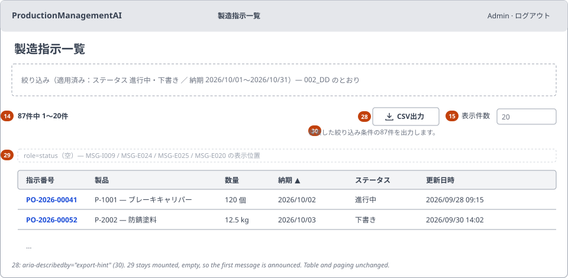
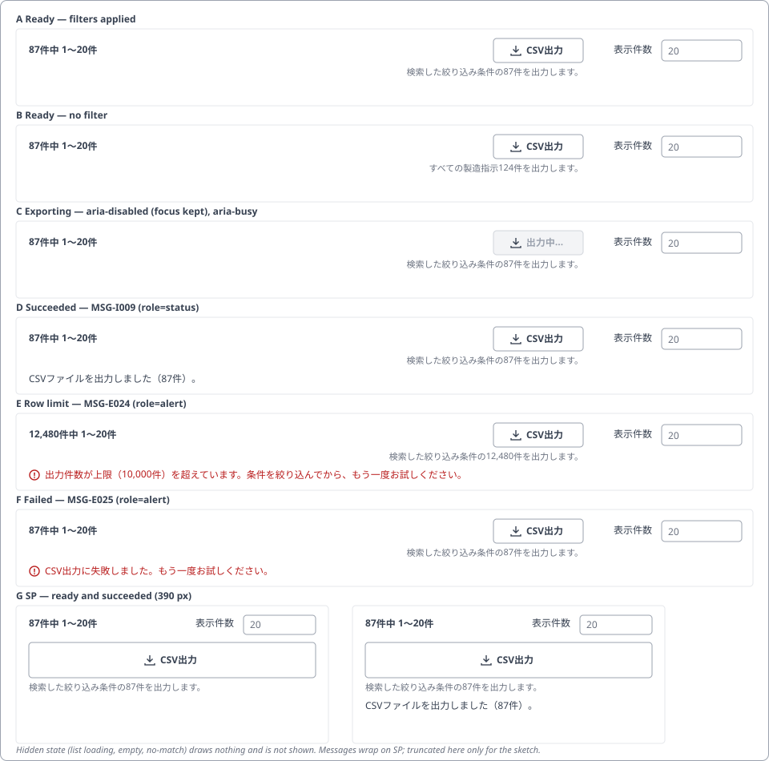
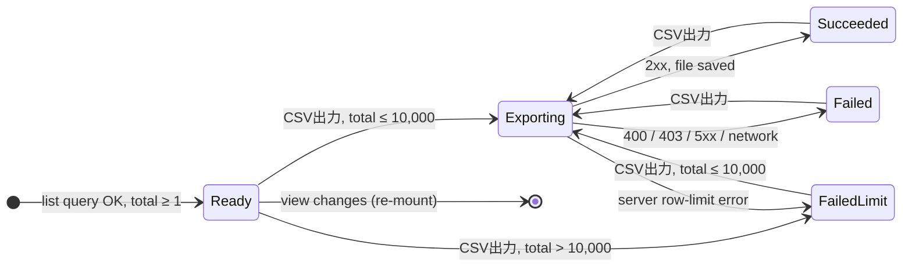

<!-- Based on ai/templates/detailed-design.md. Additive to 002_DD (WI-003), which stays unedited (WI-016 DEC-001, DEC-011). -->

# Production Order List — CSV Export — Detailed Design Document (詳細設計書)

002_DD-CSV — implements [002_BD-CSV](../../010_basic-design/002/002_BD-CSV_製造指示一覧.md) version 2, requirements
REQ-085–REQ-089.

## Document control (改版履歴)

| Field | Value |
| --- | --- |
| Document ID | 002_DD-CSV |
| Category | UI |
| System name | ProductionManagementAI |
| Subsystem name | Production orders |
| Work item | WI-016 |
| Implements | 002_BD-CSV version 2 |
| Created by | Claude (for ThongTM) |
| Created date | 2026-10-07 |
| Last updated by | Claude (for ThongTM) |
| Last updated date | 2026-10-07 |

| Version | Date | Author | Revision content |
| --- | --- | --- | --- |
| 1 | 2026-10-07 | Claude (for ThongTM) | Initial creation |
| 2 | 2026-10-07 | Claude (for ThongTM) | WI-016 DEC-017: while exporting, item 28 uses `aria-disabled="true"` with a click guard instead of the `disabled` attribute, so keyboard focus stays on it (002_BD-CSV E-30; 002_DD-SPD-CSV P-16). Screen item definition, state table and mockup markup updated; nothing else changes |

Everything about SCR-002 that this document does not mention stays as [002_DD](002_DD_製造指示一覧.md) and its
companions specify. Item numbers (28–30), functions (FN-041–FN-043), mappings (M-11–M-18), validations (V-14, V-15)
and events (E-30–E-33) are those of 002_BD-CSV and are referenced, not restated.

## Overview and reference documents (概要・目次)

| Field | Value |
| --- | --- |
| File / component name | `ExportCsvButton.tsx` (new), `ProductionOrderListPage.tsx` (changed), `api.ts`, `messages.ts`, `lib/download.ts` (new), `icons.ts`; backend `ProductionOrdersController.Export` |
| Overview | The 「CSV出力」 (Export CSV) control group on SCR-002 and the controller action behind it |

### Module / method / processing index

| No | Name | Overview | Notes |
| --- | --- | --- | --- |
| 1 | `ExportCsvButton` | Items 28, 29 and 30: button, hint and message, with the export state machine | New component |
| 2 | `ProductionOrderListPage` (change) | Places module 1 in the result header row and resets it when the view changes | Existing route component |
| 3 | `exportOrdersCsv` | Frontend API call: applied view → file, file name and row count | `api.ts` |
| 4 | `saveFile` | Saves a `Blob` under a file name through a temporary object URL | New `lib/download.ts` |
| 5 | `exportHint` | Builds the item 30 text (M-18) from the applied view and total | Pure function in `messages.ts` |
| 6 | `ProductionOrdersController.Export` | API-PO-05 action: validate, call the service, write the CSV response | Backend; contract in 002_DD-API-CSV |

### Reference documents

| No | Document | Purpose / use | Notes |
| --- | --- | --- | --- |
| 1 | 002_BD-CSV | Items, mappings, validations, events, flows | Version 2 |
| 2 | 002_DD and 002_DD-SPD | Existing list modules, view state, live-region conventions | Unedited |
| 3 | 002_DD-API (API-PO-04) | Parameter names and validation reused by API-PO-05 | Unedited |
| 4 | 002_DB | Indexes the export query relies on | Unedited; no DB change |
| 5 | WI-016 decisions.md | DEC-002–DEC-011 | |

### Referenced by

| No | Document | Purpose / use | Notes |
| --- | --- | --- | --- |
| 1 | 002_DD-API-CSV, 002_DD-FN-CSV, 002_DD-SPD-CSV | Companions (to be written after this file's review) | DEC-011 |
| 2 | WI-016 test-plan.md | Test viewpoints below | Written in the implementation revision |

### Component / file organization

**X-1. Path structure**

| No | Path / namespace | Purpose | Notes |
| --- | --- | --- | --- |
| 1 | `src/frontend/src/features/production-orders/ExportCsvButton.tsx` | Module 1 | New |
| 2 | `src/frontend/src/features/production-orders/api.ts` | Module 3 | Adds one function |
| 3 | `src/frontend/src/features/production-orders/messages.ts` | MSG-I009, MSG-E024, MSG-E025; `labels.list.export*`; module 5 | Adds entries only |
| 4 | `src/frontend/src/lib/download.ts` | Module 4 | New, feature-independent |
| 5 | `src/frontend/src/components/icons.ts` | `Download as ExportIcon` | One re-export (WI-004 DEC-023) |
| 6 | `src/backend/ProductionManagementAI.Api/Controllers/ProductionOrdersController.cs` | Module 6 | Adds one action |
| 7 | `src/backend/ProductionManagementAI.Application/ProductionOrders/` and `…Infrastructure/ProductionOrders/` | Export service, CSV writer, repository query | Designed in 002_DD-FN-CSV |

**X-2. Shared/common components used**

| No | Name | Purpose | Notes |
| --- | --- | --- | --- |
| 1 | `apiClient` (`src/frontend/src/lib/apiClient.ts`) | Same-origin fetch with cookie, 401 → session cleared → `/login`, `ApiError` with Problem Details | Module 3 needs a raw `Response` (blob + headers); 002_DD-SPD-CSV fixes how |
| 2 | `listViewState` (`toSearchParams`) | The applied view as query parameters | Reused so the export and the list send identical filters |
| 3 | `iconProps` | Decorative 16 px icon | |

**X-3. Feature-level components used**

| No | Name | Purpose | Notes |
| --- | --- | --- | --- |
| 1 | `ListSummary`, `PageSizeSelect` | Neighbours of item 28 in the result header row | Unchanged |

**X-4. External APIs used** — see "APIs used" below.

**X-5. Responsive composition** — one component with responsive Tailwind classes. At `sm` and above the button sits
in the result header row before 「表示件数」 (Rows per page), with the hint right-aligned under it; below `sm` the
button is full width (`w-full`, `min-h-11` = 44 px) on its own row, followed by the hint and the message.

### Companion design documents

| No | Document | Type | Covers |
| --- | --- | --- | --- |
| 1 | 002_DD-API-CSV_製造指示一覧.md | api-design | API-PO-05 `GET /api/production-orders/export`: parameters, headers, status codes, Problem Details, CSV body and sample file |
| 2 | 002_DD-FN-CSV_製造指示一覧.md | function-design | Export service method, query reuse without paging, row limit, CSV writer (quoting, BOM, formula neutralising, formats), streaming, logging and tracing |
| 3 | 002_DD-SPD-CSV_製造指示一覧.md | screen-processing-design | Click → limit check → request → save; error mapping; focus and announcements; reset on view change |

### Task / design index

| No | Category | File-level task | Function/process-level task | Item-level task | Confirmed | Issue | Reviewer | Reworked | Date | Notes |
| --- | --- | --- | --- | --- | --- | --- | --- | --- | --- | --- |
| 1 | basic-design | 002_BD-CSV | All | Items 28–30 | yes | — | ThongTM | yes (v2, hint) | 2026-10-07 | DEC-009, DEC-010 |
| 2 | detailed-design | 002_DD-CSV | Modules 1–6, states, mockups | Items 28–30 | no | — | ThongTM | no | 2026-10-07 | This document |
| 3 | api-design | 002_DD-API-CSV | API-PO-05 | — | no | Not yet written | ThongTM | no | — | After review of this file |
| 4 | function-design | 002_DD-FN-CSV | Export service, CSV writer | — | no | Not yet written | ThongTM | no | — | |
| 5 | screen-processing-design | 002_DD-SPD-CSV | Export flow | — | no | Not yet written | ThongTM | no | — | |

## Module design

### 1. `ExportCsvButton`

| Field | Value |
| --- | --- |
| Description | Renders items 28 (button), 30 (hint) and 29 (message) and owns the export state (Ready, Exporting, Succeeded, Failed) |
| Return type | JSX element |
| Created by / date | Claude / 2026-10-07 |
| Last modified by / date | — |

Preconditions: rendered only when the list query has succeeded with `total` ≥ 1 (BD item 28 display condition).
The parent re-mounts it (React `key` = the view key) whenever the applied view changes, which clears item 29 (E-33).

Not applicable — plain component, no rule/validator fields. (The row-limit check V-14 is one comparison inside the
click handler, specified in 002_DD-SPD-CSV.)

**Arguments**

| No | Type | Name | Description |
| --- | --- | --- | --- |
| 1 | `ListViewState` | `view` | The applied view (from the URL), the same object the list query used |
| 2 | `number` | `total` | `total` of the list response that is on screen |
| 3 | `boolean` | `disabled` | `true` while a list query is in flight (defensive; the component is normally not mounted then) |

**Dependencies**

| No | Module / component | Overview | Notes |
| --- | --- | --- | --- |
| 1 | Module 3 `exportOrdersCsv` | Performs the request | |
| 2 | Module 4 `saveFile` | Saves the file | |
| 3 | Module 5 `exportHint` | Hint text | |
| 4 | `message()`, `labels.list` | Catalog text | |
| 5 | `ExportIcon`, `iconProps` | Download glyph | Decorative |

Processing overview: on activation, refuse locally when `total` > 10,000; otherwise call module 3, save the file
with module 4 and announce the count, or show the mapped error. The step-by-step flow is in 002_DD-SPD-CSV §1.

**Processing flow**

| Step | Description | Calls |
| --- | --- | --- |
| 1 | Click / Enter / Space on item 28 (E-30) | 002_DD-SPD-CSV §1 |
| 2 | Request and save, or map the error (E-31, E-32) | Module 3, module 4 |

**Return value** — None; side effects are the saved file and the item 29 text.

### 2. `ProductionOrderListPage` (change)

| Field | Value |
| --- | --- |
| Description | Adds module 1 to the result header row; nothing else in the page changes |
| Return type | JSX element |
| Created by / date | WI-003 / 2026-09-22 |
| Last modified by / date | Claude / 2026-10-07, adds module 1 |

Preconditions: as 002_DD module 1. Not applicable — plain component, no rule/validator fields.

**Arguments** — None (route component).

**Dependencies** — module 1.

Processing overview: inside the existing `page && page.total > 0` branch, the row that holds `ListSummary` and
`PageSizeSelect` becomes a wrapping flex row: `ListSummary` left; on the right `ExportCsvButton` then
`PageSizeSelect`. `ExportCsvButton` gets `key={viewKey}`, `view`, `total={page.total}` and `disabled={loading}`.
Because the branch is not rendered while loading, on the empty state or on the no-match state, item 28 is hidden
exactly as BD item 28 requires.

**Processing flow**

| Step | Description | Calls |
| --- | --- | --- |
| 1 | Render module 1 next to `ListSummary` and `PageSizeSelect` | Module 1 |

**Return value** — None.

### 3. `exportOrdersCsv`

| Field | Value |
| --- | --- |
| Description | `exportOrdersCsv(view, signal) → Promise<{ blob: Blob; fileName: string; count: number }>` — calls API-PO-05 with the view's filter and sort parameters and returns the file |
| Return type | `Promise<ExportedFile>` |
| Created by / date | Claude / 2026-10-07 |
| Last modified by / date | — |

Preconditions: none. Not applicable — no rule/validator fields.

**Arguments**

| No | Type | Name | Description |
| --- | --- | --- | --- |
| 1 | `ListViewState` | `view` | Applied view; `page` and `pageSize` are dropped (DEC-002) |
| 2 | `AbortSignal` | `signal` | Cancels the request when the component unmounts |

**Dependencies** — `listViewState.toSearchParams` (then `page` and `pageSize` deleted), `apiClient` (session handling, `ApiError`).

Processing overview: builds `/api/production-orders/export?{filters&sort}`; on 2xx reads the body as a `Blob`, the
file name from `Content-Disposition` (`filename*` first, then `filename`, else a client-built
`製造指示一覧_YYYYMMDD-HHmm.csv`) and the row count from the count header defined in 002_DD-API-CSV; on non-2xx
throws `ApiError` exactly as other calls do. Header names and status codes: 002_DD-API-CSV.

**Processing flow**

| Step | Description | Calls |
| --- | --- | --- |
| 1 | Build the URL from the view without `page`/`pageSize` | `toSearchParams` |
| 2 | Fetch; non-2xx → `ApiError` | API-PO-05 |
| 3 | Read blob, file name, count | — |

**Return value**

| Type | Name | Description |
| --- | --- | --- |
| `ExportedFile` | — | `{ blob, fileName, count }` |

### 4. `saveFile`

| Field | Value |
| --- | --- |
| Description | `saveFile(blob, fileName)`: creates an object URL, clicks a temporary `<a download>` and revokes the URL on the next task |
| Return type | `void` |
| Created by / date | Claude / 2026-10-07 |
| Last modified by / date | — |

Preconditions: browser environment. Not applicable — no rule/validator fields. Arguments: `Blob blob`, `string
fileName`. Dependencies: none. The anchor is never inserted visibly and takes no focus.

### 5. `exportHint`

| Field | Value |
| --- | --- |
| Description | `exportHint(view, total) → string`: M-18. With `hasFilters(view)` 「検索した絞り込み条件の{total}件を出力します。」, otherwise 「すべての製造指示{total}件を出力します。」. `total` is formatted with `formatNumber` (`1,234`) |
| Return type | `string` |
| Created by / date | Claude / 2026-10-07 |
| Last modified by / date | — |

Rule type: display rule (M-18). Condition reference: `hasFilters` from `listViewState` (the same definition that
separates the no-match state from the empty state). Check parameters: none.

### 6. `ProductionOrdersController.Export`

| Field | Value |
| --- | --- |
| Description | API-PO-05 action. Same class-level `[Authorize(Policy = ProductionOrderEditor)]` and `[ResponseCache(NoStore = true)]` as the list. Validates the query string into the list's typed query, calls the export service and returns its rows as a CSV file result, or a Problem Details error |
| Return type | `Task<IActionResult>` |
| Created by / date | Claude / 2026-10-07 |
| Last modified by / date | — |

Preconditions: authenticated `Admin`/`Operator` (policy; else 401/403 by the framework, as for the list).
Not applicable — plain controller, no rule/validator fields (validation is `ProductionOrderListQuery.TryCreate`,
reused; see 002_DD-FN-CSV).

**Arguments**: `ProductionOrderExportRequest request` (the list's filter and sort fields, no paging),
`CancellationToken cancellationToken`.

**Dependencies**: export service and CSV writer (002_DD-FN-CSV), `ProductionOrderProblems` (Problem Details).
Contract: 002_DD-API-CSV.

## Screen layout and mockup

DD-level wireframe of the populated state (the BD's SP wireframe is unchanged at this level, so no new SP wireframe):

The six states of the export controls (items 28–30), PC and SP:

Mockup: static HTML state gallery in the app's visual vocabulary (Tailwind grey palette of the list page) —
[English captions](mockups/002_DD-CSV_SCR-002.html) and [Japanese captions](mockups/002_DD-CSV_SCR-002.ja.html).
Artboards: 1 PC ready with filters, 2 PC ready without filters, 3 PC exporting, 4 PC success, 5 PC row limit,
6 PC failure, 7 SP ready, 8 SP success. Not published as Artifacts (no publication in plan revision 1).

| Region | Contains (field/control) | Notes |
| --- | --- | --- |
| Result header row | Item 14 `ListSummary`; item 28 `ExportCsvButton` button; item 15 `PageSizeSelect` | Wraps; on SP item 28 moves to its own full-width row |
| Export hint | Item 30 | Right-aligned under item 28 on PC; left-aligned under item 28 on SP |
| Export message | Item 29 | Full width under the hint; success in grey, errors in red with the error icon |
| Table, paging | Items 16–23 | Unchanged |

## Screen item definition

| Field | Type | Required | Validation rule | Source (BD ref) |
| --- | --- | --- | --- | --- |
| Item 28 「CSV出力」 (Export CSV) | `<button type="button">` with `ExportIcon` (`aria-hidden`) + text; classes as the paging buttons (`rounded border border-gray-300 bg-white px-3 py-1.5 text-sm text-gray-900`, focus ring `ring-gray-900`), plus `inline-flex items-center gap-1.5`, `max-sm:w-full max-sm:min-h-11 max-sm:justify-center`; `aria-describedby="export-hint"`; while exporting `aria-disabled="true"` + `aria-busy="true"` with the disabled styling, a click guard and the text 「出力中…」 (Exporting…) — not the `disabled` attribute, so focus stays on the button (DEC-017); the real `disabled` attribute only while a list query runs | — | V-14 on click | 002_BD-CSV §3 item 28, E-30 |
| Item 30 export hint | `
`, text from module 5 | — | — | §3 item 30, M-18 |
| Item 29 export message | Success: `
` MSG-I009. Error: `
` with `ErrorIcon` + message. Empty `role="status"` container kept mounted so the first announcement is read | — | — | §3 item 29, E-31, E-32 |

New catalog entries (`messages.ts`), Japanese text exactly as below:

| Key / ID | Japanese | Gloss |
| --- | --- | --- |
| `labels.list.exportCsv` | CSV出力 | Export CSV |
| `labels.list.exporting` | 出力中… | Exporting… |
| `labels.list.exportHintFiltered(total)` | 検索した絞り込み条件の{total}件を出力します。 | Exports the {total} orders matching the searched filters. |
| `labels.list.exportHintAll(total)` | すべての製造指示{total}件を出力します。 | Exports all {total} production orders. |
| MSG-I009 | CSVファイルを出力しました（{count}件）。 | Exported {count} orders to CSV. |
| MSG-E024 | 出力件数が上限（10,000件）を超えています。条件を絞り込んでから、もう一度お試しください。 | The export exceeds the 10,000-order limit. Narrow the filters and try again. |
| MSG-E025 | CSV出力に失敗しました。もう一度お試しください。 | The CSV export failed. Try again. |

## Loading / empty / error / success states

| State | Trigger | UI behavior | Data shown |
| --- | --- | --- | --- |
| Hidden | List loading, empty (24) or no-match (25) | Items 28–30 not rendered | — |
| Ready | List shows rows | Item 28 enabled; item 30 shows M-18; item 29 empty | Hint with the shown total |
| Exporting | Item 28 activated, `total` ≤ 10,000 | Item 28 `aria-disabled` (activations ignored), `aria-busy`, text 「出力中…」; focus stays on it | Hint unchanged |
| Succeeded | 2xx and the file saved | Item 28 back to 「CSV出力」; item 29 `role=status` MSG-I009 with the response count | 「CSVファイルを出力しました（87件）。」 |
| Failed — limit | `total` > 10,000 (no request), or the server's row-limit error | Item 28 enabled; item 29 `role=alert` MSG-E024 | MSG-E024 |
| Failed — other | 403 → MSG-E020; 400 → the list's message IDs from the Problem Details `errors`; network, 5xx, aborted body → MSG-E025 | Item 28 enabled; item 29 `role=alert` | Mapped message |
| Signed out | 401 | `apiClient` clears the session; `ProtectedRoute` sends the user to `/login` (existing behaviour) | — |

## Processing and state transitions

### State transitions

Transitions from any state on a view change (Search, Clear, sort, page, page size, Back/Forward) and on 401 are
table-only.

| From state | Event | To state | Side effect |
| --- | --- | --- | --- |
| (none) | List query succeeds with `total` ≥ 1 | Ready | Hint rendered (M-18) |
| Ready / Succeeded / Failed | Item 28 activated, `total` ≤ 10,000 | Exporting | API-PO-05 requested; item 29 cleared |
| Ready / Succeeded / Failed | Item 28 activated, `total` > 10,000 | Failed (limit) | No request; MSG-E024 |
| Exporting | 2xx and body read | Succeeded | File saved (module 4); MSG-I009 announced |
| Exporting | Row-limit error | Failed (limit) | MSG-E024; nothing saved |
| Exporting | 400 / 403 / 5xx / network / body aborted | Failed | Mapped message; nothing saved |
| Exporting | 401 | (signed out) | Session cleared; `/login` |
| any | Applied view changes | Hidden, then Ready | Component re-mounted: in-flight export aborted, item 29 cleared, hint rebuilt (E-33) |

### Processing flows

| Flow | Where | Events |
| --- | --- | --- |
| Export from the list | 002_DD-SPD-CSV §1 | E-30, E-31, E-32 |
| Reset on view change | 002_DD-SPD-CSV §2 | E-33 |
| Produce the CSV | 002_DD-FN-CSV | (server side of E-30–E-32) |

## APIs used

| Endpoint | Method | Purpose | Design doc |
| --- | --- | --- | --- |
| `/api/production-orders/export` (API-PO-05) | GET | All orders matching the filters, as CSV | 002_DD-API-CSV |
| `/api/production-orders` (API-PO-04) | GET | The list itself, unchanged; supplies `total` for the hint and the limit pre-check | 002_DD-API |

## Database and transaction mapping

| Operation | Table(s) | Transaction boundary | Concurrency handling |
| --- | --- | --- | --- |
| Read (count + rows) | `production_orders`, `products`, `production_lines` | One read-only transaction for the count and the row query, so the count header and the rows agree | Not applicable — read only; snapshot detail in 002_DD-FN-CSV |

No write, no migration, no new index (002_BD-CSV data design overview).

## Exception handling

| Failure | Retry policy | Timeout | User-facing error | Logging |
| --- | --- | --- | --- | --- |
| Over 10,000 rows (client pre-check) | None; the user narrows the filters | — | MSG-E024 | None (no request) |
| Over 10,000 rows (server) | None | — | MSG-E024 | Export log entry, outcome `limit` (002_DD-FN-CSV) |
| 400 invalid parameter | None | — | List message IDs (MSG-E002, MSG-E015–MSG-E019) | As the list |
| 401 / 403 | None | — | `/login` / MSG-E020 | Framework auth logging |
| Network error, 5xx, connection dropped mid-body | User presses item 28 again | Browser default; no client timeout | MSG-E025 | Server: export log entry, outcome `failed` |
| User leaves the view during an export | — | — | None (request aborted) | Server sees a cancelled request |

## Test viewpoints and unresolved decisions

| Scenario | Precondition | Expected result | Test-plan ID |
| --- | --- | --- | --- |
| Button and hint shown with filters | Filtered list, 87 matches | 「CSV出力」 enabled; hint 「検索した絞り込み条件の87件を出力します。」; button described by the hint | TC (implementation revision) |
| Hint without filters | No filter, 124 orders | 「すべての製造指示124件を出力します。」 | TC |
| Hidden on empty / no-match / loading | Each state | No item 28 | TC |
| Export succeeds | ≤ 10,000 matches | Request carries filters and sort, no page/pageSize; `saveFile` called with the header file name; MSG-I009 with the header count | TC |
| Busy state | Request pending | Button `aria-disabled`, `aria-busy`, 「出力中…」, still focused; a second activation sends no request | TC |
| Client limit | `total` = 10,001 | No request; MSG-E024 as alert | TC |
| Server errors | 403 / 400 / 500 / network | MSG-E020 / list messages / MSG-E025 / MSG-E025; button enabled again | TC |
| View change resets | Message shown, then Search | Message cleared; hint updated; in-flight request aborted | TC |
| E2E download PC/SP | Compose stack, demo data | Download event with `.csv` name; file has BOM, header and the listed rows; axe passes | TC |

Unresolved decisions: none for this file. API status codes and header names are decided in 002_DD-API-CSV (BD open
questions); the `apiClient` raw-response approach in 002_DD-SPD-CSV.
