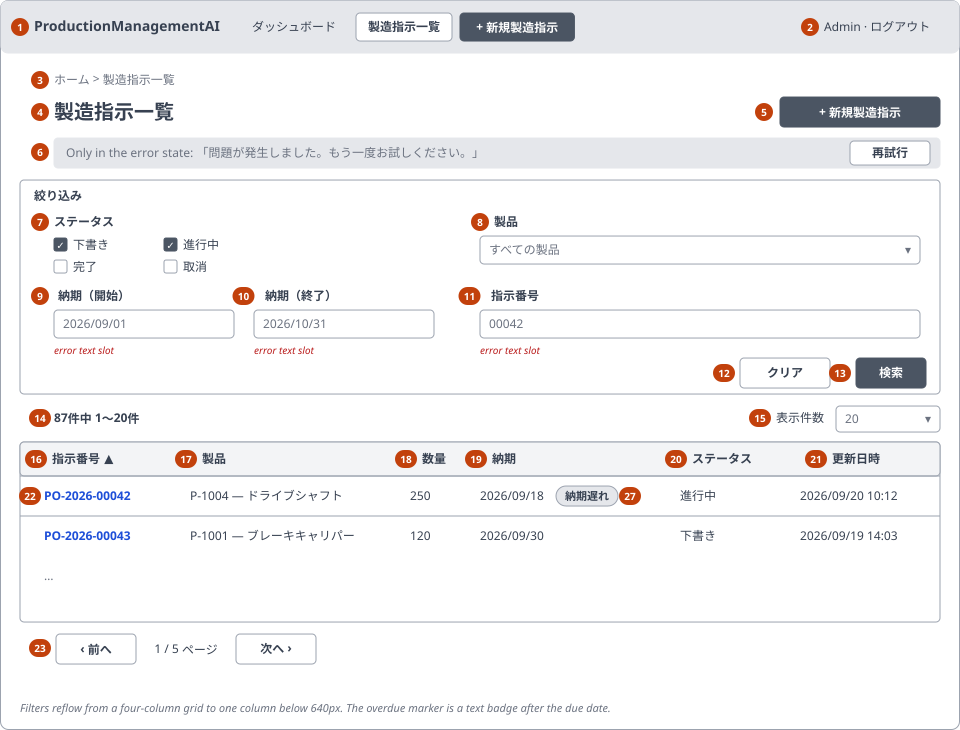
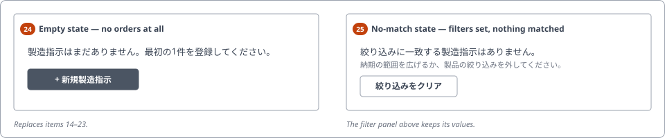
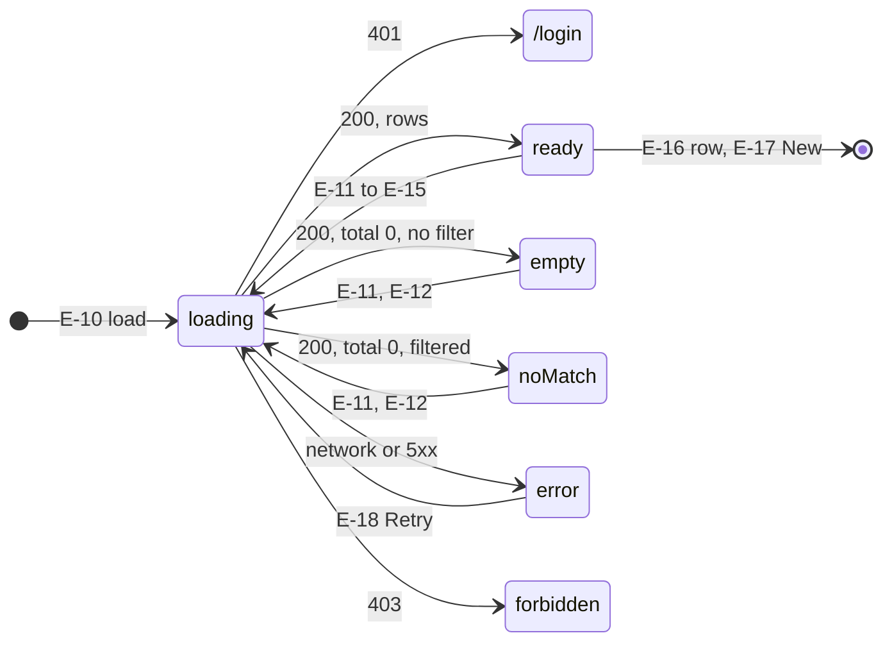

<!-- Based on ai/templates/detailed-design.md (revision at commit e7e0d36). -->

# Production Order List — Detailed Design Document (詳細設計書)

002_DD — implements 002_BD (SCR-002), requirements REQ-020–REQ-027.

## Document control (改版履歴)

| Field | Value |
| --- | --- |
| Document ID | 002_DD |
| Category | UI |
| System name | ProductionManagementAI |
| Subsystem name | Production orders |
| Work item | WI-003 |
| Implements | 002_BD |
| Created by | Claude (for ThanhTN) |
| Created date | 2026-09-22 |
| Last updated by | Claude (for ThanhTN) |
| Last updated date | 2026-09-23 |

| Version | Date | Author | Revision content |
| --- | --- | --- | --- |
| 1 | 2026-09-22 | Claude (for ThanhTN) | Initial creation |
| 2 | 2026-09-22 | Claude (for ThanhTN) | Rendered mockup published and linked |
| 3 | 2026-09-22 | Claude (for ThanhTN) | Aligned with the implementation: string-bound query parameters, enum names matched by name only, the sort applied before the projection, and the two contrast/link-style corrections axe found |
| 4 | 2026-09-23 | Claude (for ThanhTN) | Diagrams redrawn for the revised DD template (RFC 0009): the layout sketch and the empty/no-match states as SVG wireframes under `wireframes/`; the screen states also drawn as a Mermaid state diagram above the table. No field, rule, API or processing changes |
| 5 | 2026-09-23 | Claude (for ThanhTN) | WI-005: the UI is Japanese. The message catalog lists the Japanese text with an English gloss (WI-005 DEC-003); table caption, summary, button names, formatting helpers, wireframes and mockup updated. Test-viewpoint rows keep their English shorthand for button names. A Japanese edition of the mockup was added (`mockups/002_DD_screen-b-mockup.ja.html`). No field, rule, API or processing changes |

## Overview and reference documents (概要・目次)

| Field | Value |
| --- | --- |
| File / component name | `ProductionOrderListPage.tsx` and its child components; `ProductionOrdersController.List` |
| Overview | SCR-002, the production-order list: a read-only, server-paged, sortable, filterable table whose whole view state lives in the URL, and from which an order is opened in SCR-001 |

### Module / method / processing index

| No | Name | Overview | Notes |
| --- | --- | --- | --- |
| 1 | `ProductionOrderListPage` | Route component: view state, query, state selection | Module design §1 |
| 2 | `ProductionOrderFilters` | Filter panel, client validation, Search/Clear | §2 |
| 3 | `ProductionOrderTable` | Results table / SP cards, sorting, row activation | §3 |
| 4 | `ListPagination` | Summary, page size, Previous/Next | §4 |
| 5 | `ProductionOrderListQuery` + `validateFilters` | The query validator — one rule set, two implementations (server authoritative) | §5 |
| 6 | `useListViewState` | URL ⇄ typed view state | §6 |
| 7 | `ProductionOrdersController.List` | Request boundary | §7 |
| 8 | `api.ts` — `listOrders` | Typed client wrapper | §8 |
| 9 | `ProductionOrderService.ListAsync` and repository read methods | Server-side query use case | Pointer only — designed in 002_DD-FN |

### Reference documents

| No | Document | Purpose / use | Notes |
| --- | --- | --- | --- |
| 1 | 002_BD | Screen items, validation V-09–V-13, events E-10–E-19, states | Parent |
| 2 | 002_DB | Indexes, query shape, sort mapping, demo seed | Data layer |
| 3 | 002_DD-API | Endpoint contract | Companion |
| 4 | 002_DD-FN | Service and repository methods | Companion |
| 5 | 002_DD-SPD | Step-by-step processing per component | Companion |
| 6 | 001_DD, 001_DD-API, 001_DD-FN, 001_DD-SPD | SCR-001: message catalog, error contract, `Result<T>`, `apiClient`, plant clock, telemetry — all reused | Screen A |
| 7 | 0001_ADR, 0002_ADR | Layered backend; cookie auth and roles | |
| 8 | 001_BD | SCR-001's screen transition, which this screen changes (Cancel target) | |

### Referenced by

| No | Document | Purpose / use | Notes |
| --- | --- | --- | --- |
| 1 | 002_DD-API, 002_DD-FN, 002_DD-SPD | Companions elaborating this DD | |
| 2 | `work-items/WI-003/test-plan.md` | Test viewpoints below become `TC-###` | Not yet written |

### Component / file organization

**X-1. Path structure**

| No | Path / namespace | Purpose | Notes |
| --- | --- | --- | --- |
| 1 | `src/frontend/src/features/production-orders/` | Existing feature folder; the list page and its components join SCR-001's files | `ProductionOrderListPage.tsx`, `ProductionOrderFilters.tsx`, `ProductionOrderTable.tsx`, `ListPagination.tsx`, `useListViewState.ts`, `listValidation.ts` |
| 2 | `src/frontend/src/features/production-orders/api.ts`, `types.ts`, `messages.ts` | Existing files, extended — not duplicated | `listOrders`, the list types, the new message IDs |
| 3 | `src/backend/ProductionManagementAI.Api/Controllers/ProductionOrdersController.cs` | Existing controller, one new action | |
| 4 | `src/backend/ProductionManagementAI.Application/ProductionOrders/` | `ProductionOrderListQuery`, `ProductionOrderListContracts`, `ListAsync` on the existing service | |
| 5 | `src/backend/ProductionManagementAI.Infrastructure/ProductionOrders/` | Repository read methods, query extensions | |
| 6 | `src/backend/ProductionManagementAI.Infrastructure/Migrations/` | The two migrations from 002_DB | |

**X-2. Shared/common components used**

| No | Name | Purpose | Notes |
| --- | --- | --- | --- |
| 1 | `apiClient` | Fetch wrapper with the 401 → `/login` behavior | WI-001 |
| 2 | `AppHeader`, `ProtectedRoute` | Common header and route guard | WI-001 |
| 3 | `MessageBanner` | Error/success banner with its live region | 001_DD module 8 |
| 4 | `messages.ts`, `statusLabels` | The single message catalog and status labels | 001_DD |

**X-3. Feature-level components used**

| No | Name | Purpose | Notes |
| --- | --- | --- | --- |
| 1 | `ProductionOrderFilters` | Filter panel | §2 |
| 2 | `ProductionOrderTable` | Results | §3 |
| 3 | `ListPagination` | Paging controls | §4 |

**X-4. External APIs used** — see "APIs used" below.

**X-5. Responsive composition** — one set of components with responsive Tailwind styling, not separate PC/SP components, except the results region: `ProductionOrderTable` renders a `<table>` at `sm` and above and a card list below it, because a table and a card list cannot be the same markup and stay semantically correct. The filter panel is the same markup, wrapped in a `
`-style disclosure below `sm`.

### Companion design documents

| No | Document | Type | Covers |
| --- | --- | --- | --- |
| 1 | 002_DD-API_production-order-list.md | api-design | `GET /api/production-orders` (new, API-PO-04) and the reuse of `GET /api/products`; request/response field catalogs, error codes |
| 2 | 002_DD-FN_production-order-list-query.md | function-design | `ProductionOrderService.ListAsync`, the repository's `CountOrdersAsync`/`ListOrdersAsync`, filter/sort composition, the list mapper, observability |
| 3 | 002_DD-SPD_production-order-list.md | screen-processing-design | P-10 to P-15 plus the controller request boundary, one block per component |

### Task / design index

| No | Category | File-level task | Function/process-level task | Item-level task | Confirmed | Issue | Reviewer | Reworked | Date | Notes |
| --- | --- | --- | --- | --- | --- | --- | --- | --- | --- | --- |
| 1 | basic-design | 002_BD | SCR-002 | — | yes | — | ThanhTN | no | 2026-09-22 | Approved ("the BD look good"); revised to v2/v3 during 002_DB and 002_DD |
| 2 | database-design | 002_DB | Indexes, seed, queries | — | yes | — | ThanhTN | no | 2026-09-22 | Approved ("the DB design is approved") |
| 3 | detailed-design | 002_DD | Modules §1–§8, states, mockup | — | no | — | ThanhTN | no | 2026-09-22 | This document; mockup published 2026-09-22 |
| 4 | api-design | 002_DD-API | `GET /api/production-orders` | Query parameters, error codes | no | — | ThanhTN | no | 2026-09-22 | |
| 5 | function-design | 002_DD-FN | `ListAsync`, repository reads | Sort mapping, overdue rule | no | — | ThanhTN | no | 2026-09-22 | |
| 6 | screen-processing-design | 002_DD-SPD | P-10–P-15 | Response handling | no | — | ThanhTN | no | 2026-09-22 | |

## Module design

### 1. `ProductionOrderListPage`

| Field | Value |
| --- | --- |
| Description | Route component for `/production-orders`: owns the query lifecycle and chooses which of the six screen states to render |
| Return type | JSX element |
| Created by / date | Claude / 2026-09-22 |
| Last modified by / date | — |

Preconditions: rendered inside `ProtectedRoute`, so a session exists.

Not applicable — plain component, no rule/validator fields.

**Arguments**: none (route component).

**Dependencies**

| No | Module / component | Overview | Notes |
| --- | --- | --- | --- |
| 1 | `useListViewState` | View state from the URL | §6 |
| 2 | `api.ts` `listOrders`, `listProducts` | Data | §8 |
| 3 | `ProductionOrderFilters`, `ProductionOrderTable`, `ListPagination`, `MessageBanner` | Children | §2–§4 |
| 4 | `useAuth` | Role gate (UX only; the server is authoritative) | WI-001 |

Processing overview: see 002_DD-SPD §1 and §6. One query per distinct view state; a superseded response is discarded rather than rendered.

**Processing flow**: 002_DD-SPD §1 (P-10) and §6 (P-15).

**Return value**

| Type | Name | Description |
| --- | --- | --- |
| JSX | — | One of `loading`, `ready`, `empty`, `noMatch`, `error`, `forbidden` |

### 2. `ProductionOrderFilters`

| Field | Value |
| --- | --- |
| Description | The filter panel (items 7–13): holds draft filter values and publishes them on Search |
| Return type | JSX element |
| Created by / date | Claude / 2026-09-22 |
| Last modified by / date | — |

Preconditions: the product options have loaded, or the product select is rendered disabled with its load error.

Not applicable — plain component; its rules live in §5.

**Arguments**

| No | Type | Name | Description |
| --- | --- | --- | --- |
| 1 | `ListViewState` | `view` | Current applied filters, used to (re-)initialize the draft |
| 2 | `ProductResponse[]` | `products` | Options for item 8 |
| 3 | `(filters) => void` | `onApply` | Publishes valid filters to the view state |
| 4 | `boolean` | `busy` | Disables Search while a query is in flight |

**Dependencies**

| No | Module / component | Overview | Notes |
| --- | --- | --- | --- |
| 1 | `validateFilters` | Client-side V-09, V-10 | §5 |
| 2 | `messages.ts` | ID → text | |

Processing overview: 002_DD-SPD §3 (P-12). The draft re-bases whenever the applied view state changes, so Back or a shared URL always leaves the panel showing what produced the rows.

**Return value**: JSX (a `<form>`).

### 3. `ProductionOrderTable`

| Field | Value |
| --- | --- |
| Description | The results region (items 16–22, 27): a table at `sm` and above, a card list below it |
| Return type | JSX element |
| Created by / date | Claude / 2026-09-22 |
| Last modified by / date | — |

Preconditions: called only in the `ready` state, with `items.length ≥ 0`.

Not applicable — plain component.

**Arguments**

| No | Type | Name | Description |
| --- | --- | --- | --- |
| 1 | `ProductionOrderListItem[]` | `items` | The page's rows |
| 2 | `ProductionOrderSort` | `sort` | Active sort key, from the response |
| 3 | `'asc' \| 'desc'` | `dir` | Active direction, from the response |
| 4 | `(sort, dir) => void` | `onSort` | Publishes a new sort to the view state |

**Dependencies**

| No | Module / component | Overview | Notes |
| --- | --- | --- | --- |
| 1 | `Link` | Order-number cell → SCR-001 | react-router |
| 2 | `statusLabels`, `labels`, date and number formatting | M-05, M-10 | `messages.ts`; `src/lib/format.ts` (WI-005) |

Processing overview: 002_DD-SPD §4 (P-13). Accessibility specifics: `<caption>` naming the table and its sort, 「製造指示一覧（納期の昇順）」 (Production orders, sorted by due date ascending), `<th scope="col">` header cells each containing a `<button>`, `aria-sort="ascending" | "descending"` on the active header only, the overdue marker as text next to the due date, and the row's mouse handler deliberately additive to the link.

**Return value**: JSX.

### 4. `ListPagination`

| Field | Value |
| --- | --- |
| Description | Result summary (item 14), page-size select (15) and Previous/Next (23) |
| Return type | JSX element |
| Created by / date | Claude / 2026-09-22 |
| Last modified by / date | — |

Preconditions: a response with `total`, `page` and `pageSize` exists.

Not applicable — plain component.

**Arguments**

| No | Type | Name | Description |
| --- | --- | --- | --- |
| 1 | `number` | `total`, `page`, `pageSize` | From the response, not the request |
| 2 | `(page) => void` / `(size) => void` | `onPage`, `onPageSize` | Publish to the view state |

**Dependencies**: none beyond §6.

Processing overview: 002_DD-SPD §5 (P-14). The summary is the screen's live region: when a query finishes, it announces 「{total}件中 {first}〜{last}件」 ({first}–{last} of {total} orders) (M-09).

**Return value**: JSX.

### 5. `ProductionOrderListQuery` (server) and `validateFilters` (client)

| Field | Value |
| --- | --- |
| Description | The list query's validator and normalizer: one rule set stated once here, implemented on both sides, with the server authoritative |
| Return type | `Result<ProductionOrderListQuery>` (server) / `Record<field, messageId>` (client) |
| Created by / date | Claude / 2026-09-22 |
| Last modified by / date | — |

Preconditions: none — it is a pure function of the raw query values.

Rule type: input validation plus normalization (format, range, cross-field and allow-list checks).

**Rule references**

| No | Rule / validator | Location | Notes |
| --- | --- | --- | --- |
| 1 | 002_BD V-09–V-13 | 002_BD §5 | The rules this implements |
| 2 | `ProductExistsAsync` | 002_DD-FN §1 step 2 | The one check that needs the database, so it runs in the service, not here |

**Condition / data references**

| No | Key | Source | Notes |
| --- | --- | --- | --- |
| 1 | Allowed statuses | `ProductionOrderStatus` enum | Domain |
| 2 | Allowed sort keys / directions | `ProductionOrderSort`, `SortDirection` enums | Defined with this module |
| 3 | Allowed page sizes | `{10, 20, 50, 100}` constant | DEC-002 |

**Check parameters**

| No | Name | Type | Target field |
| --- | --- | --- | --- |
| 1 | `status` | string[] | Status filter (V-11) |
| 2 | `productId` | string | Product filter (V-12, existence in the service) |
| 3 | `dueFrom`, `dueTo` | string (date) | Due-date range (V-10) |
| 4 | `orderNumber` | string | Fragment (V-09) |
| 5 | `sort`, `dir`, `page`, `pageSize` | string / int | Sort and paging (V-13) |

**Arguments**

| No | Type | Name | Description |
| --- | --- | --- | --- |
| 1 | raw query values | `request` | Query-string values (server) or draft filter values (client) |

**Dependencies**: none — deliberately pure, so both sides can unit-test it without a database or a DOM.

Processing overview: validate, then normalize. Absent values take defaults; present-but-invalid values are rejected with their message ID and never silently defaulted (002_BD V-13) — that asymmetry is the whole point of the module, because defaulting a bad value would let a crafted request widen the result set. Normalization covers the order-number fragment (trim → length check → upper-case → escape `\`, `%`, `_` → wrap in `%…%`) and de-duplicating the status set. Every offending parameter is reported in one response, not the first one only.

The client implements V-09 and V-10 only (the two the user can type wrong); V-11, V-12 and V-13 cannot be violated through the UI, since those values come from the screen's own controls, so the client does not re-implement them — the server still enforces all five.

**Processing flow**: 002_DD-SPD §7 step 3 (server) and §3 step 3 (client).

**Return value**

| Type | Name | Description |
| --- | --- | --- |
| `Result<ProductionOrderListQuery>` | server | `Ok(query)` or `Invalid(parameter → message ID)` |
| `Record<string, string>` | client | Empty when valid; field → message ID otherwise |

### 6. `useListViewState`

| Field | Value |
| --- | --- |
| Description | Hook converting between the URL query string and the typed view state |
| Return type | `[ListViewState, (next, options) => void]` |
| Created by / date | Claude / 2026-09-22 |
| Last modified by / date | — |

Preconditions: rendered inside the router.

Not applicable — plain hook.

**Arguments**: none.

**Dependencies**

| No | Module / component | Overview | Notes |
| --- | --- | --- | --- |
| 1 | `useSearchParams` | URL access | react-router |

Processing overview: 002_DD-SPD §2 (P-11). Parsing is total and never throws; serialization omits every parameter equal to its default.

**Return value**

| Type | Name | Description |
| --- | --- | --- |
| `[ListViewState, setView]` | — | Current view state and the publisher that rewrites the URL |

### 7. `ProductionOrdersController.List`

| Field | Value |
| --- | --- |
| Description | `GET /api/production-orders` — the request boundary |
| Return type | `ActionResult<PagedResult<ProductionOrderListItem>>` |
| Created by / date | Claude / 2026-09-22 |
| Last modified by / date | — |

Preconditions: the existing `ProductionOrderEditor` policy has authorized the request.

Not applicable — plain handler.

**Arguments**

| No | Type | Name | Description |
| --- | --- | --- | --- |
| 1 | `ProductionOrderListRequest` | `request` | `[FromQuery]` binding of the nine parameters |
| 2 | `CancellationToken` | `cancellationToken` | |

**Dependencies**

| No | Module / component | Overview | Notes |
| --- | --- | --- | --- |
| 1 | `ProductionOrderListQuery.TryCreate` | Validation | §5 |
| 2 | `ProductionOrderService.ListAsync` | Use case | 002_DD-FN §1 |
| 3 | `ProductionOrderProblems.ToActionResult` | `Result<T>` → HTTP | Existing |

Processing overview: 002_DD-SPD §7. No `[Consumes]` attribute — the endpoint takes no body.

**Return value**: 200 with the paged result, or the Problem Details responses catalogued in 002_DD-API.

### 8. `api.ts` — `listOrders`

| Field | Value |
| --- | --- |
| Description | Typed wrapper building the query string and parsing the paged response |
| Return type | `Promise<PagedResult<ProductionOrderListItem>>` |
| Created by / date | Claude / 2026-09-22 |
| Last modified by / date | — |

Preconditions: none.

Not applicable — plain function.

**Arguments**

| No | Type | Name | Description |
| --- | --- | --- | --- |
| 1 | `ListViewState` | `view` | Serialized with the same rules as the URL (§6), so what the user sees and what is queried cannot diverge |
| 2 | `AbortSignal` | `signal` | Cancels a superseded query |

**Dependencies**: `apiClient` (401 handling, JSON parsing, Problem Details mapping).

Processing overview: one serializer for both the URL and the request; defaults are omitted from both.

**Return value**: the parsed `PagedResult`, or a typed API error the page maps per 002_DD-SPD §6.

### 9. Server-side service and repository methods

Pointer only — `ProductionOrderService.ListAsync`, `IProductionOrderRepository.CountOrdersAsync` / `ListOrdersAsync`, the filter/sort composition and the list mapper are designed in **002_DD-FN**, which also specifies the spans and metrics for the endpoint.

## Screen layout and mockup

Implementation-fidelity layout. It refines 002_BD §1 in two ways: the filter panel is laid out as a labelled grid that reflows from four columns to one, and the overdue marker is specified as a text badge after the due date rather than a styling of the date itself, so it survives both themes and screen readers.

Empty state (no orders at all) and no-match state (filters set, nothing matched):

Mockup artifact: https://claude.ai/artifact/2XrZ9xnEfzQ6pCbUnZovL3 — published privately on 2026-09-22 with the user's authorization (plan revision 1, "Resources and external actions"). Source kept in the repository at `docs/en/020_detailed-design/002/mockups/002_DD_screen-b-mockup.html`, alongside 001_DD's, whose token system and app-look CSS it reuses so the two mockups read as one set. Seven artboards: 1 default view, 2 filtered and sorted (with the focus rings), 3 filter validation errors, 4 no-match, 5 empty, 6 query error, 7 SP card layout.

Japanese edition, with the page captions in Japanese too, linked from the Japanese PDF (WI-005): https://claude.ai/artifact/TTxzX1PJVyKr3aLYpHSRZK (private). Source: [`mockups/002_DD_screen-b-mockup.ja.html`](mockups/002_DD_screen-b-mockup.ja.html).

| Region | Contains (field/control) | Notes |
| --- | --- | --- |
| Header | AppHeader (items 1, 2) | Shared component, unchanged |
| Title row | Heading (4), New production order (5) | Button right-aligned on PC, full width on SP |
| Banner | MessageBanner (6) | Rendered only in the `error` state; `role="alert"`, carries **再試行** (Retry) |
| Filter panel | Items 7–13 | 4-column grid at `lg`, 2 at `sm`, 1 below; each field has a reserved error slot so the layout doesn't jump when an error appears |
| Summary row | Items 14, 15 | Summary is the live region (`role="status"`) |
| Results | Items 16–22, 27 | `<table>` at `sm`+, card list below; sticky header row on PC |
| Paging | Item 23 | Centered; controls disabled, not hidden, at the ends |
| Empty / no-match | Items 24, 25 | Replace the results region only; the filter panel stays |

## Screen item definition

Types and client-side behavior for each input; the authoritative rules are 002_BD §5 and the server (§5 above).

| Field | Type | Required | Validation rule | Source (BD ref) |
| --- | --- | --- | --- | --- |
| `status` | `Set<'Draft'\|'InProgress'\|'Completed'\|'Cancelled'>` | no | Four checkboxes in a `<fieldset>` with a `<legend>`; empty set = no restriction | §3 item 7, V-11, DEC-005 |
| `productId` | `string \| null` (uuid) | no | Native `<select>`, options ordered by SKU, label "{sku} — {name}" (e.g. `P-1004 — ドライブシャフト`), first option 「すべての製品」 (All products) with an empty value | §3 item 8, V-12, M-06 |
| `dueFrom` | `string \| null` (`YYYY-MM-DD`) | no | `<input type="date">`; malformed → MSG-E016; after `dueTo` → MSG-E017 | §3 item 9, V-10 |
| `dueTo` | `string \| null` (`YYYY-MM-DD`) | no | `<input type="date">`; malformed → MSG-E016 | §3 item 10, V-10 |
| `orderNumber` | `string \| null` | no | `<input type="search" maxlength="20">`; trimmed on submit; longer than 20 → MSG-E015 (the attribute prevents it in practice, the check covers paste and crafted URLs) | §3 item 11, V-09 |
| `sort` | `ProductionOrderSort` | no | Set by the header buttons only; never typed | §3 items 16–21, V-13 |
| `dir` | `'asc' \| 'desc'` | no | Toggled by re-clicking the active header | §3 items 16–21, V-13 |
| `page` | `number` | no | Set by the paging controls; reset to 1 by any filter, sort or page-size change | §3 item 23, V-13 |
| `pageSize` | `10 \| 20 \| 50 \| 100` | no | `<select>`, default 20 | §3 item 15, V-13, DEC-002 |

Read-only row fields (items 16–22, 27) are rendered from `ProductionOrderListItem` (002_DD-API) and have no input behavior. `isOverdue` comes from the server, so every client agrees on "today" (WI-002 DEC-011).

Message catalog additions (`messages.ts`; the server returns the same IDs as `code`; other UI strings are in its `labels` object, WI-005 DEC-007). 001_DD already defines MSG-E001–MSG-E014 and MSG-I001–MSG-I002, so Screen B continues the same catalog rather than starting a second one:

| ID | Text (Japanese, as implemented) | English gloss |
| --- | --- | --- |
| MSG-E015 | 指示番号の検索は20文字以内で入力してください。 | Order number search can't exceed 20 characters. |
| MSG-E016 | 有効な日付を入力してください。 | Enter a valid date. |
| MSG-E017 | 納期（開始）は納期（終了）以前の日付にしてください。 | 'Due from' must be on or before 'Due to'. |
| MSG-E018 | 不明なステータスです。 | Unknown order status. |
| MSG-E019 | 対応していない並べ替えまたはページングの指定です。 | Unsupported sort or paging option. |
| MSG-E020 | 製造指示を閲覧する権限がありません。 | You don't have permission to view production orders. |
| MSG-I003 | 製造指示はまだありません。最初の1件を登録してください。 | No production orders yet. Create the first one. |
| MSG-I004 | 絞り込みに一致する製造指示はありません。 | No orders match your filters. |

Reused unchanged: MSG-E002 (unknown product filter), MSG-E013 (query failure).

Two visual rules were corrected during implementation, after `@axe-core/playwright` failed on the real screen: the
`Cancelled` badge uses `text-gray-600` rather than `text-gray-400` (2.9:1 on white fails WCAG 1.4.3), and the
breadcrumb link is underlined always, not only on hover (WCAG 1.4.1, "link in text block").

## Loading / empty / error / success states

| State | Trigger | UI behavior | Data shown |
| --- | --- | --- | --- |
| `loading` | A query is in flight | The results region is replaced by a skeleton with `aria-busy="true"`; the filter panel stays usable but **検索** (Search) is disabled; previous rows are not left visible as if they were the answer | Skeleton rows |
| `ready` | 200 with `total > 0` | Table, summary, sort marker and paging, all rendered from the response's echoed controls; the summary's live region announces the new total | The page's rows |
| `ready` (past the last page) | 200 with `total > 0` and `items = []` | Empty table body with the paging controls intact and **‹ 前へ** (Previous) enabled — not an error (REQ-024) | No rows |
| `empty` | 200 with `total = 0` and no filter set | MSG-I003 with a **+ 新規製造指示** (New production order) action, replacing the results region | — |
| `noMatch` | 200 with `total = 0` and at least one filter set | MSG-I004 with **絞り込みをクリア** (Clear filters); the filter panel keeps its values so the user can adjust rather than retype | — |
| Filter validation error | Client V-09/V-10, or a 400 from the server | Inline error under each offending field, focus moved to the first one; the previously loaded rows stay on screen and are not implied to match the rejected filters | Previous rows |
| `error` | Network failure or 5xx | MSG-E013 banner with **再試行** (Retry), which re-runs the same query unchanged | Previous rows cleared |
| `forbidden` | Client role gate or 403 | Full-region panel MSG-E020 with a link back to `/`; no query is issued | — |
| 401 | Any request without a valid session | `apiClient` redirects to `/login` | — |

## Processing and state transitions

This screen has no business state machine — it changes no order data (DEC-003). Its transitions are view-state transitions.

### State transitions

Transitions from any state (E-17 New, E-19 Back/Forward) and a 400 that keeps the previous state are in the table below, not the diagram.

| From state | Event | To state | Side effect |
| --- | --- | --- | --- |
| (route entered) | E-10 load | `loading` | View state read from the URL; product options fetched |
| `loading` | 200, rows | `ready` | Summary announced |
| `loading` | 200, `total = 0`, no filter | `empty` | — |
| `loading` | 200, `total = 0`, filtered | `noMatch` | — |
| `loading` | 400 | previous state + field errors | No rows replaced |
| `loading` | 401 / 403 | `/login` / `forbidden` | — |
| `loading` | network or 5xx | `error` | — |
| `ready`/`empty`/`noMatch` | E-11 Search, E-12 Clear | `loading` | URL updated (push), `page → 1` |
| `ready` | E-13 sort | `loading` | URL updated (push), `page → 1` |
| `ready` | E-14 page, E-15 page size | `loading` | URL updated (push); page size also resets `page → 1` |
| `ready` | E-16 row activated | (leaves screen) | Navigates to SCR-001 edit mode |
| any | E-17 New | (leaves screen) | Navigates to SCR-001 create mode |
| `error` | E-18 Retry | `loading` | Same query re-run |
| any | E-19 Back/Forward | `loading` | View state re-read from the URL |

### Processing flows

| Flow | Where (screen-processing-design / function-design section) | Events |
| --- | --- | --- |
| P-10 Load and query | 002_DD-SPD §1 | E-10, E-19 |
| P-11 View-state synchronization | 002_DD-SPD §2 | E-10–E-15, E-19 |
| P-12 Filter, search, clear | 002_DD-SPD §3 | E-11, E-12 |
| P-13 Sort and row activation | 002_DD-SPD §4 | E-13, E-16 |
| P-14 Page and page size | 002_DD-SPD §5 | E-14, E-15 |
| P-15 Query-response handling | 002_DD-SPD §6 | E-10, E-18 |
| Server query use case | 002_DD-FN §1–§6 | — |

## APIs used

| Endpoint | Method | Purpose | Design doc |
| --- | --- | --- | --- |
| `/api/production-orders` | GET | One page of orders with the total | 002_DD-API §1 |
| `/api/products` | GET | Product filter options | 002_DD-API §2 (defined in 001_DD-API §1) |

## Database and transaction mapping

| Operation | Table(s) | Transaction boundary | Concurrency handling |
| --- | --- | --- | --- |
| Count matches | `production_orders` | None (single statement, READ COMMITTED) | Not applicable — read-only |
| Fetch page | `production_orders` joined to `products` | None (single statement) | Not applicable — read-only |
| Product filter existence check | `products` | None | Not applicable |

Deliberate exception to the one-query-per-table convention: the page query joins `products`, because the list must show the product label and can sort by it, and issuing a second query per page to resolve 20 product ids would be slower and could tear (a product renamed between the two queries). The count query does **not** join, since no filter needs it. Both select only the columns the screen uses (002_DB read projection). No existing SCR-001 query is modified.

The two statements can observe different snapshots, so the total may differ from the page by a row created between them; 002_DB accepts that explicitly rather than taking a repeatable-read transaction for an informational screen.

## Exception handling

| Failure | Retry policy | Timeout | User-facing error | Logging |
| --- | --- | --- | --- | --- |
| Invalid query parameter (400) | none automatic — the user corrects it | — | Inline field error, or a banner for a parameter with no field | Information: rejected parameter names with their message IDs (structured) |
| Unknown product filter (400) | none | — | Inline error MSG-E002 on the product field | Information |
| Not signed in (401) | none | — | Redirect to `/login` | Existing `apiClient` behavior |
| Missing role (403) | none | — | Panel MSG-E020 | Information |
| Query/database failure (500) | none automatic; **再試行** (Retry) re-runs it | Npgsql command timeout 30s (default) | Banner MSG-E013 | Error with exception, server-side only; the response is generic Problem Details with no stack trace or exception text (`ai/rules/backend.md`) |
| Frontend network failure | none automatic; **再試行** (Retry) | browser default | Banner MSG-E013 | `console.error` in development only |
| Superseded query (user changed the view mid-flight) | not an error | — | none | none — the response is discarded by `AbortSignal` |
| Product options fail to load | none automatic | — | Product select disabled with an inline load error; the rest of the screen still works | Information |

## Test viewpoints and unresolved decisions

U = unit, I = integration, E = E2E. These become `TC-###` when the WI-003 test plan is written (plan revision 2).

| Scenario | Precondition | Expected result | Test-plan ID |
| --- | --- | --- | --- |
| Default view (REQ-020) — I, E | Seeded 80 orders | 200; 20 rows; `total = 80`; sorted by due date ascending; every status present (DEC-006) | TC-101 |
| Row content (REQ-021) — U, E | One known order | Row shows order number, SKU + name, quantity, due date, status label, updated date; no GUID and no raw enum name visible | TC-102 |
| Overdue marker (REQ-021) — U | Plant today = D | `dueDate < D` with `Draft`/`InProgress` → `isOverdue = true`; same date with `Completed`/`Cancelled` → false; `dueDate = D` → false | TC-103 |
| Status filter, multi-select (REQ-022) — I | Seeded data | `?status=Draft&status=InProgress` returns exactly those rows and a matching total; no `status` returns everything | TC-104 |
| Product / due-range / fragment filters (REQ-022) — I | Seeded data | Each filter alone returns exactly the matching rows; range inclusive at both ends; fragment matches case-insensitively mid-string | TC-105 |
| Combined filters (REQ-022) — I | Seeded data | Filters combine with AND; the total matches the filtered row count | TC-106 |
| Invalid filter values (REQ-022) — I | — | Unknown status → 400 MSG-E018; unknown product → 400 MSG-E002; `dueFrom > dueTo` → 400 MSG-E017; malformed date → 400 MSG-E016; 21-character fragment → 400 MSG-E015; all offending parameters reported together | TC-107 |
| Fragment escaping (REQ-022, DEC-010) — I | An order `PO-2026-00042` exists | Searching `%` or `_` returns no rows (treated literally), not every row | TC-108 |
| Sorting (REQ-023) — I, E | Seeded data | Each of the six keys sorts the whole result set, not just the page; clicking again reverses; status sorts in workflow order; unsupported key → 400 MSG-E019 | TC-109 |
| Paging stability (REQ-023, REQ-024) — I | Orders sharing a due date | Pages 1 and 2 together contain each row exactly once (the order-number tie-breaker) | TC-110 |
| Paging and page size (REQ-024) — I, E | 80 orders | `pageSize` 10/20/50/100 accepted, default 20; page beyond the last → 200 with `items = []` and the real `total`; `pageSize=101`, `0`, `abc`, `page=0` → 400 MSG-E019 | TC-111 |
| Page reset (REQ-024) — U, E | On page 3 | Changing a filter, the sort or the page size returns to page 1 | TC-112 |
| Navigation (REQ-025) — E | Rows present | Clicking a row, and activating the order-number link by keyboard, both open `/production-orders/{id}`; **New production order** opens `/production-orders/new`; the list exposes no save or status control | TC-113 |
| Authorization (REQ-026) — I, E | — | Unauthenticated → 401 and the UI redirects to `/login`; signed in without either role → 403 and no order data in the response body | TC-114 |
| URL view state (REQ-027) — E | A filtered, sorted, paged view | Reload reproduces it; Back returns to the previous view; a URL with `sort=bogus&page=-1` renders the default view without an error page | TC-115 |
| Empty and no-match states (REQ-020, REQ-022) — E | Empty table / non-matching filter | MSG-I003 with **New production order** / MSG-I004 with **Clear filters**, and the filter panel keeps its values | TC-116 |
| Query failure (REQ-020) — E | API returns 500 | MSG-E013 banner with **Retry**; **Retry** re-runs the same query | TC-117 |
| Accessibility — U (axe), E (axe) | Table rendered | No axe violations; `aria-sort` on the active column only; table has a caption; every row reachable by keyboard; summary announces the total | TC-118 |
| Index usage (002_DB) — I | Seeded data | The default-sort and fragment queries use `ix_production_orders_due_date_order_number` and the trigram index (`EXPLAIN`), not a sequential scan | TC-119 |

Unresolved decisions: none for the design. Two items are recorded as limitations rather than decisions:

- The list endpoint reuses the `ProductionOrderEditor` policy, so a read-only role cannot be expressed. This waits on WI-001 DEC-015 (the full role/permission matrix), which remains open.
- The mockup is a static rendering, not a prototype: it fixes layout, state coverage and the treatment of status, the overdue marker and the sort indicator, but no interaction is demonstrated there — behavior is specified in 002_DD-SPD.
