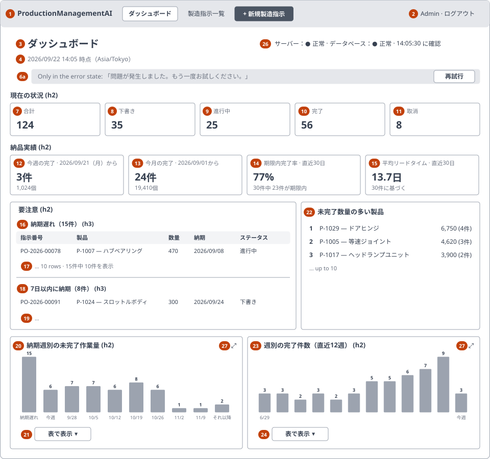
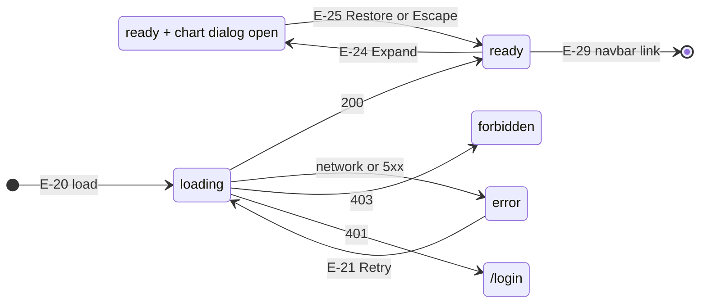

<!-- Based on ai/templates/detailed-design.md (revision at commit c3747ed). -->

# Production Dashboard — Detailed Design Document (詳細設計書)

003_DD — implements 003_BD (SCR-003), requirements REQ-028–REQ-042.

## Document control (改版履歴)

| Field | Value |
| --- | --- |
| Document ID | 003_DD |
| Category | UI + API |
| System name | ProductionManagementAI |
| Subsystem name | Production orders |
| Work item | WI-004 |
| Implements | 003_BD revision 3 |
| Created by | Claude (for ThanhTN) |
| Created date | 2026-09-22 |
| Last updated by | Claude (for ThanhTN) |
| Last updated date | 2026-09-23 |

| Version | Date | Author | Revision content |
| --- | --- | --- | --- |
| 1 | 2026-09-22 | Claude (for ThanhTN) | Initial creation |
| 2 | 2026-09-22 | Claude (for ThanhTN) | Rendered mockup published and linked |
| 3 | 2026-09-22 | Claude (for ThanhTN) | Plan revision 2 (mockup review): navbar in the shared header and the navigation guard (DEC-016, DEC-022), health indicator and its endpoint (DEC-017, DEC-019, DEC-020), chart maximize (DEC-018); page actions removed; test viewpoints TC-222–TC-227 added, TC-201/TC-202 updated |
| 4 | 2026-09-22 | Claude (for ThanhTN) | Icons (DEC-023): `lucide-react` dependency and the `components/icons.ts` import point; mockup v3 |
| 5 | 2026-09-23 | Claude (for ThanhTN) | Diagrams redrawn for the revised DD template (RFC 0009): the layout sketch as an SVG wireframe under `wireframes/`; the screen states also drawn as a Mermaid state diagram above the table. No field, rule, API or processing changes |
| 6 | 2026-09-23 | Claude (for ThanhTN) | WI-005: the UI is Japanese. The message catalog lists the Japanese text with an English gloss (WI-005 DEC-003); formatter rows (件, 個, 日, `YYYY/MM/DD`, `M/D`) and names match the code; health texts, wireframes and mockup updated. Corrected: the `ready` state announces the snapshot-time line, not a separate "Dashboard updated" text. A Japanese edition of the mockup was added (`mockups/003_DD_screen-c-mockup.ja.html`). No field, rule, API or processing changes |

## Overview and reference documents (概要・目次)

| Field | Value |
| --- | --- |
| File / component name | `DashboardPage.tsx` and its child components; `DashboardController.Get` |
| Overview | SCR-003, the production dashboard at `/`: eight read-only widgets rendered from one server snapshot, a server/database health indicator, and charts that maximize to the full window; replacing the placeholder home page. Also the shared header's navbar and navigation guard used by every screen |

### Module / method / processing index

| No | Name | Overview | Notes |
| --- | --- | --- | --- |
| 1 | `DashboardPage` | Route component: role gate, load, state selection, page actions | Module design §1 |
| 2 | `StatusTiles` | Items 7–11 | §2 |
| 3 | `DeliveryTiles` | Items 12–15 | §2 |
| 4 | `AttentionList` | Items 16–19 | §3 |
| 5 | `TopProducts` | Item 22 | §4 |
| 6 | `BarChart` | Items 20–21 and 23–24: SVG bars plus table equivalent | §5 |
| 7 | `dashboardFormat.ts` | Pure formatters for M-13, M-14, M-16–M-19 | §6 |
| 8 | `dashboardApi.ts` — `getDashboard` | Typed client wrapper | §7 |
| 9 | `DashboardController.Get` | Request boundary | §8 |
| 10 | `DashboardService`, `DashboardWindow`, `IDashboardReader`, `DashboardMapper`, `IPlantClock` additions | Server-side snapshot | Pointer only — designed in 003_DD-FN |
| 11 | `ProductionOrder` entity — completion time | REQ-033 | Pointer only — designed in 001_DD v4 module 1 step 5 |
| 12 | `AppNavbar` (in `AppHeader`) | The application navbar on every authenticated screen | §10 |
| 13 | `NavigationGuard` + `GuardedLink` | Lets an edited SCR-001 form intercept in-app links (DEC-022) | §11 |
| 14 | `HealthIndicator` + `useSystemHealth` | Item 26: status, polling, visibility pause | §12 |
| 15 | `ChartDialog` | Items 27–29: maximized chart view | §13 |
| 16 | `SystemController.Health`, `SystemHealthService`, `IDatabasePing`, cookie renewal rule | Health endpoint and the no-renew rule | Pointer only — designed in 003_DD-FN §6–§7 |

### Reference documents

| No | Document | Purpose / use | Notes |
| --- | --- | --- | --- |
| 1 | 003_BD | Items, metric definitions D-01–D-09, mappings M-11–M-19, events E-20–E-23 | Parent |
| 2 | 003_DB | Column, constraints, queries Q1–Q6, snapshot, seed, migrations | Data layer |
| 3 | 003_DD-API | Endpoint contract | Companion |
| 4 | 003_DD-FN | Service, window, reader, mapper, plant-clock additions | Companion |
| 5 | 003_DD-SPD | Step-by-step processing per component | Companion |
| 6 | 001_DD set (v4), 001_BD v6 | Completion stamping on `InProgress → Completed`; message catalog, `apiClient`, `MessageBanner`, plant clock | Screen A |
| 7 | 002_DD set, 002_DB | `ProductSummary`, status labels, test conventions; seed that 003_DB extends | Screen B |
| 8 | 0001_ADR, 0002_ADR | Layered backend; cookie auth and roles | |

### Referenced by

| No | Document | Purpose / use | Notes |
| --- | --- | --- | --- |
| 1 | 003_DD-API, 003_DD-FN, 003_DD-SPD | Companions elaborating this DD | |
| 2 | `work-items/WI-004/test-plan.md` (TP-004) | Test viewpoints below become `TC-2##` | Written in plan revision 2 |

### Component / file organization

**X-1. Path structure**

| No | Path / namespace | Purpose | Notes |
| --- | --- | --- | --- |
| 1 | `src/frontend/src/features/dashboard/` | New feature folder | `DashboardPage.tsx`, `StatusTiles.tsx`, `DeliveryTiles.tsx`, `AttentionList.tsx`, `TopProducts.tsx`, `BarChart.tsx`, `dashboardFormat.ts`, `dashboardApi.ts`, `types.ts` |
| 2 | `src/frontend/src/App.tsx` | Route `/` → `DashboardPage`; the inline `HomePage` is deleted; the authenticated routes are wrapped in `NavigationGuardProvider` | DEC-005, DEC-022 |
| 2a | `src/frontend/src/components/` | `AppHeader.tsx` (extended), `AppNavbar.tsx`, `GuardedLink.tsx` | Shared by every screen (DEC-016) |
| 2b | `src/frontend/src/lib/navigationGuard.tsx` | `NavigationGuardProvider`, `useNavigationGuard` | DEC-022 |
| 2c | `src/frontend/src/features/dashboard/` | Also `HealthIndicator.tsx`, `useSystemHealth.ts`, `ChartDialog.tsx`, `systemApi.ts` | |
| 2e | `src/frontend/src/components/icons.ts` | The only module importing `lucide-react`; re-exports the icons of 003_BD M-21 under role names (`NavDashboardIcon`, `StatusCompletedIcon`, …), so a glyph changes in one place | DEC-023 |
| 2f | `src/frontend/package.json` | `lucide-react` pinned at an exact version (1.47.0 at design time; confirmed when installed) | DEC-023 |
| 2d | `src/frontend/src/features/production-orders/ProductionOrderForm.tsx`, `ProductionOrderPage.tsx`, `ProductionOrderListPage.tsx` | The form registers with the guard; breadcrumb links become `GuardedLink` | DEC-022 |
| 3 | `src/frontend/src/features/production-orders/messages.ts` | The single message catalog, extended with MSG-E021 and MSG-I005–MSG-I008 | Not a second catalog |
| 4 | `src/backend/ProductionManagementAI.Api/Controllers/DashboardController.cs` | New controller | |
| 5 | `src/backend/ProductionManagementAI.Application/Dashboard/` | `DashboardService`, `DashboardWindow`, `DashboardMapper`, `IDashboardReader`, `DashboardContracts` | New namespace |
| 6 | `src/backend/ProductionManagementAI.Infrastructure/Dashboard/DashboardReader.cs` | Raw-SQL reader | |
| 6a | `src/backend/ProductionManagementAI.Api/Controllers/SystemController.cs`, `Application/Health/SystemHealthService.cs` (+ `IDatabasePing`), `Infrastructure/Health/DatabasePing.cs` (namespace `Health`, WI-004 DEC-024) | Health endpoint | 003_DD-FN §6 |
| 6b | `src/backend/ProductionManagementAI.Infrastructure/DependencyInjection.cs` | Cookie `Events.OnCheckSlidingExpiration`: no renewal for the health path | 003_DD-FN §7, DEC-019 |
| 7 | `src/backend/ProductionManagementAI.Application/ProductionOrders/Ports.cs`, `Infrastructure/ProductionOrders/PlantClock.cs` | `IPlantClock` additions | 003_DD-FN §5 |
| 8 | `src/backend/ProductionManagementAI.Domain/ProductionOrders/ProductionOrder.cs`, `Infrastructure/ProductionOrders/ProductionOrderConfigurations.cs` | `CompletedAtUtc` property, mapping and check constraints | 001_DD v4, 003_DB |
| 9 | `src/backend/ProductionManagementAI.Infrastructure/Migrations/` | 003_DB's three migrations | |

**X-2. Shared/common components used**

| No | Name | Purpose | Notes |
| --- | --- | --- | --- |
| 1 | `apiClient` | Fetch wrapper with 401 → `/login` | WI-001 |
| 2 | `AppHeader`, `ProtectedRoute` | Common header (now with `AppNavbar`) and route guard | DEC-016 |
| 3 | `MessageBanner` | Error banner with its live region | 001_DD |
| 4 | `messages.ts`, `statusLabels` | Message catalog and status labels | 001_DD, 002_DD |

**X-3. Feature-level components used** — modules 2–6 above.

**X-4. External APIs used** — see "APIs used" below.

**X-5. Responsive composition** — one set of components with responsive Tailwind classes. The widget grid is one column below `sm`, two columns at `lg` for the paired widgets (attention list with top products; workload with trend). Tile rows use `grid-cols-2` below `sm` and `grid-cols-5` / `grid-cols-4` above. Two components change markup rather than only layout: `AttentionList` (table ↔ cards, as `ProductionOrderTable` does), and `BarChart`, which keeps a minimum width inside a horizontally scrolling card on SP.

### Companion design documents

| No | Document | Type | Covers |
| --- | --- | --- | --- |
| 1 | 003_DD-API_production-dashboard.md | api-design | `GET /api/dashboard` (API-DSH-01) and `GET /api/system/health` (API-SYS-01): response catalogs, error codes, caching |
| 2 | 003_DD-FN_dashboard-snapshot.md | function-design | `DashboardService.GetSnapshotAsync`, `DashboardWindow.For`, `IDashboardReader.ReadAsync`, `DashboardMapper.ToResponse`, `IPlantClock` additions, `SystemHealthService.CheckAsync`, the session-renewal rule, observability |
| 3 | 003_DD-SPD_production-dashboard.md | screen-processing-design | P-20 to P-29 plus the two controller request boundaries |

### Task / design index

| No | Category | File-level task | Function/process-level task | Item-level task | Confirmed | Issue | Reviewer | Reworked | Date | Notes |
| --- | --- | --- | --- | --- | --- | --- | --- | --- | --- | --- |
| 1 | basic-design | 003_BD | SCR-003 | — | yes | — | ThanhTN | no | 2026-09-22 | Approved ("003_BD is approved, move on to 003_DB") |
| 2 | database-design | 003_DB | Column, queries, seed, migrations | — | yes | — | ThanhTN | no | 2026-09-22 | Approved ("003_DB is approved, move on to the DD") |
| 3 | basic/detailed-design | 001_BD v6, 001_DD v4, 001_DD-FN v3, 001_DD-API v2 | Completion stamping | — | yes | — | ThanhTN | no | 2026-09-22 | Approved with 003_DB |
| 4 | detailed-design | 003_DD | Modules §1–§8, states, mockup | — | no | — | ThanhTN | no | 2026-09-22 | This document |
| 5 | api-design | 003_DD-API | `GET /api/dashboard` | Response catalog | no | — | ThanhTN | no | 2026-09-22 | |
| 6 | function-design | 003_DD-FN | Service, window, reader, mapper | Calendar rules, rounding | no | — | ThanhTN | no | 2026-09-22 | |
| 7 | screen-processing-design | 003_DD-SPD | P-20–P-25 | Chart geometry, response handling | no | — | ThanhTN | no | 2026-09-22 | |

## Module design

### 1. `DashboardPage`

| Field | Value |
| --- | --- |
| Description | Route component for `/`: renders the page heading and actions, loads the snapshot once, and chooses among `loading`, `ready`, `error` and `forbidden` |
| Return type | JSX element |
| Created by / date | Claude / 2026-09-22 |
| Last modified by / date | — |

Preconditions: rendered inside `ProtectedRoute`, so a session exists.

Not applicable — plain component, no rule/validator fields.

**Arguments**: none (route component).

**Dependencies**

| No | Module / component | Overview | Notes |
| --- | --- | --- | --- |
| 1 | `getDashboard` | Data | §7 |
| 2 | Modules 2–6, `MessageBanner` | Children | |
| 3 | `useAuth` | Role gate (UX only; the server is authoritative) | WI-001 |
| 4 | `HealthIndicator` | Item 26, rendered beside the heading | §12 |

Processing overview: 003_DD-SPD §1 (P-20) and §2 (P-21). Every widget receives its slice of the same snapshot object; none fetches on its own.

**Processing flow**: 003_DD-SPD §1, §2.

**Return value**

| Type | Name | Description |
| --- | --- | --- |
| JSX | — | Heading and health indicator always (the indicator is hidden in `forbidden`); below them one of `loading`, `ready`, `error`, `forbidden` |

### 2. `StatusTiles` and `DeliveryTiles`

| Field | Value |
| --- | --- |
| Description | The two tile rows (items 7–11, 12–15) |
| Return type | JSX element |
| Created by / date | Claude / 2026-09-22 |
| Last modified by / date | — |

Preconditions: `ready` state.

Not applicable — presentational.

**Arguments**

| No | Type | Name | Description |
| --- | --- | --- | --- |
| 1 | `StatusCounts` | `counts` | `StatusTiles` |
| 2 | `CountAndQuantityWithFrom` ×2, `OnTime`, `LeadTime` | `week`, `month`, `onTime`, `leadTime` | `DeliveryTiles` |

**Dependencies**: `dashboardFormat` (§6), `statusLabels`.

Processing overview: 003_DD-SPD §3 (P-22). Each tile is a list item with its label first in reading order and its value second, so a screen reader announces "Draft, 35" rather than a bare number.

**Return value**: JSX.

### 3. `AttentionList`

| Field | Value |
| --- | --- |
| Description | Overdue and due-soon groups (items 16–19) |
| Return type | JSX element |
| Created by / date | Claude / 2026-09-22 |
| Last modified by / date | — |

Preconditions: `ready` state.

Not applicable — presentational.

**Arguments**

| No | Type | Name | Description |
| --- | --- | --- | --- |
| 1 | `OrderGroup` | `overdue` | D-01 |
| 2 | `OrderGroup` | `dueSoon` | D-02 |

**Dependencies**: `statusLabels`, `dashboardFormat.formatQuantity`.

Processing overview: 003_DD-SPD §4 (P-23). No cell is a link and no row has a handler (DEC-006). The status badge reuses Screen B's badge styling (text label, never color alone).

**Return value**: JSX.

### 4. `TopProducts`

| Field | Value |
| --- | --- |
| Description | Ranked list of up to 10 products by open quantity (item 22) |
| Return type | JSX element |
| Created by / date | Claude / 2026-09-22 |
| Last modified by / date | — |

Preconditions: `ready` state.

Not applicable — presentational.

**Arguments**

| No | Type | Name | Description |
| --- | --- | --- | --- |
| 1 | `TopProduct[]` | `products` | D-04, in rank order |

**Dependencies**: `dashboardFormat.formatQuantity`.

Processing overview: 003_DD-SPD §5 (P-24).

**Return value**: JSX (`<ol>`).

### 5. `BarChart`

| Field | Value |
| --- | --- |
| Description | Reusable inline-SVG bar chart with a printed value per bar, an accessible summary and a 「表で表示」 (View as table) disclosure (DEC-010) |
| Return type | JSX element |
| Created by / date | Claude / 2026-09-22 |
| Last modified by / date | — |

Preconditions: none — it renders any number of non-negative values, including all zero.

Not applicable — presentational.

**Arguments**

| No | Type | Name | Description |
| --- | --- | --- | --- |
| 1 | `string` | `title` | The widget heading (`<h2>`) |
| 2 | `{ label: string; value: number; emphasis?: boolean }[]` | `bars` | One entry per bar, in display order; `emphasis` marks the overdue and current-week bars |
| 3 | `string` | `summary` | The SVG's accessible name |
| 4 | `string[]` / `string[][]` | `tableColumns`, `tableRows` | The table equivalent |
| 5 | `string \| undefined` | `emptyMessage` | Shown over an all-zero chart (workload: MSG-I007) |
| 6 | `'card' \| 'maximized'` | `variant` | `card` renders the Expand control (item 27); `maximized` renders larger and without it, inside `ChartDialog` |

**Dependencies**: none beyond React.

Processing overview: 003_DD-SPD §6 (P-25). The workload chart plots order counts (quantities are in its table); the trend chart plots completed-order counts.

**Return value**: JSX (`<section>` containing `<svg>`, the disclosure button and the table).

### 6. `dashboardFormat.ts`

| Field | Value |
| --- | --- |
| Description | Pure formatting functions for the dashboard's value mappings |
| Return type | strings |
| Created by / date | Claude / 2026-09-22 |
| Last modified by / date | — |

Preconditions: none.

Rule type: display mapping (003_BD §4).

**Rule references**

| No | Rule / validator | Location | Notes |
| --- | --- | --- | --- |
| 1 | M-13, M-14, M-16, M-17, M-18, M-19 | 003_BD §4 | One function per mapping |

**Arguments / return values**

| Function | Signature | Mapping |
| --- | --- | --- |
| `formatRate` | `(x: number, y: number) => string` | M-13: `y = 0` → "—", else `Math.floor(100·x/y + 0.5)` + "%" |
| `formatLeadTime` | `(averageDays: number \| null) => string` | M-14: `null` → "—", else one decimal + 「日」, e.g. 「13.7日」 |
| `formatOrders`, `formatUnits` | `(n: number) => string` | M-18: `formatNumber` (`Intl.NumberFormat('ja-JP')`, `src/lib/format.ts`) thousands separators + 「件」 / 「個」, e.g. 「1,234件」, 「17,922個」 (WI-005 DEC-006) |
| `bucketLabel` | `(kind, weekStart, index) => string` | M-16: 「納期遅れ」 (Overdue), 「今週」 (This week), the Monday as `M/D` (`monthDay`, e.g. `9/28`), 「それ以降」 (Later) |
| `weekRange` | `(start: string, end: string) => string` | M-16: `YYYY/MM/DD〜YYYY/MM/DD` for table equivalents |
| `formatInZone` | `(utc: string, timeZone: string, part: 'dateTime' \| 'time') => string` | M-17, M-20: `Intl.DateTimeFormat` with `timeZone` → `YYYY/MM/DD HH:mm` or `HH:mm:ss`; the page wraps the first as 「{…} 時点（Asia/Tokyo）」 |
| `shownNote` | `(shown: number, total: number) => string \| null` | M-19: 「{total}件中 {shown}件を表示」 (Showing {shown} of {total}) when `total > shown`, else `null` |

**Dependencies**: none — no React, no DOM, so each is unit-tested directly.

Processing overview: the server sends counts and plant dates; this module turns them into text. Nothing here does calendar arithmetic. Every date it prints came from the server, so the browser's own time zone cannot shift a figure.

**Return value**: strings.

### 7. `dashboardApi.ts` — `getDashboard`

| Field | Value |
| --- | --- |
| Description | Typed wrapper for `GET /api/dashboard` |
| Return type | `Promise<DashboardSnapshot>` |
| Created by / date | Claude / 2026-09-22 |
| Last modified by / date | — |

Preconditions: none.

Not applicable — plain function.

**Arguments**

| No | Type | Name | Description |
| --- | --- | --- | --- |
| 1 | `AbortSignal` | `signal` | Cancels the request on unmount |

**Dependencies**: `apiClient` (401 handling, JSON parsing, Problem Details mapping).

Processing overview: no transformation — the response type in `types.ts` mirrors 003_DD-API field for field.

**Return value**: the parsed snapshot, or an `ApiError` the page maps per 003_DD-SPD §2.

### 8. `DashboardController.Get`

| Field | Value |
| --- | --- |
| Description | `GET /api/dashboard` — the request boundary |
| Return type | `ActionResult<DashboardResponse>` |
| Created by / date | Claude / 2026-09-22 |
| Last modified by / date | — |

Preconditions: policy `ProductionOrderEditor` has authorized the request.

Not applicable — plain handler.

**Arguments**

| No | Type | Name | Description |
| --- | --- | --- | --- |
| 1 | `CancellationToken` | `cancellationToken` | The only parameter; nothing is bound from the request |

**Dependencies**

| No | Module / component | Overview | Notes |
| --- | --- | --- | --- |
| 1 | `DashboardService.GetSnapshotAsync` | Use case | 003_DD-FN §1 |

Processing overview: 003_DD-SPD §7. `[ResponseCache(NoStore = true, Location = ResponseCacheLocation.None)]` on the action.

**Return value**: 200 with the snapshot, or 401 / 403 / 500 as catalogued in 003_DD-API.

### 9. Server-side snapshot

Pointer only — `DashboardService`, `DashboardWindow`, `IDashboardReader`/`DashboardReader`, `DashboardMapper` and the `IPlantClock` additions are designed in **003_DD-FN**, which also specifies the span and the counter.

### 10. `AppNavbar`

| Field | Value |
| --- | --- |
| Description | The navbar inside `AppHeader` on every authenticated screen (003_BD H-2, H-4, H-5; DEC-016) |
| Return type | JSX element |
| Created by / date | Claude / 2026-09-22 |
| Last modified by / date | — |

Preconditions: rendered by `AppHeader` only when a user is signed in.

Not applicable — plain component.

**Arguments**: none — the current route comes from `useLocation`.

**Dependencies**: `GuardedLink` (§11), `useLocation`.

Processing overview: 003_DD-SPD §8 (P-26). Current-entry rule: `/` → Dashboard; `/production-orders` and `/production-orders/{id}` → Production orders; `/production-orders/new` → New production order.

**Return value**: JSX (a `<nav>` named 「メインメニュー」 (Main menu), and on SP the 「メニュー」 (Menu) button and its panel).

### 11. `NavigationGuard` and `GuardedLink`

| Field | Value |
| --- | --- |
| Description | A context through which an edited form can intercept in-app links, and the link component that consults it (DEC-022) |
| Return type | Context provider; hook; JSX link |
| Created by / date | Claude / 2026-09-22 |
| Last modified by / date | — |

Preconditions: `NavigationGuardProvider` wraps the authenticated routes in `App.tsx`.

Rule type: navigation interception.

**Arguments / API**

| Member | Signature | Behavior |
| --- | --- | --- |
| `useNavigationGuard().register` | `(guard: (to: string) => boolean) => () => void` | The form registers a function that returns `true` when it has taken over the navigation (it was dirty and opened its dialog). Returns the unregister function, called on unmount |
| `GuardedLink` | props of react-router `Link` | On click: if a registered guard returns `true` for `to`, `preventDefault()`; otherwise a normal `Link`. Modified clicks (Ctrl/Cmd/Shift, middle button) are never intercepted: they open a new tab and lose nothing |

**Dependencies**: react-router `Link`, `useNavigate`.

Processing overview: 003_DD-SPD §9 (P-27). Only one guard is registered at a time (one form per screen). The form's dialog remembers the destination and, on Discard, navigates there. This avoids migrating `BrowserRouter` to a data router for `useBlocker`. Browser Back, reload and closing the tab are intentionally not intercepted (DEC-022).

**Return value**: provider, hook, link.

### 12. `HealthIndicator` and `useSystemHealth`

| Field | Value |
| --- | --- |
| Description | Item 26: shows HS-01–HS-05 with the last-check time; the hook owns the polling |
| Return type | JSX element; hook returning `{ server, database, checkedAt, state }` |
| Created by / date | Claude / 2026-09-22 |
| Last modified by / date | — |

Preconditions: rendered on SCR-003 outside the `forbidden` state.

Rule type: status derivation (003_BD HS-01–HS-05, DEC-020).

**Arguments**: none.

**Dependencies**: `systemApi.getHealth` (with a 5 s `AbortSignal.timeout`), `document.visibilityState`, `dashboardFormat.formatHealth` (M-20).

Processing overview: 003_DD-SPD §10 (P-28). The first check runs on mount; then every 30 s while the tab is visible; on becoming visible it checks at once. The polling uses `setTimeout` chained after each completed check, never `setInterval`, so a slow check cannot pile up concurrent requests.

**Return value**: JSX: a `role="status"` region with the two statuses, e.g. 「サーバー：正常」 「データベース：正常」, and 「HH:mm:ss に確認」 (Checked HH:mm:ss).

### 13. `ChartDialog`

| Field | Value |
| --- | --- |
| Description | Items 28–29: a chart and its table in a full-window modal (DEC-018) |
| Return type | JSX element |
| Created by / date | Claude / 2026-09-22 |
| Last modified by / date | — |

Preconditions: opened by a chart's Expand control with that chart's props.

Not applicable — presentational.

**Arguments**: the same props as `BarChart` (§5), plus `open`, `onClose`, and `returnFocusTo` (the Expand button).

**Dependencies**: native `<dialog>` with `showModal()`; `BarChart` with `variant="maximized"`.

Processing overview: 003_DD-SPD §11 (P-29). The platform provides focus containment, Escape and the backdrop; the component sets `aria-labelledby` to the chart title and restores focus on close.

**Return value**: JSX (`<dialog>`).

## Screen layout and mockup

Implementation-fidelity layout. It refines 003_BD §1 in three ways. The two tile rows get section labels (「現在の状況」 (Current state), 「納品実績」 (Delivery)) as `<h2>` headings, so the page has a heading outline. The delivery tiles state their windows in their captions. The two charts sit side by side at `lg` and stack below it.

Mockup artifact: https://claude.ai/artifact/5f5hbKibAX3xURVAS5Aeot — published privately on 2026-09-22 with the user's authorization ("public it privately"); version 2 republished to the same URL under plan revision 2 (step 7), version 3 with the Lucide icons (DEC-023). Source: `docs/en/020_detailed-design/003/mockups/003_DD_screen-c-mockup.html`, which reuses 002_DD's token system and app-look CSS verbatim, so the three mockups read as one set. Its figures are computed from 003_DB's seed as it reads on a run day of 2026-09-22 (a Tuesday), not invented. Artboards (version 2 of the mockup, same URL): 1 ready (PC, with the navbar and a healthy indicator), 2 loading, 3 empty system, 4 no recent completions, 5 load error with the database unavailable, 6 forbidden, 7 SP layout with the menu closed, 8 SP menu open, 9 chart with its table, 10 maximized chart, 11 the navbar on SCR-002.

Japanese edition, with the page captions in Japanese too, linked from the Japanese PDF (WI-005): https://claude.ai/artifact/BPRHgKEpaYBnZMCzCsUBJz (private). Source: [`mockups/003_DD_screen-c-mockup.ja.html`](mockups/003_DD_screen-c-mockup.ja.html).

| Region | Contains (field/control) | Notes |
| --- | --- | --- |
| Header | AppHeader (items 1, 2) | Shared component, unchanged |
| Header | AppHeader with AppNavbar (003_BD H-1–H-5) | Shared by every screen; Menu on SP |
| Title row | Heading (3), snapshot time (4), health indicator (26) | Indicator right-aligned on PC, wraps below on SP |
| Banner | MessageBanner (6a) | `error` state only; `role="alert"`, carries **再試行** (Retry) |
| Current state | Items 7–11 | `<h2>` + `<ul>` of tiles |
| Delivery | Items 12–15 | `<h2>` + `<ul>` of tiles |
| Needs attention | Items 16–19 | `<h2>` + two `<h3>` groups |
| Top products | Item 22 | `<h2>` + `<ol>` |
| Workload / Trend | Items 20–21 / 23–24, Expand (27) | `<h2>` + Expand + SVG + disclosure + table |
| Maximized chart | Items 28–29 | `<dialog>` over the page |
| Loading | Item 25 | Skeleton in each widget frame, `aria-busy` on the widget region |

## Screen item definition

SCR-003 has no input field (003_BD §5). Its only controls are the navbar (shared header), Retry, the two table disclosures, the two Expand controls and Restore; everything else is output rendered from `DashboardSnapshot` (003_DD-API).

| Field | Type | Required | Validation rule | Source (BD ref) |
| --- | --- | --- | --- | --- |
| Navbar links (×3), Menu (SP) | `GuardedLink`, `button` | — | none — navigation | 003_BD H-2–H-5, E-29–E-31 |
| Retry | `button` | — | none; present only in `error` | §3 item 6a, E-21 |
| View as table (×2) | `button` with `aria-expanded` | — | none | §3 items 21, 24, E-23 |
| Expand (×2) | icon `button`, name 「{chart title}を拡大」 (Expand {chart title}) | — | none | §3 item 27, E-24 |
| Restore | `button` | — | none; Escape equivalent | §3 item 29, E-25 |

Message catalog additions (`messages.ts`; other UI strings are in its `labels` object, WI-005 DEC-007). 001_DD and 002_DD already define MSG-E001–MSG-E020 and MSG-I001–MSG-I004, so Screen C continues the same catalog:

| ID | Text (Japanese, as implemented) | English gloss |
| --- | --- | --- |
| MSG-E021 | ダッシュボードを閲覧する権限がありません。 | You don't have permission to view the dashboard. |
| MSG-I005 | 納期遅れの製造指示はありません。 | No overdue orders. |
| MSG-I006 | 7日以内に納期の製造指示はありません。 | No orders due in the next 7 days. |
| MSG-I007 | 未完了の製造指示はありません。 | No open orders. |
| MSG-I008 | 直近30日に完了した製造指示はありません。 | No orders completed in the last 30 days. |

Reused unchanged: MSG-E013 (load failure).

## Loading / empty / error / success states

| State | Trigger | UI behavior | Data shown |
| --- | --- | --- | --- |
| `loading` | Request in flight (mount or Retry) | Heading and page actions shown; each widget frame shows a skeleton; the widget region has `aria-busy="true"` | No figures |
| `ready` | 200 | Every widget from the one snapshot; snapshot time shown and announced once (「… 時点（Asia/Tokyo）」) | All figures |
| `ready`, empty system | 200 with `statusCounts.total = 0` | Not a separate state: tiles show 0, groups show MSG-I005/MSG-I006, top products and workload show MSG-I007, on-time and lead time show "—" with MSG-I008, trend shows twelve zero bars | Zeros |
| `ready`, no recent completions | 200 with `onTime.completedCount = 0` | Items 14 and 15 show "—" with MSG-I008; everything else as usual | — |
| `error` | Network failure or 5xx | MessageBanner MSG-E013 with **再試行** (Retry); no figures, no stale snapshot | — |
| `forbidden` | Client role gate or 403 | Panel MSG-E021 in place of the widgets; navbar stays; no health polling | — |
| Health: checking | First check in flight | Indicator 「確認中…」 (Checking…) | — |
| Health: OK | Health 200 with `database: "ok"` | 「サーバー：正常」 · 「データベース：正常」 · 「HH:mm:ss に確認」 (Server: OK · Database: OK · Checked HH:mm:ss) | — |
| Health: database unavailable | Health 200 with `database: "unavailable"` | "Server: OK · Database: Unavailable"; figures already shown stay | — |
| Health: server unreachable | No answer in 5 s, network failure or 5xx | 「サーバー：接続不可」 · 「データベース：不明」 (Server: Unreachable · Database: Unknown) | — |
| Chart maximized | Expand | `ChartDialog` open over the page; the page behind is inert | Same snapshot |
| 401 | No valid session | `apiClient` redirects to `/login` | — |

## Processing and state transitions

This screen has no business state machine and changes no data (REQ-039). The one business transition this work item touches — `InProgress → Completed` recording its time — belongs to SCR-001 and is specified in 001_DD v4.

### State transitions

Events that keep the state (E-23 View as table, E-26–E-28 health checks) and the return to `/` are in the table below, not the diagram.

| From state | Event | To state | Side effect |
| --- | --- | --- | --- |
| (route entered) | E-20 load | `loading` | One `GET /api/dashboard` |
| `loading` | 200 | `ready` | Snapshot-time line announced |
| `loading` | 401 / 403 | `/login` / `forbidden` | — |
| `loading` | network or 5xx | `error` | — |
| `error` | E-21 Retry | `loading` | Same request re-sent |
| `ready` | E-23 View as table | `ready` | Table shown or hidden; no request |
| `ready` | E-24 Expand | `ready` + dialog open | No request; focus into the dialog |
| dialog open | E-25 Restore / Escape | `ready` | Focus back on Expand |
| any except `forbidden` | E-26–E-28 health check | same | Indicator updated; figures untouched |
| any | E-29 navbar link | (leaves screen) | Navigates to SCR-002 or SCR-001 create; health polling stops on unmount |
| (leaves) | returns to `/` | `loading` | A new snapshot; the earlier one is never reused (`no-store`) |

### Processing flows

| Flow | Where (screen-processing-design / function-design section) | Events |
| --- | --- | --- |
| P-20 Load | 003_DD-SPD §1 | E-20, E-21 |
| P-21 Response handling | 003_DD-SPD §2 | E-20 |
| P-22 Tiles | 003_DD-SPD §3 | — |
| P-23 Attention groups | 003_DD-SPD §4 | — |
| P-24 Top products | 003_DD-SPD §5 | — |
| P-25 Charts | 003_DD-SPD §6 | E-23 |
| P-26 Navbar | 003_DD-SPD §8 | E-29–E-31 |
| P-27 Navigation guard | 003_DD-SPD §9 | 001_BD E-07a, E-09 |
| P-28 Health polling | 003_DD-SPD §10 | E-26–E-28 |
| P-29 Maximized chart | 003_DD-SPD §11 | E-24, E-25 |
| Server snapshot | 003_DD-FN §1–§5 | — |

## APIs used

| Endpoint | Method | Purpose | Design doc |
| --- | --- | --- | --- |
| `/api/dashboard` | GET | The snapshot | 003_DD-API §1 |
| `/api/system/health` | GET | Server and database status | 003_DD-API §2 |

## Database and transaction mapping

| Operation | Table(s) | Transaction boundary | Concurrency handling |
| --- | --- | --- | --- |
| Dashboard snapshot | `production_orders`, joined to `products` for Q3 and Q4 | One `REPEATABLE READ READ ONLY` transaction around seven statements (003_DB, DEC-015) | Not applicable — read-only; one snapshot for every figure |
| Record completion (SCR-001) | `production_orders.completed_at_utc` | The existing single `SaveChanges` | `xmin` token, unchanged (001_DD v4) |
| Health ping | none — `SELECT 1` | Single statement, 2 s timeout | Not applicable |

Raw SQL is used for the snapshot's seven statements (003_DD-FN §3). That is a deliberate exception to the LINQ-first style of 001_DD and 002_DD, because their aggregate shapes have no clean LINQ translation. Each statement is a `FormattableString`, so every value is a bound parameter.

## Exception handling

| Failure | Retry policy | Timeout | User-facing error | Logging |
| --- | --- | --- | --- | --- |
| Not signed in (401) | none | — | Redirect to `/login` | Existing `apiClient` behavior |
| Missing role (403) | none | — | Panel MSG-E021 | Information (framework) |
| Database or query failure (500) | none automatic; **再試行** (Retry) re-sends | Npgsql command timeout 30 s (default) | Banner MSG-E013 | `Error` `DashboardSnapshotFailed` with the exception, server-side only; generic Problem Details to the client |
| Frontend network failure | none automatic; **再試行** (Retry) | browser default | Banner MSG-E013 | `console.error` in development only |
| Unmount mid-request | not an error | — | none | none — aborted |
| Health: database ping fails or exceeds 2 s | none; next poll in 30 s | 2 s (server) | Indicator "Database: Unavailable" | `Warning` `DatabasePingFailed` with the exception type only; counter `database=unavailable` |
| Health: server unreachable | none; next poll in 30 s | 5 s (browser) | Indicator 「サーバー：接続不可」 · 「データベース：不明」 (Server: Unreachable · Database: Unknown) | none client-side |
| Health: 401 | none | — | Redirect to `/login` (the poll did not renew the session, DEC-019) | Existing `apiClient` behavior |
| An old backend completes an order after 003_DB migration 1 | not applicable at runtime | — | That save fails with 500 | Prevented by deploy order (003_DB "Deploy order") |

## Accessibility (WCAG 2.2 AA)

Icons (DEC-023, 003_BD M-21) render through `components/icons.ts` with `aria-hidden="true"` and `focusable="false"`, 16 px, `currentColor`, always beside visible text or inside a control with its own accessible name.

Stated in 003_BD's non-functional requirements and made concrete in 003_DD-SPD §3–§6. In summary: one `<h1>`, then `<h2>` per widget and `<h3>` per attention group; tiles are list items with label before value; the attention tables have captions and `scope="col"` headers; each chart is `role="img"` with a summarizing name, prints every value as text, and offers a real table; emphasis never relies on color alone; the SP chart scroller is keyboard-focusable and labelled; the navbar is a labelled `<nav>` with `aria-current` on the current entry and an SP Menu button with `aria-expanded` that closes on Escape; the health indicator is a polite `role="status"` region that announces changes only, with statuses in text and shape-coded dots; the maximized chart is a native modal `<dialog>` named by its title, with focus returned to Expand on close; loading is `aria-busy`, errors `role="alert"`, the finished load a polite status message. Automated checks: `vitest-axe` on the page in each state, and `@axe-core/playwright` on the running screen (TC-217).

## Test viewpoints and unresolved decisions

U = unit (xUnit Application/Domain, or Vitest + RTL), I = integration (`WebApplicationFactory` + Testcontainers Postgres), E = E2E (Playwright). These become `TC-201`… in TP-004 (plan revision 2).

**Test data isolation.** The integration database carries WI-003's and 003_DB's demo seed (003_DB "Environments"). Dashboard integration tests therefore run in their own test class with their own `IntegrationTestFixture` instance, and so their own container. Before each test they delete every production order through the fixture's owner connection (`ExecuteAsOwnerAsync`), insert exactly the rows the case needs, and pin the plant clock with `FakeTimeProvider`. TC-218, which checks the seed itself, runs in a separate class on a fresh container with the real clock, and deletes nothing.

| Scenario | Precondition | Expected result | Test-plan ID |
| --- | --- | --- | --- |
| Landing page (REQ-028) — E | Seeded stack | Signing in lands on `/` showing the dashboard heading, every widget, the snapshot time and the navbar with Dashboard current; the placeholder home content is gone | TC-201 |
| Read-only (REQ-039, DEC-006) — U, E | Ready state | No tile, row, bar or list item is a link or has a click handler; the page issues no request other than `GET /api/dashboard` and the health checks; opening and closing a maximized chart issues none | TC-202 |
| Status counts (REQ-029) — I, U(fe) | Rows in each status, and a status with none | Each count exact; the empty status is 0; `total` = sum; labels are Screen A's | TC-203 |
| Overdue and due-soon boundaries (REQ-030, D-01, D-02) — I | T pinned; active orders due T − 1, T, T + 7, T + 8; completed and cancelled orders due T − 1 | T − 1 overdue; T and T + 7 due soon; T + 8 in neither; terminal orders in neither; groups ordered by due date then order number; with 12 overdue, 10 returned and `total = 12` | TC-204 |
| Workload buckets (REQ-031, D-03, DEC-009) — U, I | `DashboardWindow` for each weekday Mon–Sun; active orders at T − 1, T, W + 6, W + 7, W + 55, W + 56 | Exactly 10 buckets; each order in exactly one; bucket boundaries per D-03 for every weekday; the current week's first date is T; counts sum to draft + inProgress; empty buckets 0 | TC-205 |
| Top products (REQ-032, D-04) — I | 12 products with active quantity, two tied, plus a product with only completed orders | 10 returned, quantity descending, tie broken by SKU; the completed-only product absent | TC-206 |
| Completion recorded on save (REQ-033) — U, I | InProgress order; clock pinned | Save to `Completed` sets `completed_at_utc` = save time = `updated_at_utc`; a later notes edit leaves it unchanged; other transitions never set it; a 409 or 422 save sets nothing; a body with `completedAtUtc` is ignored | TC-207 |
| Completion constraints and backfill (REQ-033, 003_DB) — I | Migrated database | Owner `UPDATE` making a `Completed` row's `completed_at_utc` NULL, or a `Draft` row's non-NULL, or `completed_at_utc < created_at_utc` → check violation; after migration every `Completed` row has a value; `pmai_app` can still update orders and still cannot `DELETE` | TC-208 |
| Completed this week / month (REQ-034, D-05, D-06) — U, I | T = a Wednesday; completions at Monday 00:00 JST (= Sunday 15:00 UTC), Sunday 23:59 JST the week before, the 1st 00:00 JST, the last day of the previous month | Week and month counts include exactly the in-window ones; plant-time boundaries, not UTC; quantities summed; no completions → 0 / 0 | TC-209 |
| On-time rate (REQ-035, D-07) — U, I | Completions on the due date, one day late, early; one at T − 29 and one at T − 30; a cancelled order | On the due date counts as on time; late does not; T − 29 in the window, T − 30 out; cancelled in neither count; client: `23/30` → "77%", `1/3` → "33%", `2/3` → "67%", `0/0` → "—" + MSG-I008 | TC-210 |
| Completion trend (REQ-036, D-08) — U, I | Completions in 3 of the 12 weeks, one at a week boundary in plant time | Exactly 12 entries oldest first; the 9 empty weeks are 0; the boundary completion lands in the plant-local week; a completion 13 weeks ago is excluded | TC-211 |
| Average lead time (REQ-037, D-09) — U, I | Three orders with lead times 1.25, 2.0 and 2.1 days | `averageDays` = 1.8 (mean 1.783… rounded); none in the window → `null` → "—"; client prints "1.8 days" | TC-212 |
| Authorization (REQ-038) — I, E | — | Unauthenticated → 401 and the UI redirects to `/login`; signed in without either role → 403, no figures in the body, panel MSG-E021 | TC-213 |
| One snapshot (REQ-028, DEC-011, DEC-015) — I | Mixed data | Workload counts sum to draft + inProgress; overdue bucket = overdue `total`; the reader marks its transaction read-only before its first query — observed through Npgsql's own statement tracing (`SET TRANSACTION READ ONLY` precedes all seven `production_orders` statements), since the reader's ADO.NET commands are invisible to EF interceptors (DEC-024); the `REPEATABLE READ` isolation is set by the reader's `BeginTransactionAsync` call and reviewed in code | TC-214 |
| Empty system (REQ-028) — I, U(fe) | No orders | 200; all zeros; `averageDays` null; client shows MSG-I005–MSG-I008 and "—" per 003_DD states; no error | TC-215 |
| Load failure and Retry (REQ-028) — U(fe), E | API returns 500 | Banner MSG-E013 with **Retry**, no figures; page actions usable; Retry re-requests and renders on success | TC-216 |
| Icons decorative (DEC-023) — U | Each component with icons | Every Lucide `<svg>` has `aria-hidden="true"`; icon-only controls have an accessible name; no text is replaced by an icon | TC-228 |
| Accessibility — U (axe), E (axe) | Each state | No axe violations; heading outline h1 → h2 → h3; each chart `role="img"` with a name listing every bar's value; **View as table** toggles `aria-expanded` and reveals a table with the same numbers; SP chart scroller focusable | TC-217 |
| Demo seed figures (003_DB) — I | Fresh container, real clock, migrations only | 124 orders (35/25/56/8); every one of the 12 trend weeks ≥ 2; on time 23 of 30; lead time 13.7 over 30; every workload bucket non-zero; 10 top products; no negative lead time; next order number continues after the new seed | TC-218 |
| Index usage (003_DB) — I | Seeded data, `ANALYZE` | `EXPLAIN` of Q3a uses `ix_production_orders_active_due_date`; Q5 uses `ix_production_orders_completed_at_utc` | TC-219 |
| SP layout (003_BD SP) — E | Pixel 7 profile | Tiles two per row; attention rows as cards; chart cards scroll horizontally, the page does not | TC-220 |
| Query string ignored (003_DD-API) — I | — | `GET /api/dashboard?today=2020-01-01&top=1000` returns the same body as without the query string | TC-221 |

| Navbar (REQ-040, DEC-016) — U, E | Signed in on each of `/`, `/production-orders`, `/production-orders/{id}`, `/production-orders/new`; Pixel 7 profile | Three links on every screen; `aria-current="page"` on the right one per 003_BD H-2; not rendered on `/login`; SP: Menu toggles `aria-expanded`, Escape closes and returns focus; each link navigates | TC-222 |
| Navigation guard (REQ-019, DEC-022) — U, E | SCR-001 with an edited field | Navbar, breadcrumb and app-name links open the discard dialog; Keep editing stays with values kept; Discard goes to the clicked link's destination; with no edits each link navigates at once; a Ctrl-click is not intercepted | TC-223 |
| Health endpoint (REQ-041, DEC-020) — I | App as `pmai_app` | Unauthenticated 401; no role 403; healthy → 200 `{ database: "ok", checkedAt }` and nothing else; with `IDatabasePing` replaced to throw or to exceed 2 s → 200 `{ database: "unavailable" }`; `Cache-Control: no-store`; no exception text in the body | TC-224 |
| Health poll never renews the session (DEC-019) — I | Signed in; cookie clock advanced past half its lifetime | `GET /api/system/health` returns no `Set-Cookie`; `GET /api/dashboard` at the same moment does (renewal still works for real use) | TC-225 |
| Health indicator (REQ-041) — U(fe) | Fake timers; mocked `getHealth` | 「確認中…」 (Checking…) then OK; `unavailable` → "Database: Unavailable"; rejection or 5xx → "Server: Unreachable · Database: Unknown"; next check after 30 s, chained (no overlap); hidden tab pauses, visible tab checks at once; the live region announces a change but not a repeat; unmount stops polling | TC-226 |
| Maximize a chart (REQ-042, DEC-018) — U(fe), E | Ready state | Expand opens a modal dialog named by the chart title, showing the chart and its table with the same numbers; no network request; Tab stays inside; Escape and Restore close it and focus returns to Expand; axe clean with the dialog open | TC-227 |

Regression in WI-003's own suites is a plan revision 3 task, not a new viewpoint. The tests that assert the 80-row total, the 32/24/16/8 status spread or the `00081` next number move to 003_DB's figures. The tests that assert relative dates do not change.

Unresolved decisions: none for the design. The same two limitations as 002_DD carry over:

- The dashboard reuses the `ProductionOrderEditor` policy, so a read-only role cannot be expressed; this waits on WI-001 DEC-015.
- The mockup is a static rendering: it fixes layout, state coverage, and the treatment of tiles, groups and charts. Behavior is specified in 003_DD-SPD.
