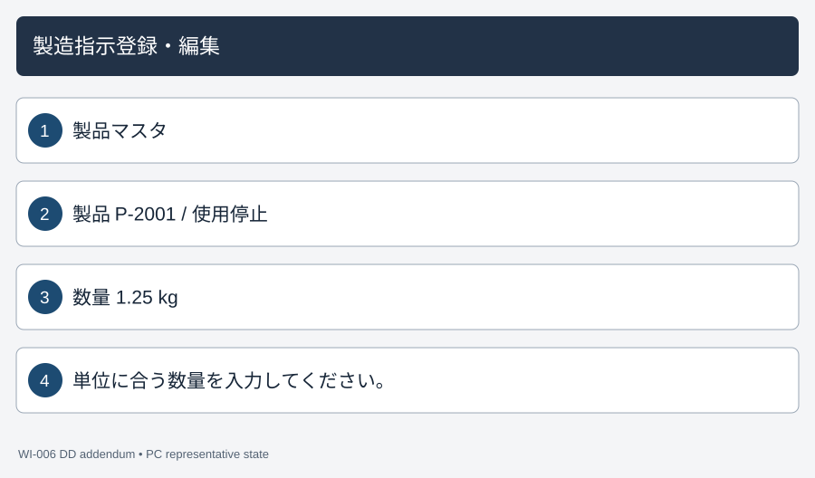
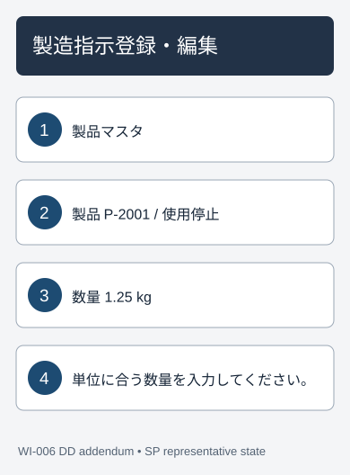
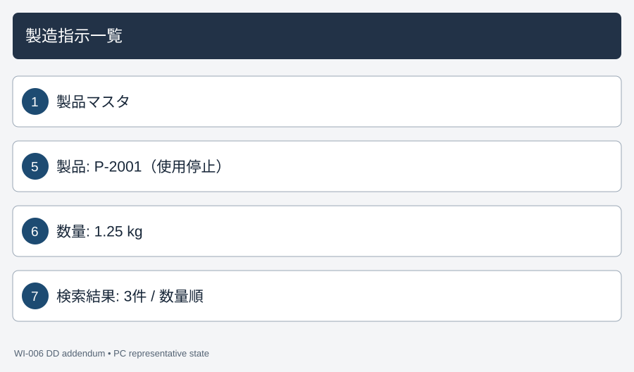
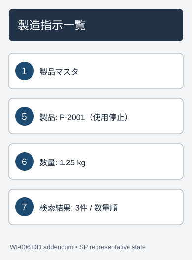
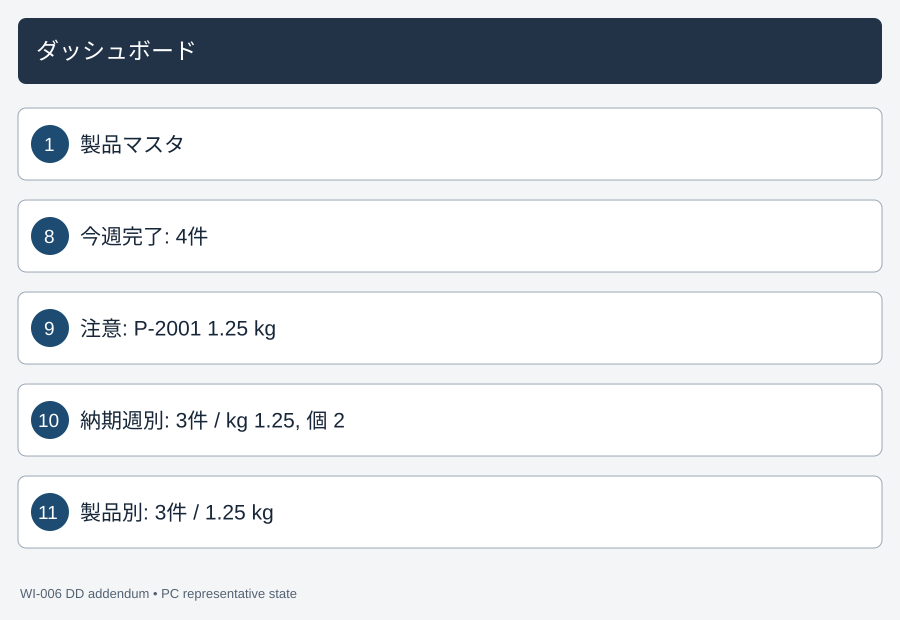
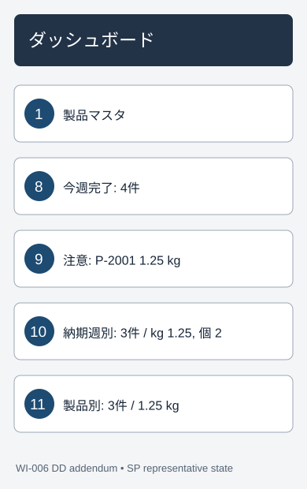
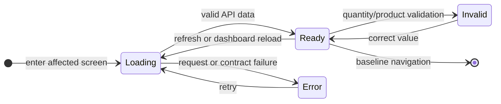

# Product master impact on existing screens — Detailed Design Addendum (詳細設計追補)

`004_DD-EXISTING-SCREENS` defines the WI-006 client changes to SCR-001, SCR-002 and SCR-003. It extends the approved [001_DD](../001/001_DD_製造指示登録・編集.md), [002_DD](../002/002_DD_製造指示一覧.md) and [003_DD](../003/003_DD_ダッシュボード.md) without editing them. Their unchanged routes, status transitions, filters, paging, plant-time windows, session behavior and chart modal behavior remain authoritative. Requirements: REQ-052, REQ-056–REQ-060.

## Document control

| Field | Value |
| --- | --- |
| Document ID / work item | 004_DD-EXISTING-SCREENS / WI-006 |
| Version / date | 1 / 2026-09-30 |
| Approved input | [004_BD-EXISTING-SCREENS](../../010_basic-design/004/004_BD-EXISTING-SCREENS_製品マスタ影響.md), [004_DB-EXISTING-SCREENS](../../database/004/004_DB-EXISTING-SCREENS_製品マスタ影響.md), [004_DD-API](004_DD-API_製品マスタ.md), [004_DD-FN](004_DD-FN_製品マスタ.md) |
| Scope | Client presentation, validation, screen state and API binding for the three affected screens; no new endpoint or backend method |

The existing [004_DD-SPD](004_DD-SPD_製品マスタ.md) owns SCR-004 only. This addendum owns the affected-screen processing. Application code and tests have not been changed in this design phase.

## Layout and review mockups

These DD wireframes reuse the numbered regions from the BD addendum. They show representative data, not committed seed values. A local [English-captioned mockup](mockups/004_DD-EXISTING-SCREENS_mockup.html) and [Japanese-captioned mockup](mockups/004_DD-EXISTING-SCREENS_mockup.ja.html) show populated, retired, invalid, empty and count-based dashboard states. The two editions are static review artifacts; they do not claim working client behavior.

| Screen | PC | SP |
| --- | --- | --- |
| SCR-001 |  |  |
| SCR-002 |  |  |
| SCR-003 |  |  |

| No. | Region | Detailed binding |
| --- | --- | --- |
| 1 | Shared navigation | Existing guarded route links plus 「製品マスタ」 (Product master); SP Menu keeps its baseline behavior. |
| 2 | SCR-001 product | Active choices from API-PRD-01; an unchanged historical retired selection is retained and marked 「使用停止」 (Retired). |
| 3 | SCR-001 quantity | Label/help/value use the selected product unit; exact decimal text validation changes with that unit. |
| 4 | SCR-001 error/status | Field-linked quantity/product error and existing summary; draft values remain. |
| 5 | SCR-002 product filter | All products from API-PRD-01, including marked retired options; selected filter remains in URL. |
| 6 | SCR-002 row/card quantity | Order quantity next to `product.unit`, including historical retired rows. |
| 7 | SCR-002 result and sort | Order count stays a count; `quantity` sorting uses numeric stored value, with no mixed-unit total. |
| 8 | SCR-003 delivery tiles | Completed week/month show `orderCount` and period, with no quantity line. |
| 9 | SCR-003 attention rows | Each quantity is paired with its product unit. |
| 10 | SCR-003 workload | Ten order-count bars plus an equivalent accessible table with per-unit subtotals. |
| 11 | SCR-003 top products | Rank by active order count; show each product's `openQuantity` with its own unit. |

PC tables use semantic column headers; SP cards retain explicit field labels. A responsive layout must not create horizontal page scrolling at 320 CSS px or 200% zoom. Callout 1 is shared and illustrated on each screen; 2–11 appear on their owning screen.

## Shared quantity representation and API binding

| Source / destination | Client interpretation | Constraint |
| --- | --- | --- |
| API-PRD-01 `products[].id`, `.sku`, `.name`, `.unit`, `.isActive` | Picker/filter options; seven units exactly `個`, `本`, `枚`, `台`, `セット`, `kg`, `m` | Missing/unknown unit is an invalid response, never default to `個`. |
| API-PO-01/03 create/edit `quantity` | JSON number sent from an exact validated decimal text value | Positive, at most 999999999; `kg`/`m` at most three fractional digits; other units integer. No exponent notation or extra trailing zero such as `1.2340`. |
| API-PO-02 detail and API-PO-01/03 success `unit` | Read-only quantity suffix and selected-product consistency check | Historical retired product remains visible. Product/quantity still lock outside Draft. |
| API-PO-04 list row `product.unit` | Row-specific quantity suffix and retired filter rendering | Missing product/unit makes the page a recoverable load error. |
| API-DSH-01 attention `product.unit`, workload `orderCount`/`unitQuantities`, top-product `product.unit`/`activeOrderCount`/`openQuantity`, completed `orderCount` | Draw count metrics and unit-specific quantities only | Removed mixed-unit `quantity` properties must not be read. Invalid/missing required unit fails the snapshot rather than showing partial metrics. |

The quantity editor keeps the raw text in state. Use a text control with `inputMode=decimal` for `kg`/`m` and `inputMode=numeric` for discrete units, so lexical rules and trailing-zero precision can be checked before JSON serialization; `type=number`, `parseFloat` or binary floating-point arithmetic must not decide validity. The API client needs a lossless decimal-number codec for quantity values and aggregate subtotals; format the decimal digits as text with `ja-JP` grouping, preserving up to three meaningful fractional digits and never rounding to a different 0.001 value. Counts may use integer arithmetic. No client code adds quantities across units.

## SCR-001 — Create and edit processing

| Item or event | State and processing | Visible result / error |
| --- | --- | --- |
| Enter create | Fetch API-PRD-01; no product selected, no unit implied. | Quantity help asks for a product; quantity cannot be saved without product. |
| Enter edit | Fetch order detail and products. Preserve the order's saved product ID even if inactive; cross-check its unit with the detail unit. | Draft: saved retired option remains selected and marked. Non-Draft: existing product and quantity read-only, including the unit. |
| Pick product | Only active new choices selectable. On change, replace the unit/help and revalidate the current raw quantity without discarding it. | New unit is announced politely; a fractional amount becomes invalid when changing to a discrete unit. |
| Validate quantity | Check ASCII decimal syntax without exponent/sign/whitespace after normal field trim; range `(0, 999999999]`; decimal scale ≤3 for `kg`/`m`, scale 0 for discrete. | Error linked to quantity through `aria-describedby`; `aria-invalid` only after interaction or submit. Keep typed text and focus first invalid field after submit. |
| Save Draft with retired saved product | Compare selected ID with the loaded original ID; allow unchanged ID in PUT. | Other valid edits can save. A different inactive ID is unavailable and the server rejects it if forced. |
| POST/PUT succeeds | Use API returned order/unit, clear dirty state, follow the existing create/edit route behavior. | Show baseline success state with quantity and returned unit. |
| `PRODUCT_INACTIVE` 400 | Map `errors.productId`; refresh options if needed, keep draft and stop automatic retry. | Explain that an active product must be selected; focus product error. If the original retired ID was unchanged, treat this unexpected response as a recoverable conflict and reload order detail before retry. |
| `QUANTITY_UNIT_INVALID` or `VALIDATION` 400 | Map `errors.quantity`; keep raw text and current product. | Announce the rule for that unit and focus the quantity error. |
| Products/order load fails, or unit mismatch/missing | Do not substitute another product or unit; use existing retry state. | No editable form with fabricated values. |

The baseline order status, due-date validation, unsaved-change guard, 401/403 handling and success navigation remain. Server validation and FN-031's product-row lock are authoritative for a retirement race. A timed-out write has an uncertain outcome; the client does not replay it automatically and reads the order before another user-initiated attempt.

## SCR-002 — List processing

| Event / state | Processing | Visible result |
| --- | --- | --- |
| Load filters | API-PRD-01 populates the product filter with active and retired products; append visible 「使用停止」 (Retired) text to inactive options. | A historical retired product remains selectable by ID, including when restored from the URL. |
| Load rows | API-PO-04 returns product summary and numeric quantity. Pair each row's quantity with that row's `product.unit`; preserve baseline pagination/filter/search behavior. | PC quantity cell and SP card line show e.g. `1.25 kg`; no page-level quantity sum. |
| Sort by quantity | Send the existing quantity sort key and direction; render server numeric order unchanged. | The sort indicator represents numeric value; the distinct unit on each row remains visible. |
| Empty/loading/error | Keep baseline states. A required unit/product absent from a row fails the page response validation. | Error offers Retry; no fake `個` suffix or partly valid rows. |

The list remains navigable to the same SCR-001 order. It does not hide old orders when their product is retired. The list result summary stays an order count, 「件」 (orders).

## SCR-003 — Dashboard processing

| Widget | API-DSH-01 mapping | Presentation and empty state |
| --- | --- | --- |
| Status and attention counts | Existing count fields | Keep 「件」 (orders). Attention row `quantity` is shown with `product.unit`. |
| Open workload D-03 | Exactly ten `workload[]` buckets: `orderCount` drives bar height, label and tooltip. `unitQuantities[]` has at most one quantity per allowed unit. | Title 「納期週別の未完了製造指示件数」 (Open order count by due week). Accessible table has week, order count and separate unit/quantity entries; no combined quantity column. Empty bucket has zero count and no unit entries. |
| Top products D-04 | `activeOrderCount` desc, SKU asc from server; `openQuantity` and `product.unit` are secondary data. | Title 「未完了製造指示の多い製品」 (Products with most open orders). No product with zero active orders. Empty state has no fabricated quantity. |
| Completed week/month D-05/D-06 | `orderCount` and `from` only | `0件` for none; remove the former mixed-unit quantity line. |
| On-time rate, completion trend, lead time D-07–D-09 | Baseline fields | Preserve percentages, twelve count buckets and elapsed-day meaning. |

One successful API response is one dashboard snapshot. Validate required keys, allowed units, unique unit per bucket, ten workload buckets and the existing twelve trend buckets before replacing the displayed snapshot. On network/server/contract failure, use the baseline error/Retry state and do not retain stale counts as current. Chart and maximized view share the same count dataset and equivalent table. A `unitQuantities: []` bucket has no unit subtotal; no zero-unit rows are invented. Unit entries follow the seven-value approved order, and measured subtotals are displayed to at most three fractional digits without rounding away a meaningful digit.

## State transitions and accessibility

The state diagram shows the new branch points. Existing navigation, loading retry and status transitions are inherited from the approved baselines; state-preserving edits are listed in the table.

| From | Event | To | Effect |
| --- | --- | --- | --- |
| Entry or Error | First load or Retry | Loading | Request screen's existing API plus required unit fields. |
| Loading | Complete valid response | Ready | Show one coherent form/list/dashboard snapshot. |
| Loading | Request/contract failure | Error | Show recoverable status, no invented unit or stale dashboard data. |
| Ready | SCR-001 invalid input or rejected save | Invalid | Keep draft and attach field error. |
| Invalid | Correct field/product | Ready | Revalidate against selected unit; remove resolved error. |
| Ready | Refresh/filter/sort/reload | Loading | Replace only with latest valid response; abort/ignore superseded reads. |
| Ready | Existing successful navigation | Exit | Follow baseline route and dirty guard. |

All new unit text is visible and associated with the relevant quantity. A product change announces the selected unit and rule through a polite status, without announcing each keystroke. Retired state is conveyed by text, not color. PC tables have `<th scope>` headers; SP cards repeat field labels. The workload chart has a text title and an equivalent semantic table available on PC, SP and maximized view. Keyboard order, visible focus, Japanese labels, linked errors and 200% zoom must meet WCAG 2.2 AA. Chart colors cannot be the only encoding of counts or units.

## Error, authorization and verification handoff

The existing same-origin cookie and server-side `Admin`/`Operator` access checks still apply. New validation is a client aid only; API-PO-01/03 enforces eligibility and unit-specific quantity, and API-DSH-01 is read-only. Do not log order notes, product names, raw quantity text or session cookies. Existing client error reporting and backend OpenTelemetry behavior remain; [004_DD-FN](004_DD-FN_製品マスタ.md) defines the added validation and aggregation spans/metrics. There is no new endpoint or job in this addendum.

| Review/test viewpoint | Requirement | Expected result |
| --- | --- | --- |
| Create `kg`/`m` with `1.234`, reject `1.2340`, exponent, zero and over-limit | REQ-058 | Exact lexical and server rules agree; raw input remains after error. |
| Switch `1.25 kg` to a discrete-unit product | REQ-058–059 | Quantity becomes invalid without being cleared; new unit/rule is announced. |
| Edit old Draft retaining retired product; attempt new retired choice; non-Draft lock | REQ-052, REQ-056 | Only unchanged retired reference may save; historical value stays readable. |
| Filter/sort historical rows with different units on PC/SP | REQ-056, REQ-059 | Retired filter is available; each quantity has its unit; no mixed total. |
| Dashboard mixed-unit and zero buckets, top-product tie, completed-zero tiles | REQ-060 | Count bars/tiles/rank and separate unit subtotals match one snapshot. |
| Missing unit, API failure, 401/403, keyboard/zoom/modal | REQ-055–060 | Recoverable error or baseline auth path; no fabricated value; accessible focus/table. |

Test case IDs and execution evidence will be added to the WI-006 [test plan](../../../../work-items/WI-006/test-plan.md) after this final design file is reviewed, as required by approved plan revision 3. Design-consistency remains in progress until then. Unresolved business decisions: none; DEC-003, DEC-007–DEC-011 govern this addendum.
