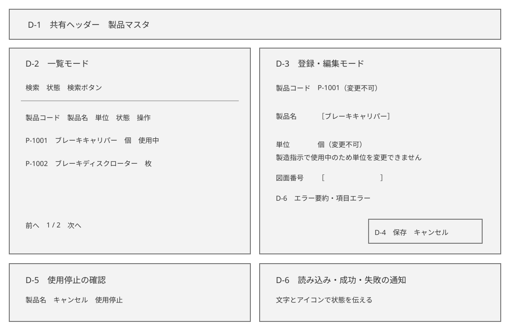
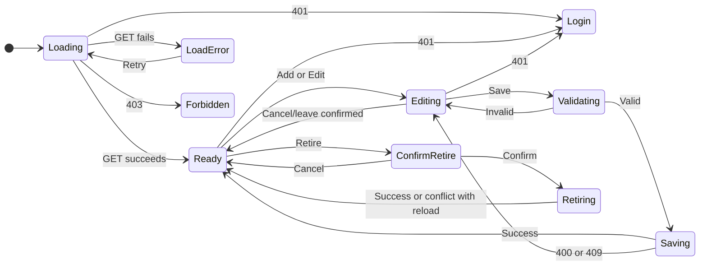

# ProductionManagementAI — Product master — Detailed Design Document (詳細設計書)

`004_DD` specifies SCR-004 under approved WI-006 plan revision 3. It implements [004_BD](../../010_basic-design/004/004_BD_製品マスタ.md) version 2, [004_DB](../../database/004/004_DB_製品マスタ.md) version 2, and [WI-006 brief](../../../../work-items/WI-006/brief.md) REQ-049–REQ-055 and REQ-057. The new [BD](../../010_basic-design/004/004_BD-EXISTING-SCREENS_製品マスタ影響.md) and [DB](../../database/004/004_DB-EXISTING-SCREENS_製品マスタ影響.md) addenda specify effects on SCR-001–SCR-003; their detailed screen behavior belongs to the later WI-006 DD addendum. No application code has changed in this design phase.

## Document control (改版履歴)

| Field | Value |
| --- | --- |
| Document ID / version | 004_DD / 2, review |
| Screen / work item | SCR-004 「製品マスタ」 (Product master) / WI-006 |
| Created / updated | Codex, 2026-09-29 |
| Source | WI-006 brief and DEC-001–DEC-011; 004_BD v2, 004_DB v2 and their approved impact addenda |

## Reference documents and companions

| No. | Document | Purpose |
| --- | --- | --- |
| 1 | [004_BD](../../010_basic-design/004/004_BD_製品マスタ.md) | Navigation, actions, visible states |
| 2 | [004_DB](../../database/004/004_DB_製品マスタ.md) | Schema and migration |
| 3 | [004_DD-API](004_DD-API_製品マスタ.md) | Endpoints, request/response and errors |
| 4 | [004_DD-FN](004_DD-FN_製品マスタ.md) | Application services and telemetry |
| 5 | [004_DD-SPD](004_DD-SPD_製品マスタ.md) | Client request and interaction sequences |

The companion files above are existing drafts awaiting their individual review turns. This main DD owns screen fields, states and client modules; it does not approve those drafts. The edit form needs an authoritative indication that an order references the product so it can lock the unit. The exact API property and conflict response are specified when 004_DD-API is reviewed. A published mockup Artifact service is unavailable; the local static HTML previews below are the reviewable visual artifacts.

## Component and file organization

| Path / module | Planned purpose |
| --- | --- |
| `src/frontend/src/features/products/` | Product master pages, form, API client, validation and state components |
| `src/frontend/src/features/production-orders/` | Existing order-screen effects are specified in the later WI-006 DD addendum |
| `src/frontend/src/features/production-orders/messages.ts` | Japanese labels/messages for SCR-004 and any new SCR-001 state |
| `src/backend/ProductionManagementAI.{Domain,Application,Infrastructure,Api}/` | Product entity, service/repository, EF migration, controller |

The shared header and protected route are reused. Responsive components serve PC/SP; no new component kit. The existing unsaved-change guard pattern is reused for create/edit. Backend processing is owned by 004_DD-FN; API fields by 004_DD-API.

## Screen layout and mockup

The local [English-captioned HTML mockup](mockups/004_DD_screen-product-master-mockup.html) and [Japanese-captioned edition](mockups/004_DD_screen-product-master-mockup.ja.html) show populated/empty list, create, referenced-product edit, validation, retirement confirmation, success, forbidden and phone-card states. They are static previews. The [approved BD phone wireframe](../../010_basic-design/004/wireframes/004_BD_SCR-004-sp.svg) remains the SP layout authority; this DD changes behavior inside the same regions.

| Region | Items and behavior |
| --- | --- |
| D-1 | Shared header/nav, same as 004_BD item 1. |
| D-2 | List mode: search/filter, result table/cards, paging, loading/empty/error. |
| D-3 | Form mode: SKU, name, unit and drawing number with labels/errors; SKU always read-only in edit. If referenced by any order, unit is displayed as noneditable text with an explanatory notice. |
| D-4 | Save/Cancel; unsaved-change guard on navigation. |
| D-5 | Retire confirmation on list, named by product and focus-contained. |
| D-6 | Error summary and polite success status. |

## Field definitions and validation

| Field | Create | Edit | Client rule | Server rule / result |
| --- | --- | --- | --- | --- |
| SKU | Required editable | Read-only, sent unchanged | Trim ends; 1–50 characters | Required; `lower(sku)` unique; a changed value on PUT is rejected. |
| Name | Required editable | Editable | Trim ends; 1–200 characters | Required and nonblank; Unicode text retained. |
| Unit | Required selection | Selection only while no order references product | One of `個`, `本`, `枚`, `台`, `セット`, `kg`, `m`. Referenced product shows the current unit as noneditable text with Japanese reason; preserve it in edit state. | Reject unknown/empty unit and a changed unit after any order reference (REQ-057, 004_DB). |
| Drawing number | Optional | Editable | Trim ends; max 100 characters; blank becomes null | Same length and normalization. |
| Version | Not shown | Hidden application state | Loaded with record; must travel with edit/retire | Compare against `xmin`; stale version returns a conflict. |

An authoritative reference-lock indication is loaded with edit detail; the UI never infers it from retirement state or cached order counts. A retired product with no orders may still change unit; a referenced product may still change name and drawing number. A new order may reference the product after the form loads, so the server rechecks inside the edit transaction and rejects a changed unit. The client retains the draft and offers a reload. Retirement does not unlock the unit.

Validation is shown after blur or attempted submit, not on initial render or each keystroke. Required fields have visible labels; error text is linked to the control with `aria-describedby`, synchronized with `aria-invalid`, announced and summarized at submit. Invalid submit retains values and focuses the summary or first invalid field. Save remains available before validation and is disabled only while a valid request is in flight. Server validation is authoritative. Use semantic `<form>`, `<label>`, `<select>`, named controls and submit buttons; display a locked unit as read-only text with a reason rather than a disabled selector whose value could be omitted. Mobile controls keep comfortable touch targets. This follows the `modern-web-guidance` forms, required-field-feedback and accessible-error-announcement guides retrieved 2026-09-29.

## Loading, empty, error and success states

| State | Trigger | Visible result |
| --- | --- | --- |
| Loading | List/detail GET pending | Heading and loading status; dependent controls wait. |
| Empty catalog | Successful unfiltered list with total 0 | Explain no products exist; Add stays available. |
| No match / page beyond end | Successful filtered or out-of-range page with no rows | Distinguish from empty catalog; offer Clear or valid page navigation. |
| Ready | Successful list/detail | Rows/cards, count, status text and actions. |
| Locked edit | Detail reports an order reference | Noneditable unit with reason; name/drawing number editable. |
| Fetch failure | GET network/server error | Error and 「再試行」 (Retry); do not present stale data as current. |
| Validation/duplicate | Invalid input or server field conflict | Retain draft; inline errors and summary; enable correction. |
| Stale write / newly locked unit | Version or reference conflict | Explain change and offer reload; no silent retry. |
| Save success | Create/edit succeeds | Return to saved list URL and announce success politely. |
| Retire success | Confirmation succeeds | Stay on list; show row retired and announce success politely. |
| Unauthorized | 401 or 403 | Redirect to `/login` on 401; forbidden state on 403. |

If a saved product is excluded by preserved filters, the list shows a success notice and a Clear option without claiming the row is visible. If the return page is now beyond the last page, navigate to the last valid page while retaining filters.

## Screen state machine

| From → to | Trigger | Screen behavior |
| --- | --- | --- |
| Loading → Ready / LoadError / Forbidden / Login | List/detail request | Render data, retry, permission message, or redirect, respectively. |
| Ready → Editing | Add/Edit | Navigate to form mode; preserve list return URL. |
| Editing → Validating → Editing | Invalid submission | Keep input, show error summary, focus first invalid field. |
| Editing → Saving → Ready | Valid save | Prevent duplicate submit, then return to list with success notice. |
| Saving → Editing | Field/stale/unit-lock conflict | Map field errors or show a changed-record notice and reload option. |
| Ready → ConfirmRetire → Retiring → Ready | Retire and confirm | Focus into dialog; on success update list; on conflict reload current row, no silent retry. |
| Editing → Ready | Cancel or confirmed navigation | Discard draft only after unsaved-change confirmation. |

Filter/page changes and input edits keep the same route-level state and are specified in 004_DD-SPD. The diagram shows distinct route-level and mutation states; transitions that remain in the same state are table-only. Retire Cancel and Escape restore focus to the invoking button; a successful retirement moves focus to the status or updated row. The dialog names the product and contains focus while open.

## Screen-owned modules

| Module | Responsibility | Dependencies |
| --- | --- | --- |
| `ProductMasterPage` | Parse URL filters, request/manage list, render table/cards and states | Product API client, shared header |
| `ProductFormPage` | Create/edit route, field values/errors, submit and dirty guard | Product API client, message catalog |
| `RetireProductDialog` | Confirm active product retirement, focus/escape behavior | Product API client, accessible dialog pattern |
| `ProductStateLabel` | Render active/retired text plus non-color cue | Japanese catalog |
| Existing order picker/filter | Affected-screen behavior is specified in the later WI-006 DD addendum | Extended `GET /api/products` rows |

## Accessibility, security and observability

- WCAG 2.2 AA: logical heading/focus order, visible focus, keyboard actions, text status alongside color, Japanese error summary and field messages, dialog focus containment/return, PC/SP layouts and 200% zoom. Verify with automated axe and manual keyboard/zoom review. A newly discovered unit-lock conflict is announced with a reload choice.
- API role checks remain authoritative. The UI does not infer authorization from hidden buttons. Product fields are business reference data, with no expected PII or secrets. Same-origin cookie and JSON-only mutation posture is documented in 004_DD-API.
- No SKU/name/drawing number or full request body is logged or used as a telemetry label. Outcome counts and error details are in 004_DD-FN.

## API and persistence mapping

| Screen action | API operation | Persistence / concurrency | Contract owner |
| --- | --- | --- | --- |
| Search and page | `GET /api/product-master` | Bounded read of `products`; no write | 004_DD-API API-PM-01 |
| Load edit form | `GET /api/product-master/{id}` | Read product, version and authoritative order-reference lock indication | 004_DD-API API-PM-02 |
| Create | `POST /api/product-master` | Insert active product; DB SKU uniqueness and allowed-unit constraints are final authority | 004_DD-API API-PM-03; 004_DD-FN FN-028 |
| Edit | `PUT /api/product-master/{id}` | Versioned product update; product-row lock and order-reference check in one transaction | 004_DD-API API-PM-04; 004_DD-FN FN-029 |
| Retire | `POST /api/product-master/{id}/retire` | Versioned `is_active=false`; no delete or automatic reactivation | 004_DD-API API-PM-05; 004_DD-FN FN-030 |

The later API companion owns exact JSON names, Problem Details error codes and request timeouts; the FN companion owns SQL/EF lock sequence and OpenTelemetry span/metric names. Both must agree with the approved 004_DB transaction rule before dependent code. Do not transmit or log product names, SKUs, drawing numbers, full bodies, cookies or version tokens in telemetry labels. Same-origin cookie authentication and JSON-only mutations follow the existing security posture.

## Test viewpoints

See [WI-006 test plan](../../../../work-items/WI-006/test-plan.md) for TC-303–TC-307, TC-310–TC-312 and TC-314: catalog list/search, create validation and duplicates, edit/stale version, retirement, role denial, seed migration, responsive and accessibility behavior. REQ-057 and affected-screen requirements need additional scenarios when the test plan is updated after the last design review. No application test has run. The precise reference-lock DTO field and conflict mapping are an outstanding *technical contract* for 004_DD-API, not an unresolved business decision.
