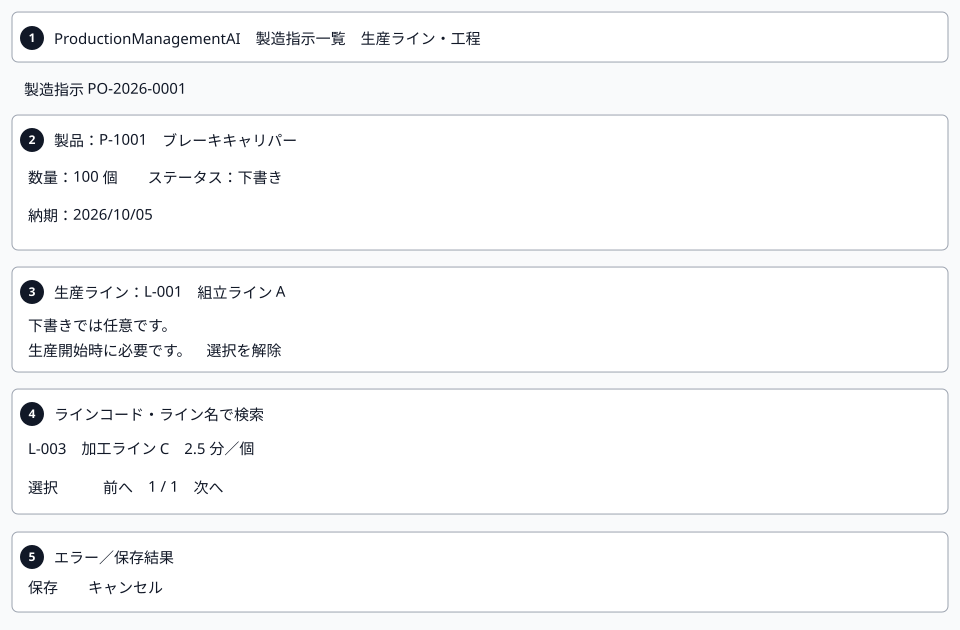
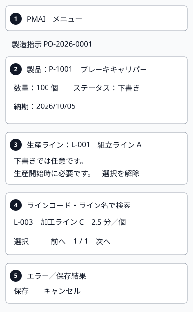
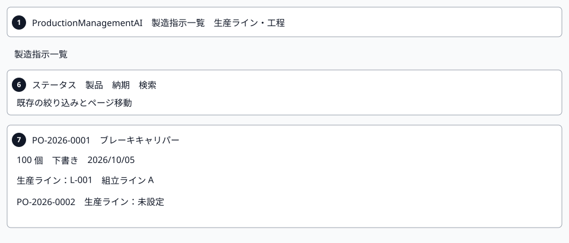
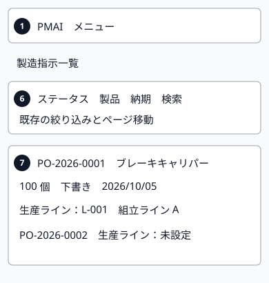
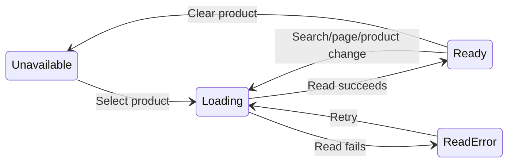

# Production-line assignment — Order impact design

005_DD-ORD version 1 is the WI-009-owned addendum for SCR-001 (order create/edit) and SCR-002 (order list), implementing FN-036 and REQ-068/069 with history rules from REQ-067. Approved plan revision 1 step 10. It extends the existing screens; it introduces no new route or independent DD family.

## 1. Document control and authoritative inputs

| Field | Value |
| --- | --- |
| Document ID / version | 005_DD-ORD / 1 |
| System / subsystem | ProductionManagementAI / Production orders |
| Work item / author | WI-009 / Agent |
| Created / updated | 2026-10-01 / 2026-10-01 |
| Review state | Submitted for review; design only, not implemented |

| Version | Date | Author | Change |
| --- | --- | --- | --- |
| 1 | 2026-10-01 | Agent | Initial order picker/history/list impact and visuals |

Inputs: [005_BD](../../010_basic-design/005/005_BD_生産ライン・工程.md), [005_DB](../../database/005/005_DB_生産ライン・工程.md), [main DD](005_DD_生産ライン・工程.md), [API version 2](005_DD-API_生産ライン・工程.md), [FN version 1](005_DD-FN_生産ライン・工程.md), [SPD version 1](005_DD-SPD_生産ライン・工程.md), [requirements](../../000_requirements/005/005_REQ_production-lines.md), [decisions](../../../../work-items/WI-009/decisions.md) and [plan](../../../../work-items/WI-009/plan.md).

Read-only baselines: [001_DD](../001/001_DD_製造指示登録・編集.md), [002_DD](../002/002_DD_製造指示一覧.md) and [WI-006 impact addendum](../004/004_DD-EXISTING-SCREENS_製品マスタ影響.md). Original quantity, product retirement, status, due-date, notes, numeric order version, navigation and save-success behavior remain authoritative. Only line-related additions are owned here. Endpoint contracts remain in 005_DD-API section 6; backend validation/locks remain in 005_DD-FN section 6. All four 005 DD family members already exist; this addendum does not duplicate them or rewrite completed designs.

## 2. Screen layout and static review artifacts

Mockup artifact: [English gallery](mockups/005_DD-ORD_order-assignment.html) and [Japanese edition](mockups/005_DD-ORD_order-assignment.ja.html). Native design/Artifact publishing remains unavailable; local HTML follows the approved design workflow fallback. The gallery has illustrative static states, Japanese UI and translated captions; it calls no APIs and records no runtime evidence. Reuse gray/white surfaces, gray-900 primary actions, Japanese fonts and responsive composition from ProductionOrderForm/Table.

| Region | Screen / binding |
| --- | --- |
| 1 | Both: existing guarded header; dedicated Factory navigation to SCR-005 |
| 2 | SCR-001: existing product/quantity/status inputs and unchanged field locks |
| 3 | SCR-001: lineId/current-selection summary; Draft Clear, non-Draft read-only |
| 4 | SCR-001: eligible q/page search/results, loading/empty/error; no historical options |
| 5 | SCR-001: line field error/summary; existing Save/Cancel and success notice |
| 6 | SCR-002: unchanged filters/URL/sort/paging; no new line filter or sort |
| 7 | SCR-002: non-sortable line column/card detail with current master or real null |

Numbers are local to this addendum and do not renumber baseline items. At <640px form/picker controls stack and the list uses cards; >=640px uses the existing table. The line column has a plain scoped header, no sort button. Long names wrap; any desktop table horizontal scrolling stays inside the existing table container.

## 3. Field and assignment rules

Existing order routes and the eligible-line API both require Admin or Operator through the existing ProductionOrderEditor policy. UI controls and direct routes enforce the same access; the server repeats authorization. No new role or broader read entitlement. An order sends only lineId for this addition, not line version, timing, unit confirmation or scheduling data.

| Item | Local value / validation |
| --- | --- |
| lineId | UUID string or null; create default null. Include in dirty comparison. Lock based on origin saved status, not selected target status. Draft changing to InProgress may still select before Save. |
| Current line | Separate summary {id,code,name,isActive} from order response, or newly selected candidate. null displays unassigned. Retired master is visibly marked; saved selection need not appear on any candidate page. |
| Candidate search / paging | q trimmed <=100 code points; page 1–10000, fixed 50; Search/Clear reset page 1. Product change resets q/page and cancels obsolete reads. No picker state in order-list URL or persisted draft storage. |
| Timing hints | Show candidate minutesPerUnit as exact decimal text and visible product unit. It is a current configuration hint, not order history, reserved capacity, total or automatic duration. No new cross-unit sum. |

| Origin / requested action | Allowed result / server check |
| --- | --- |
| Create Draft, absent/null line | Save with no assignment. Non-null selection must be eligible for product. |
| Draft unrelated edit with unchanged product/line | Retain exact historical selection even if line/pair retired or confirmation stale; no new eligibility check unless starting. |
| Draft change line or product | New non-null exact pair must be eligible. Client always clears line on product change, including change back; no automatic substitute/restore. Explicit null clears with no line/pair check. |
| Draft → InProgress | Require non-null and recheck active product/line/pair plus unit revision under FN locks, including unchanged/omitted historical assignment. |
| Origin InProgress/Completed/Cancelled | lineId read-only; unchanged value/null or omission accepted during otherwise allowed edits. Changed assignment rejected LINE_LOCKED. Old non-Draft null stays null; no backfill requirement. |

Order detail/list line fields cannot reveal pair retirement or confirmation revision. Do not label a saved line as fully eligible merely because isActive is true, and do not infer ineligibility from absence on a filtered/paged choice response. Starting always uses the server check.

## 4. Order picker state transitions

| From | Event | To | Effect |
| --- | --- | --- | --- |
| Unavailable | Draft selects active product | Loading | Read API-PL-07; product change clears line first |
| Loading | Current read succeeds | Ready | Render page/empty; preserve selection separately |
| Loading | Current read fails | ReadError | No invented choices; show retry |
| ReadError | Explicit retry | Loading | New read; no order write |
| Ready | Apply search/page or active product change | Loading | Cancel old read; product change clears line |
| Ready | Clear product | Unavailable | Clear line and candidates; no request |
| Any picker state | Origin non-Draft, product cleared or inactive | Unavailable | Cancel read; retain original line on non-Draft; hide selectable panel |
| Ready | Select candidate / clear line | Ready | Local line draft only; dirty; never write order on selection |

Six distinct-state chart edges match the first six rows; any-state and same-state cases are table-only. Unavailable means the selection panel is disabled/hidden, not that a historical line disappears. Picker state is orthogonal to the existing order form save/error state.

## 5. Client processing sequences

### 5.1 ProductionOrderPage / ProductionOrderForm / OrderLinePicker

Proposed metadata: Agent / created and modified 2026-10-01. Used services: existing getOrder/listProducts/createOrder/updateOrder, API-PL-07 eligible adapter, Japanese catalog and navigation guard. OrderLinePicker is a feature-local React composition, not a new framework.

| Step | Processing / branches | Call / result |
| --- | --- | --- |
| 1 | Load existing product/order baseline; decode required nullable line. Create initializes null. Existing 401/403/404 views remain; no editable fabricated baseline. | Existing page reads → initial form |
| 2 | Determine assignment lock from origin status. Non-Draft displays named line/null read-only with lock hint; Draft active product loads candidates. Retired product retains history but exposes no new line choices. | API-PL-07 or read-only view |
| 3 | Apply q/page with encoded productId, cancel superseded reads and guard response by product/request generation. A late result cannot restore a cleared/changed line. Search/page alone do not mark order dirty. | Eligible adapter → picker state |
| 4 | Select only a current-product candidate; show current selection independently of visible page. Keep baseline historical selection until explicit change; replacement/clear cannot reselect retired history as a new choice. Product change clears line. | Local lineId/summary → dirty draft |
| 5 | On Save preserve existing validation and status options. If requested Draft→InProgress has null, field error/focus, no mutation. Do not require candidate membership for unchanged historical Draft saves. | Form validation including lineId |
| 6 | New client sends explicit lineId UUID/null and existing order version/quantity fields. Keep exact order quantity number-token serializer; new line decimal-string contract must not replace it. Single save; no repeated pending mutation. | Existing POST/PUT order → committed response or error |
| 7 | Success keeps existing create→edit route and update-in-place behavior; response becomes authoritative baseline, including line. Notify with existing success catalog. No master mutation or second order save. | Existing onCreated / update baseline |
| 8 | On LINE_REQUIRED/INELIGIBLE/LOCKED retain draft and map errors.lineId to new field and summary. Offer explicit candidate refresh for Draft; refresh never clears/substitutes selected value. Retry requires explicit Save after correction. | Catalog + optional API-PL-07 read |
| 9 | Order-version conflict uses existing MSG-E009 with guarded reload; no merge/overwrite. Ambiguous write retains draft and disables another mutation until explicit order read reconciliation. Edit verifies id; lost create without known id cannot be auto-replayed or proven by similar fields; retain warning and use existing list for manual verification. | Existing order get/list; no automatic replay |
| 10 | Dirty guard includes line changes and covers Cancel/navbar/browser exits; pending save suppresses repeated submit/navigation. Existing discard dialog uses viewport centering and safe focus obligations. No localStorage/URL draft persistence. | Existing guard / discard dialog |

### 5.2 ProductionOrderListPage / ProductionOrderTable

Proposed metadata: Agent / 2026-10-01. Used services: existing listOrders and formatters/catalog. Add the same nullable line projection to each row and mobile card; retain the original list state machine and API filters.

| Step | Processing / branches | Result |
| --- | --- | --- |
| 1 | Load using existing URL filters/sort/page/pageSize and cancellation; no lineId query parameter. | Unchanged loading/error/empty states |
| 2 | Render line code/name and retired marker only from response isActive. Real null displays unassigned; missing required property/integrity failure is not invented null. | Non-sortable line table cell / card detail |
| 3 | Keep order-number link/row navigation, quantity with unit, counts and keyboard sort unchanged. No per-row API-PL read, mixed-unit total or dashboard change. | Existing edit route / list controls |

## 6. Error messages, accessibility and persistence boundary

New UI strings below are catalog proposals; existing headings/status/save/messages must match messages.ts. Only client text is translated; machine error codes and API types remain those of approved API/FN.

| Binding | Japanese UI | English gloss |
| --- | --- | --- |
| Field / null | 生産ライン / 未設定 | Production line / unassigned |
| Picker search / choose / clear | ラインコード・ライン名 / 選択 / 選択を解除 | Line code/name / select / clear selection |
| Optional Draft help | 下書きでは任意です。生産開始時に必要です。 | Optional in Draft; required to start production |
| Locked help | 下書き以外の製造指示では、生産ラインを変更できません。 | Line cannot change outside Draft |
| History / retired | 使用停止 / 現在の割当は履歴として保持されています。 | Retired / current assignment retained as history |
| Empty eligible page | 選択できる生産ラインはありません。 | No selectable production lines |
| LINE_REQUIRED | 生産を開始するには、生産ラインを選択してください。 | Select a line to start production |
| LINE_INELIGIBLE | この製品を生産できる有効なラインを選択してください。 | Select a valid line for this product |
| LINE_LOCKED | 下書き以外の製造指示では、生産ラインを変更できません。 | Cannot change a line outside Draft |
| Unknown write / verify | 保存結果を確認できません。再送信せず、現在の状態を確認してください。 / 現在の状態を確認 | Unknown save outcome; verify without replay / verify current state |

400 line errors join existing field handling without replacing existing quantity/status/product codes; 409 remains the original numeric order-version conflict. Choice 404/error does not mark the order missing. 401 uses existing session expiry; 403 stops protected rendering/writes. Read retries are explicit. Server-confirmed LINE_BUSY rollback, when returned by FN integration, may be retried explicitly after Retry-After; generic timeout/500/lost or malformed write response is not rollback proof.

Accessibility: labeled line region with persistent optional/required/locked help; field error links and aria-describedby/invalid; candidate buttons named by code/name; polite loading/results and error alerts; scoped table header, descriptive mobile line text, non-color retired marker, visible focus and >=48px picker controls. Refresh/search focus result heading without disturbing a typed draft; selection returns to current-selection heading. Existing native discard dialog remains centered after scroll, keyboard contained, safe action first, Escape cancels and focus returns. Verify at 320px/200% zoom and keyboard later; static previews do not prove conformance.

Persistence remains the approved nullable production_orders.line_id and product/line composite reference. Detail/list project current master names with no N+1 reads; legacy null stays real null. Save/start eligibility uses the existing order transaction and product→line→pair SHARE locks through commit; original order xmin predicate prevents status-read races. No independent pair timing snapshot, unit conversion, capacity reservation or historical recomputation. Migration/write-pause/rollback limits belong to 005_DB; no SQL is executed here. Instrumentation adds the FN-owned ProductionLine.ValidateOrder child span inside existing order traces; eligible reads use ProductionLine.Eligible and approved bounded metrics. No raw ids/query/names/coefficients/versions/cookies/body diagnostics or new dependency.

## 7. Compatibility and verification viewpoints

| Case | Expected result / later test |
| --- | --- |
| Old client missing lineId | Create Draft null; update preserves exact saved assignment. Draft start without valid non-null assignment fails, including existing Draft; coordinate rollout per DB. |
| Explicit null vs omission | Draft clear only for explicit null; non-Draft changed non-null→null fails; legacy null→null allowed. |
| Retired/stale pair and historical line | Unchanged history saves; new/changed selection and start reject; line isActive alone is insufficient. |
| Product change and late choice response | Clear line immediately; no stale response restore/substitute; server rejects incompatible retained UUID. |
| Unit ABA / retirement / order-version race | Server locks/checks and final xmin make save/start atomic; retain draft on error. |
| Line list presentation | Current names/retired/null displayed identically in table/cards; unchanged list URL/sort/counts/quantity units. |
| Read/error/unknown/accessibility | No fabricated choice/line; no automatic replay; 401/403/404 scopes correct; field focus/keyboard/mobile checked later. |

Open business decisions: none. These are design expectations, not executed application tests. Actual document/visual verification is recorded in [evidence](../../../../work-items/WI-009/evidence.md). Submit this one design package for explicit review. After approval, revision 1 step 11 reconciles the full family/security and prepares the test plan; step 12 presents implementation revision 2 for separate approval. No application code, migration, push, PR, merge or deployment is authorized by this document.
