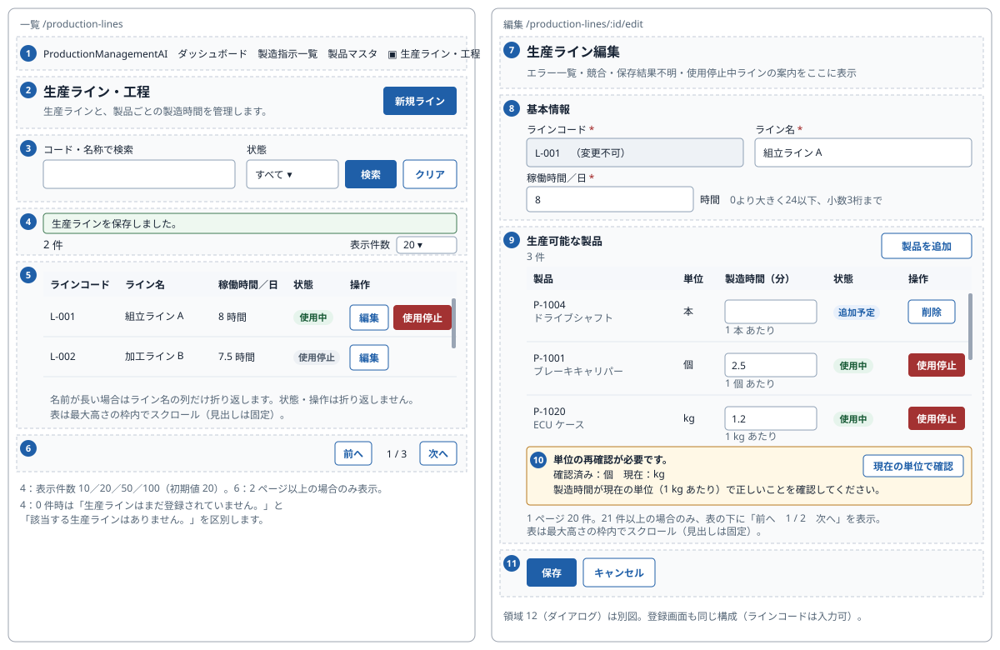
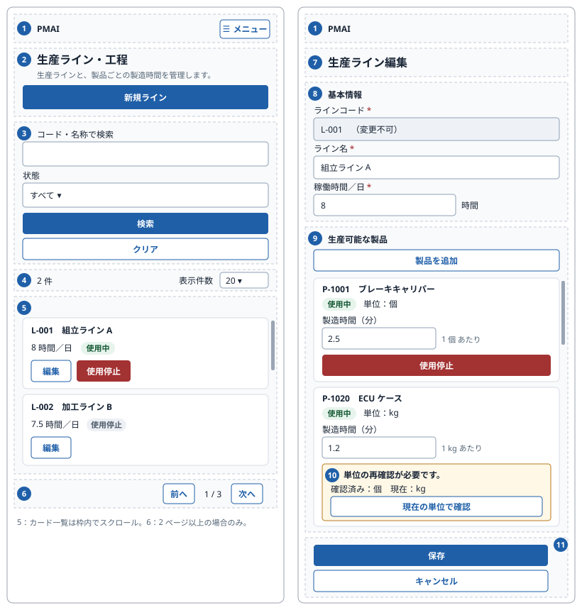
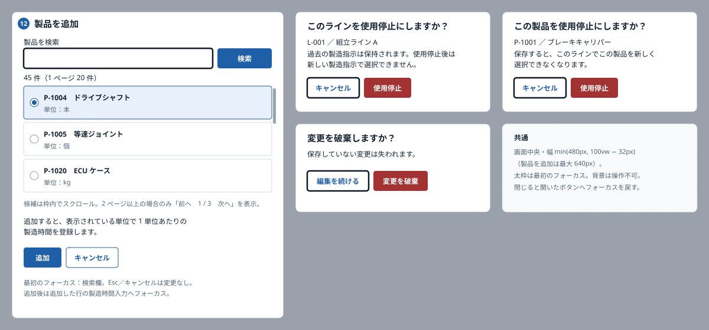

# Production lines — Screen redesign

## 1. Document control and authority

| Field | Value |
| --- | --- |
| ID / version / date | 005_DD-SPD-REDESIGN / 3 / 2026-10-06 |
| Work item / screen | WI-015, BUG-009 / SCR-005 「生産ライン・工程」 (Production lines and processes) |
| Requirements | REQ-082–084; preserves REQ-064–069 and 005_REQ rules 1–8 |
| Review state | Approved by the user on 2026-10-06 (WI-015 DEC-010) |
| Authorized phase | WI-015 plan revision 1: design documents only |

| Version | Date | Change |
| --- | --- | --- |
| 1 | 2026-10-06 | Initial redesign for review |
| 2 | 2026-10-06 | User review: 「表示件数」 10/20/50/100 on the list, as on 製品マスタ, with an optional `pageSize` on API-PL-01 (DEC-006) |
| 3 | 2026-10-06 | User review: 20 per page for the form's product table and the add dialog, with optional page sizes on API-PL-02 and API-PL-06 (DEC-008); every list scrolls inside a fixed-height box (DEC-009) |

This additive document replaces the visual and interaction presentation of SCR-005 in
[005_DD-SPD](005_DD-SPD_生産ライン・工程.md) §2 and §5 and its mockup. The approved WI-009 documents
stay unedited. For everything not restated here they remain binding:
[005_REQ](../../000_requirements/005/005_REQ_production-lines.md),
[005_BD](../../010_basic-design/005/005_BD_生産ライン・工程.md), [005_DD](005_DD_生産ライン・工程.md),
[005_DD-API](005_DD-API_生産ライン・工程.md), [005_DD-FN](005_DD-FN_生産ライン・工程.md) and the processing
steps of 005_DD-SPD §4. Decisions: [WI-015 decisions](../../../../work-items/WI-015/decisions.md) DEC-002 (control
heights), DEC-003 (unit confirmation on add), DEC-004 (approved wording), DEC-006 (rows per page), DEC-008 (20 per page on the form) and DEC-009 (scroll
boxes).

No route, database, permission or business rule changes. The only API changes are optional allow-listed page
sizes on API-PL-01, API-PL-02 and API-PL-06 (§10.1, §10.2). Order assignment (SCR-001/002) is out of scope.

## 2. Users and journeys

The users are Admin and Operator staff who keep master data current. Every default-visible item below serves
one of these five tasks; anything else is shown only when it applies.

| # | Task | Journey |
| --- | --- | --- |
| J1 | Find a line | Navbar → list → search code/name, choose state → 検索 → 編集 |
| J2 | Register a line | 新規ライン → code, name, hours → (optional) 製品を追加 → 保存 → list with notice |
| J3 | Set products and timing | 編集 → 製品を追加 → choose a product in the dialog → enter minutes per one unit → 保存 |
| J4 | Reconfirm after a unit change | 編集 → the marked row explains old/current unit → check the minutes → 現在の単位で確認 → 保存 |
| J5 | Retire | List row 使用停止 → confirm (immediate); or pair 使用停止 → confirm → row shows pending → 保存 |

Simplifications compared with the running screen:
- The candidate-product list moves into a dialog, so the page no longer lists every product inline.
- The unit checkbox on each row is replaced by explicit confirmation when adding, plus a button only on rows
  that need reconfirmation.
- Paging controls appear only when there is more than one page.
- Plain state text becomes badges.

## 3. Screen layout and mockup

Mockup artifacts: [English captions](mockups/005_DD-SPD-REDESIGN_SCR-005.html) and
[Japanese captions](mockups/005_DD-SPD-REDESIGN_SCR-005.ja.html). Each edition has the same 24 artboards
with identical Japanese UI. They are static review aids: no search, navigation or write runs in the gallery.
The external design publisher is not used; local HTML rendered in Chromium is the established fallback.

Visual vocabulary is reused from 製品マスタ (WI-013) so the master screens look alike:

| Token | Value |
| --- | --- |
| Page | White, centred, max width 1024 px, 24 px side padding (16 px below 640 px) |
| Primary button | Filled `#1f5fa8`, white bold text, 40 px high (DEC-002) |
| Secondary button | White, `#1f5fa8` border and text, 42 px high |
| Danger button | Filled `#a33232`, white text, 40 px high; used for 使用停止 actions and confirmations |
| Text input / select | `#8ea0b5` border, 42 px high; read-only fields `#eef2f6` background with 「（変更不可）」 |
| Required marker | Red `*` (`#a12424`) after the label, as on 製品マスタ; optional fields have no marker |
| Badges | 使用中 green (`#e6f4ec` / `#155833`); 使用停止 grey (`#edf0f4` / `#4d5a6a`); 追加予定 blue (`#e8f0fb` / `#1f5fa8`); 使用停止予定 amber (`#fff6dc` / `#7a4d00`) |
| Notices | Success green box, error red box, warning amber box (`#fff8e6`, border `#b7791f`) |
| Table | Header row `#f6f8fb` background, `#e2e8ef` row lines, header/status/actions never wrap |
| Scroll box (DEC-009) | Every list sits in a bordered box with a maximum height and vertical scrolling inside: line list `min(60vh, 640px)`, product table `min(50vh, 560px)`, add-dialog list `min(45vh, 400px)`. Table headers stay visible (sticky). Count, 「表示件数」 and pager stay outside the box. The page itself keeps its normal scroll. No horizontal page scroll |

The page reflows to one column below 640 px:
- Lines and product pairs become cards.
- Filter buttons stack at full width, with 検索 above クリア.
- The menu navbar is used.

Dialogs keep the approved native modal geometry: centred, `min(480px, 100vw − 32px)` wide, safe initial
focus. The add-product dialog is up to 640 px wide.

| Region | Content | Approved BD region |
| --- | --- | --- |
| R1 | Shared header, current marker with the Factory glyph; mobile menu | 1 |
| R2 | Heading, one-line description, primary action (list: 新規ライン) | 2 |
| R3 | Filter: code/name search, state, 検索, クリア | 3 |
| R4 | Status line: notices; count top-left, 「表示件数」 top-right | 5 |
| R5 | Lines table (PC) / cards (SP) with 編集 and 使用停止 | 4 |
| R6 | Pager, bottom-right, only when more than one page | 5 |
| R7 | Form heading, retired-line notice, error summary, conflict/unknown notices | 2, 6 |
| R8 | 基本情報 card: code, name, hours/day | 6 |
| R9 | 生産可能な製品: header with 製品を追加, pair table/cards, pair pager | 7 |
| R10 | Unit reconfirmation inside the affected pair row | 8 |
| R11 | Form actions 保存 / キャンセル, left-aligned | 6 |
| R12 | Dialogs: add product, retire line, retire pair, discard | 7, 9 |

## 4. List mode (`/production-lines`)

Order: R1 → R2 → R3 → R4 → R5 → R6.

- **R2:**
  - Heading 「生産ライン・工程」 and description 「生産ラインと、製品ごとの製造時間を管理します。」 (Manage production lines and the production time per product).
  - 「新規ライン」 (New line) primary button at the right; full width on SP.
- **R3:**
  - 「コード・名称で検索」 (Search by code or name) text field.
  - 「状態」 (State) select with options 「使用中」 (Active, default), 「使用停止」 (Retired) and 「すべて」 (All).
  - 「検索」 (Search) primary and 「クリア」 (Clear) secondary.
  - Behaviour is unchanged (SPD 4.1): input is separate from the applied URL; Search/Clear reset to page 1; Clear restores the defaults.
- **R4:**
  - Count 「{n} 件」 (n items) at the top-left of the results, and 「表示件数」 (Rows per page) select at the top-right with 10, 20 (default), 50 and 100, as on 製品マスタ (DEC-006). Notices sit above this row.
  - Changing it applies immediately and returns to page 1.
  - The value is kept in the URL as `pageSize` and preserved by 検索, クリア, paging, return-after-save and the refresh after a retirement.
  - An invalid or missing `pageSize` in the URL is replaced by 20. A page past the end moves to the last page.
  - The row is hidden while loading, on read error, when there are no lines, and when nothing matches.
- **R5, PC table:**
  - Caption 「生産ライン一覧」 (Production line list).
  - Columns: 「ラインコード」 (Line code), 「ライン名」 (Line name), 「稼働時間／日」 (Working hours/day, shown as 「8 時間」), 「状態」 (State badge), 「操作」 (Actions).
  - Actions: 「編集」 (Edit, secondary); on active lines only, 「使用停止」 (Retire, danger). Accessible names are 「{code}を編集」 and 「{code}を使用停止」.
  - Long names wrap inside their cell; code, hours, state and actions do not wrap.
  - The table sits in a scroll box (DEC-009): with 50 or 100 rows per page the rows scroll inside it under a sticky header, and the pager below stays in view.
- **R5, SP card:**
  - First line: code and name, wrapping anywhere.
  - Second line: 「8 時間／日」 and the state badge.
  - Then the actions.
  - The card list scrolls inside its box in the same way.
- **R6:** 「前へ」 (Previous), 「{page} / {pages}」 and 「次へ」 (Next), at the bottom-right. Hidden when there is only one page for the chosen rows per page.

| State | Display |
| --- | --- |
| Loading | 「読み込み中…」 (Loading) polite status; previous rows are not shown as the new result |
| No lines at all (state すべて/使用中 with no filter, total 0) | Info box 「生産ラインはまだ登録されていません。」 (No lines registered yet) and 「新規ライン」 remains |
| No match (filter applied, total 0) | Info box 「該当する生産ラインはありません。」 (No matching lines) with hint 「検索条件を変更するか、クリアしてください。」 (Change the conditions or clear them) |
| Read error | Error box 「読み込みに失敗しました。」 (Read failed) with 「再試行」 (Retry) |
| Saved (returned from form) | Success box 「生産ラインを保存しました。」 (Line saved) |
| Retired | Success box 「生産ラインを使用停止にしました。」 (Line retired); the list refreshes with the same filters |
| Retire known failure / unknown | Error box with the existing messages (conflict / busy / 「保存結果を確認できません。…」); the list is refreshed by Retry only |
| Forbidden (403 or non-Admin/Operator) | Error box 「この機能を利用する権限がありません。」 (No permission) and 「ダッシュボードへ戻る」 (Back to dashboard); no rows, filters or actions |

## 5. Form mode (`/production-lines/new`, `/production-lines/:id/edit`)

Order: R1 → R7 → R8 → R9 → R11. The heading 「生産ライン登録」 (Register line) or 「生産ライン編集」 (Edit line)
receives programmatic focus on load without a visible focus box. Keyboard focus is still visible on every control.

### 5.1 基本情報 card (R8)

Card title 「基本情報」 (Basic information). Two columns on PC (code | name, then hours | empty); one column on SP.

| Item (Japanese UI, English gloss) | Create | Edit | Hint / rule (unchanged rules) |
| --- | --- | --- | --- |
| 「ラインコード」 (Line code) `*` | Text input | Read-only grey field with 「（変更不可）」 | Create hint 「登録後は変更できません。」 (Cannot be changed after registration). Trim; 1–50 characters; unique ignoring case, including retired lines |
| 「ライン名」 (Line name) `*` | Text input | Text input | Trim; 1–200 characters |
| 「稼働時間／日」 (Working hours/day) `*` | Decimal input with suffix 「時間」 (hours) | Same | Hint 「0より大きく24以下、小数3桁まで」 (Greater than 0 and up to 24, up to 3 decimals) |

A retired line (edit) shows an amber notice in R7: 「このラインは使用停止中です。ライン名と稼働時間は修正できますが、使用中には戻せません。」
(This line is retired; its name and hours can be corrected but it cannot be reactivated). The running screen's
separate 「状態: …」 line is removed.

### 5.2 生産可能な製品 (R9, R10)

Section header 「生産可能な製品」 (Supported products) with a 「製品を追加」 (Add product) secondary button at the right.
On edit the count 「{n} 件」 sits under the header. On create, before anything is added, the section shows
「製品はまだ追加されていません。」 (No products added yet). A line may be saved without products.

PC table columns:
- 「製品」 (Product): SKU on the first line, name below, wrapping.
- 「単位」 (Unit): the current product unit, read-only text.
- 「製造時間（分）」 (Production time, minutes): decimal input, with the hint 「1 {unit} あたり」 (per one {unit}) under it. Accessible name: 「{sku} の製造時間（1 {unit} あたりの分）」.
- 「状態」 (State): badge.
- 「操作」 (Actions): row action.

On SP each pair is a card with the same items stacked.

| Row kind | State badge | Timing | Row action |
| --- | --- | --- | --- |
| Saved, active | 「使用中」 | Editable | 「使用停止」 (danger) → pair dialog |
| Saved, active, product retired in 製品マスタ | 「使用中」 plus grey note 「製品は使用停止中」 (Product retired) | Editable (no new eligibility, rule 5) | 「使用停止」 |
| Saved, retired pair | 「使用停止」 | Read-only text | None |
| Staged retirement (after dialog, before 保存) | 「使用停止予定（保存後に反映）」 (Retirement pending Save) | Read-only text | 「取り消す」 (Undo, secondary): removes the staged retirement locally |
| New, unsaved (added from dialog) | 「追加予定」 (To be added) | Editable, empty, focused after add | 「削除」 (Remove, secondary): removes the row locally, no API call |
| Needs unit reconfirmation (`requiresUnitConfirmation`) | 「使用中」 | Editable | 「使用停止」, plus the R10 notice under the row |

**R10, unit reconfirmation:** an amber notice spanning the row, shown only when the saved pair's confirmed
unit or unit revision differs from the product's current one:

- 「単位の再確認が必要です。」 (Unit reconfirmation required)
- 「確認済み：{confirmedUnit}　現在：{currentUnit}」 (Confirmed: … Current: …)
- 「製造時間が現在の単位（1 {currentUnit} あたり）で正しいことを確認してください。」 (Check that the time is right for the current unit)
- Button 「現在の単位で確認」 (Confirm for current unit, secondary).

After the click, the button becomes the text 「{currentUnit} で確認済み（保存後に反映）」 (Confirmed for {unit},
applied on Save) with 「取り消す」 (Undo). Editing the minutes again clears the confirmation (SPD 4.3 step 4).
Saving with an unconfirmed stale row whose timing changed shows the field error
「現在の単位で確認してください。」 (Confirm for the current unit). An unchanged stale row may stay as it is
during unrelated edits (approved rule).

**New rows and DEC-003:** choosing a product in the add dialog, which states its unit, is the explicit
confirmation for that unit. The row is sent with `confirmUnit: true` and the observed unit/revision. If the
product's unit changed meanwhile, the server rejects the save (409 unit stale) and the row shows R10 with
「単位が変更されました。」 (The unit changed) until the user removes it, or re-adds it and confirms.

Pair paging: 20 per page (DEC-008; API-PL-02 with `pairsPageSize=20`). The pager 「前へ　{page} / {pages}　次へ」
appears under the table only when there are more than 20 pairs. Intents on other pages are kept (SPD 4.3 step 3).
New rows are listed first, on page 1, and do not count toward the 20 saved rows. The table or card list scrolls
inside its box (DEC-009). Revealing an error scrolls its row into view inside the box before focusing it.

### 5.3 Add product dialog (R12)

The dialog is titled 「製品を追加」 (Add product). Contents:
- 「製品を検索」 (Search products) field with 「検索」.
- The count 「{n} 件」.
- A single-choice list. Each option is a radio row: SKU and name, with 「単位：{unit}」 below.
- A pager inside the dialog when there is more than one page.
- The note 「追加すると、表示されている単位で 1 単位あたりの製造時間を登録します。」 (Adding registers the time per one unit of the unit shown).
- Buttons 「追加」 (Add, primary, enabled after a choice) and 「キャンセル」.

Data come from API-PL-06 (`q`, `page`, `lineId`, `pageSize=20`; DEC-008), 20 candidates per page. Products already on the line, including retired pairs, and
unsaved added rows are not offered.

| Dialog state | Display |
| --- | --- |
| Loading | 「読み込み中…」 |
| No candidates | 「選択できる製品はありません。」 (No products can be selected) |
| Read error | 「読み込みに失敗しました。」 with 「再試行」 |

Focus starts in the search field. Escape or キャンセル closes without change and returns focus to
「製品を追加」. 「追加」 closes the dialog, adds the 「追加予定」 row and focuses its timing input. On SP the
dialog is full width (16 px margins). On every width the candidate list scrolls inside its box (DEC-009). The
search field, count, pager, note and buttons stay visible.

### 5.4 Validation, save and recovery (R7, R11)

- 「保存」 (Save, primary) then 「キャンセル」 (Cancel, secondary), left-aligned under the form; full width on SP with 保存 first.
- Save is disabled while clean, pending, in conflict, in unknown state or during the busy cooldown. Pending shows 「保存中…」 (Saving).
- Validation keeps every value and row. It shows the summary 「入力内容を確認してください。」 (Check the input) with one link per error, and focuses the first invalid control, revealing its pair page.

Field messages:

| Condition | Message |
| --- | --- |
| Code required | 「ラインコードを入力してください。」 |
| Code too long | 「ラインコードは50文字以内で入力してください。」 |
| Code duplicate | 「このラインコードは既に登録されています。」 |
| Name required / too long | 「ライン名を入力してください。」 / 「ライン名は200文字以内で入力してください。」 |
| Hours invalid | 「0より大きく24以下の数値を、小数3桁までで入力してください。」 |
| Minutes invalid | 「0より大きい数値を、小数3桁までで入力してください。」 |
| Reconfirmation missing | 「現在の単位で確認してください。」 |

Recovery states:
- **Conflict (409 stale line or unit):** error notice 「変更が競合しています。」 plus 「他の利用者が先に更新しました。入力内容は残っています。」 (Someone saved first; your input is kept). Button 「再読み込み」 (Reload) opens the discard dialog first.
- **Unknown save:** error notice 「保存結果を確認できません。再送信せず、現在の状態を確認してください。」 with 「現在の状態を確認」 (Check current state) and 「再読み込み」. The verification result is shown as read-only lines; no automatic replay.
- **Busy (503):** 「処理が混み合っています。少し待ってからお試しください。」
- **Not found:** 「指定した生産ラインは存在しません。」 with 「一覧へ戻る」 (Back to list).
- **Read error:** 「読み込みに失敗しました。」 with 「再試行」.
- **Forbidden:** same as the list.
- **Cancel / navbar / browser leave while dirty:** discard dialog. When clean, Cancel returns to the list directly.

## 6. Dialogs (R12)

| Dialog | Title | Body | Buttons (initial focus first) |
| --- | --- | --- | --- |
| Retire line (list) | 「このラインを使用停止にしますか？」 | 「{code} ／ {name}」 and 「過去の製造指示は保持されます。使用停止後は新しい製造指示で選択できません。」 (History is kept; it cannot be chosen for new orders) | 「キャンセル」, 「使用停止」 (danger) |
| Retire pair (form) | 「この製品を使用停止にしますか？」 | 「{sku} ／ {name}」 and 「保存すると、このラインでこの製品を新しく選択できなくなります。」 (After Save, this product can no longer be newly chosen on this line) | 「キャンセル」, 「使用停止」 (danger) |
| Discard | 「変更を破棄しますか？」 | 「保存していない変更は失われます。」 | 「編集を続ける」 (Keep editing), 「変更を破棄」 (Discard, danger) |
| Add product | 「製品を追加」 | §5.3 | Search field first; 「追加」, 「キャンセル」 |

Line retirement is immediate (API-PL-05). Pair retirement only stages the row until 保存 (approved behaviour).

## 7. Japanese UI catalog

These texts replace the current `labels.lines` entries where they differ. Texts already in the approved
SPD §5 keep that wording (DEC-004). Marked † are new in this design.

| Key | Japanese UI | English gloss |
| --- | --- | --- |
| heading / description† | 生産ライン・工程 / 生産ラインと、製品ごとの製造時間を管理します。 | Production lines and processes / description |
| new / create / edit | 新規ライン / 生産ライン登録 / 生産ライン編集 | New line / register / edit |
| search, state, options | コード・名称で検索 / 状態 / 使用中・使用停止・すべて | Search, state, options |
| apply / clear | 検索 / クリア | Search / Clear |
| count† / pager | {n} 件 / 前へ・{p} / {n}・次へ | Count / pager |
| rows per page | 表示件数 (existing order-list label) / 10・20・50・100 | Rows per page |
| caption† / columns | 生産ライン一覧 / ラインコード・ライン名・稼働時間／日・状態・操作 | Caption / columns |
| hours value | {h} 時間 / {h} 時間／日 (SP) | Hours |
| empty / no match† hint | 生産ラインはまだ登録されていません。 / 該当する生産ラインはありません。 検索条件を変更するか、クリアしてください。 | No lines / no match |
| basic† / products | 基本情報 / 生産可能な製品 | Basic information / supported products |
| required / read-only† | `*` (red) / （変更不可） | Required / read only |
| code hint† / hours hint† | 登録後は変更できません。 / 0より大きく24以下、小数3桁まで | Hints |
| retired line notice† | このラインは使用停止中です。ライン名と稼働時間は修正できますが、使用中には戻せません。 | Retired line notice |
| pair columns† | 製品・単位・製造時間（分）・状態・操作 / 1 {unit} あたり | Pair columns, per-unit hint |
| pair states† | 追加予定 / 使用停止予定（保存後に反映） / 製品は使用停止中 | To be added / pending retirement / product retired |
| pair actions† | 製品を追加 / 使用停止 / 削除 / 取り消す | Add / retire / remove / undo |
| no pairs† | 製品はまだ追加されていません。 | No products yet |
| stale | 単位の再確認が必要です。 / 確認済み：{a}　現在：{b} / 製造時間が現在の単位（1 {b} あたり）で正しいことを確認してください。 / 現在の単位で確認 / {b} で確認済み（保存後に反映） / 単位が変更されました。 | Reconfirmation texts |
| add dialog† | 製品を追加 / 製品を検索 / 製品の候補 (scroll-region name) / 単位：{unit} / 追加すると、表示されている単位で 1 単位あたりの製造時間を登録します。 / 追加 / 選択できる製品はありません。 | Add dialog |
| validation† | §5.4 messages; summary 入力内容を確認してください。 | Validation |
| save / cancel | 保存 / 保存中… / キャンセル | Save |
| outcomes | 生産ラインを保存しました。 / 生産ラインを使用停止にしました。 / 変更が競合しています。 他の利用者が先に更新しました。入力内容は残っています。† / 保存結果を確認できません。再送信せず、現在の状態を確認してください。 / 現在の状態を確認 / 再読み込み / 処理が混み合っています。少し待ってからお試しください。 | Outcomes |
| load | 読み込み中… / 読み込みに失敗しました。 / 再試行 / 指定した生産ラインは存在しません。 / 一覧へ戻る† | Loading |
| forbidden | この機能を利用する権限がありません。 / ダッシュボードへ戻る | Forbidden |
| dialogs | §6 texts; 編集を続ける / 変更を破棄 | Dialogs |

Order-assignment texts (`labels.lines.unassigned`, `eligible`, …) used by SCR-001/002 are unchanged.

## 8. Change list

| Area | Running screen (2f502b1) | This design |
| --- | --- | --- |
| Labels | 生産ラインを登録, 生産ラインを編集, 製造可能な製品, 生産時間 (分／1単位), checkbox text | Approved catalog wording (§7) |
| List | Plain state text, grey Retire, 検索結果：N件 above, 「Nページ」 pager always, fixed 50 rows | Badges, red Retire, 「N 件」 top-left, 「表示件数」 10/20/50/100 top-right (default 20), pager bottom-right only when needed, distinct empty/no-match |
| Form | No required marks or hints, 「状態:」 line, Cancel before Save on the right, heading focus box | Red `*`, hints, retired notice, 保存 then キャンセル on the left, no focus box on the heading |
| Products | Inline candidate list (up to 50 rows with buttons) always visible; per-row checkbox; 50 pairs per page | Add dialog; DEC-003 confirmation on add; reconfirmation button only on stale rows; badges; undo for staged rows; 20 per page in the table and the dialog (DEC-008) |
| Scrolling | Lists extend the page | Each list scrolls inside a fixed-height box with a sticky header (DEC-009) |
| Heights | 48 px | 40 px filled / 42 px outlined and fields (DEC-002) |

## 9. Accessibility (WCAG 2.2 AA)

- **Labels and errors:** every input has a visible label; the required `*` is `aria-hidden` and the input has `aria-required`. Hints and errors are linked with `aria-describedby`, and errors set `aria-invalid`.
- **Tables:** they have captions and column headers. Pair inputs have per-row accessible names; SP cards are list items named by code or SKU.
- **Announcements:** status and success notices are polite live regions; errors use `role="alert"` once.
- **Dialogs:** native `<dialog>` with `aria-labelledby` and `aria-describedby`. Focus is contained and starts on the safe button (or the add dialog's search field). Escape cancels, and focus returns to the opener. The add dialog's options are a radio group, operable with the arrow keys.
- **Targets and colour:** targets are at least 34 px (pager) and at least 40 px (actions), above the 24 px minimum. State is shown as text, not by colour alone.
- **Reflow:** usable at 320 px and 200% zoom with no horizontal page scroll. Long names wrap.
- **Scroll boxes:** each box is a keyboard-focusable region (`tabindex="0"`, `role="region"`), named after its list (for example 「生産ライン一覧」, 「生産可能な製品」, 「製品の候補」), so keyboard users can scroll it (axe `scrollable-region-focusable`). Focus moving to a control inside scrolls it into view. Sticky headers do not cover the focused row.

## 10. API mapping (unchanged)

| Use | API |
| --- | --- |
| List, verify created code | API-PL-01 `GET /api/production-lines?q&state&page&pageSize` (§10.1) |
| Edit load, pair pages, verification | API-PL-02 `GET /api/production-lines/{id}?pairsPage&pairsPageSize` (§10.2) |
| Create | API-PL-03 (`products[]` with `confirmUnit: true` for each added row, DEC-003) |
| Update | API-PL-04 (`productChanges[]`: `add` with `confirmUnit: true`; `setTiming` with `confirmUnit` true only after 「現在の単位で確認」; `retire`) |
| Retire line | API-PL-05 |
| Add-product dialog | API-PL-06 `GET /api/production-lines/product-choices?q&page&lineId&pageSize` (§10.2) |

### 10.1 API-PL-01 extension: optional `pageSize` (DEC-006)

This extends [005_DD-API](005_DD-API_生産ライン・工程.md) §2 "Query limits" and §5.1, which stay unedited. It is
the same pattern as `GET /api/product-master` in WI-013 DEC-007.

| Item | Contract |
| --- | --- |
| Parameter | `pageSize`, optional, ASCII integer, one of `10`, `20`, `50`, `100`; a repeated key is 400 like the other keys |
| Default | 50 when omitted, the current behaviour, so other callers (create-verification by code) are unchanged |
| Invalid value | 400 `VALIDATION` with the error on `pageSize` (for example `0`, `25`, `abc`, `1000`) |
| Response | Unchanged `LinePage`; `pageSize` echoes the applied value; `items` holds at most `pageSize` rows |
| Paging | `page` 1–10000 unchanged; beyond the last page returns empty `items` with the real `total` (the UI then moves to the last page) |
| Unchanged | No other parameter is added; API-PL-02 and API-PL-06 are extended separately in §10.2 |

The frontend response check accepts `pageSize` in {10, 20, 50, 100}. Tests: endpoint theories for each allowed
and rejected value, plus the UI URL and canonicalization cases.

### 10.2 API-PL-02 and API-PL-06 extension: optional page sizes (DEC-008)

These extend 005_DD-API §5.2 and the API-PL-06 contract, which stay unedited. The rules match §10.1.

| Item | API-PL-02 detail | API-PL-06 product choices |
| --- | --- | --- |
| Parameter | `pairsPageSize`, optional, one of `10`, `20`, `50`, `100` | `pageSize`, optional, one of `10`, `20`, `50`, `100` |
| Default when omitted | 50 (current behaviour; other callers, such as create/edit verification, are unchanged) | 50 (current behaviour) |
| Used by SCR-005 | `pairsPageSize=20` for every edit-load and pair-page read, including verification and reload | `pageSize=20` |
| Invalid value | 400 `VALIDATION` on the parameter | 400 `VALIDATION` on `pageSize` |
| Response | `pairs.pageSize` echoes the applied value; at most that many pairs; same snapshot and version rules | `pageSize` echoes the applied value |

API-PL-07 (eligible lines for orders) is unchanged. The cross-page action ledger and error mapping (SPD 4.3 step
3, 4.5 step 4) work the same with 20-row pages. The page number is stored per row as before.

## 11. Verification viewpoints (for the implementation revision)

| Requirement | Check |
| --- | --- |
| REQ-084 list | PC and SP screenshots against artboards 1–8, 22 and 23; badges, red retire, count and 「表示件数」 and pager placement, no pager on one page; distinct empty and no-match |
| DEC-006 | 「表示件数」 10/20/50/100, default 20, in the URL, kept by search/Clear/paging/save/retire; invalid URL value replaced; API `pageSize` allow-list and default 50 |
| REQ-084 form | Artboards 9–21 and 24; 保存 then キャンセル; required marks and hints; read-only code |
| DEC-003 | Adding a product sends `confirmUnit: true` with the observed unit and revision; a stale saved row cannot be saved with changed minutes until 「現在の単位で確認」 |
| Picker | Dialog shows 20 per page; search and paging reach products beyond 20; already-added products are not offered; Escape makes no change |
| DEC-008 | Edit with more than 20 pairs shows the pager; an error on page 2 is revealed and focused; API `pairsPageSize`/`pageSize` allow-lists with default 50 |
| DEC-009 | With 100 rows, 20+ pairs and 20 candidates, each list scrolls inside its box, the header stays visible, the pager and buttons stay visible, the page has no horizontal scroll; each box is reachable and scrollable by keyboard; axe passes |
| Heights (DEC-002) | Filled 40 px, outlined and fields 42 px, measured against the order screens |
| REQ-069 | axe has no violations; keyboard through dialogs; 320 px and 200% zoom without horizontal scroll |
| Regression | Existing production-line unit, E2E and mobile specs updated only where wording or layout changed; order-assignment specs unchanged |

## 12. Artboard inventory

The sample data are illustrative, not database fixtures: L-001 組立ライン A (8 hours, active), L-002 加工ライン B
(7.5 hours, retired), P-1001 ブレーキキャリパー (個), P-1004 ドライブシャフト (本), P-1020 ECU ケース
(kg after a unit change).

| # | Artboard | Regions |
| --- | --- | --- |
| 1 | List, PC, ready (state すべて) | R1–R5 |
| 2 | List, PC, after save (success notice) | R1–R5 |
| 3 | List, PC, no lines registered | R1–R4 |
| 4 | List, PC, no match | R1–R4 |
| 5 | List, PC, loading | R1–R4 |
| 6 | List, PC, read error | R1–R4 |
| 7 | List, PC, more than one page (表示件数 20) | R1–R6 |
| 8 | List, PC, retire-line dialog | R12 |
| 9 | Register, PC, empty | R7–R9, R11 |
| 10 | Add-product dialog, PC | R12 |
| 11 | Register, PC, product added (追加予定) | R8–R9, R11 |
| 12 | Edit, PC, ready (active, retired and product-retired pairs) | R7–R9, R11 |
| 13 | Edit, PC, validation errors | R7–R9, R11 |
| 14 | Edit, PC, unit reconfirmation required | R9–R10 |
| 15 | Edit, PC, reconfirmed, waiting for Save | R9–R10 |
| 16 | Edit, PC, retire-pair dialog | R12 |
| 17 | Edit, PC, staged pair retirement | R9 |
| 18 | Edit, PC, retired line | R7–R8 |
| 19 | Edit, PC, conflict | R7, R11 |
| 20 | Edit, PC, save result unknown | R7, R11 |
| 21 | Discard dialog | R12 |
| 22 | Forbidden | R1–R2 |
| 23 | List, SP, cards | R1–R6 |
| 24 | Edit, SP, pair cards and reconfirmation; SP add dialog | R7–R12 |

The artboard numbers in §11 refer to this table.
