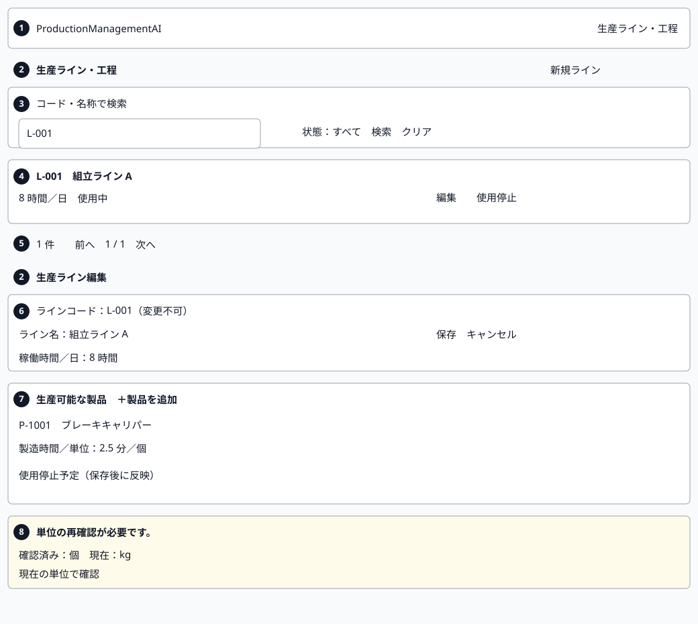
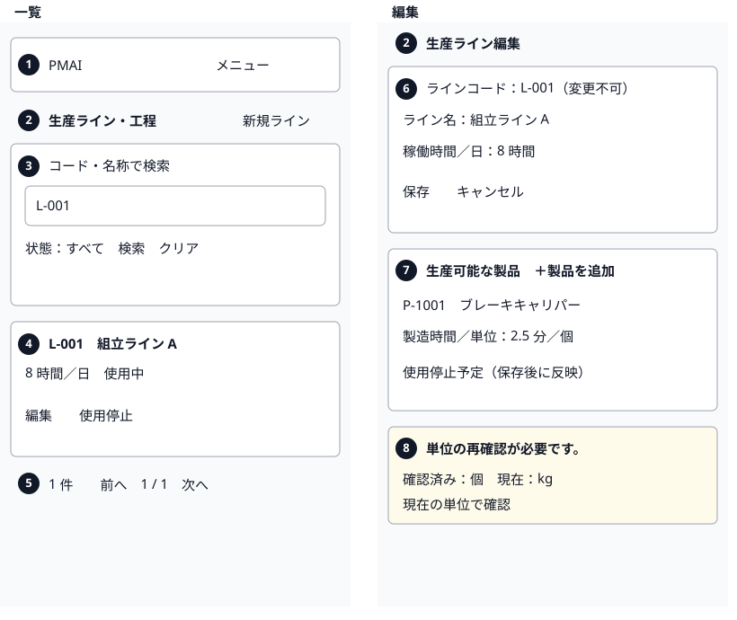
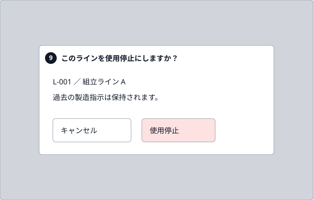

# Production lines — Screen processing design

005_DD-SPD version 1 elaborates SCR-005 and FN-032–FN-035. Order integration (FN-036 / REQ-068) is reserved to the next approved-plan step, the new order-impact DD. WI-009 plan revision 1 step 9; design only.

## 1. Document control and references

| Field | Value |
| --- | --- |
| Document ID / version | 005_DD-SPD / 1 |
| System / subsystem | ProductionManagementAI / Master data |
| Work item / author | WI-009 / Agent |
| Created / updated | 2026-10-01 / 2026-10-01 |
| Review state | Submitted for review; not implemented |

| Version | Date | Author | Change |
| --- | --- | --- | --- |
| 1 | 2026-10-01 | Agent | Initial screen flows, detailed visuals and static state previews |

Sources: [005_BD](../../010_basic-design/005/005_BD_生産ライン・工程.md), [005_DB](../../database/005/005_DB_生産ライン・工程.md), [main DD](005_DD_生産ライン・工程.md), [API version 2](005_DD-API_生産ライン・工程.md), [FN version 1](005_DD-FN_生産ライン・工程.md), [requirements](../../000_requirements/005/005_REQ_production-lines.md), [decisions](../../../../work-items/WI-009/decisions.md) and [plan](../../../../work-items/WI-009/plan.md). Approved sources remain unchanged. State diagrams/tables belong to main DD section 7; transaction algorithms belong to FN. This document owns client execution sequences.

## 2. Screen layout and mockup

Mockup artifact: [English static gallery](mockups/005_DD-SPD_SCR-005.html); [Japanese edition](mockups/005_DD-SPD_SCR-005.ja.html). Native design/Artifact publishing is unavailable in this session; local HTML is the approved-plan fallback. No application API, write, login or interactive workflow is simulated. Captions are translated; all proposed UI remains Japanese. Each artboard is an illustrative state, not a record of a running application.

Use existing white/gray surfaces, gray borders, rounded controls, 48px inputs/actions and the Japanese system font stack from AppHeader, ProductMasterPage and index.css. Reuse shared navbar behavior; add the approved centralized Factory glyph distinct from Package/ClipboardList. At widths below 640px use menu/cards and stacked controls; at 640px and above use the shared desktop navigation/table. No new component kit.

The mobile figure shows list and edit as two adjacent artboards for readable print review; each represents the same single-column mobile layout.

| BD region | Detail / preview states |
| --- | --- |
| 1 | Shared header; current line nav, mobile menu; dedicated Factory icon |
| 2 | List/form heading, New; dirty/retired notices |
| 3 | Unapplied q/state controls, Search/Clear |
| 4 | PC rows / SP cards; Edit and active-only line Retire |
| 5 | Loading, no lines/no matches, read error, success, paging |
| 6 | Code/name/hours, immutable edit code, validation, Save/Cancel |
| 7 | New/saved/retired timing rows, staged retirement, pair pages |
| 8 | Previous/current unit, revision-sensitive stale notice, explicit confirmation |
| 9 | Centered line/pair retirement and dirty-discard confirmations |

## 3. Component process list

| No | Owner | Responsibility / references |
| --- | --- | --- |
| 1 | ProductionLineListPage | FN-032/035; API-PL-01/05; REQ-064/067/069 |
| 2 | ProductionLineFormPage | FN-033; API-PL-02/03/04; REQ-065/066 |
| 3 | TimingEditor | FN-034; API-PL-02/06; REQ-066/067 |
| 4 | LineConfirmationDialog | FN-035 / staged pair action / discard; REQ-067/069 |
| 5 | LineDraftValidation | Exact local validation and stable error association |
| 6 | ProductionLineApi adapter / navigation guard | Response ordering, auth, deadline, error/unknown handling |

## 4. Processing design

### 4.1 ProductionLineListPage

| Field | Value |
| --- | --- |
| Detail | Apply URL filters and handle one version-checked line retirement. |
| Created / last modified | Agent / 2026-10-01; initial version |

Processing overview: Apply URL filters and handle one version-checked line retirement.

| Used component / service | Use |
| --- | --- |
| AppHeader / catalog | Shared navigation, current marker and Japanese labels |
| ProductionLineApi / LineConfirmationDialog | List/retire and confirmation |

| Step | Description | Branch / condition | Calls | Result |
| --- | --- | --- | --- | --- |
| 1 | Check existing session and Admin/Operator role. | 401: existing login flow; 403: forbidden without rows/actions. | ProtectedRoute / auth | Loading or auth view |
| 2 | Read q/state/page from URL; initialize input draft separately. | Defaults: empty q, active, 1. Reject unknown/repeated keys or invalid bounds locally; no invalid API call. | URL parser | Valid filter draft or filter error |
| 3 | Fetch applied list; cancel superseded reads. | Accept only current request generation; old results cannot replace newer filters. | API-PL-01 | Ready including empty, or ReadError |
| 4 | Search/Clear updates URL and resets page 1; paging keeps applied filters. | Clear resets q/state to empty/active. Browser history restores applied controls. Clamp navigation to available pages and 10000; no page 0. | Router / step 3 | Loading; result heading receives focus after user action |
| 5 | Open New/Edit or capture active line id/code/name/version and invoker for Retire. | Retired rows have Edit only; no restore/delete. | Router / LineConfirmationDialog | Form route or region 9 overlay |
| 6 | After confirmation send one retirement using captured version. | Cancel/Escape: no request. Pending: suppress repeat. Success: announce and refresh current filters. Known failure: retain target; ambiguous: Unknown. | API-PL-05 / adapter | Retiring → Loading / Ready / Unknown |

### 4.2 ProductionLineFormPage

| Field | Value |
| --- | --- |
| Detail | Maintain an immutable baseline plus a draft; save one aggregate without implicit retries. |
| Created / last modified | Agent / 2026-10-01; initial version |

Processing overview: Maintain an immutable baseline plus a draft; save one aggregate without implicit retries.

| Used component / service | Use |
| --- | --- |
| TimingEditor / LineDraftValidation | Pair intents and validation |
| ProductionLineApi / navigation guard | Detail/save, errors and dirty exits |

| Step | Description | Branch / condition | Calls | Result |
| --- | --- | --- | --- | --- |
| 1 | Authorize route; initialize create or fetch edit detail page 1. | Create: blank fields, zero pairs, Clean. Edit: no editable fake baseline on loading/error/404. | API-PL-02 for edit | Clean or local read/404 view |
| 2 | Store line version and loaded row observations; track all changes by product ID/local key. | Code read-only in edit; retired line name/hours editable without reactivation. Any changed value/action/confirmation makes Dirty. | TimingEditor / guard | Dirty; code/state locks retained |
| 3 | On Save normalize line text and validate entire draft/change ledger. | Clean/pending/Conflict/Unknown: disabled. Invalid: retain rows/values, show summary, focus first invalid control; no mutation. | LineDraftValidation | Dirty errors or Saving |
| 4 | Build create products or edit productChanges; capture submitted index-to-row map. | Edit sends only changed actions, version, name/hours; no code. Omitted rows unchanged. Reject >1000 actions or >256 KiB locally without silent truncation; persisted pair count unlimited by this request cap. | API-PL-03 / API-PL-04 | One pending aggregate request |
| 5 | Handle confirmed response or failure through adapter. | Success: navigate list with one announced notice. Validation: map captured indices to stable rows. Stale parent/unit: Conflict. Ambiguous: Unknown; never clear draft early. | Adapter / router | Exit / Dirty / Conflict / Unknown |
| 6 | Resolve Conflict/Unknown explicitly; guard replacement of dirty data. | Edit verify by id; create verify by list/code. Matching code alone does not prove own creation. If outcome cannot be reconciled keep write disabled; no replay/auto merge. | API-PL-02 / API-PL-01 / discard dialog | Read verification and explicit authoritative reload |

### 4.3 TimingEditor

| Field | Value |
| --- | --- |
| Detail | Keep a cross-page action ledger and explicit observed-unit confirmation. |
| Created / last modified | Agent / 2026-10-01; initial version |

Processing overview: Keep a cross-page action ledger and explicit observed-unit confirmation.

| Used component / service | Use |
| --- | --- |
| ProductionLineApi / decimal validator | Product choices, paged detail and exact minutes |
| LineConfirmationDialog / form draft | Stage retirement and track changes |

| Step | Description | Branch / condition | Calls | Result |
| --- | --- | --- | --- | --- |
| 1 | Fetch product choices by applied search/page and lineId for edit; exclude local unsaved IDs. | Server excludes every saved association including retired. New choice must be active; no duplicate product IDs. Cancel obsolete reads. | API-PL-06 | Choices or retryable read error |
| 2 | Add a selected product observation with blank timing and unconfirmed intent. | No automatic conversion/confirmation; require minutes per one displayed unit. Remove unsaved row locally with no API. | Form draft | Dirty new row |
| 3 | Read saved pair pages into keyed baseline cache; keep intents even off page. | Compare returned parent version to original. Changed version: Conflict, guarded reload; never merge. Same version: update current observations and clear intent if unit/revision changed. | API-PL-02 with pairsPage | Current page plus preserved action ledger |
| 4 | Edit active saved minutes or explicitly confirm displayed unit/revision. | Stale pair needs confirmation even if unit text unchanged. New pair requires confirmation. Fresh timing edit may retain current confirmation (confirmUnit false). Later coefficient/observation change clears intent. | Exact validator / form draft | setTiming/add with observed unit and opaque revision |
| 5 | Keep unchanged stale/inactive-product associations during unrelated edits. | Saved retired pair read-only. No add/reactivation of its product. Stale edited timing requires confirm; eligibility remains server owned. | Form draft | History retained; no implicit action |
| 6 | Confirm saved active pair retirement and replace any timing intent with retire action. | Only stages local intent; expose pending-retirement text. Save persists; Cancel/discard writes nothing. | LineConfirmationDialog / form draft | Dirty pending retirement |

### 4.4 LineConfirmationDialog

| Field | Value |
| --- | --- |
| Detail | Center a safe modal and distinguish immediate line retirement from staged pair retirement and discard. |
| Created / last modified | Agent / 2026-10-01; initial version |

Processing overview: Center a safe modal and distinguish immediate line retirement from staged pair retirement and discard.

| Used component / service | Use |
| --- | --- |
| Native dialog / remembered invoker | Top layer, keyboard containment, safe and return focus |
| List/form action / navigation guard | Dispatch exactly the approved action |

| Step | Description | Branch / condition | Calls | Result |
| --- | --- | --- | --- | --- |
| 1 | Capture target text, operation and invoker; call showModal(). | Never derive action from untrusted HTML; text rendering only. Associate heading/body with aria-labelledby/describedby. | Native dialog | Overlay, inert background |
| 2 | Apply viewport geometry and focus safe action. | position fixed; inset 0; margin auto; width min(480px, calc(100vw - 32px)); max-height calc(100dvh - 32px); overflow auto. Center after scroll, SP and zoom. | Cancel / keep editing focus | Both axes centered; no page-relative top offset |
| 3 | Cancel, Escape or confirm. | Cancel/Escape closes with no write or draft change. Confirm line → API-PL-05 once; confirm pair → local retire; confirm discard → requested exit/reload only. | Owner action | Remembered return state or pending/exit |
| 4 | Close and restore focus. | Invoker if still present; after refreshed retirement use row/status heading; completed navigation uses destination heading. Backdrop click is not confirmation. | Owner focus target | Predictable keyboard position |

### 4.5 LineDraftValidation

| Field | Value |
| --- | --- |
| Detail | Validate exact text without floating-point rounding; preserve field identity. |
| Created / last modified | Agent / 2026-10-01; initial version |

Processing overview: Validate exact text without floating-point rounding; preserve field identity.

| Used component / service | Use |
| --- | --- |
| API v2 grammar / draft ledger | Format, bounds, action identity and confirmation |

| Step | Description | Branch / condition | Calls | Result |
| --- | --- | --- | --- | --- |
| 1 | Trim code/name only; count Unicode code points. | Create code 1–50, name 1–200. Edit code untouched. Server DB lower(code) governs duplicate checks across retired lines. | Local validator | Field errors; never preclaim uniqueness |
| 2 | Validate hours/minutes as ASCII text with API regex. | ^(0&#124;[1-9][0-9]*)(\.[0-9]{1,3})?$; hours >0 <=24; minutes >0 <=999999999.999. No spaces, signs, leading zeros, exponent, grouping or precision rounding; 1.2340 invalid. Compare exact scaled decimal values; never Number. | Exact decimal helper | Retained text or field error |
| 3 | Validate each action and explicit observed-unit intent. | One action/product. add requires confirmUnit true; stale setTiming requires true; retire contains action/productId only. Unit in 個, 本, 枚, 台, セット, kg, m. Opaque versions compared as strings. | Action ledger | Valid aggregate or stable-key errors |
| 4 | Map server errors through captured submission order. | products[i] / productChanges[i] map to row even off page. Show page/row error link and reveal before focus; unknown field paths become summary, never dropped. Server remains authoritative. | Error summary / form | All draft values retained |

### 4.6 ProductionLineApi adapter / navigation guard

| Field | Value |
| --- | --- |
| Detail | Handle cancellation, known rejection and unknown writes without leaking or storing drafts. |
| Created / last modified | Agent / 2026-10-01; initial version |

Processing overview: Handle cancellation, known rejection and unknown writes without leaking or storing drafts.

| Used component / service | Use |
| --- | --- |
| Existing apiClient / auth / navigation guard | Same-origin session and guarded navigation |

| Step | Description | Branch / condition | Calls | Result |
| --- | --- | --- | --- | --- |
| 1 | Send same-origin JSON with cookie; validate decoded representation. | Reads generation checked; write deadline 20s. Abort/network/lost response does not prove rollback. No automatic mutation retries. | API-PL-01–06 | Decoded result or classified failure |
| 2 | Classify application response and keep local data. | 400 / code conflict: field/summary error; LINE_STALE, LINE_UNIT_STALE, LINE_UNIT_CONFIRMATION_REQUIRED: Conflict. 404 local missing view. 413/415 actionable summary. 503 LINE_BUSY is known rollback; explicit retry only, honor Retry-After. 500/malformed/lost write → Unknown. | Problem code mapping | Dirty / Conflict / Unknown / read error |
| 3 | Apply existing 401 session handling; stop feature access on 403. | Do not expose protected baseline on forbidden routes; drafts memory only and cleared by existing logout/expiry. No localStorage, URL payload or new persistence. | Auth / ProtectedRoute | Login or forbidden |
| 4 | Guard Cancel, navbar and browser navigation/reload while dirty; suppress exits during pending writes. | In-app uses discard dialog; reload/unload uses native browser prompt without custom translation guarantees. Conflict/Unknown verification reload also guards discarded data. | Existing navigation guard / beforeunload | Retain or explicitly discard; never implicit save |
| 5 | Emit only bounded client operation/status diagnostics if existing instrumentation supports it. | No bodies, q, names, coefficients, unit/version tokens or credentials; new server spans/metrics remain FN owned. | Existing diagnostics | No new telemetry dependency |

## 5. UI messages and accessibility

New feature labels below are catalog proposals; existing shared labels must match messages.ts exactly. Centralize new text under the same catalog when implementation is approved. Wireframes/mockups show Japanese only; captions are outside the UI.

| Context | Japanese UI | English gloss |
| --- | --- | --- |
| Heading | 生産ライン・工程 | Production lines and processes |
| Create / edit | 生産ライン登録 / 生産ライン編集 | Create / edit production line |
| New / supported products | 新規ライン / 生産可能な製品 | New line / supported products |
| Identity / hours | ラインコード / ライン名 / 稼働時間／日 | Code / name / working hours per day |
| Timing / confirm | 製造時間／単位 / 現在の単位で確認 | Minutes per unit / confirm for current unit |
| Stale / staged retirement | 単位の再確認が必要です。 / 使用停止予定（保存後に反映） | Unit reconfirmation required / retirement pending Save |
| Loading / empty / no match | 読み込み中… / 生産ラインはまだ登録されていません。 / 該当する生産ラインはありません。 | Loading / no registered lines / no matches |
| Read error / retry | 読み込みに失敗しました。 / 再試行 | Read failed / retry |
| Saved / retired | 生産ラインを保存しました。 / 生産ラインを使用停止にしました。 | Line saved / retired |
| Conflict / unknown | 変更が競合しています。 / 保存結果を確認できません。再送信せず、現在の状態を確認してください。 | Conflicting change / unknown save; verify without replay |
| Forbidden | この機能を利用する権限がありません。 | No permission for this feature |

WCAG 2.2 AA target: label every input with persistent required/unit hints; associate field errors with aria-describedby and aria-invalid; error summary links reveal paged rows. Table has caption and scoped headers; cards use named regions. Status is text, not color alone. Use polite live status for loading/success and an alert for errors, without duplicate announcements. DOM focus order: header → heading/New → filters/results/pages, or identity → pair actions/pages → Save/Cancel. Preserve visible focus rings, 48px controls, sufficient contrast, reflow at 320px and 200% zoom. Dialog keyboard containment, inert background, Escape, focus restoration and scroll-safe viewport centering require later runtime verification; static previews cannot prove them.

## 6. Verification viewpoints and review stop

| Requirement | Later verification |
| --- | --- |
| REQ-064 | URL history; literal q; state/page bounds; read cancellation; table/cards; two empty states |
| REQ-065 | Immutable code; trim/case duplicate; exact text limits; version conflict retains draft |
| REQ-066 | Numeric boundaries; fresh/stale/ABA confirmation; unit-change race; cross-page intents/errors |
| REQ-067 | Cancel/Escape no write; pair staged vs line immediate; history/read-only retired; no restore |
| REQ-068 | Covered later by new order-impact DD; no new order screen authored here |
| REQ-069 | Admin/Operator read/write; 401/403; native modal focus/geometry; keyboard/mobile/zoom |

Business decisions unresolved: none. Source/API constraints are settled by approved inputs. Current checks cover document/visual consistency only; no application, network, accessibility conformance, transaction or E2E result is claimed. Detailed actual checks are recorded in [evidence](../../../../work-items/WI-009/evidence.md). Submit this single design package and wait for explicit user review before writing 005_DD-ORD. Full-family/security reconciliation and implementation plan revision 2 remain later gates.
