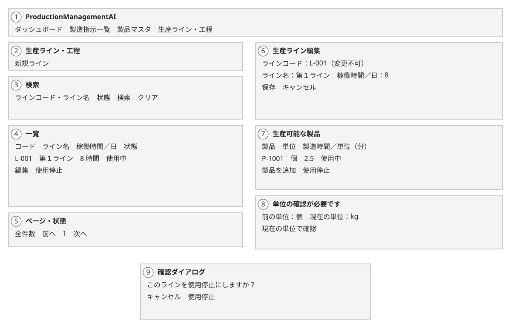
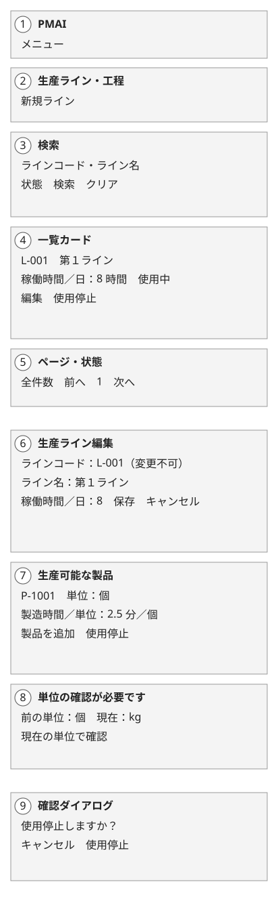
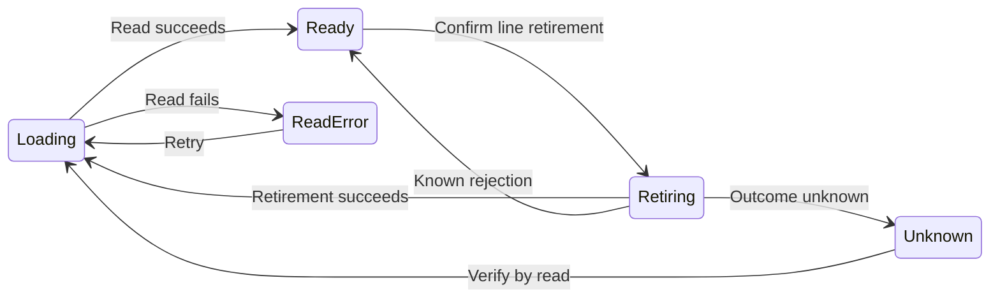
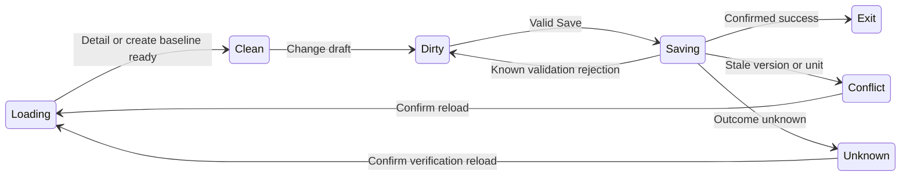

# Production lines — Detailed design

005_DD implements SCR-005, FN-032–FN-036 and REQ-064–REQ-069 under WI-009
approved plan revision 1, step 6. This is the main DD review package, not the
completed DD family or an implementation authorization.

## 1. Document control

| Field | Value |
| --- | --- |
| Document ID / version | 005_DD / 1 |
| Category / system / subsystem | UI and module design / ProductionManagementAI / Master data |
| Screen | SCR-005 「生産ライン・工程」 (Production lines and processes) |
| Work item / author | WI-009 / Agent |
| Created / updated | 2026-10-01 / 2026-10-01 |
| Inputs | Approved 005_BD version 1 and 005_DB version 1; DEC-001–DEC-009 |
| State | Submitted for review; not implemented |

| Version | Date | Author | Change |
| --- | --- | --- | --- |
| 1 | 2026-10-01 | Agent | Initial fields, modules, states and persistence boundaries |

## 2. References, companions and ownership

| Document | Purpose / current relationship |
| --- | --- |
| [005_BD](../../010_basic-design/005/005_BD_生産ライン・工程.md) | Approved routes, regions, navigation and business behavior |
| [005_DB](../../database/005/005_DB_生産ライン・工程.md) | Approved schema, exact bounds, unit revision, locks and migration intent |
| [005_REQ](../../000_requirements/005/005_REQ_production-lines.md) | Acceptance criteria for REQ-064–REQ-069 |
| [WI-009 plan](../../../../work-items/WI-009/plan.md) | Sequential review and design-only authorization |
| [Layering ADR](../../architecture/0001/0001_ADR_backend-layered-structure.md) | Controller/Application/Domain/Infrastructure boundaries |
| [Authentication ADR](../../architecture/0002/0002_ADR_auth-rbac-foundation.md) | Existing cookie-session and role foundation |

### Companion design documents

All three companions are mandatory for the completed DD family. They have not
yet been authored because the approved plan requires separate review in order.
Names below are reservations, not links to nonexistent files. This main document
owns fields, screen modules and states; exact catalogs/algorithms have one home.

| Reserved document | Owns | Next step |
| --- | --- | --- |
| 005_DD-API_生産ライン・工程.md | Requests/responses, query bounds, roles, errors and operation telemetry | 7, after main DD review |
| 005_DD-FN_生産ライン・工程.md | Application methods, lock SQL/order, atomic writes and backend instrumentation | 8, after API review |
| 005_DD-SPD_生産ライン・工程.md | Client processing sequences, detailed SVGs and EN/JA HTML state mockups | 9, after FN review |
| 005_DD-ORD_production-line-assignment.md | SCR-001/002 effects and existing-order request compatibility | 10, after SPD review |

Referenced by: none yet. Later companions will reference this main DD; no edits
to approved source designs are required. Overall family consistency stays pending
until all companions and the new order-impact DD are reviewed.

### Task and module index

| No. | Task / function | Design owner | Review status |
| --- | --- | --- | --- |
| 1 | List and URL filters, FN-032 | Main DD fields/states; SPD sequences; API read catalog | Main DD submitted; companions pending |
| 2 | Identity/hours form, FN-033 | Main DD validation; API/FN mutation details | Main DD submitted; companions pending |
| 3 | Product timing/reconfirmation, FN-034 | Main DD row state; DB constraints; API/FN confirmation guard | Main DD submitted; companions pending |
| 4 | Line retirement, FN-035 | Main DD dialog/state; API/FN transaction | Main DD submitted; companions pending |
| 5 | Order eligibility/locking, FN-036 | DB boundary and new order-impact DD | Detailed order behavior pending step 10 |

## 3. Component organization and screen-owned modules

### X-1. Paths

| Planned path | Responsibility |
| --- | --- |
| src/frontend/src/features/production-lines/ | Pages, timing editor, decimal validation and API adapter |
| src/frontend/src/features/production-orders/messages.ts | Japanese catalog additions; one existing catalog, no new i18n dependency |
| src/frontend/src/components/icons.ts | Centralized Factory import, distinct from Package and ClipboardList |
| src/backend/ProductionManagementAI.Domain/ | Line/pair entities and immutable identity invariants |
| src/backend/ProductionManagementAI.Application/ | Use cases and ports; methods owned by DD-FN |
| src/backend/ProductionManagementAI.Infrastructure/ | EF mapping, repositories and planned additive migrations |
| src/backend/ProductionManagementAI.Api/ | ProductionLinesController; contracts owned by DD-API |

### X-2. Shared components

Reuse AppHeader/AppNavbar, GuardedLink, NavigationGuardProvider, same-origin
apiClient, session handling and Japanese display formatting. Native dialog
behavior must retain WI-008 viewport centering and focus behavior. Existing
Product master version serialization remains unchanged; the new line token is
an opaque string. Framework/ASPX include files and XML rule engines are not
applicable to this React/.NET stack.

### X-3. Feature modules

Proposed modules below are design names, not existing or tested files. All are
created/updated by Agent on 2026-10-01. UI modules return React elements; controller
returns HTTP results; validators return structured field errors. Plain rendering
and controller modules have no rule-engine parameters.

| Module | Inputs / preconditions | Responsibility / output | Dependencies |
| --- | --- | --- | --- |
| ProductionLinesPage | Authenticated route; URL q/state/page | Applied-filter list state, PC table/SP cards, notices and pagination | Line API adapter, header, catalog |
| ProductionLineFormPage | Create or edit id; authoritative detail when editing | Immutable baseline, local draft, version, dirty guard and save outcome | TimingEditor, validation, API adapter |
| TimingEditor | Saved/new rows; product unit/revision; permitted writer | Add, edit coefficient, stage retirement and explicit confirmation intent | Product choices, catalog, decimal validator |
| LineConfirmationDialog | Named target/action and invoker | Cancel/Escape safe; confirm action; focus restoration | Native dialog, form/list state |
| LineStateLabel | Active state and optional stale-unit state | Visible Japanese text and non-color cue | Catalog |
| ProductionLinesController | Authenticated request; role for writes | Delegate validated use case, map errors without SQL/internal details | Application ports in DD-FN; contracts in DD-API |

### X-4. External APIs

Only existing same-origin application APIs; see section 8. No external identity,
shop-floor API or new integration. Service methods and step-by-step processing
are reserved to FN/SPD; this document does not duplicate their algorithms.

### X-5. Responsive composition

One data/state implementation for PC table and SP cards; shared forms reflow
without a separate mobile workflow. Preserve approved BD breakpoints/regions.
The later SPD refines visual details without changing this route/state contract.

### Screen-owned validation rule

LineDraftValidation is a format and cross-field assistance rule. Arguments:
mode, saved baseline, local identity/hours and timing rows. References: BD screen
items/history rules and DB sections 3–4. Checks: code/name strings, exact decimal
text, unique product IDs and explicit current-unit intent. Output: field errors
indexed by stable product ID or unsaved row key, plus summary. Dependencies:
approved product unit set and server-supplied current unit/revision. Local validity
does not prove current eligibility or authorize a write; server repeats checks.
No database reads or automatic unit conversion occur in this client rule.

## 4. Screen layout and region mapping

The approved BD SVGs are reused unchanged for this main-DD review. The plan
reserves detailed wireframes and EN/JA HTML state mockups to step 9 (SPD); they
are not claimed complete here. No new layout or numbered region is introduced.

| BD region | DD items / behavior |
| --- | --- |
| 1 | Shared header/nav and current marker; Factory decorative, visible text |
| 2 | Mode heading, New and dirty/permission notices |
| 3 | q/state draft controls and applied URL filters |
| 4 | Code/name/hours/state and row actions; table/cards share data |
| 5 | Loading/empty/error/success status, total and bounded pages |
| 6 | Code/name/hours, field errors, Save/Cancel |
| 7 | Saved/new timing rows, unit labels, Add, local Remove and staged Retire |
| 8 | Configured/current unit plus revision-sensitive stale warning and Confirm |
| 9 | Retirement/discard dialog, safe initial focus and return focus |

## 5. Screen item definition and validation

Quoted labels are approved-BD proposals, not implemented catalog entries.

| Item / Japanese UI (English gloss) | Local type / required | Validation and state rule | Source |
| --- | --- | --- | --- |
| q, search | string / no | Code/name search; input separate from applied URL; exact API bound in DD-API | BD 0-3, region 3 |
| state / page | enum / integer | Active/retired/all; default active, page 1; Apply/Clear resets page; exact paging bound in DD-API | BD regions 3/5 |
| id / parent version | opaque strings / edit only | UUID route id; authoritative parent xmin token; never increment/merge locally | DB 3.1/9 |
| 「ラインコード」 (Line code) | string / yes | Trim both ends; 1–50 Unicode code points; immutable on edit; duplicate comparison follows DB lower(code), all states | BD items; DB 3.1/4 |
| 「ライン名」 (Line name) | string / yes | Trim; 1–200 code points; not a URL/log label | BD items; DB 3.1 |
| 「稼働時間／日」 (Working hours/day) | decimal input text / yes | 0 < value <=24, at most 3 fractional digits; show 「時間」 (hours) | BD items; DB 3.1 |
| 「生産可能な製品」 (Supported products) | product IDs / zero or more | New rows use active products; exclude every already associated ID including retired pairs; saved identity immutable | BD items; DB 3.2 |
| 「製造時間／単位」 (Production time/unit) | decimal input text / yes per row | 0 < value <=999999999.999; at most 3 fractional digits; minutes per exactly one displayed unit | BD items; DB 3.2 |
| Pair active state | boolean / saved row | Retirement one-way; saved retired rows readable, not re-added/reactivated; unsaved rows removable locally | BD retirement; DB 3.2 |
| Configured/current unit and revision | unit + opaque revision string | Seven units; compare unit and revision; changed-back unit remains stale; never use JS Number for bigint revision | DB 3.2/3.3/9 |
| 「現在の単位で確認」 (Confirm for current unit) | explicit local intent / conditional | Requires valid coefficient and displayed current unit/revision; no load/save auto-confirmation; server checks observed revision | BD unit confirmation; DB 7/9 |
| 「保存」 / 「キャンセル」 (Save / Cancel) | actions | Save logical aggregate; prevent repeated pending writes; Cancel writes nothing and guards dirty data | BD events |

Keep decimal input as text; accept ASCII digits with at most one decimal point
and 1–3 fractional digits if present. Reject exponent, thousands separators,
NaN/infinity, nonpositive values and extra precision; do not round to fit. Parse
and format with exact decimal helpers/server decimal, not binary floating-point
arithmetic. Values display with Japanese formatting and visible unit labels;
formatted thousands separators are not sent back as input. API transport details
and authoritative parsing are finalized in DD-API/FN.

Dirty state includes pair additions, coefficient edits, retirement intent and
confirmation intent. A saved stale pair may remain unchanged during an unrelated
line edit; editing its timing requires explicit current-unit confirmation. New
pairs require confirmation of the visible unit when saved. Retired pairs remain
read-only. An inactive product's existing pair is readable but never eligible for
new order selection/start. Changing product unit does not alter coefficients.
A later coefficient or observed-unit change clears local confirmation intent.
Save is disabled while clean, pending or unresolved unknown/conflict; preserve
the draft until explicit verification/reload resolves those states.
Confirmation covers the observed unit revision: a later product change must fail
that intent rather than silently bind it to an unseen newer unit.

## 6. Visible states, permissions and dialogs

| State / trigger | Visible behavior / retained data |
| --- | --- |
| List loading | Announce loading; no old rows presented as new filter results |
| No lines / no matches | Distinct notices; permitted New action remains available |
| Ready / retired | Readable actual rows, state text; retired line cannot be restored; code always immutable |
| Form loading / not found | No editable fake baseline; retry transient read, local 404 view |
| Clean / dirty form | Edit loaded data; dirty guard covers Cancel, navbar, browser navigation/reload |
| Validation | Preserve all values/rows; summary and associated errors; focus first invalid field |
| Stale unit | Show configured/current unit and required confirmation even when unit strings match but revision differs |
| Conflict | Keep draft; explain stale record/unit; explicit guarded reload; no silent overwrite/merge |
| Saving / retiring | Disable repeated mutation; announce pending; do not erase draft before confirmed response |
| Success | Form returns to list; line retirement stays on list; announced notice and authoritative refresh |
| Unknown write outcome | Preserve draft and target identity; no automatic replay; read/list verification before another write |
| 403 / 401 | Forbidden stays on route without write; 401 uses existing session-expiry/login handling |

Authenticated reads retain the applicable existing authorization policy; exact
read-policy mapping is catalogued at DD-API review. No new read entitlement is
introduced. Admin and Operator may create/edit/retire; API repeats these gates.
A user without write permission has no write controls and a direct form route is
forbidden, even if a read policy permits viewing. No broader role matrix is inferred. Retired-line ordinary field edits do not
reactivate it; active state cannot be toggled back by form/API payload.

Pair retirement confirmation stages a local inactive intent; Save persists it
with the entire aggregate. Cancel/Escape changes nothing; dirty confirmation does
not commit other edits implicitly. Show pending retirement until Save succeeds.
Line retirement is a separate list operation using the current parent version.

Dialogs center in both viewport axes with at least 16px margins, including after
scroll. Safe action starts focused, background inert, Escape cancels, focus
returns to invoker (or updated row/status after success). Fit SP and 200% zoom
with internal scrolling. Labels/errors, semantic table/cards, live statuses,
keyboard focus and visible non-color state cues target WCAG 2.2 AA.

## 7. Processing and state transitions

Distinct states are diagrammed below; same-state and any-state transitions are
table-only. Retirement/discard dialogs are overlays with remembered return state,
not separate routes. Entry/exit routes remain exactly those in the approved BD.

### 7.1 List state

| From | Event | To | Side effect |
| --- | --- | --- | --- |
| Entry / Ready | Enter, Apply, Clear or page change | Loading | Read applied URL; no write |
| Loading | Successful read (including empty page) | Ready | Render current rows/empty state |
| Loading | Failed read | ReadError | Show retry; retain filter input |
| ReadError | Retry | Loading | New read only |
| Ready | Confirm line retirement | Retiring | One version-checked retirement request |
| Retiring | Confirmed success | Loading | Notice, authoritative list refresh |
| Retiring | Known rejection | Ready | Error; record not assumed changed |
| Retiring | Lost/ambiguous result | Unknown | No automatic write replay |
| Unknown | Verify | Loading | Read target/list; reconcile outcome before another mutation |
| Ready | New / Edit | Form Loading | Route change; no write |

### 7.2 Form state

| From | Event | To | Side effect |
| --- | --- | --- | --- |
| Loading | Detail succeeds / create initialized | Clean | Set authoritative baseline and version; no write |
| Clean | Edit/add/confirm/stage pair retirement | Dirty | Local draft only |
| Dirty | More edits / invalid local Save | Dirty | Keep values; validation errors, no HTTP mutation |
| Dirty | Valid Save | Saving | One logical aggregate mutation |
| Saving | Confirmed success | Exit | Return list and announce success |
| Saving | Known validation/business rejection | Dirty | Retain draft and field errors |
| Saving | Stale parent/product-unit observation | Conflict | No overwrite; draft retained |
| Saving | Lost/ambiguous result | Unknown | Do not automatically replay |
| Conflict | Explicit guarded reload | Loading | Discard only after confirmation, fetch latest |
| Unknown | Explicit guarded verification reload | Loading | Read existing id, or list/code after create; no implicit second create |
| Clean / Dirty | Cancel or permitted navigation | Exit | Dirty discard confirmation first; no write |
| Any form state | Read failure / 404 | Same route error view | No fabricated data; retry where valid |
| Any authenticated state | 401 / 403 | Login / forbidden view | Existing session handling; no further mutation |

The list chart has eight distinct-state transitions and the form chart nine;
the rows enumerate them plus entry, navigation and same/any-state cases. Pending network response is not
proof of commit. If access changes mid-edit, preserve values only in memory as
allowed by existing session handling; no localStorage or URL draft persistence.

### Processing flow owners

| Flow | Later owner | Events / function |
| --- | --- | --- |
| URL reads, request cancellation and focus | 005_DD-SPD list block | Search/Clear/page, FN-032 |
| Form load/dirty/validation/save | 005_DD-SPD form block; 005_DD-FN aggregate write | FN-033 |
| Product lookup, timing and confirmation | 005_DD-SPD timing block; 005_DD-FN unit guard | FN-034 |
| Dialog/list retirement | 005_DD-SPD dialog block; 005_DD-FN retirement | FN-035 |
| Order picker/start/history | New 005_DD-ORD; 005_DD-FN eligibility | FN-036 |

## 8. APIs used and persistence boundaries

Proposed call inventory below is for later DD-API review, not a finalized field
catalog. Existing Product master endpoint/contract is preserved; product unit
observation needed by this feature is resolved in the new feature's read contract.
No separate pair DELETE, restore or independent-version mutation endpoint.

| Proposed call | Purpose | Specification owner |
| --- | --- | --- |
| GET /api/production-lines | Search/state/page list | 005_DD-API |
| GET /api/production-lines/{id} | Line/pair detail and current unit observation | 005_DD-API |
| POST /api/production-lines | Create line with configured pairs | 005_DD-API |
| PUT /api/production-lines/{id} | Atomic parent/pair edit and explicit confirmations | 005_DD-API |
| POST /api/production-lines/{id}/retire | Version-checked one-way line retirement | 005_DD-API |
| Product choices / eligible order lines | Active choices, unit observation and eligibility projections | 005_DD-API and new 005_DD-ORD; exact read route reserved |

| Operation | Persistence / transaction | Concurrency and history |
| --- | --- | --- |
| List/detail | Project used fields from lines/pairs/products | Read-only; do not claim eligibility remains valid after response |
| Create/edit with pair changes | READ COMMITTED aggregate write | Product locks sorted UUID, then exclusive parent, then pairs; parent xmin changes on every persisted pair mutation |
| Explicit confirmation | Same aggregate transaction; locked product observation | Compare observed unit/revision; server derives confirmed values; ABA invalidation retained |
| Retire line | Parent version comparison and exclusive lock | Preserve pairs/orders; no physical deletion |
| New/changed order assignment/start | Product, line, pair FOR SHARE through commit | Validate active/current-unit state and order concurrency; FK alone insufficient |
| Historical unchanged order edit | Preserve exact pair/null and existing field locks | No active check except Draft start; line locked outside Draft |

Schema, columns, grants, indexes, trigger and recovery limits remain those of
approved DB. Queries project only needed columns; read projections may join
pairs/products/lines to report meaningful current units and historical names.
This is a deliberate exception to separate-table query preference; avoid N+1
queries. Exact snapshot/read semantics and bounded query controls belong to
API/FN. No scheduling, overload gate, automatic allocation or timing snapshot.

## 9. Exceptions and observability boundary

RFC 9457 error catalogs and exact time/lock limits are finalized in DD-API/FN;
no unconfigured timeout is reported as working. Reads may be retried explicitly;
writes are not automatically replayed after an ambiguous result.

| Failure | Screen response / retry | Required observability |
| --- | --- | --- |
| Validation / duplicate code | Retain fields, associate errors; user corrects before retry | Bounded validation/conflict outcome, no raw names/code/search |
| Stale parent / unit observation | Conflict with guarded reload; no overwrite | Operation/outcome and concurrency span |
| Not found / forbidden / unauthenticated | Local 404/403 or login per existing session | Status/outcome, no credentials or cookie content |
| Lock timeout / deadlock | Rollback result, preserve draft; explicit retry only after known failure | Bounded transient outcome and duration |
| Network / unknown commit | Keep draft; verify target/list before next mutation | Client operation/status without bodies; server outcome if known |

Every new endpoint/use case requires OpenTelemetry spans and metrics, not logs
alone. API/FN owns exact names and bounded labels; never include product/line IDs,
raw text, coefficients, tokens or credentials as metric dimensions. Structured
logs must not expose SQL, stack traces or sensitive payloads to users. Full
security and instrumentation consistency gates remain pending companions.

## 10. Verification viewpoints and next review

| Requirement | Later test viewpoint | Current verification state |
| --- | --- | --- |
| REQ-064 | URL restore, paging, empty/read-error and PC/SP list | Design mapping only; runtime not run |
| REQ-065 | Trim/case duplicate, immutable code, parent stale write | Design mapping only; runtime not run |
| REQ-066 | Exact bounds/precision; mixed-unit display; ABA/reconfirmation race; atomic pair edit | Design mapping only; runtime not run |
| REQ-067 | Dialog Cancel no write; staged retirement/dirty guard; retained history; no restore | Design mapping only; runtime not run |
| REQ-068 | Optional Draft, eligible start, outside-Draft lock and legacy null | Detailed order-impact design pending; runtime not run |
| REQ-069 | Admin/Operator API/UI gates, keyboard/focus/dialog geometry, mobile/zoom and telemetry | Design mapping only; runtime not run |

Test-plan IDs will be assigned in plan step 11; none are fabricated here. No
business question is open. Exact API catalogs, query/time limits, backend flows,
client sequences, detailed visual mockups and order impact remain at their
planned review steps. Main-DD field/state consistency with approved BD/DB is
reviewable; the full DD family and implementation-ready gate are incomplete.
Submit this file and its EN/JA PDFs; wait for explicit review before DD-API.
No approved design source was edited, application test run or migration executed.
