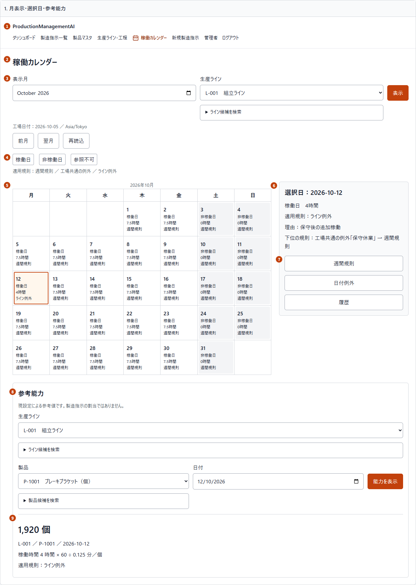
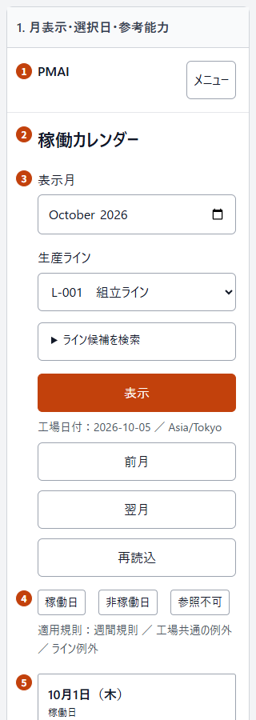
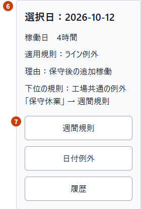
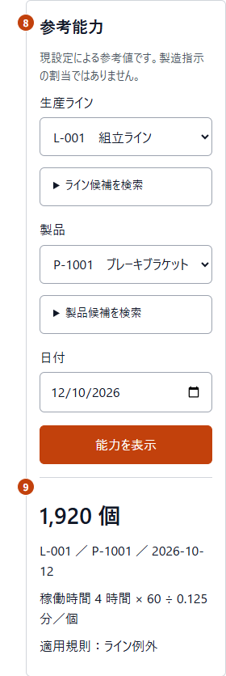
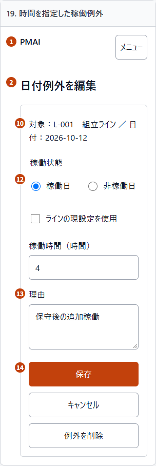
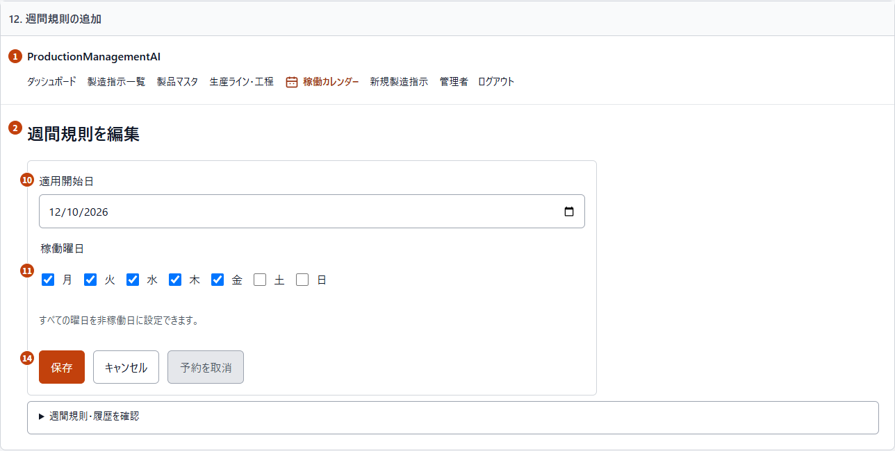
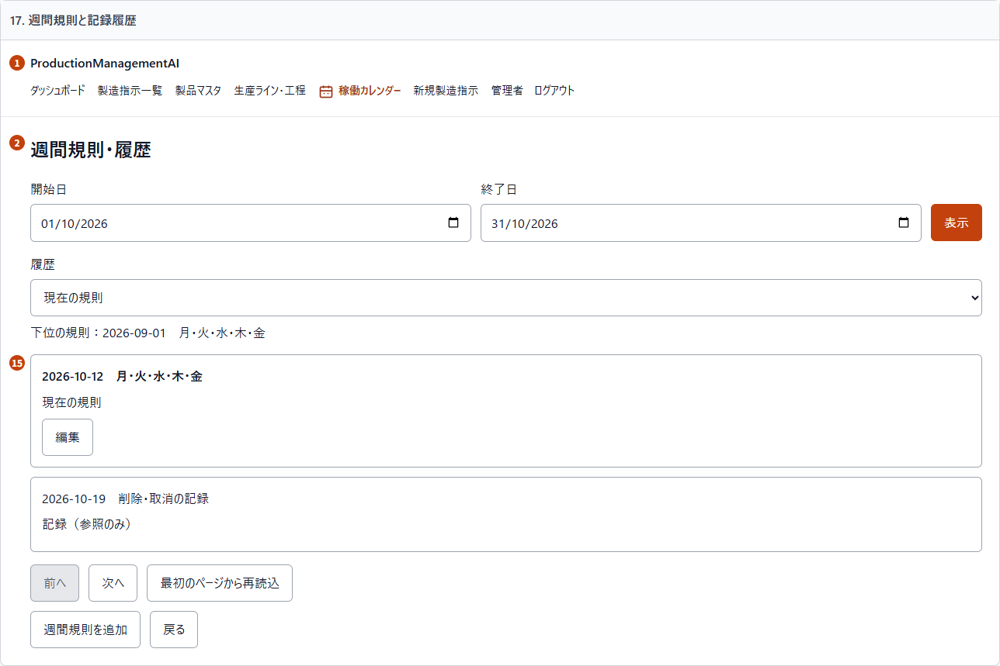
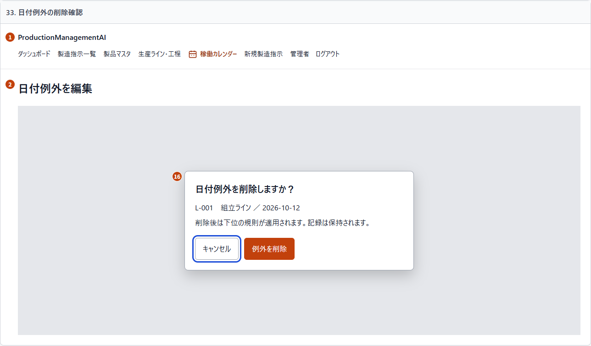

# Plant calendar — Full-screen alignment

## 1. Document control and authority

| Field | Value |
| --- | --- |
| ID / version / date | 006_DD-SPD-ALIGNMENT / 2 / 2026-10-05 |
| Work item / screen | WI-012, BUG-005 / SCR-006 |
| Requirements | REQ-079–081; preserve REQ-070–075 |
| Review state | Proposed; awaiting explicit user design review |
| Authorized phase | Plan revision 2: audit and design only |

This additive document covers the complete calendar and its weekly, exception,
history and confirmation modes. Completed approved documents remain immutable.
The discarded capacity-only proposal is not a source for this version.

Sources: [006_BD](../../010_basic-design/006/006_BD_稼働カレンダー.md),
[006_DD-SPD](006_DD-SPD_稼働カレンダー.md),
[006_DD](006_DD_稼働カレンダー.md),
[006_DD-FN](006_DD-FN_稼働カレンダー.md),
[006_DD-API](006_DD-API_稼働カレンダー.md),
[WI-012 plan](../../../../work-items/WI-012/plan.md) and
[audit evidence](../../../../work-items/WI-012/evidence.md).

On 2026-10-05 the user explicitly selected the BD desktop composition: calendar
left, selected day and actions right; mobile stacked. This resolves the conflicting
stacked sample in the earlier SPD gallery. Requirements and API invariants remain
binding. Proposed visual gap coverage below requires this document's review.

## 2. Screen layout and mockup

Mockup artifacts: [English captions](mockups/006_DD-SPD-ALIGNMENT_SCR-006.html)
and [Japanese captions](mockups/006_DD-SPD-ALIGNMENT_SCR-006.ja.html).
Each edition has 50 complete screen artboards with identical Japanese UI.
Native inputs/disclosures are visual review aids; no search, navigation or write
is implemented by the gallery. The established local HTML/Chromium fallback is
used because the external design publisher is unavailable.

Desktop at 900 CSS px and above uses the BD two-thirds calendar / one-third detail
composition, with 24px between regions. At 640–899px retain the semantic seven-day
table and stack details below it to keep cells readable. Below 640px replace the
table with an ordered agenda containing every real date; details/actions follow,
then capacity. This intermediate reflow is proposed responsive gap coverage.
Do not shrink seven columns onto a phone or omit dates to shorten screenshots.

Use existing gray/white surfaces, orange-700 primary actions, gray borders and
Japanese system fonts. Actions have a 48px minimum height; independent controls
have at least 8px spacing, groups 16px and major sections 24px. Labels and inputs
align at the top of a row; secondary search belongs to its selector. Text wraps.
The shared application shell remains the existing component: PMAI on mobile,
full application name on desktop, active CalendarRange icon and guarded menu.
Non-calendar shared navigation icons and authentication-dependent name/logout
layout are inherited from that component, not reimplemented from the illustration.

Mobile previews below are separate crops of the full gallery, not a truncated
runtime agenda. Open the gallery at the target viewport to inspect all 31 days.

<table><thead><tr><th>Top / dates</th><th>Selected day</th><th>Capacity</th><th>Date editor</th></tr></thead><tbody><tr><td></td><td></td><td></td><td></td></tr></tbody></table>

Additional numbered examples cover weekly fields, retained versions and confirmation.

<table><thead><tr><th>Weekly editor: 10, 11, 14</th><th>History: 15</th><th>Confirmation: 16</th></tr></thead><tbody><tr><td></td><td></td><td></td></tr></tbody></table>

## 3. Complete region mapping

Orange numbered badges identify regions 1–16 in the images and galleries.
They correspond exactly to the table below. The left annotation gutter and badges
are documentation aids; remove `#region-annotation-style` and `.region-badge`
from the mockup render before comparing application geometry.

Original SPD regions 1–16 remain the inventory. No new route or business state machine is introduced.

| Region | Content | Implementation owner |
| --- | --- | --- |
| 1 | Shared header/current route; mobile Menu | AppHeader / AppNavbar |
| 2 | Mode heading, status and honest recovery | All modes |
| 3 | Draft month/scope, Apply, month navigation | PlantCalendarPage |
| 4 | State/source legend and server plant date | PlantCalendarPage |
| 5 | Full month / full ordered agenda | MonthView |
| 6 | Selected-day state/hours/source/reason/fallback | PlantCalendarPage |
| 7 | Weekly/date/history entry actions | PlantCalendarPage |
| 8 | Independent line/product/date capacity query | CapacityPanel |
| 9 | Exact quantity, unit, basis or unavailable reason | CapacityPanel |
| 10 | Captured date/scope or effective start | WeeklyPatternEditor / DateExceptionEditor |
| 11 | Seven weekdays; empty set allowed | WeeklyPatternEditor |
| 12 | Working/closed radios and inherited/exact hours | DateExceptionEditor |
| 13 | Optional plain-text reason | DateExceptionEditor |
| 14 | Save/Cancel/remove/withdraw/reconciliation | Editors |
| 15 | Bounded current/history and predecessor | Editors / history view |
| 16 | Centered captured-target confirmation | Existing native dialog |

## 4. Calendar and choice interaction contract

Keep draft month/scope separate from applied URL/context. Apply validates then
fetches; Previous/Next month directly applies a bounded month. Show the server
plant date/timezone and state/source as text. Render only real month dates, inert
padding cells and a selected-day indicator. A day cell shows state, effective hours
where available, and source; plant working days say line-dependent instead of a
fabricated duration. Past inherited hours are explicitly current line settings.

Selected-day details show winning reason and lower-priority explanation. No partial
merge of exception hours is allowed. Disable new/edit action for past/unconfigured
or retired scope with a nearby reason; history remains readable. Existing future
exceptions on retired lines retain the separate removal permission.

Choice search is a native closed disclosure immediately below its scope/line/product
selector. Opening it exposes labeled input, Search, Clear and count. Only more than
one result page exposes Previous/Next inside that same group. Scope line, capacity
line and capacity product searches/pages are independent. Existing page size 50,
query bounds and API-PC-08/09 remain unchanged. All eligible choices stay reachable.

Keep the selected business label when its item leaves a page/filter; never show a
raw UUID as a product name. A syntactically valid retained URL identifier can remain
unconfirmed and use explicit capacity verification; do not infer eligibility or
force arbitrary reselection. Changing line clears product, related search/page and
result. Changed query/date/product invalidates superseded capacity. Clear resets
only the corresponding search/page, preserving a confirmed selected label.

Capacity stays below both calendar columns. Show an independent line selector,
then product/date/request, followed by result. Available output uses the response's
own quantity, unit, hours and minutes-per-unit with exact formatting. A valid closed
pair is zero; unavailable is never zero. UnitStale explains the separate Production
lines action without automatic timing confirmation. Current-settings disclaimer
remains visible. Input/date bounds and server validation are unchanged.

## 5. Editors, history and confirmations

Weekly mode prioritizes effective start, seven labeled checkboxes and actions, as
in the approved weekly mockup. New starts stage an explicit intent; existing starts
are immutable. All-closed is valid. Protected/today/past rules cannot be withdrawn;
only permitted future targets can. Current/history range, predecessor and paging
remain available in a secondary disclosure, with a full expanded artboard. History
selection is read-only; snapshots restart explicitly when stale.

Date mode uses labeled Working/Closed radio controls, restoring the approved visual
choice. A new/removed target initially has neither selected. Existing scope/date
are labels, not editable identity fields. Working exposes the inherit checkbox;
exact hours appear only when inheritance is off. Closed hides hours and submits the
existing closed semantics. Preserve <=500-character normalized plain-text reasons,
exact hours (>0, <=24, <=3 decimals), first-invalid focus and dirty-value retention.

History mode is an explicit read-only presentation with scope/date, current marker,
retained records and bounded paging/restart/back. It must not look like a writable
exception form. This completes the approved history artboard using existing APIs;
no permission or mutation semantics change.

Saving disables fields and duplicate mutation, including Cancel while pending.
Conflict preserves values and offers guarded reload. Unknown never retries a write:
verify via current/history reads, label each observation, and enable explicit
acceptance only after successful observation. Cancel/leave still requires discard
confirmation. Known save followed by refresh failure keeps the success message and
retries reads only. Read failures get retry beside the affected region.

Remove/withdraw/discard use the existing native modal in the viewport center.
Show captured scope/date and consequence. Cancel starts focused, Tab stays inside,
Escape/Cancel retain the draft, and focus returns to the invoker. Long dialog content
scrolls within viewport limits. Static modal drawings are not runtime focus proof.

## 6. Copy and accessibility

Existing Japanese catalog strings remain authoritative for unchanged actions and
messages. Earlier shorthand captions such as 「稼働」 (Working) become the existing
「稼働日」 (Working day); 「適用」 (Apply) uses existing 「表示」 (Display).
This explicit copy reconciliation does not alter business states. The following
missing display labels are proposed catalog additions, not claims of existing keys.

| Proposed Japanese text | English meaning |
| --- | --- |
| ライン候補を検索 | Search line choices |
| 製品候補を検索 | Search product choices |
| 条件をクリア | Clear search conditions |
| 週間規則・履歴を確認 | Inspect weekly rules and history |
| 稼働状態 / 稼働曜日 | Working state / working weekdays |
| 選択内容を確認してください。 | Confirm the retained selection |
| 選択内容は未確認です。能力を表示して確認してください。 | Selection unconfirmed; request capacity to verify |
| 工場日付 / 選択日 / 戻る | Plant date / selected day / Back |
| ライン依存 | Depends on line settings |

Implement labels through the central catalog. Bind fields to visible labels,
errors with aria-describedby/aria-invalid, statuses with polite announcements and
urgent errors with alerts. Preserve natural source order across layouts; a hidden
month/agenda variant must not be tabbable. Use native radio/checkbox/select/details
controls, visible focus, adequate contrast and text state cues. No hover-only names.
Long names have full wrapped labels below truncated native selectors. Native date
formatting can vary with OS/browser locale; underlying date-only values do not.

## 7. Artboard and region inventory

Sample context: plant today 2026-10-05, activation before October, October 2026. October12 reopens plant maintenance for 4 hours on L-001. P-1001 is 0.125 minutes/個, yielding 1,920 個. October17 is closed with valid zero capacity. Samples are not database fixtures.

| Anchor | State | Original SPD regions |
| --- | --- | --- |
| ready | Month, selected day and reference capacity | 1–9 |
| plant | Plant scope and line-specific capacity | 1–9 |
| scope-pages | Line filter: more than 50 choices | 1–9 |
| month-loading | Month loading | 1–9 |
| unconfigured | Unconfigured calendar | 1–9 |
| month-error | Month read error | 1–9 |
| day-loading | Selected-day loading | 1–9 |
| day-error | Selected-day read error | 1–9 |
| mismatch | Independent read versions differ | 1–9 |
| success | Confirmed save | 1–9 |
| refresh-error | Save confirmed; refresh failed | 1–9 |
| weekly-new | New weekly definition | 1,2,10,11,14,15 |
| weekly-future | Future weekly definition | 1,2,10,11,14,15 |
| weekly-all-closed | All weekdays closed | 1,2,10,11,14,15 |
| weekly-past | Past weekly definition | 1,2,10,11,14,15 |
| weekly-unknown | Weekly save outcome unknown | 1,2,10,11,14,15 |
| weekly-history | Current and retained weekly versions | 1,2,15 |
| exception-new | New date exception; explicit state required | 1,2,10,12,13,14 |
| exception-edit | Working exception with exact hours | 1,2,10,12,13,14 |
| exception-inherit | Inherit current line hours | 1,2,10,12,13,14 |
| exception-closed | Closed date exception | 1,2,10,12,13,14 |
| exception-plant | Plant-wide date exception | 1,2,10,12,13,14 |
| exception-invalid | Invalid hours and retained input | 1,2,10,12,13,14 |
| exception-past | Past date: read only | 1,2,10,12,13,14 |
| exception-retired | Retired line: existing exception removable | 1,2,10,12,13,14 |
| exception-saving | Save pending | 1,2,10,12,13,14 |
| exception-conflict | Conflict with guarded reload | 1,2,10,12,13,14 |
| exception-unknown | Save outcome unknown; no replay | 1,2,10,12,13,14 |
| exception-observed | Observation obtained; explicit acceptance | 1,2,10,12,13,14 |
| exception-long | Long business reason | 1,2,10,12,13,14 |
| weekly-records | Weekly history: read-only records | 1,2,15 |
| history | Retained date-exception history | 1,2,15 |
| confirm-remove | Remove exception confirmation | 1,2,16 |
| confirm-withdraw | Withdraw future rule confirmation | 1,2,16 |
| confirm-discard | Discard draft confirmation | 1,2,16 |
| capacity-initial | No capacity selection yet | 1–9 |
| capacity-line-pages | Capacity line choices: page 2 | 1–9 |
| capacity-product-pages | Product choices: page 2 | 1–9 |
| capacity-empty | No matching products | 1–9 |
| capacity-no-lines | No eligible active lines | 1–9 |
| capacity-choice-error | Choice read error | 1–9 |
| capacity-loading | Capacity loading | 1–9 |
| capacity-error | Capacity read error | 1–9 |
| capacity-unavailable | Unit-stale capacity unavailable | 1–9 |
| capacity-closed | Valid closed-day capacity is zero | 1–9 |
| capacity-unconfirmed | Retained URL selection awaits verification | 1–9 |
| capacity-invalid | Past capacity date rejected | 1–9 |
| capacity-long | Long line and product labels | 1–9 |
| invalidUrl | Invalid URL | 1,2 |
| forbidden | Forbidden | 1,2 |

## 8. Implementation comparison and verification

The later implementation plan must close each audit finding against this approved
package. Compare production frontend and mockups at the same viewport, chosen
state and equivalent business data: hierarchy, columns, field/control order, exact
labels, visibility, spacing, source/reason/hours, and result basis. Shared-shell
inheritance and native date/font differences above are the only general visual
exceptions; record any additional difference for review, not silent acceptance.

| Check | Required future proof |
| --- | --- |
| Full-screen parity | Calendar/day/editor/history/modal and recovery screenshots; REQ-079/081, findings ALIGN-01–16 |
| Responsive | 1440, 900, 640, 639, 390, 320 CSS px; native 200% zoom; full real dates; no clipping |
| Choice navigation | >50 scope-line, capacity-line and product choices; correct page/search group; retained selected labels; REQ-080 |
| Editor regression | Weekly new/current/history/withdraw; date new/inherited/exact/closed/remove; past/retired/protected rules |
| Honest settlement | Pending/validation/conflict/Unknown/read retry/known save refresh failure; no replay or invented success |
| Accessibility | Keyboard, radio groups, disclosure, dialog containment/return, error focus, axe; screen reader and physical IME reported separately |
| Invariants | Same endpoints/payloads/date bounds, exact decimals, role checks, version/snapshot rules; existing order/dashboard behavior |

The design phase renders static artifacts only. There are no running Docker
containers, and existing localhost ports 3000/5173/5033 refused connections on
2026-10-05. Current-runtime screenshots could not be captured; actual-side findings
are source inspection, not browser reproductions. Revision3 must obtain runtime
parity proof before calling the defect fixed. Static illustrations cannot prove
API behavior, modal focus, screen-reader speech or physical mobile IME.

## 9. Review gate and change boundary

No endpoint, database migration, authorization policy, telemetry contract or job is
added. No production data or credentials occur in sample artifacts. Existing BD/DD
navigation and state diagrams remain applicable; this is a layout/copy addendum
with the region table above, not a new business state machine.

Review this single Markdown and its bilingual mockup/PDF companions together.
After approval, prepare and present revision3 for application changes and tests.
Implementation, fixture writes, commit/push/PR/merge, deployment and replacement
videos are not authorized by this design-phase approval.
