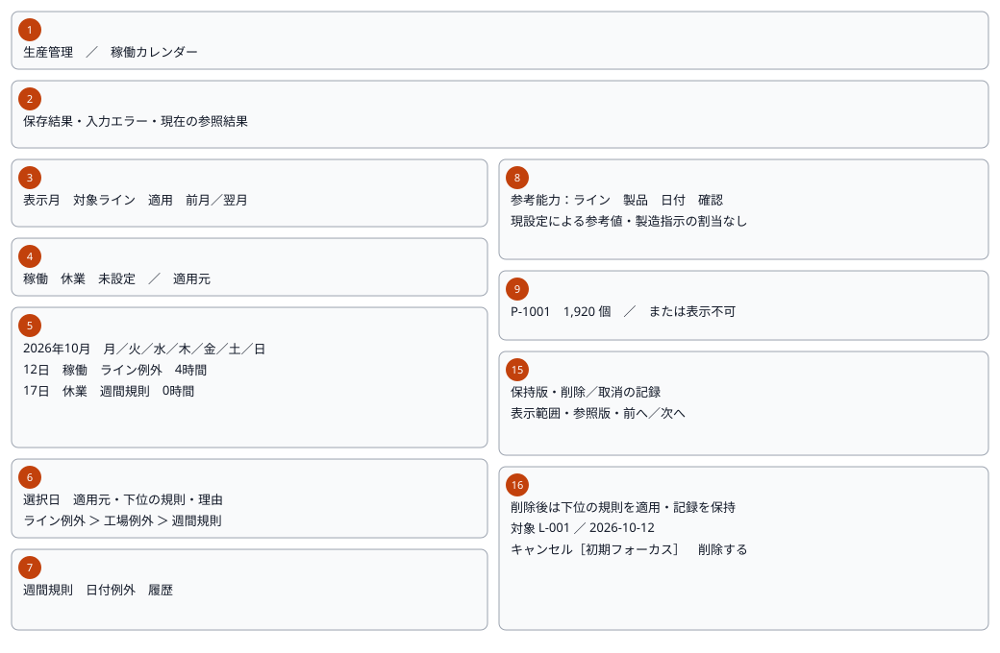
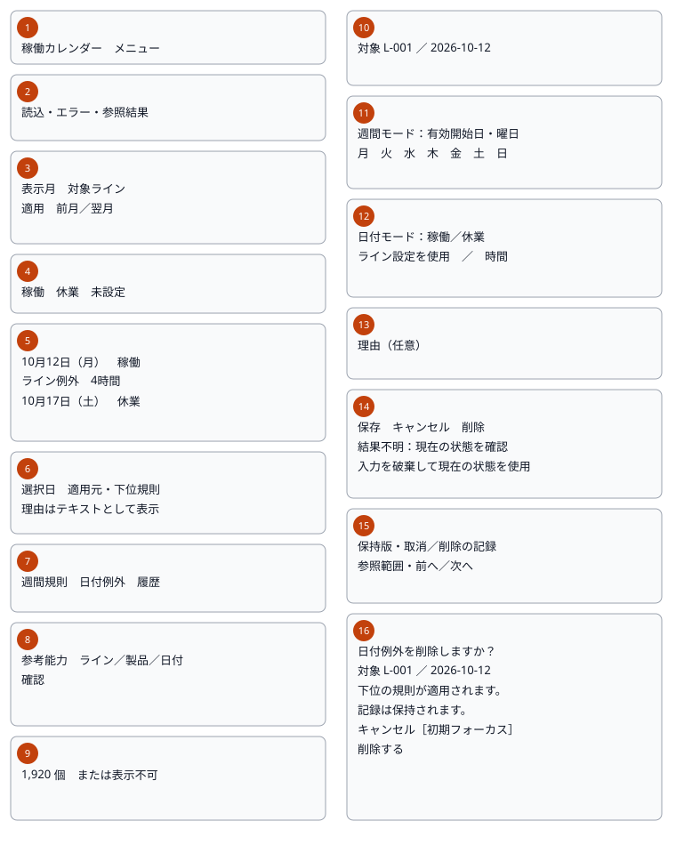

# Plant calendar — Screen processing design

006_DD-SPD version 1 elaborates SCR-006, FN-037–040 and REQ-070–075.
WI-010 approved plan revision 1 step 9. Design only; not implemented.

## 1. Document control and references

| Field | Value |
| --- | --- |
| Document ID / version | 006_DD-SPD / 1 |
| System / subsystem | ProductionManagementAI / Master data |
| Work item / author | WI-010 / Agent |
| Created / updated | 2026-10-02 / 2026-10-02 |
| Review state | Submitted for review; not implemented |

| Version | Date | Author | Change |
| --- | --- | --- | --- |
| 1 | 2026-10-02 | Agent | Initial client flows, focus/reconciliation behavior and detailed previews |

Sources: [requirements](../../000_requirements/006/006_REQ_plant-calendar.md),
[BD](../../010_basic-design/006/006_BD_稼働カレンダー.md),
[DB](../../database/006/006_DB_稼働カレンダー.md), [main DD](006_DD_稼働カレンダー.md),
[API](006_DD-API_稼働カレンダー.md), [FN](006_DD-FN_稼働カレンダー.md),
[decisions](../../../../work-items/WI-010/decisions.md) and
[plan](../../../../work-items/WI-010/plan.md). Prior designs are approved and immutable.
Main DD owns the three state diagrams and transition tables; API owns transport,
fields/errors; FN owns database algorithms. This document owns client execution,
keyboard/focus and detailed state previews; it does not duplicate those catalogs.

## 2. Screen layout and mockup

Mockup artifact: [English-caption static gallery](mockups/006_DD-SPD_SCR-006.html)
and [Japanese-caption edition](mockups/006_DD-SPD_SCR-006.ja.html).
The design/publishing tool is unavailable; local HTML rendered in Chromium is the
existing bounded fallback. No external publishing or application API simulation.
Twelve artboards: loading/unconfigured; populated month; weekly create/edit;
no matching choices; validation; past/retired restrictions; known success with
refresh error; conflict; unknown observation; confirmation; retained history;
capacity unavailable. Both editions show Japanese UI, with translated captions.

Reuse white/gray surfaces, gray borders, rounded 48px controls, orange primary
buttons and Japanese system fonts from existing master screens. Desktop >=640px
uses shared navigation and a semantic month table; smaller widths use Menu and
an ordered day agenda, stacked fields/actions/history. No new component kit.
The sampled October 12 line exception reopens a plant closure for 4 hours;
P-1001 at 0.125 min/個 yields 1,920 個. Illustrations are not seed or runtime evidence.

The phone sheet has two separate panels: lookup and editor/reconciliation. They
represent successive screen modes, not a simultaneous two-column phone layout.

| Region | Ownership / visible content |
| --- | --- |
| 1 | Shared header/current CalendarRange navigation; phone Menu |
| 2 | Status/error summary, restrictions and read-only unknown observations |
| 3 | Draft month/scope, Apply and bounded previous/next month |
| 4 | Working/closed/unavailable and source legend |
| 5 | Month day buttons / ordered phone agenda |
| 6 | Selected date, winning source, fallback and reason |
| 7 | Weekly/date/history actions, dependent on observed permissions |
| 8 | Independent line/product/date capacity selections and request |
| 9 | Exact quantity/unit or unavailable reason; no cross-unit totals |
| 10 | Captured date/scope or new weekly effective date |
| 11 | Seven weekly checkboxes; all closed valid |
| 12 | Working/closed, inherited/explicit hours |
| 13 | Optional reason, plain text |
| 14 | Save/Cancel/remove/withdraw and reconciliation actions |
| 15 | Bounded current/history pages, marker identity and predecessor |
| 16 | Centered remove/withdraw/discard confirmation; safe initial focus |

## 3. Process list and shared invariants

All component names below are proposed files under features/plant-calendar/;
authored/updated by Agent on 2026-10-02. Includes/ASPX/XML files: not applicable.
Existing shared components and the single Japanese catalog are reused.

| Block | Owner / purpose | Used components/services | Traceability |
| --- | --- | --- | --- |
| P-01 | PlantCalendarPage; applied URL and read rendering | AppHeader, GuardedLink, API-PC-01/02/08 | FN-037, REQ-070/074/075 |
| P-02 | WeeklyPatternEditor; current/retained definitions | DraftValidation, Confirmation, API-PC-03/04/05 | FN-038, REQ-071/074 |
| P-03 | DateExceptionEditor; exact target and history | DraftValidation, Confirmation, API-PC-02/06/07/11 | FN-039, REQ-072/074 |
| P-04 | CapacityPanel; independent current reference result | API-PC-08/09/10, exact display formatter | FN-040, REQ-073/074 |
| P-05 | CalendarConfirmation; action and guarded departure | Native dialog, existing navigation guard | REQ-074 |
| P-06 | CalendarDraftValidation; normalized draft/errors | DateTextRule, HoursTextRule, ReasonTextRule | REQ-071/072/074 |
| P-07 | CalendarApi adapter; cancellation/auth/settlement | Existing same-origin apiClient/session | All requirements |

Separate applied key, filter draft, editor baseline, editor draft and request
sequence. Read keys include operation, scope/date/range/search/page and requested
snapshot token where applicable. Every request also has a monotonic local sequence;
accept only the current key/sequence while mounted and authorized. Aborting a
superseded read is normal, not a displayed failure. Client sequences are never
server revisions. Do not join two responses into a claimed single snapshot.

Baseline stores the exact returned context version and target id, including a
removed/withdrawn marker. Never substitute a winning lower-priority source id for
the exact editable target. Never borrow a version from a choices/capacity response
to upgrade an old draft. No draft, reason, token or history snapshot in storage or
URL; memory only. Navigation URLs contain only BD's five allowed parameters.

## 4. Processing design

### 4.1 P-01 — PlantCalendarPage

Detail: restore calendar context and present request-keyed lookup. Dependencies
are listed in section 3; result is the existing main DD read state.

| Step | Processing / branch | Calls | Result / focus |
| --- | --- | --- | --- |
| 1 | Require current Admin/Operator session; strict parse month/lineId/date/mode/productId, reject repeated/unknown keys, invalid combinations or unsupported values | Existing session; local validator | Invalid URL: safe reset action, no calendar request |
| 2 | Get server date basis. If month omitted, use valid URL date's month, otherwise server plant month. Day mode requires date; explicit month/date mismatch rejected; product requires line | API-PC-08 supplies context | Never derive plant today from browser clock; heading focus on route entry |
| 3 | Apply validated default URL with replace; absent date selects server today if in applied month, otherwise first real date | Router | Applied month/scope/date recorded; canonical UUID casing |
| 4 | Fetch month and active line choices; show retained selected line from scope even when absent from active choices | API-PC-01/08 | Loading; no old data relabeled; unavailable coverage is HTTP 200, not read error |
| 5 | Render 28–31 real dates; desktop padding inert, no adjacent-month day actions. Select date using native button; fetch independent details keyed to date/scope | API-PC-02 | Selected-day source/fallback shown as text, not partial hour merge |
| 6 | If month/day versions differ, mark month older and perform one month refresh. If still different, show refresh-needed notice; do not combine as coherent or auto-loop | API-PC-01 | Day remains its own observation; editor baseline always day response |
| 7 | Filter edits only change local controls. Apply validates, updates URL, aborts obsolete reads and clears capacity; previous/next directly applies bounded month and a real selected day | API-PC-01/02 | At 0001-01/9999-12 respective boundary action disabled; announce month, keep initiating control focus |
| 8 | Enter weekly/day/history from successful authoritative context; dirty editor departure uses P-05 | Router; P-02/03 | Editors initialize via their own read; invalid/past/unactivated restrictions visible |
| 9 | Read failure: show safe message and explicit read retry; unknown line offers reset scope. Auth error delegates P-07 | API-PC-01/02 | No fabricated month, no hidden old successful result under new labels |

URL reset is an explicit user action, not silent recovery. Month/day queries omit
mode/productId and absent lineId; editors/history send only their endpoint's keys.
For retained past days show recorded state/source/explicit hours; any inherited
hours are labeled current line settings, not historical actual capacity.

### 4.2 P-02 — WeeklyPatternEditor

Detail: edit one effective start, inspect retained versions and future withdrawal.
Return transitions are main DD Clean/Dirty/Confirming/Saving and settlement states.

| Step | Processing / branch | Calls | Result / focus |
| --- | --- | --- | --- |
| 1 | Query selected range <=366 dates, initially applied month. Current view includes markers; show applicableBeforeFrom separately. History selection is read-only | API-PC-03 | Empty range does not mean no predecessor; range/page controls remain available |
| 2 | For new start, default server today; fetch Current with from=to=chosen date to capture exact target or marker and version. For edit, select current row's immutable start | API-PC-03 | Never reuse predecessor id as target; year 9999 safe |
| 3 | Initialize weekdays from current nonwithdrawn target; new/withdrawn target uses observed applicable pattern, or Mon–Fri proposal when absent. Creation/re-add is an explicit staged intent | Local draft | New intent counts as a change; existing unchanged payload disables Save |
| 4 | Toggle checkboxes in Mon..Sun order, allowing []. Change date on a new intent discards/reinitializes only after dirty confirmation; saved start cannot move | P-05/06; API-PC-03 | Baseline and draft distinct; past rows read-only |
| 5 | Save valid changed today/future draft once with captured version/id and exact weekday tokens | API-PC-04 | Saving; disable write/field changes, keep progress text |
| 6 | Future current nonwithdrawn row may request withdrawal; initial activation/today/past disallowed. Confirm captured row, not currently highlighted replacement | P-05; API-PC-05 | Append marker; no physical deletion or draft autosave |
| 7 | Current/History view, range and paging are read-only; page 2+ carries first page snapshotVersion. Stale paging keeps observation and requires explicit page-1 restart | API-PC-03 | No combined revision pages; changing range/view resets page/token |
| 8 | Settle write through P-07. Known success returns calendar with saved context; conflict/unknown preserves draft | P-07; P-01 | Heading/status focus after return; guarded Cancel remains possible |

A future date outside the initial month is inspected with its own bounded range;
there is no hidden all-future query or added business scheduling horizon.

### 4.3 P-03 — DateExceptionEditor

Detail: save/remove one plant or line date exception; history independent of draft.

| Step | Processing / branch | Calls | Result / focus |
| --- | --- | --- | --- |
| 1 | Read exact scope/date; exception null means never configured, removed marker retained for re-add. Store response context and target | API-PC-02 | Existing identity labels immutable; new target opened from selected date/scope |
| 2 | Initialize from live exception; new/removed target requires explicit Working/Closed choice. Inherited working stores null hours; plant label explains dependence on selected line | Local draft | No invented eight-hour default or lower-override merging |
| 3 | Closed clears hours and inherit control; working/inherit clears explicit hours; switching to explicit requires new valid text. Reason stays independent | P-06 | Hidden contradictory values never submitted; focus stays on initiating control |
| 4 | Validate normalized draft and <=8 KiB UTF-8 JSON including property/escape overhead; save once with all required nullable properties | API-PC-06 | No float coercion; capture exact scope/date/id/version |
| 5 | Remove only current nonremoved target today/future; retired line permits existing removal despite disabled create/edit. Confirm fallback and retained history | P-05; API-PC-07 | No request on dismissal; no pending draft save |
| 6 | Inspect history for exact scope/date, paged token from page 1; show isCurrent, marker, commitRevision/date and plain reason. History is never an editable baseline | API-PC-11 | Read-only; stale page restarts explicitly; current snapshot returned independently |
| 7 | Past, unactivated or retired restrictions render text; preserve permitted draft after authoritative rejection. Refresh observation separately, never silently rebase | API-PC-02; P-07 | Save blocked where restricted; removal eligibility distinct |
| 8 | Known success/known rejection/conflict/unknown uses P-07; guarded Cancel returns calendar preserving applied lookup context | P-07/05/01 | No blind replay; selected day restored |

### 4.4 P-04 — CapacityPanel

Detail: descriptive current capacity only; never order allocation or load scheduling.

| Step | Processing / branch | Calls | Result / focus |
| --- | --- | --- | --- |
| 1 | Require line and today/future date; default applied active line/day if eligible. Past lookup remains available outside this panel | API-PC-08 | Active paged choices; no eligible line -> explicit empty guidance |
| 2 | Line change clears product/result, aborts obsolete choices/capacity; query literal product search with applied q/page and selected line | API-PC-09 | No matches differs from failed read; retained URL product shown as unconfirmed until validated |
| 3 | Select current product from eligible pages or retain a requested URL id for server eligibility lookup; do not claim eligibility from identifier alone | Local selection | No silent replacement with first product; no stale quantity |
| 4 | Explicit lookup sends line/product/date only. Product/date/search changes invalidate old result; current key/sequence gates completion | API-PC-10 | Independent Loading/Ready/Unavailable/ReadError |
| 5 | Available result uses server quantity/minutes/hours strings, exact display grouping without binary float arithmetic. Closed valid pair displays 0 with unit | Display formatter | Show current-settings notice, source and unit; no total across products |
| 6 | Unavailable shows reason text and no quantity/coefficient; UnitStale directs user to Production lines separately, never auto-reconfirms timing | Display mapping | Invalid pair remains unavailable even on a closed day |
| 7 | Read error offers explicit retry; server plantToday can invalidate a now-past date. After any known calendar mutation invalidate prior capacity | API-PC-10; P-07 | Request/focus stays in panel; status announced without focus theft |

Separate responses may have different contexts; a capacity result explains its own
returned day and references, never combines a month day with a later coefficient.

### 4.5 P-05 — CalendarConfirmation and navigation

Detail: captured destructive intent and discard destination, one dialog at a time.
Uses native showModal/top layer, existing navigation guard and GuardedLink.

| Step | Processing / branch | Calls | Result / focus |
| --- | --- | --- | --- |
| 1 | Capture action, logical target, target id/version, draft-state and invoker; leave/discard also captures intended route/history destination | Local intent | Dialog title/scope/date/consequence; not mutable current selection |
| 2 | Open native centered dialog with labeled title and short description, viewport max width/height and internal overflow | showModal | Initial Cancel focus; background inert; no document-centered absolute positioning |
| 3 | Tab/Shift+Tab stay within dialog. Escape/Cancel/backdrop dismissal performs no mutation and retains draft; restore invoker, or editor heading if removed | close | Restore prior Clean/Dirty/Unknown; no stacked dialogs |
| 4 | Confirm remove/withdraw only if captured context still matches and permitted; otherwise close with error and no request | API-PC-05/07 via editor | Submit once then dismiss to Saving; duplicate clicks disabled |
| 5 | Confirm discard/reload/accept observation clears original draft only explicitly; reload creates new baseline, never replays old request | P-01/02/03 | Cancel keeps original values; no payload-equality success inference |
| 6 | Dirty route/menu/Cancel/Back/Forward uses existing guard; declined pop restores history position, accepted departure reaches captured target once | NavigationGuardProvider | Saving blocks in-app departure; Unknown allows confirmed discard/leave |
| 7 | Browser refresh/tab-close uses supported beforeunload warning while dirty/pending/unknown | Browser | Warning is not guaranteed; unloading never proves rollback |

Long content remains scrollable above the mobile keyboard; controls are not hidden
behind fixed page footers. Follow [WAI dialog guidance](https://www.w3.org/WAI/ARIA/apg/patterns/dialog-modal/)
for contained focus and return to the invoker. Runtime keyboard/centering checks are
still required; a static illustration cannot establish modal compliance.

### 4.6 P-06 — CalendarDraftValidation

Detail: synchronous local input checks, never authoritative business permission.
No external calls. Required field rules remain main DD/API; no duplicate catalog.

| Step | Processing / branch | Result |
| --- | --- | --- |
| 1 | Normalize into a separate payload; preserve visible input until correction/success. Date/month parse Gregorian text, including leap years and full bounds | Structured errors, no timezone conversion |
| 2 | Hours trim and exact syntax/range/scale checks, no Number/parseFloat, exponent/grouping/rounding. Closed/inherit emits null | Exact hours string or field error |
| 3 | Unicode validate, trim reason, blank null; count code points after trim, internal whitespace unchanged. JSON UTF-8 byte count after serialization | Safe text and exact payload-size check |
| 4 | Weekly distinct enum set; [] valid. Validate required explicit new state, reference and observed editable dates | No guessed concurrency acceptance |
| 5 | Compare normalized payload plus logical creation/re-add intent to captured baseline. Invalid/unchanged submit makes no API call | Announce linked errors; focus first invalid field in document order |

Use form labels/fieldset legends, aria-invalid and aria-describedby for field
errors. Known server field errors map only recognized fields/codes; unknown codes
use safe page-level text. Reasons render text nodes; no HTML injection or input echo
in diagnostic messages. No analytics of keystrokes, raw notes or revision tokens.

### 4.7 P-07 — CalendarApi adapter and settlement

Detail: same-origin adapter around existing apiClient; feature-only 25s deadline.
All requests use established cookies/session, no framework/dependency change.

| Step | Processing / branch | Result |
| --- | --- | --- |
| 1 | Build only approved query/body fields, omit absent optional query fields, keep nullable body members. No automatic write retry | Request captured once; string tokens stay opaque |
| 2 | Validate expected response shape and exact enums/strings. Ignore obsolete reads; cleanup aborts readers but does not assert write rollback | Safe read error; malformed write success becomes Unknown |
| 3 | 401/403: existing login/forbidden handling, abort/clear feature memory and stop; do not persist draft across authentication | No arbitrary returned HTML; authorization cannot be bypassed by route |
| 4 | Valid 200 MutationResult: known commit/no-op, clear submitted draft, return calendar and refresh. changed=false announces unchanged, not a new revision | Success remains known if subsequent read fails; show separate refresh error |
| 5 | Valid NotApplied: field validation keeps draft; stale/target mismatch enters Conflict and blocks resubmit until explicit discard/reload. Other rejected writes keep safe restriction/busy message | CALENDAR_BUSY manual retry only, respecting Retry-After; no timer write |
| 6 | Missing/invalid outcome, timeout, network loss, aborted write, generic 5xx, CALENDAR_WRITE_UNKNOWN or malformed success: enter Unknown | Block all mutations; keep original draft/identity/version; no success or certain failure claim |
| 7 | Verify Unknown with exact day + exception-history, or weekly Current/History range containing captured start. Label each read independently if revisions differ | Verifying -> Unknown with observed values/errors; no claim that this client committed |
| 8 | After successful observation user may explicitly discard and accept current baseline; failed verification cannot enable Accept. Re-read latest baseline after acceptance | Unknown -> Loading; stale draft never gets a new token silently |
| 9 | Unknown Cancel/leave still permitted with discard confirmation; pending verification canceled as read only | No replay, completion endpoint or idempotency promise |

Before auth branching, adapter semantics still treat lost/malformed mutation
responses as uncertain; session errors terminate the feature rather than display
success. In known success refresh-error state, retry calls only reads. Never send
the earlier mutation again merely to obtain a clean calendar view.

## 5. Japanese UI additions and focus contract

Proposed additions to the existing single catalog; not implemented. Existing
shared labels stay unchanged. Quoted messages below have exact Japanese and gloss.
The Japanese PDF omits English glosses, keeping message keys and code values.

| Proposed key | Japanese UI | English gloss / use |
| --- | --- | --- |
| calendar.loading | 読込中です。 | Loading |
| calendar.notActivated | カレンダーは未設定です。 | Calendar not configured |
| calendar.readError | 読込に失敗しました。再読込してください。 | Read failed; reload |
| calendar.noChoices | 選択できる項目がありません。 | No selectable choices |
| calendar.noMatches | 条件に一致する項目がありません。 | No matching choices |
| calendar.validation | 入力内容を確認してください。 | Check input |
| calendar.hoursError | 稼働時間は0を超え24以下、小数3桁まで入力してください。 | Hours >0, <=24, scale <=3 |
| calendar.pastLocked | 過去の日付は変更できません。 | Past date immutable |
| calendar.retiredLocked | このラインは停止中です。新規登録・編集はできません。 | Retired line; create/edit blocked |
| calendar.saved | 保存しました。 | Confirmed save |
| calendar.unchanged | 変更はありませんでした。 | Confirmed no-op |
| calendar.refreshAfterSave | 保存は完了しましたが、表示の更新に失敗しました。 | Known save, refresh failed |
| calendar.conflict | カレンダーが更新されています。再読込してください。 | Changed; guarded reload |
| calendar.unknown | 保存結果を確認できません。再送せず現在の状態を確認してください。 | Unknown result; inspect without resend |
| calendar.observation | 現在の参照結果です。先ほどの保存成功を証明するものではありません。 | Observation is not commit proof |
| calendar.acceptCurrent | 入力を破棄して現在の状態を使用 | Discard input and use observed state |
| calendar.removeTitle | 日付例外を削除しますか？ | Remove exception? |
| calendar.removeBody | 削除後は下位の規則が適用されます。記録は保持されます。 | Fallback restored; history retained |
| calendar.withdrawTitle | 予約した週間規則を取り消しますか？ | Withdraw future weekly rule? |
| calendar.discardTitle | 入力を破棄しますか？ | Discard draft? |
| calendar.capacityUnavailable | 参考能力を表示できません。 | Capacity unavailable |
| calendar.unitStale | 単位が変更されています。生産ライン・工程で時間を再確認してください。 | Reconfirm timing after unit change |
| calendar.currentSettings | 現設定による参考値です。製造指示の割当ではありません。 | Current reference, no allocation |
| calendar.historyMarker | 削除・取消の記録 | Removal/withdrawal marker |
| calendar.invalidUrl | 表示条件を確認してください。 | Check URL conditions |
| calendar.notFound | 対象が見つかりません。表示条件を確認してください。 | Unknown target; check conditions |
| calendar.busy | 処理が混み合っています。しばらく待ってから再試行してください。 | Busy; manual retry after waiting |
| calendar.timeZoneError | カレンダーの日付設定を確認できません。管理者に連絡してください。 | Date basis mismatch; contact administrator |
| calendar.protectedRule | この週間規則は変更・取消できません。 | Protected weekly rule |
| calendar.requestError | 送信内容を確認してください。 | Request size/media error |
| calendar.unexpected | 処理を完了できませんでした。 | Unexpected error |
| calendar.referenceStopped | 対象のライン・製品・組合せは停止中です。 | Retired reference |
| calendar.noTiming | このラインと製品の製造時間が未設定です。 | Pair missing |
| calendar.noCalendar | 適用できるカレンダーの記録がありません。 | Calendar unavailable |

| API code / unavailable reason | Catalog key / behavior |
| --- | --- |
| VALIDATION | validation + recognized linked field errors |
| REQUEST_TOO_LARGE / UNSUPPORTED_MEDIA_TYPE | requestError; preserve draft |
| NOT_FOUND | notFound; no silent target substitution |
| CALENDAR_STALE / CALENDAR_TARGET_CHANGED | conflict; guarded reload |
| CALENDAR_PAST_DATE | pastLocked; save blocked |
| CALENDAR_LINE_RETIRED | retiredLocked; existing removal separately eligible |
| CALENDAR_PROTECTED_RULE | protectedRule |
| CALENDAR_NOT_ACTIVATED / NotActivated | notActivated |
| CALENDAR_BUSY | busy; manual retry respecting Retry-After |
| CALENDAR_TIMEZONE_MISMATCH | timeZoneError; feature unavailable |
| CALENDAR_WRITE_UNKNOWN / uncertain transport | unknown; mutation blocked |
| UNEXPECTED | unexpected for reads; unknown for writes |
| LineRetired / ProductRetired / PairRetired | referenceStopped; no quantity |
| PairMissing | noTiming; no quantity |
| UnitStale | unitStale; no quantity |
| CalendarUnavailable | noCalendar; no quantity |

No arbitrary server title/detail is shown as user text. Unknown enum/schema is
a protocol failure rather than a guessed unavailable reason. Read/network failure
uses readError; valid write success/no-op uses saved/unchanged, followed by a
separate refreshAfterSave if needed. Never translate unavailable to zero.

Focus order: shared header/Menu; month/scope/Apply/previous/next; date buttons or
agenda; selected-day actions; capacity inputs/request; mode fields; Save/Cancel/
remove; history controls. Weekly checkbox order is Monday through Sunday. Native
buttons use Tab and Enter/Space; no custom ARIA grid or undocumented arrow mode.
Only rendered PC or SP day controls are focusable, never both hidden copies.
Route/editor entry focuses heading; ordinary completed reads announce status
politely without stealing focus. Submitted validation focuses first invalid field;
page conflict/unknown uses focusable summary. Unknown verification completion
announces observation and retains Verify focus; Accept requires discard dialog.

Use text plus color, visible focus rings, adequate text/control contrast, semantic
table headers and labeled date buttons (date/state/source), aria-current=date for
today and aria-pressed for selected day. Loading containers use aria-busy; assertive
errors do not repeatedly announce on every render. Maintain 48px actions and
single-column reflow at 320 CSS px, 200% zoom and enlarged text. Reflow intent follows
[WCAG reflow guidance](https://www.w3.org/WAI/WCAG22/Understanding/reflow.html).
Static browser checks are artifact evidence only; screen-reader/keyboard/mobile
keyboard and native zoom compliance require later implemented UI verification.

## 6. Verification viewpoints and unresolved decisions

| Requirement | Later implementation verification |
| --- | --- |
| REQ-070 | Default server month, valid deep links, repeated/mismatched URL, date bounds, superseded reads and PC/SP focus |
| REQ-071 | New-today predecessor vs exact target, marker re-add, all closed, bounded future/history paging and protected withdrawal |
| REQ-072 | Working/closed/null toggles, Unicode/UTF-8 limits, exact target removal, retired-line removal and retained history |
| REQ-073 | Empty vs no matches vs failure, unit-stale eligibility, exact result display, zero vs unavailable, stale response suppression |
| REQ-074 | Admin/Operator, auth teardown, busy manual retry, conflict, unknown observation/discard, known success with read failure, dialog/dirty history/focus/zoom |
| REQ-075 | No new due-date/start/dashboard calendar dependency; existing order/master flows unchanged |

Unresolved business decisions: none. No new architecture, schema or dependency
choice. Current scope needs no existing-screen impact DD; plan step 10 assessment
and full design/security reconciliation remain after this review. Submit SPD with
SVGs, EN/JA mockups and PDFs; await explicit review. Application work requires a
later presented and explicitly approved implementation-plan revision.
