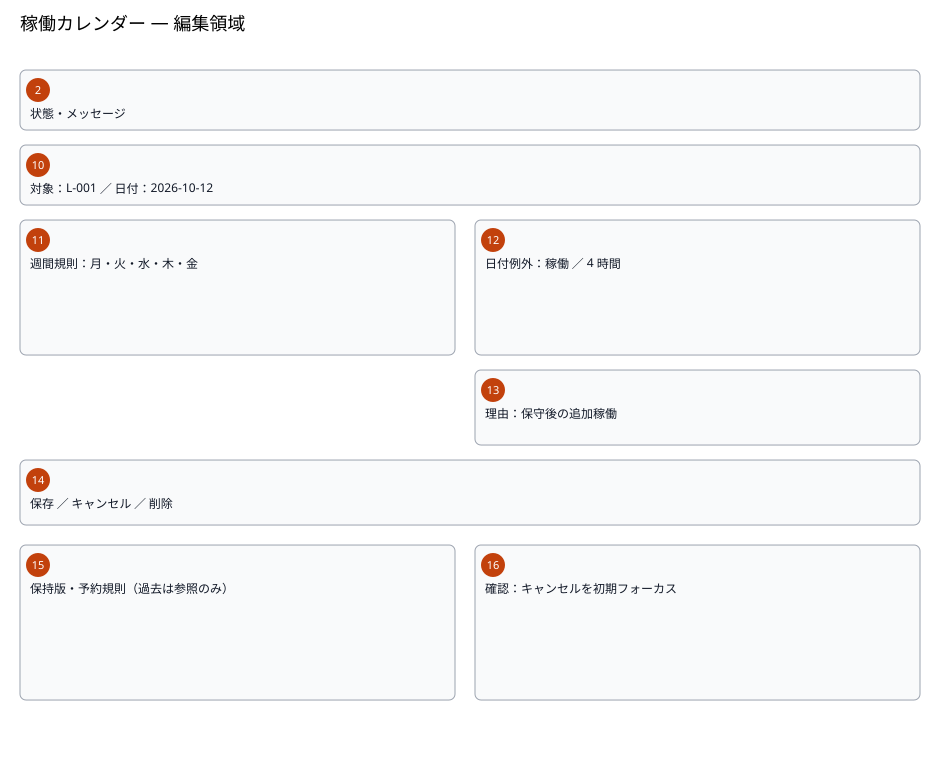
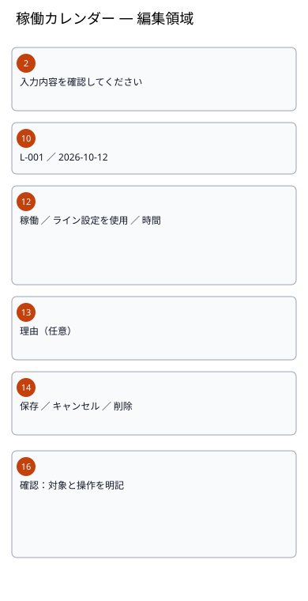
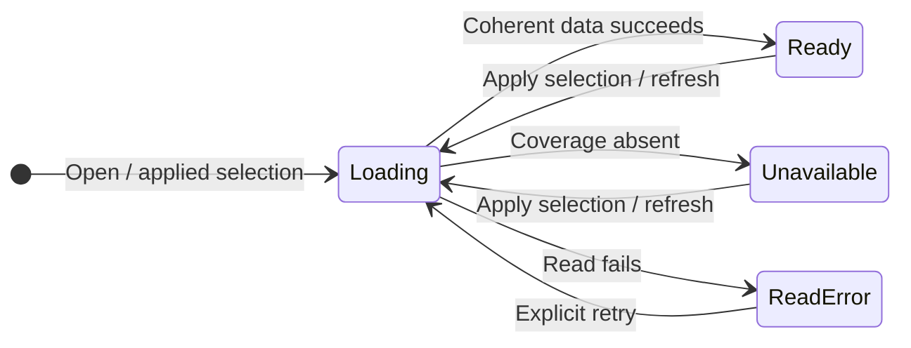
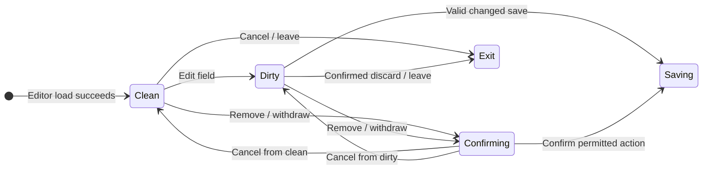
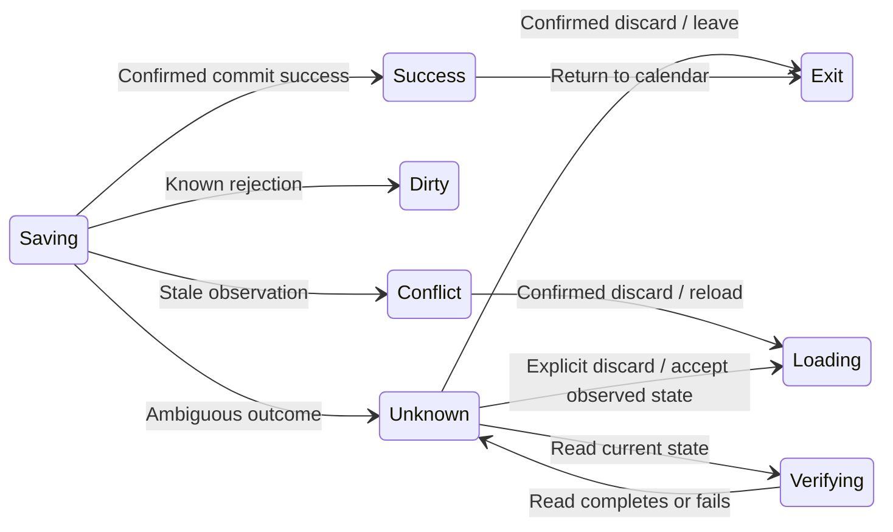

# Plant calendar — Detailed design

006_DD version 1 implements SCR-006, FN-037–040 and REQ-070–075 under
WI-010 approved plan revision 1 step 6. Main DD review package only; the DD
family and implementation authorization remain incomplete.

## 1. Document control

| Field | Value |
| --- | --- |
| Document ID / version | 006_DD / 1 |
| Category / system / subsystem | UI and module design / ProductionManagementAI / Master data |
| Screen | SCR-006 「稼働カレンダー」 (Working calendar) |
| Author / work item | Agent / WI-010 |
| Created / updated | 2026-10-02 / 2026-10-02 |
| Inputs | Approved 006_REQ, 006_BD and 006_DB version 1 |
| Review state | Submitted for review; not implemented |

| Version | Date | Author | Change |
| --- | --- | --- | --- |
| 1 | 2026-10-02 | Agent | Initial fields, modules, state transitions and visual companions |

## 2. References and design ownership

| Reference | Purpose |
| --- | --- |
| [006_REQ](../../000_requirements/006/006_REQ_plant-calendar.md) | REQ-070–075 and accepted RP-01–05 |
| [006_BD](../../010_basic-design/006/006_BD_稼働カレンダー.md) | Routes, navigation and calendar regions 1–9 |
| [006_DB](../../database/006/006_DB_稼働カレンダー.md) | Three-table storage, exact checks, snapshots, locks and recovery |
| [WI-010 plan](../../../../work-items/WI-010/plan.md) | Sequential review and phase authorization |
| [Layering ADR](../../architecture/0001/0001_ADR_backend-layered-structure.md) | Layered controller/use-case/persistence structure |
| [Authentication ADR](../../architecture/0002/0002_ADR_auth-rbac-foundation.md) | Existing same-origin cookie/roles |

### Companion design documents

All three companions are mandatory and reserved below, without broken links to
nonexistent files. Each is created only after the preceding review. Referenced
by: none yet; later companions will reference this immutable approved main DD.

| Reserved file | Owns | Plan step |
| --- | --- | --- |
| 006_DD-API_稼働カレンダー.md | Endpoint field catalogs, bounds, errors, roles and endpoint telemetry | 7 after main DD approval |
| 006_DD-FN_稼働カレンダー.md | Backend methods, resolver, exact transactions and budgets/instrumentation | 8 after API approval |
| 006_DD-SPD_稼働カレンダー.md | Client processing sequences, detailed focus/keyboard flows and final state mockups | 9 after FN approval |

| Function | Main DD ownership | Later specification |
| --- | --- | --- |
| FN-037 | Applied month/scope/day/read state | API read contract, FN snapshot, SPD sequencing |
| FN-038 | Weekly fields and current/future/past variant | API payload, FN version transition, SPD editor flow |
| FN-039 | Exception fields, remove dialog and retained draft | API target/errors, FN atomic marker append, SPD confirmation |
| FN-040 | Capacity selection and honest result state | API transport, FN decimal floor/eligibility, SPD stale-result guard |

## 3. Component organization and module design

### X-1. Paths

| Planned path / namespace | Responsibility |
| --- | --- |
| src/frontend/src/features/plant-calendar/ | Calendar route, editors, state, API adapter and validators |
| src/frontend/src/features/production-orders/messages.ts | Existing single Japanese catalog additions |
| src/frontend/src/components/icons.ts | Central CalendarRange alias proposed, distinct from Factory/Package/ClipboardList; verify installed export later |
| src/backend/ProductionManagementAI.Domain/PlantCalendar/ | Calendar snapshots and row-local invariants |
| src/backend/ProductionManagementAI.Application/PlantCalendar/ | Use cases/ports, methods specified by DD-FN |
| src/backend/ProductionManagementAI.Infrastructure/PlantCalendar/ | EF mappings, snapshot reader, aggregate writer |
| src/backend/ProductionManagementAI.Api/Controllers/ | PlantCalendarController; exact contracts in DD-API |

### X-2. Shared components

Reuse AppHeader, AppNavbar, GuardedLink, NavigationGuardProvider, same-origin
apiClient and existing session behavior. Dates stay date-only; existing
Japanese number formatting is display-only, never numeric validation.
No new component kit, provider, state library or i18n package.

### X-3. Feature modules

These are proposed names, not existing code. All authored by Agent on 2026-10-02.

| Module / inputs | Preconditions | Responsibility / return | Dependencies |
| --- | --- | --- | --- |
| PlantCalendarPage / applied URL key | Admin/Operator session | React view; month table/phone agenda, selected-day and capacity context | Calendar API adapter, header, catalog |
| WeeklyPatternEditor / authoritative definition+revision | Read succeeded; server date known | React form; independent draft, weekdays/start, retained version inspection | Validation, navigation guard |
| DateExceptionEditor / scope/date/target+revision | Exact captured identity; editable server rules | React form; state/hours/reason, remove intent, preserved draft | Validation, confirmation |
| CapacityPanel / line/product/date query | Today/future; current reference choices | React view; request-keyed result or explicit unavailable | Calendar API adapter, formatters |
| CalendarConfirmation / captured action+invoker | Remove/withdraw/discard intent | Centered native dialog; Cancel first, focus return, no write on dismissal | Native dialog and route guard |
| CalendarDraftValidation / mode+strings+context | Typed input and observed date; no authoritative claim | Structured field errors / valid normalized draft | Exact decimal/date rules and catalog |
| PlantCalendarController / request | Existing cookie and Admin/Operator on every read/write | HTTP result, no domain SQL/algorithm in controller | Application port, DD-API catalog |

### X-4. Rule details

CalendarDraftValidation is a screen-owned validator, not an XML rule engine.
Rule type: synchronous typed validation, not authoritative concurrency checking.
Rule references: HoursTextRule, DateTextRule, ReasonTextRule and the server's
editable context. Condition references: observed plantToday/timezone/activation,
selected line state, captured target and aggregate revision; these observations
may become stale, so the server always rechecks. Check parameters are F-04–11
and capacity F-14. Inputs are exact text/booleans/weekday set; output is a field
error map or normalized draft. It never writes, increments revisions or merges.

### X-5. Includes / legacy concepts

ASPX include paths, XML containers, condition files and server-rendered HTML
includes: not applicable to React/.NET. Backend business methods belong to FN;
step-by-step UI sequences belong to SPD, avoiding duplicate algorithm ownership.

## 4. Screen layout, regions and mockups

Reuse approved BD month/phone regions 1–9. The following editor SVGs add precise
field ownership; numbers 10–16 complement BD, while 2 retains the message area.
The desktop sheet combines alternative editor modes: regions 11/15 are weekly-only,
12/13 are date-only; the application shows one mode at a time.

| Region | Fields / content | Notes |
| --- | --- | --- |
| 2 | F-16 status/errors | Announced status or error summary; never assert uncertain commit |
| 10 | F-04/F-07 effective date or captured scope/date | Weekly start editable for new date; exception identity immutable on edit |
| 11 | F-05 weekday choices | Seven labeled booleans; all closed valid |
| 12 | F-08–10 working state/hours | Explicit or line-inherited; closed has no stored hours |
| 13 | F-11 reason | Optional plain text, 500 code points |
| 14 | F-12–13 actions | Save/Cancel/remove or future withdrawal; draft/permission/pending guards |
| 15 | F-06 retained/current/future definitions | Read-only past payloads, current selection, future correction/withdrawal |
| 16 | Confirmation | Captured target/version; safe initial focus and centered viewport |

Mockup artifact: [English-caption static states](mockups/006_DD_SCR-006-states.html)
and [Japanese-caption static states](mockups/006_DD_SCR-006-states.ja.html).
Nine artboards: unconfigured read, populated calendar/capacity, weekly edit,
exception validation, past read-only, confirmed success, conflict, unknown
outcome and confirmation. UI text is Japanese in both editions. Layout samples
use Oct 12 L-001 reopening to 4 hours, P-1001 at 0.125 min/個 = 1,920 個.
These are visual design samples; no seed, server, real execution or physical-phone
claim. Static spans illustrate controls, not a functional form. Browser render
and phone-width inspection validate the artifact only. Final SPD owns richer
per-state processing/focus mockups. No external artifact publishing required.

## 5. Fields, normalization and validation

| BD field | Stored/display input | Initial / validation / behavior |
| --- | --- | --- |
| F-01 month | YYYY-MM text | URL or server month; impossible month rejected; applied value separate from draft |
| F-02 scope | Plant/null or UUID line | Validate reference; active choices for new use; retained retired scope readable |
| F-03 selected day | YYYY-MM-DD + resolved state/source | Bound to applied month; before coverage unavailable; no synthetic days |
| F-04 weekly start | YYYY-MM-DD text | New default server today; past immutable; future correction keeps identity date |
| F-05 weekdays | Seven boolean choices | Existing mask or Mon–Fri initial; all false valid; server maps distinct set to 0–127 |
| F-06 definitions | Current/retained/future payloads | No editing old revisions; withdrawal future only; first activation protected |
| F-07 exception identity | scope/date and optional target revision id | Existing identity immutable; move means separate new exception |
| F-08 state | Working/closed | Explicit choice; removal not a user working state |
| F-09 inherit | Boolean, working only | True means null stored hours and current line baseline; no lower override merge |
| F-10 hours | Exact decimal string | Required for explicit working; >0, <=24, at most 3 fractional digits; no exponent, grouping, binary float or implicit rounding |
| F-11 reason | Unicode text | Trim both ends, blank -> null, <=500 code points; preserve internal content; render as text |
| F-12 Save/Cancel | Local action | Save only changed valid editable draft; known success returns calendar; dirty Cancel confirms discard |
| F-13 remove/withdraw | Captured action | Existing exception today/future; future weekly only; centered confirm, version unchanged |
| F-14 capacity | Line/product/date selections | Current valid choices, today/future; explicit request; changing key invalidates old result |
| F-15 result | Quantity/unit/hours/time/eligibility | Floor to whole discrete units or 3 decimals kg/m; unavailable not zero; plant-only has no invented hours |
| F-16 notice/verification | Operation outcome + read observation | Field errors/conflict/unknown keep draft; observation not proof of this client's commit |

Hours normalization trims surrounding whitespace but does not round or truncate
precision. Toggling closed/inherit explicitly clears contradictory hours; hidden
values must not be sent. Count reason with Unicode code points, not JS UTF-16
length; reject malformed text under the API contract. Dates are parsed as calendar
values, not Date objects interpreted in browser timezone. DB DateOnly bounds
are 0001-01-01 through 9999-12-31; exact API query limits remain later ownership.

Every read/write requires Admin/Operator; route visibility is not authorization.
Server plantToday and current master state decide editability, including after
midnight or retirement. Retired-line exception can be removed today/future,
but not newly created/edited. All calendar writes carry observed global revision;
independent calendar changes may cause conflict. Do not copy line xmin into it.
No draft notes, tokens or inputs in URL/localStorage/sessionStorage.

## 6. Processing and state transitions

State tokens below are implementation design names. The diagrams show exactly
the following edge inventories. Same-state validation/pending/dirty events and
any-state auth errors remain in the separate table below. Diagrams split read,
draft and write/reconciliation to keep labels readable; shared tokens refer to
the same editor state, not separate screen IDs.

### Read state — 7 diagram edges

| From | Event | To | Effect |
| --- | --- | --- | --- |
| [*] | Open / applied selection | Loading | No fabricated data |
| Loading | Coherent data succeeds | Ready | Bind result to applied key |
| Loading | Coverage absent | Unavailable | Explicit configuration unavailable |
| Loading | Read fails | ReadError | Honest error, no relabeled old data |
| ReadError | Explicit retry | Loading | Read only |
| Ready | Apply selection / refresh | Loading | Invalidate old result |
| Unavailable | Apply selection / refresh | Loading | Read only |

### Editor draft — 10 diagram edges

| From | Event | To | Effect |
| --- | --- | --- | --- |
| [*] | Editor load succeeds | Clean | Store baseline and revision |
| Clean | Edit field | Dirty | Local draft only |
| Clean | Remove / withdraw | Confirming | Capture operation/identity/version |
| Dirty | Remove / withdraw | Confirming | Capture target; do not silently save draft |
| Confirming | Cancel from clean | Clean | Restore prior clean state |
| Confirming | Cancel from dirty | Dirty | Keep draft |
| Dirty | Valid changed save | Saving | Submit once |
| Confirming | Confirm permitted action | Saving | Submit captured action once |
| Clean | Cancel / leave | Exit | No write |
| Dirty | Confirmed discard / leave | Exit | No write |

### Write and reconciliation — 10 diagram edges

| From | Event | To | Effect |
| --- | --- | --- | --- |
| Saving | Confirmed commit success | Success | Refresh calendar after known write |
| Saving | Known rejection | Dirty | Retain values and field errors |
| Saving | Stale observation | Conflict | Retain draft; block overwrite |
| Saving | Ambiguous outcome | Unknown | Block mutation/replay |
| Conflict | Confirmed discard / reload | Loading | Fetch new authoritative baseline |
| Unknown | Read current state | Verifying | Read only; retain original draft |
| Verifying | Read completes or fails | Unknown | Show observation/error; no success inference |
| Unknown | Explicit discard / accept observed state | Loading | Only after verification; no automatic replay |
| Unknown | Confirmed discard / leave | Exit | Cancel remains available; no write |
| Success | Return to calendar | Exit | Preserve applied context |

| From | Event | To / effect |
| --- | --- | --- |
| Ready | Select day, valid local capacity selection | Same read state; capacity has independent request-keyed Loading/Ready/Unavailable/ReadError |
| Clean / Dirty | Field validation or unchanged Save | Same state, no mutation; invalid fields announced/focused |
| Confirming | Context/version no longer matches | Return prior Clean/Dirty with error; no confirmed operation against different target |
| Saving / Verifying | Additional write click | Same state; block duplicate mutation |
| Loading / ReadError | Cancel editor | Exit, no mutation; draft discard if one was retained |
| Any authenticated state | 401 / 403 | Existing login / forbidden view; clear feature data and stop processing |
| Any editable state | Date becomes past / line retires | Show authoritative restriction; retain local input where session allows, no permitted save |

Conflict keeps local draft until explicit guarded reload. Unknown verification
reads without discarding the draft and always returns to Unknown with an observed
state or read error. Accepting observed state requires explicit draft discard;
this resets to a new baseline, never asserts the earlier save succeeded and never
replays its request. Exact settlement/error handling must be finalized in API/FN.
Cancel remains available while Unknown; Saving prevents duplicate actions and
accidental in-app destructive departure. Browser exit cannot be guaranteed:
use the existing supported beforeunload warning and reconcile lost outcomes.

| Flow | Specification owner | Trigger |
| --- | --- | --- |
| Applied URL/read cancellation and focus | DD-SPD calendar block | FN-037 Apply/month/day |
| Draft/save/dirty navigation | DD-SPD editors; DD-FN mutation methods | FN-038/039 |
| Confirmation remove/withdraw | DD-SPD dialog; DD-FN snapshot append | FN-038/039 |
| Unknown verification | DD-SPD result state; DD-API error contract; DD-FN read | F-16 |
| Capacity request/decimal/eligibility | DD-SPD panel; DD-FN capacity | FN-040 |

## 7. API use and persistence mapping

This is a logical call inventory, not a premature endpoint field catalog.
Proposed base /api/plant-calendar; exact routes/methods are DD-API's next review.
No existing production-order/master endpoint change is authorized here.

| Logical call | Purpose / ownership |
| --- | --- |
| Month/day/context read | Matching scope/dates, activation, current revision and source; DD-API/FN |
| Weekly versions/history read | Bounded current/future/retained records; DD-API/FN |
| Weekly save / future withdraw | One observed-revision transition; DD-API/FN |
| Exception save / remove | One captured scope/date/target transition; DD-API/FN |
| Line/product choice and capacity read | Valid current references and one dated descriptive result; DD-API/FN |
| Verification read | Current revision/target/history observations; no replay ledger; DD-API/FN |

| Operation | Approved DB mapping / transaction | Screen implication |
| --- | --- | --- |
| Read/context/capacity | Read-only REPEATABLE READ, projected calendar and current master data | One coherent snapshot, no mixed versions or per-day roundtrips |
| Weekly mutation | State FOR UPDATE; append/old-current=false; revision+1 atomically | Current-day insertion preserves older starts; future withdrawal marker |
| Line exception mutation | Line FOR SHARE before state FOR UPDATE | Retirement race rechecked; no reverse lock order |
| Plant exception mutation | State FOR UPDATE only | Null plant identity uniqueness includes markers |
| Remove/re-add | Retained snapshot/marker, no DELETE | Fallback restored; past notes/history retained |

Prefer clear projected table reads; capacity may join existing line/pair/product
within the same snapshot to avoid N+1 and mixed-generation eligibility. Existing
query behavior is not rewritten. No stored capacity or order relationship.
Column-scoped EF updates must respect DB grants; all service algorithms, query
budgets and exact lock/cancellation behavior have one owner in DD-FN.

## 8. Exceptions, accessibility and observability

| Outcome | User behavior | Retry / instrument boundary |
| --- | --- | --- |
| Invalid input/reference/past date | Keep input; field/page explanation and first-error focus | Explicit correction only; bounded validation outcome |
| Known version conflict | Keep draft; guarded reload | No automatic overwrite/merge; concurrency outcome |
| Read error | Honest retry and unavailable current result | Explicit read retry; operation/outcome/duration |
| Unknown write outcome | Keep draft; block writes; verify or Cancel | No blind replay, payload-equality success claim or automatic retry |
| Authentication / authorization | Login or forbidden; feature processing stops | Existing session behavior, no cookie/body logs |
| Lock timeout/deadlock/known rollback | Retain draft and safe generic error | Bounded transient outcome; exact budgets later |

RFC 9457 Problem Details field/error catalog belongs to DD-API. OpenTelemetry
endpoint/use-case spans plus count/duration metrics are mandatory; API/FN owns
names and bounded operation/outcome labels. Exclude raw dates, line/product IDs,
notes, quantity text, revision tokens, SQL internals and credentials from labels/
user diagnostics. Runtime exports/timeouts are not configured in this design.

Accessibility: semantic desktop table/native day buttons and mobile ordered
agenda; associated form labels, visible focus, text+color states and error/status
announcements. Confirmation uses fixed native dialog centered to viewport,
forward/reverse Tab trap, Cancel initial focus, Escape and invoker focus restoration.
Dirty route/history exits use the existing guard. Layout targets 320 CSS px and
200% zoom; past/retired restrictions have text. Mockup spans do not establish
interactive accessibility compliance; later implementation must verify it.

## 9. Verification viewpoints and next review

| Requirement | Meaningful later verification |
| --- | --- |
| REQ-070 | URL restore, impossible dates, activation unavailable, read cancellation and PC/SP |
| REQ-071 | Today/future replacement, future withdraw/re-add, all closed, protected past/initial definition |
| REQ-072 | Null plant duplicate, exact hours, reason code points, remove/Cancel, retained revisions |
| REQ-073 | Line reopening, full override/hour fallback, current-unit generation, floor precision and unavailable vs zero |
| REQ-074 | Admin/Operator every endpoint, global conflict, midnight/retirement race, unknown outcome, focus/dialog/mobile/zoom and telemetry |
| REQ-075 | Existing order-start, due-date and dashboard-day rules unchanged |

Test IDs belong to plan step 11; no unrun tests are reported as passing. No open
business blocker. Exact API bounds, backend budgets/algorithms and final SPD
processing await their sequential reviews. Migration/recovery remains approved
DB; no schema execution in this phase. Submit main DD with its SVGs, mockups and
EN/JA PDFs; await approval before writing DD-API. Full family/security gate is pending.
