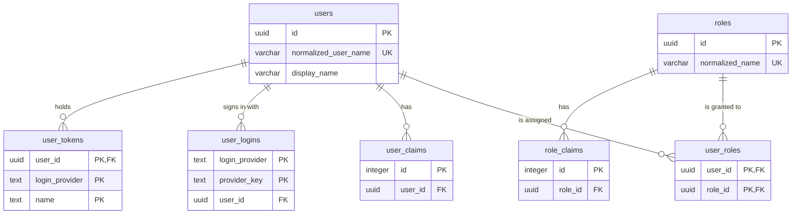

<!-- Based on ai/templates/database-design.md (the revision matching ai/templates/example/DatabaseDesign/). -->

# ProductionManagementAI — Identity Schema — Database Design Document (テーブル定義書)

000_DB — supports auth/RBAC foundation (`work-items/WI-001/brief.md` INFRA-002), implements 0002_ADR (`docs/en/architecture/0002/0002_ADR_auth-rbac-foundation.md`).

Physical naming convention: `snake_case`, per `ai/skills/database-design/SKILL.md` ("until [a convention is] fixed, use snake_case physical names consistently"). ASP.NET Core Identity's default PascalCase table names (`AspNetUsers`, etc.) are remapped to `snake_case` via EF Core Fluent API `ToTable(...)` calls in `AppDbContext`, and `EFCore.NamingConventions` (proposed in `work-items/WI-001/plan.md`, Auth foundation design) snake_cases column names consistently. Keys are `uuid` defaulting to `gen_random_uuid()` (the claim tables use Identity's `integer` identity keys), timestamps are `timestamptz`, and constraint and index names follow EF Core's `pk_`/`fk_`/`ix_` style. 001_DB–003_DB follow this convention.

## Document control (改版履歴)

| Field | Value |
| --- | --- |
| Document ID | 000_DB |
| System name | ProductionManagementAI |
| Work item | WI-001 |
| Database | `production_management_ai`, schema `public` |
| DBMS | PostgreSQL 17 |
| Character set | UTF-8 |
| Created by | Claude (for ThanhTN) |
| Created date | 2026-09-16 |
| Last updated by | Claude (for ThanhTN) |
| Last updated date | 2026-09-28 |

| No | Target | Work item | Change | Date | Author |
| --- | --- | --- | --- | --- | --- |
| 1 | All | WI-001 | Initial creation (as DB-001) | 2026-09-16 | Claude (for ThanhTN) |
| 2 | All | — | Template references updated | 2026-09-17 | ThanhTN |
| 3 | Open decisions | WI-002 | CSRF decision recorded as decided (WI-002 DEC-020) | 2026-09-18 | Claude (for ThanhTN) |
| 4 | All | WI-005 | Renamed to 000_DB (RFC 0010); English and Japanese PDFs added (RFC 0008) | 2026-09-23 | Claude (for ThanhTN) |
| 5 | All | — | Restructured to the table-definition template (document control, table list with lifecycle, per-table column definitions, index and trigger lists, database role section). Corrected against the `InitialIdentitySchema` migration: `users` column order, `phone_number` type (`text`, not `varchar(32)`), column defaults (the booleans and `access_failed_count` have no database default; the application sets them), FK names, the four FK indexes, and the uniqueness constraints (unique indexes, not separate `UNIQUE` constraints). The four Identity default tables are itemized; `user_claims` and `role_claims` recorded as read at sign-in | 2026-09-28 | Claude (for ThanhTN) |

## Table list (テーブル一覧)

| No | Schema | Physical name | Logical name | Overview | Indexes beyond PK | Triggers | Created | Schema changed | Dropped | Status |
| --- | --- | --- | --- | --- | --- | --- | --- | --- | --- | --- |
| 1 | `public` | `users` | [Users](#users-users) | Application user accounts (Identity `IdentityUser<Guid>` + app-specific fields) | yes | no | 2026-09-16 | — | — | in use |
| 2 | `public` | `roles` | [Roles](#roles-roles) | RBAC roles (Identity `IdentityRole<Guid>`); seeded `Admin`, `Operator` | yes | no | 2026-09-16 | — | — | in use |
| 3 | `public` | `user_roles` | [User roles](#user-roles-user_roles) | Many-to-many join between users and roles | yes | no | 2026-09-16 | — | — | in use |
| 4 | `public` | `user_claims` | [User claims](#user-claims-user_claims) | Identity default — per-user claims | yes | no | 2026-09-16 | — | — | in use — read at sign-in; empty, nothing writes it |
| 5 | `public` | `role_claims` | [Role claims](#role-claims-role_claims) | Identity default — per-role claims | yes | no | 2026-09-16 | — | — | in use — read at sign-in; empty, nothing writes it |
| 6 | `public` | `user_logins` | [User logins](#user-logins-user_logins) | Identity default — external login providers | yes | no | 2026-09-16 | — | — | unused (no external login in scope) |
| 7 | `public` | `user_tokens` | [User tokens](#user-tokens-user_tokens) | Identity default — per-user tokens, e.g. password reset | no | no | 2026-09-16 | — | — | unused (kept for extensibility) |

"Created" is the date of the migration that created the table (`InitialIdentitySchema`, 2026-09-16).

## ER diagram and relationships

| Table | Related table | Relationship (1:1 / 1:N / N:N) | FK column |
| --- | --- | --- | --- |
| `users` | `roles` | N:N (via `user_roles`) | `user_roles.user_id` / `user_roles.role_id` |
| `users` | `user_claims` | 1:N (a user may have none) | `user_claims.user_id` |
| `users` | `user_logins` | 1:N (a user may have none) | `user_logins.user_id` |
| `users` | `user_tokens` | 1:N (a user may have none) | `user_tokens.user_id` |
| `roles` | `role_claims` | 1:N (a role may have none) | `role_claims.role_id` |

## Table definitions (テーブル定義)

Validation for every Identity-managed column is ASP.NET Core Identity's own (`UserManager`/`RoleManager` and their options); no screen writes these tables. Where a column has no database default, the application supplies the value on insert (Identity's entity defaults or `AppUser`'s initializers).

### Users (`users`)

| Field | Value |
| --- | --- |
| Logical name | Users |
| Physical name | `users` |
| Schema | `public` |
| Overview | One row per application user account. Written only through ASP.NET Core Identity (`UserManager`): the development seed admin by `IdentitySeeder`, and login bookkeeping (lockout, failed count, security stamp). Columns follow `IdentityUser<Guid>` plus the app-specific `display_name`, `is_active`, `created_at_utc` (`AppUser`) |
| Estimated volume | small, bounded — plant staff accounts, tens of rows |
| Retention / deletion | kept; no deletion feature exists. Deleting a user would cascade to its role assignments, claims, logins and tokens |

| No | Item name | Physical name | Data type | Length | NOT NULL | Default | PK | UK | FK | Validation | Used | Description | Code values | Notes |
| --- | --- | --- | --- | --- | --- | --- | --- | --- | --- | --- | --- | --- | --- | --- |
| 1 | Id | `id` | uuid | — | yes | `gen_random_uuid()` | ○ | | | — | ○ | Identity `IdentityUser<Guid>` key | — | Returned by `GET /api/auth/me` |
| 2 | DisplayName | `display_name` | varchar | 200 | yes | none | | | | Application sets it on create | ○ | Name shown in the UI header | — | App-specific addition |
| 3 | IsActive | `is_active` | boolean | — | yes | none (application sets `true`) | | | | — | | Account-enabled flag | `true`: active; `false`: disabled | App-specific addition; reserved for a future account-disable use case, not yet consumed by any requirement |
| 4 | CreatedAtUtc | `created_at_utc` | timestamptz | — | yes | `now()` | | | | — | ○ | When the account was created (UTC) | — | App-specific addition |
| 5 | UserName | `user_name` | varchar | 256 | no | none | | | | Identity | ○ | Login name | — | `POST /api/auth/login` → `userName` |
| 6 | NormalizedUserName | `normalized_user_name` | varchar | 256 | no | none | | ○ | | Identity | ○ | Upper-cased user name for case-insensitive lookup | — | Unique via `ix_users_normalized_user_name` |
| 7 | Email | `email` | varchar | 256 | no | none | | | | Identity | | Email address | — | Identity default; no email-based feature yet |
| 8 | NormalizedEmail | `normalized_email` | varchar | 256 | no | none | | | | Identity | | Upper-cased email for lookup | — | Not unique (`RequireUniqueEmail` is off) |
| 9 | EmailConfirmed | `email_confirmed` | boolean | — | yes | none (application sets `false`) | | | | Identity | | Email confirmation flag | — | No email-confirmation flow in scope |
| 10 | PasswordHash | `password_hash` | text | — | no | none | | | | Identity | ○ | Identity-managed password hash | — | Never read or written outside Identity APIs |
| 11 | SecurityStamp | `security_stamp` | text | — | no | none | | | | Identity | ○ | Changes when credentials change, invalidating existing sessions | — | Identity default |
| 12 | ConcurrencyStamp | `concurrency_stamp` | text | — | no | none | | | | Identity | ○ | Optimistic-concurrency token for Identity updates | — | Identity default |
| 13 | PhoneNumber | `phone_number` | text | — | no | none | | | | Identity | | Phone number | — | Identity default; unused |
| 14 | PhoneNumberConfirmed | `phone_number_confirmed` | boolean | — | yes | none (application sets `false`) | | | | Identity | | Phone confirmation flag | — | Identity default; unused |
| 15 | TwoFactorEnabled | `two_factor_enabled` | boolean | — | yes | none (application sets `false`) | | | | Identity | | 2FA flag | — | No 2FA flow in scope |
| 16 | LockoutEnd | `lockout_end` | timestamptz | — | no | none | | | | Identity | ○ | End of the current lockout, if any | — | Supports the STRIDE lockout mitigation in 0002_ADR |
| 17 | LockoutEnabled | `lockout_enabled` | boolean | — | yes | none (Identity sets `true` for new users) | | | | Identity | ○ | Whether this user can be locked out | — | Identity default |
| 18 | AccessFailedCount | `access_failed_count` | integer | — | yes | none (application sets `0`) | | | | Identity | ○ | Consecutive failed sign-ins | — | Reset on successful sign-in |

- **Usage patterns (パターン):** Not applicable — one kind of record.
- **CSV import/export (DL対象 / UL更新):** Not applicable — no CSV import/export.
- **Seed data:** one development admin user (`admin`, display name `Seed Admin`), created at startup by `IdentitySeeder` when `SEED_ADMIN_PASSWORD` is set, not by a migration (0002_ADR).

### Roles (`roles`)

| Field | Value |
| --- | --- |
| Logical name | Roles |
| Physical name | `roles` |
| Schema | `public` |
| Overview | RBAC roles (Identity `IdentityRole<Guid>`). Written only by `IdentitySeeder` through `RoleManager` |
| Estimated volume | small, bounded — the placeholder roles, 2 rows |
| Retention / deletion | kept; role deletion is not exposed by any feature |

| No | Item name | Physical name | Data type | Length | NOT NULL | Default | PK | UK | FK | Validation | Used | Description | Code values | Notes |
| --- | --- | --- | --- | --- | --- | --- | --- | --- | --- | --- | --- | --- | --- | --- |
| 1 | Id | `id` | uuid | — | yes | `gen_random_uuid()` | ○ | | | — | ○ | Identity `IdentityRole<Guid>` key | — | |
| 2 | Name | `name` | varchar | 256 | no | none | | | | Identity | ○ | Role name | `Admin`; `Operator` (placeholders, 0002_ADR) | Returned in `GET /api/auth/me` → `roles` |
| 3 | NormalizedName | `normalized_name` | varchar | 256 | no | none | | ○ | | Identity | ○ | Upper-cased role name for lookup | — | Unique via `ix_roles_normalized_name` |
| 4 | ConcurrencyStamp | `concurrency_stamp` | text | — | no | none | | | | Identity | ○ | Optimistic-concurrency token | — | Identity default |

- **Usage patterns (パターン):** Not applicable — one kind of record.
- **CSV import/export (DL対象 / UL更新):** Not applicable — no CSV import/export.
- **Seed data:** `Admin` and `Operator`, created at startup by `IdentitySeeder` if missing, not by a migration.

### User roles (`user_roles`)

| Field | Value |
| --- | --- |
| Logical name | User roles |
| Physical name | `user_roles` |
| Schema | `public` |
| Overview | One row per role assigned to a user (Identity `IdentityUserRole<Guid>`) |
| Estimated volume | small, bounded — at most users × roles |
| Retention / deletion | physical delete when a role is removed from a user; cascades from `users` and `roles` |

| No | Item name | Physical name | Data type | Length | NOT NULL | Default | PK | UK | FK | Validation | Used | Description | Code values | Notes |
| --- | --- | --- | --- | --- | --- | --- | --- | --- | --- | --- | --- | --- | --- | --- |
| 1 | UserId | `user_id` | uuid | — | yes | none | ○ | | `users.id` | — | ○ | Assigned user | — | Composite PK with `role_id` |
| 2 | RoleId | `role_id` | uuid | — | yes | none | ○ | | `roles.id` | — | ○ | Assigned role | — | Composite PK with `user_id` |

- **Usage patterns (パターン):** Not applicable — one kind of record.
- **CSV import/export (DL対象 / UL更新):** Not applicable — no CSV import/export.
- **Seed data:** the seed admin's `Admin` assignment, created by `IdentitySeeder`.

### User claims (`user_claims`)

| Field | Value |
| --- | --- |
| Logical name | User claims |
| Physical name | `user_claims` |
| Schema | `public` |
| Overview | Identity default table for per-user claims. `AddIdentity<AppUser, AppRole>` registers Identity's `UserClaimsPrincipalFactory`, which reads this table for the signed-in user at every sign-in; no feature writes it, so it stays empty. Kept at near-zero cost so that claims, if needed later, need no schema change (`work-items/WI-001/plan.md`, Auth foundation design) |
| Estimated volume | empty |
| Retention / deletion | physical delete by Identity; cascades from `users` |

| No | Item name | Physical name | Data type | Length | NOT NULL | Default | PK | UK | FK | Validation | Used | Description | Code values | Notes |
| --- | --- | --- | --- | --- | --- | --- | --- | --- | --- | --- | --- | --- | --- | --- |
| 1 | Id | `id` | integer | — | yes | identity (`GENERATED BY DEFAULT AS IDENTITY`) | ○ | | | — | | Surrogate key | — | Sequence `user_claims_id_seq` |
| 2 | UserId | `user_id` | uuid | — | yes | none | | | `users.id` | — | ○ | Owning user | — | Sign-in reads claims by user |
| 3 | ClaimType | `claim_type` | text | — | no | none | | | | Identity | ○ | Claim type URI | — | |
| 4 | ClaimValue | `claim_value` | text | — | no | none | | | | Identity | ○ | Claim value | — | |

- **Usage patterns (パターン):** Not applicable — one kind of record.
- **CSV import/export (DL対象 / UL更新):** Not applicable — no CSV import/export.
- **Seed data:** None.

### Role claims (`role_claims`)

| Field | Value |
| --- | --- |
| Logical name | Role claims |
| Physical name | `role_claims` |
| Schema | `public` |
| Overview | Identity default table for per-role claims. Read at every sign-in for each of the user's roles (the same principal factory as `user_claims`); no feature writes it, so it stays empty |
| Estimated volume | empty |
| Retention / deletion | physical delete by Identity; cascades from `roles` |

| No | Item name | Physical name | Data type | Length | NOT NULL | Default | PK | UK | FK | Validation | Used | Description | Code values | Notes |
| --- | --- | --- | --- | --- | --- | --- | --- | --- | --- | --- | --- | --- | --- | --- |
| 1 | Id | `id` | integer | — | yes | identity (`GENERATED BY DEFAULT AS IDENTITY`) | ○ | | | — | | Surrogate key | — | Sequence `role_claims_id_seq` |
| 2 | RoleId | `role_id` | uuid | — | yes | none | | | `roles.id` | — | ○ | Owning role | — | Sign-in reads claims by role |
| 3 | ClaimType | `claim_type` | text | — | no | none | | | | Identity | ○ | Claim type URI | — | |
| 4 | ClaimValue | `claim_value` | text | — | no | none | | | | Identity | ○ | Claim value | — | |

- **Usage patterns (パターン):** Not applicable — one kind of record.
- **CSV import/export (DL対象 / UL更新):** Not applicable — no CSV import/export.
- **Seed data:** None.

### User logins (`user_logins`)

| Field | Value |
| --- | --- |
| Logical name | User logins |
| Physical name | `user_logins` |
| Schema | `public` |
| Overview | Identity default table linking a user to an external login provider. Unused: there is no external login in scope |
| Estimated volume | empty |
| Retention / deletion | physical delete by Identity; cascades from `users` |

| No | Item name | Physical name | Data type | Length | NOT NULL | Default | PK | UK | FK | Validation | Used | Description | Code values | Notes |
| --- | --- | --- | --- | --- | --- | --- | --- | --- | --- | --- | --- | --- | --- | --- |
| 1 | LoginProvider | `login_provider` | text | — | yes | none | ○ | | | Identity | | External provider name | — | Composite PK with `provider_key` |
| 2 | ProviderKey | `provider_key` | text | — | yes | none | ○ | | | Identity | | The user's key at that provider | — | Composite PK with `login_provider` |
| 3 | ProviderDisplayName | `provider_display_name` | text | — | no | none | | | | Identity | | Provider name for display | — | |
| 4 | UserId | `user_id` | uuid | — | yes | none | | | `users.id` | — | | Owning user | — | |

- **Usage patterns (パターン):** Not applicable — one kind of record.
- **CSV import/export (DL対象 / UL更新):** Not applicable — no CSV import/export.
- **Seed data:** None.

### User tokens (`user_tokens`)

| Field | Value |
| --- | --- |
| Logical name | User tokens |
| Physical name | `user_tokens` |
| Schema | `public` |
| Overview | Identity default table for per-user tokens (e.g. password reset, authenticator keys). Unused by any feature yet |
| Estimated volume | empty |
| Retention / deletion | physical delete by Identity; cascades from `users` |

| No | Item name | Physical name | Data type | Length | NOT NULL | Default | PK | UK | FK | Validation | Used | Description | Code values | Notes |
| --- | --- | --- | --- | --- | --- | --- | --- | --- | --- | --- | --- | --- | --- | --- |
| 1 | UserId | `user_id` | uuid | — | yes | none | ○ | | `users.id` | — | | Owning user | — | Composite PK with `login_provider`, `name` |
| 2 | LoginProvider | `login_provider` | text | — | yes | none | ○ | | | Identity | | Token issuer | — | |
| 3 | Name | `name` | text | — | yes | none | ○ | | | Identity | | Token name | — | |
| 4 | Value | `value` | text | — | no | none | | | | Identity | | Token value | — | |

- **Usage patterns (パターン):** Not applicable — one kind of record.
- **CSV import/export (DL対象 / UL更新):** Not applicable — no CSV import/export.
- **Seed data:** None.

## Index definitions (インデックス一覧)

All indexes were created by `InitialIdentitySchema` (2026-09-16) on new, empty tables, so none needed `CONCURRENTLY`.

| No | Table | Index name | Method | Unique | Column(s) and sort order | Partial predicate / INCLUDE | Built concurrently | Created | Dropped | Rationale (access pattern) |
| --- | --- | --- | --- | --- | --- | --- | --- | --- | --- | --- |
| 1 | `users` | `pk_users` | btree | yes | `id` ASC | — | no — new table | 2026-09-16 | — | Primary key; load a user by id (cookie principal) |
| 2 | `users` | `ix_users_normalized_user_name` | btree | yes | `normalized_user_name` ASC | — | no — new table | 2026-09-16 | — | Login looks up by normalized user name; Identity requires uniqueness |
| 3 | `users` | `ix_users_normalized_email` | btree | no | `normalized_email` ASC | — | no — new table | 2026-09-16 | — | Identity's email lookup; not unique because `RequireUniqueEmail` is off (the brief doesn't require email-based login) |
| 4 | `roles` | `pk_roles` | btree | yes | `id` ASC | — | no — new table | 2026-09-16 | — | Primary key |
| 5 | `roles` | `ix_roles_normalized_name` | btree | yes | `normalized_name` ASC | — | no — new table | 2026-09-16 | — | Role lookup by name; keeps seeding idempotent |
| 6 | `user_roles` | `pk_user_roles` | btree | yes | `user_id` ASC, `role_id` ASC | — | no — new table | 2026-09-16 | — | "What roles does this user have", at sign-in and on `GET /api/auth/me` |
| 7 | `user_roles` | `ix_user_roles_role_id` | btree | no | `role_id` ASC | — | no — new table | 2026-09-16 | — | EF Core FK convention; serves the cascade from `roles` and "users in role" |
| 8 | `user_claims` | `pk_user_claims` | btree | yes | `id` ASC | — | no — new table | 2026-09-16 | — | Primary key |
| 9 | `user_claims` | `ix_user_claims_user_id` | btree | no | `user_id` ASC | — | no — new table | 2026-09-16 | — | EF Core FK convention; sign-in loads the user's claims |
| 10 | `role_claims` | `pk_role_claims` | btree | yes | `id` ASC | — | no — new table | 2026-09-16 | — | Primary key |
| 11 | `role_claims` | `ix_role_claims_role_id` | btree | no | `role_id` ASC | — | no — new table | 2026-09-16 | — | EF Core FK convention; sign-in loads each role's claims |
| 12 | `user_logins` | `pk_user_logins` | btree | yes | `login_provider` ASC, `provider_key` ASC | — | no — new table | 2026-09-16 | — | Find a user by external login |
| 13 | `user_logins` | `ix_user_logins_user_id` | btree | no | `user_id` ASC | — | no — new table | 2026-09-16 | — | EF Core FK convention; logins by user |
| 14 | `user_tokens` | `pk_user_tokens` | btree | yes | `user_id` ASC, `login_provider` ASC, `name` ASC | — | no — new table | 2026-09-16 | — | Token lookup by user, provider and name; its leading column also serves the FK |

## Trigger definitions (トリガー一覧)

None — no triggers.

## Constraints

| Constraint | Type (PK/FK/UNIQUE/CHECK/EXCLUDE) | Table.column(s) | References | Rule |
| --- | --- | --- | --- | --- |
| `pk_users` | PK | `users.id` | — | — |
| `pk_roles` | PK | `roles.id` | — | — |
| `pk_user_roles` | PK | `user_roles.(user_id, role_id)` | — | — |
| `pk_user_claims` | PK | `user_claims.id` | — | — |
| `pk_role_claims` | PK | `role_claims.id` | — | — |
| `pk_user_logins` | PK | `user_logins.(login_provider, provider_key)` | — | — |
| `pk_user_tokens` | PK | `user_tokens.(user_id, login_provider, name)` | — | — |
| `fk_user_roles_users_user_id` | FK | `user_roles.user_id` | `users.id` | `ON DELETE CASCADE` — removing a user removes their role assignments |
| `fk_user_roles_roles_role_id` | FK | `user_roles.role_id` | `roles.id` | `ON DELETE CASCADE` — removing a role removes its assignments (role deletion itself is not exposed by any feature yet) |
| `fk_user_claims_users_user_id` | FK | `user_claims.user_id` | `users.id` | `ON DELETE CASCADE` |
| `fk_role_claims_roles_role_id` | FK | `role_claims.role_id` | `roles.id` | `ON DELETE CASCADE` |
| `fk_user_logins_users_user_id` | FK | `user_logins.user_id` | `users.id` | `ON DELETE CASCADE` |
| `fk_user_tokens_users_user_id` | FK | `user_tokens.user_id` | `users.id` | `ON DELETE CASCADE` |

Uniqueness of `users.normalized_user_name` and `roles.normalized_name` is enforced by the unique indexes `ix_users_normalized_user_name` and `ix_roles_normalized_name` (index list Nos. 2 and 5); there is no separate `UNIQUE` constraint. Both columns are nullable and PostgreSQL treats `NULL`s as distinct in a unique index, but Identity always sets them from the user or role name, so this never arises.

## Database role and privileges

When WI-001 created these tables, the backend used the owner login for everything. Since WI-002 (001_DB, DEC-016), the backend runs as the restricted `pmai_app` login. The `AddProductionOrders` migration grants that login the following on these tables:

| Role | Used by | Privileges on these tables | Reason |
| --- | --- | --- | --- |
| `pmai_app` (runtime login) | The API at runtime, including `IdentitySeeder` | SELECT, INSERT, UPDATE on all seven tables; DELETE on `user_roles`, `user_claims`, `user_logins`, `user_tokens`; USAGE, SELECT on sequences `user_claims_id_seq`, `role_claims_id_seq` | What `UserManager`, `RoleManager` and `SignInManager` issue: sign-in bookkeeping updates `users`, seeding inserts users, roles and assignments, and Identity removes rows from the four child tables. No DELETE on `users`/`roles`, no DDL, no TRUNCATE |
| Owner (`POSTGRES_USER`) | Migrations only (`dotnet ef database update`) | owner — DDL | Creates and alters the schema |

## API / DD mapping

| Table.column | DD field | API field |
| --- | --- | --- |
| `users.id` | not yet written (WI-001 has no DD; auth endpoints are specified directly in 0002_ADR) | `GET /api/auth/me` → `id` |
| `users.user_name` | — | `GET /api/auth/me` → `userName`; `POST /api/auth/login` request → `userName` |
| `users.display_name` | — | `GET /api/auth/me` → `displayName` |
| `roles.name` (via `user_roles`) | — | `GET /api/auth/me` → `roles: string[]` |

## Migration impact and recovery limits

| Migration | Type | Tables touched | Live table? | Sequence |
| --- | --- | --- | --- | --- |
| `InitialIdentitySchema` (2026-09-16) | additive | all seven tables above (created) | no — the project's first migration | single step |

- **Data recovery limit:** not applicable at creation — there were no pre-existing rows. Reverting it today would delete every user account and role assignment; they are recreated only for the seed admin.
- **Rollback plan:** `dotnet ef database update 0` drops these tables. Since WI-002, later migrations grant on these tables and depend on them, so this is only possible after reverting every later migration first.

## Open decisions

| Decision | Options | Recommendation | Status |
| --- | --- | --- | --- |
| Whether an additional CSRF token (beyond `SameSite` cookie attribute) is needed for state-changing endpoints | `SameSite=Lax` only vs. `SameSite=Lax` + anti-forgery token | `SameSite=Lax` only — no additional token | decided — `work-items/WI-002/decisions.md` DEC-020 (2026-09-18) |
| Whether `email_confirmed`/`two_factor_enabled`/`phone_number*` columns are ever exercised by a future requirement | keep unused vs. trim from the model | Keep (near-zero cost, avoids a later breaking migration) — already decided, see the `users` table notes | decided — see `work-items/WI-001/decisions.md` (auth foundation design) |
