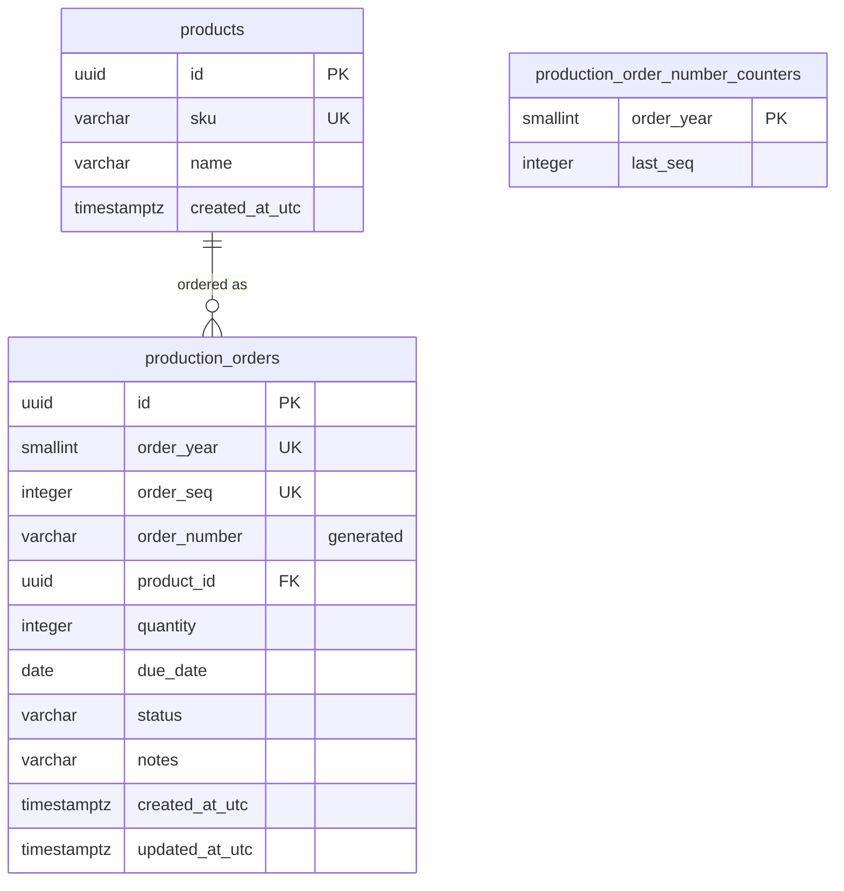

<!-- Based on ai/templates/database-design.md. -->

# ProductionManagementAI — Production Order Schema — Database Design Document (テーブル定義書)

DB-002 — requirements REQ-010–REQ-018 (`work-items/WI-002/brief.md`), basic design BD-001 (`docs/en/010_basic-design/BD-001-production-order-create-edit.md`), implements DD-001 and DD-001-API (`docs/en/020_detailed-design/`).

Physical naming follows DB-001: `snake_case` tables and columns (`EFCore.NamingConventions`, `UseSnakeCaseNamingConvention()` in `DependencyInjection.cs`), `uuid` surrogate keys defaulting to `gen_random_uuid()`, `timestamptz` UTC timestamps suffixed `_utc`, and constraint names in the `pk_`/`fk_`/`ix_`/`ck_` style EF Core generates.

## Table list

| Table | Physical name | Purpose |
| --- | --- | --- |
| Products | `products` | Minimal product reference data, seeded, no catalog UI (DEC-005) |
| Production orders | `production_orders` | One row per production order created on SCR-001 |
| Production order number counters | `production_order_number_counters` | Last issued order-number sequence per year, used to generate `PO-YYYY-NNNNN` (DEC-012, DEC-013) |

## ER diagram and relationships



`production_order_number_counters` has no foreign key: it is a counter keyed by the same year value as `production_orders.order_year`, not a parent row.

| Table | Related table | Relationship (1:1 / 1:N / N:N) | FK column |
| --- | --- | --- | --- |
| `products` | `production_orders` | 1:N (every order references exactly one product) | `production_orders.product_id` |

## Table definitions

### `products`

| Item name | Physical name | Data type | Length | NOT NULL | Default | PK/FK | Notes |
| --- | --- | --- | --- | --- | --- | --- | --- |
| Id | `id` | uuid | — | yes | `gen_random_uuid()` | PK | Seed rows use fixed UUIDs so seeding is reproducible |
| SKU | `sku` | varchar | 50 | yes | none | — | Unique business code; shown as "{SKU} — {name}" (BD-001 M-03) |
| Name | `name` | varchar | 200 | yes | none | — | |
| CreatedAtUtc | `created_at_utc` | timestamptz | — | yes | `now()` | — | |

Seed data: 30 sample products for the demo (DEC-019), inserted by the migration via EF Core `HasData` with fixed UUIDs. These are illustrative values, not real master data.

| sku | name |
| --- | --- |
| `P-1001` | Steel bracket |
| `P-1002` | Aluminium housing |
| `P-1003` | Control panel assembly |
| `P-1004` | Drive shaft |
| `P-1005` | Hydraulic valve |
| `P-1006` | Gearbox assembly |
| `P-1007` | Bearing housing |
| `P-1008` | Pump impeller |
| `P-1009` | Motor mount plate |
| `P-1010` | Conveyor roller |
| `P-1011` | Spur gear 40T |
| `P-1012` | Coupling flange |
| `P-1013` | Pneumatic cylinder |
| `P-1014` | Sensor bracket |
| `P-1015` | Cable harness A |
| `P-1016` | Cable harness B |
| `P-1017` | Terminal block unit |
| `P-1018` | Relay module |
| `P-1019` | Power supply unit |
| `P-1020` | PLC enclosure |
| `P-1021` | Heat sink |
| `P-1022` | Cooling fan assembly |
| `P-1023` | Filter housing |
| `P-1024` | Valve body |
| `P-1025` | Piston rod |
| `P-1026` | Spring assembly |
| `P-1027` | Welded frame |
| `P-1028` | Guard panel |
| `P-1029` | Hinge set |
| `P-1030` | Fastener kit |

### `production_orders`

| Item name | Physical name | Data type | Length | NOT NULL | Default | PK/FK | Notes |
| --- | --- | --- | --- | --- | --- | --- | --- |
| Id | `id` | uuid | — | yes | `gen_random_uuid()` | PK | Used in the edit route `/production-orders/{id}` |
| OrderYear | `order_year` | smallint | — | yes | none | — | Year of creation in the plant timezone, `Asia/Tokyo` (DEC-011, DEC-017); set by the application, never changed |
| OrderSeq | `order_seq` | integer | — | yes | none | — | 1–99999 within `order_year`; issued from `production_order_number_counters` (DEC-013); never changed |
| OrderNumber | `order_number` | varchar | 13 | yes | generated | — | `GENERATED ALWAYS AS ('PO-' \|\| order_year::text \|\| '-' \|\| lpad(order_seq::text, 5, '0')) STORED`, e.g. `PO-2026-00001` (DEC-012). Read-only to the application |
| ProductId | `product_id` | uuid | — | yes | none | FK → `products.id` | Changeable only while `status = 'Draft'` (REQ-018, application-enforced) |
| Quantity | `quantity` | integer | — | yes | none | — | `> 0` (REQ-013); changeable only while `Draft` |
| DueDate | `due_date` | date | — | yes | none | — | "≥ today" is application-enforced only (see Constraints) |
| Status | `status` | varchar | 20 | yes | `'Draft'` | — | `Draft` / `InProgress` / `Completed` / `Cancelled` (DEC-015); transitions application-enforced (REQ-017) |
| Notes | `notes` | varchar | 500 | no | none | — | NULL when empty (REQ-016) |
| CreatedAtUtc | `created_at_utc` | timestamptz | — | yes | `now()` | — | |
| UpdatedAtUtc | `updated_at_utc` | timestamptz | — | yes | `now()` | — | Set by the application on every successful update |
| (row version) | `xmin` (system column) | xid | — | — | — | — | Not a declared column. PostgreSQL's row-version system column, mapped by EF Core as the optimistic-concurrency token (DEC-010, DEC-014) |

### `production_order_number_counters`

| Item name | Physical name | Data type | Length | NOT NULL | Default | PK/FK | Notes |
| --- | --- | --- | --- | --- | --- | --- | --- |
| OrderYear | `order_year` | smallint | — | yes | none | PK | One row per year that has orders |
| LastSeq | `last_seq` | integer | — | yes | none | — | Last `order_seq` issued for that year; `1–99999` |

Order-number issuance (DEC-013), in the same transaction as the order insert:

```sql
INSERT INTO production_order_number_counters (order_year, last_seq)
VALUES (@year, 1)
ON CONFLICT (order_year) DO UPDATE SET last_seq = production_order_number_counters.last_seq + 1
RETURNING last_seq;
```

The upsert takes a row lock on that year's counter, so concurrent creates in the same year are serialized for the rest of the transaction and always get distinct numbers. If the insert fails and the transaction rolls back, the counter increment rolls back too, so numbers are not skipped. The statement is issued through the ORM's parameterized raw-SQL API (`ai/rules/database.md`).

## Index definitions

| Index name | Table | Column(s) | Type | Rationale (access pattern) |
| --- | --- | --- | --- | --- |
| `pk_products` | `products` | `id` | unique btree (PK) | Product lookup by ID when validating `product_id` (V-01) |
| `ix_products_sku` | `products` | `sku` | unique btree | Enforces unique SKU; the product dropdown is ordered by SKU (FN-004) |
| `pk_production_orders` | `production_orders` | `id` | unique btree (PK) | Load/update by ID (FN-002, FN-003) |
| `ix_production_orders_order_year_order_seq` | `production_orders` | `order_year, order_seq` | unique btree | Guarantees order-number uniqueness (DEC-006); `order_number` is derived from these two columns, so it is unique too |
| `ix_production_orders_product_id` | `production_orders` | `product_id` | btree | Added during implementation (DEC-029): EF Core's foreign-key convention always creates it. Serves the `ON DELETE RESTRICT` check and Screen B's expected product filter |
| `pk_production_order_number_counters` | `production_order_number_counters` | `order_year` | unique btree (PK) | Counter upsert by year |

Deliberately not added:

- ~~**`production_orders.product_id`**~~: originally left out, but added during implementation (DEC-029). See the index table.
- **`production_orders.order_number`:** uniqueness is already covered by the `(order_year, order_seq)` index, and Screen A never looks orders up by number. Screen B's search design will decide whether to add it.

## Constraints

| Constraint | Type (PK/FK/UNIQUE/CHECK) | Table.column(s) | References | Rule |
| --- | --- | --- | --- | --- |
| `pk_products` | PK | `products.id` | — | — |
| `ix_products_sku` | UNIQUE | `products.sku` | — | — |
| `pk_production_orders` | PK | `production_orders.id` | — | — |
| `fk_production_orders_products_product_id` | FK | `production_orders.product_id` | `products.id` | `ON DELETE RESTRICT` — a product with orders can't be deleted (REQ-015) |
| `ix_production_orders_order_year_order_seq` | UNIQUE | `production_orders.(order_year, order_seq)` | — | — |
| `ck_production_orders_quantity_positive` | CHECK | `production_orders.quantity` | — | `quantity > 0` (REQ-013) |
| `ck_production_orders_status` | CHECK | `production_orders.status` | — | `status IN ('Draft', 'InProgress', 'Completed', 'Cancelled')` (REQ-017) |
| `ck_production_orders_order_seq_range` | CHECK | `production_orders.order_seq` | — | `order_seq BETWEEN 1 AND 99999` — keeps `NNNNN` at five digits (DEC-013) |
| `ck_production_orders_order_year_range` | CHECK | `production_orders.order_year` | — | `order_year BETWEEN 2000 AND 9999` — keeps `YYYY` at four digits |
| `pk_production_order_number_counters` | PK | `production_order_number_counters.order_year` | — | — |
| `ck_production_order_number_counters_last_seq_range` | CHECK | `production_order_number_counters.last_seq` | — | `last_seq BETWEEN 1 AND 99999`. If a year's 100,000th order is attempted, the counter upsert fails, the whole create is rolled back and the API returns a server error (DEC-013) |

Rules deliberately **not** enforced in the database, and why:

| Rule | Why application-only |
| --- | --- |
| Due date ≥ today (REQ-014, DEC-009, DEC-011) | "Today" moves, and depends on the plant timezone. A CHECK would make valid historical rows fail on restore (`pg_restore`) or re-validation, and it can't express "only when changed" |
| Allowed status transitions (REQ-017) | Transitions depend on the previous value. A trigger could enforce them, but the Domain layer is the single source of the rule (ADR-0001); the CHECK above still blocks unknown values |
| Product/quantity locked after Draft (REQ-018, DEC-007) | Also depends on the previous row state; enforced in the Domain/Application layer and covered by tests |

## Transactions and concurrency

| Operation | Transaction scope | Concurrency control |
| --- | --- | --- |
| Create (FN-001) | Single transaction: counter upsert → insert `production_orders` | Counter row lock serializes same-year creates; unique `(order_year, order_seq)` as a backstop |
| Update (FN-002) | Single `UPDATE ... WHERE id = @id AND xmin = @version` (EF Core) | Optimistic: 0 rows affected → the order was changed since it was loaded → rejected (V-08, DEC-010). The client sends back the `version` it loaded |
| Read (FN-003, FN-004) | No explicit transaction | — |

## Application database privileges

Least privilege this feature needs (`ai/rules/database.md`):

| Table | Privileges |
| --- | --- |
| `products` | SELECT |
| `production_orders` | SELECT, INSERT, UPDATE (no DELETE — orders are never deleted) |
| `production_order_number_counters` | SELECT, INSERT, UPDATE |

Login split (DEC-016, decided: split now):

| Login | Used by | Privileges |
| --- | --- | --- |
| Owner (`POSTGRES_USER`, existing) | `dotnet ef database update` only | Owns the schema; runs DDL |
| Runtime (new, proposed name `pmai_app`) | The backend at runtime (`ConnectionStrings__DefaultConnection`) | `CONNECT` on the database, `USAGE` on schema `public`, the table grants above, plus what ASP.NET Core Identity and `IdentitySeeder` need on the DB-001 tables: SELECT/INSERT/UPDATE on `users`, `roles`, `user_roles`, `user_claims`, `role_claims`, `user_logins`, `user_tokens`, DELETE on `user_roles`/`user_claims`/`user_logins`/`user_tokens` (Identity removes these rows), and `USAGE, SELECT` on the identity sequences of `user_claims.id`/`role_claims.id`. No DDL, no TRUNCATE |

Implemented (plan revision 2): the `AddProductionOrders` migration, which runs as the owner, creates `pmai_app` as `NOLOGIN` if it's missing and applies these grants. `deploy/db/init/10-app-login.sh`, baked into the database image, gives it `LOGIN PASSWORD` from `PMAI_APP_DB_PASSWORD` on a fresh volume, so no password is in the repository. No `ALTER DEFAULT PRIVILEGES` blanket grant is used: any later migration that adds a table must extend the script with that table's explicit grants. The exact grant list is verified by the integration tests, which run the app as the runtime login, and by `RuntimeLogin_CannotDeleteOrdersOrRunDdl`.

## API / DD mapping

DD field names are BD-001 §3 variable names; API field names are confirmed in DD-001-API. DD-001-API adds two computed response-only fields (`allowedNextStatuses`, `isProductQuantityEditable`) that have no column.

| Table.column | DD field | API field |
| --- | --- | --- |
| `production_orders.id` | (route `id`) | `id` |
| `production_orders.order_number` | `orderNumber` | `orderNumber` (response only) |
| `production_orders.product_id` | `productId` | `productId` |
| `production_orders.quantity` | `quantity` | `quantity` |
| `production_orders.due_date` | `dueDate` | `dueDate` (ISO `YYYY-MM-DD`) |
| `production_orders.status` | `status` | `status` (`Draft` \| `InProgress` \| `Completed` \| `Cancelled`); request field on update only — create always yields `Draft` |
| `production_orders.notes` | `notes` | `notes` (`null` when empty) |
| `production_orders.created_at_utc` | `createdAt` | `createdAt` (response only, ISO 8601 UTC) |
| `production_orders.updated_at_utc` | `updatedAt` | `updatedAt` (response only, ISO 8601 UTC) |
| `production_orders.xmin` | (hidden) | `version` (in the response; required in update requests) |
| `production_orders.order_year`, `order_seq` | — | not exposed (internal to order-number generation) |
| `products.id` | `productId` options | `GET /api/products` → `id` |
| `products.sku`, `products.name` | Product option label (M-03) | `GET /api/products` → `sku`, `name` |

## Migration impact and recovery limits

- **Migration type:** additive — one new EF Core migration (proposed name `AddProductionOrders`) creates three new tables plus the product seed rows. No existing table is changed.
- **Data recovery limit:** there are no existing rows to lose when applying it. Rolling it back after use permanently deletes every production order and counter row. Take a `pg_dump` of these tables first if their data matters.
- **Rollback plan:** `dotnet ef database update InitialIdentitySchema --project src/backend/ProductionManagementAI.Infrastructure --startup-project src/backend/ProductionManagementAI.Api` drops the three tables. Nothing outside them references them.
- **Operational note:** the generated `order_number` column is defined with EF Core `HasComputedColumnSql(..., stored: true)`. The expression uses explicit `::text` casts because PostgreSQL requires generation expressions to be immutable.

## Open decisions

| Decision | Options | Recommendation | Status |
| --- | --- | --- | --- |
| How to generate the per-year order sequence | per-year counter table with upsert; `MAX(order_seq)+1` with retry; one PostgreSQL sequence per year | Counter table | decided — see `work-items/WI-002/decisions.md` DEC-013 |
| What happens past 99,999 orders in one year | reject the create; widen to 6 digits | Reject (CHECK constraint) | decided — DEC-013 |
| Optimistic-concurrency token | PostgreSQL `xmin`; explicit `version` column | `xmin` | decided — DEC-014 |
| Status storage | `varchar` + CHECK; PostgreSQL enum type; smallint code | `varchar` + CHECK | decided — DEC-015 |
| Split migration-owner and restricted runtime DB roles | split now; keep the single owner role for the local demo | Split before any shared/non-local deployment | decided — split now (DEC-016, user) |
| Demo product seed size | 5; ~15; 30 | 5 | decided — 30 (DEC-019, user) |
