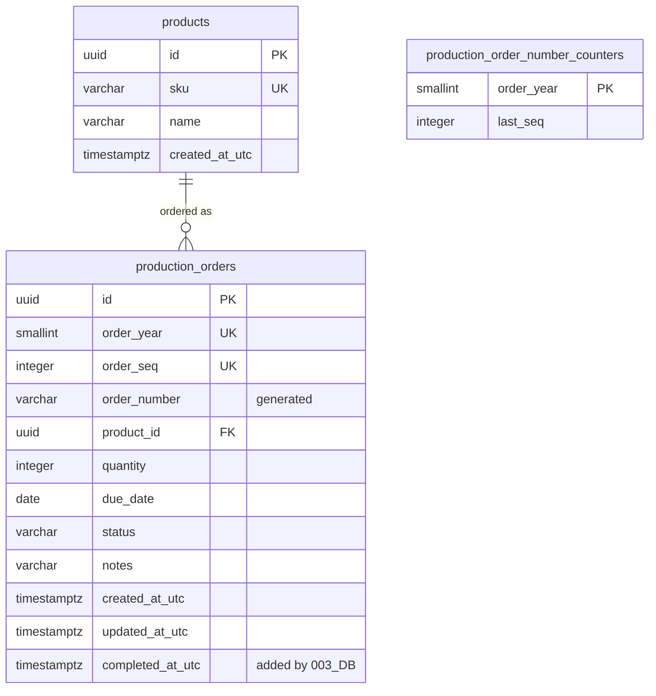

<!-- Based on ai/templates/database-design.md (the revision matching ai/templates/example/DatabaseDesign/). -->

# ProductionManagementAI — Production Order Schema — Database Design Document (テーブル定義書)

001_DB — requirements REQ-010–REQ-018 (`work-items/WI-002/brief.md`), basic design 001_BD (`docs/en/010_basic-design/001/001_BD_製造指示登録・編集.md`), implements 001_DD and 001_DD-API (`docs/en/020_detailed-design/`).

Extended by 003_DB (`003_DB_ダッシュボード.md`, WI-004): `production_orders` gains `completed_at_utc` and two check constraints. The column is listed below with a pointer; its definition, constraints and migration belong to 003_DB. 002_DB and 003_DB add indexes on `production_orders`, listed in their own documents.

Physical naming follows 000_DB: `snake_case` tables and columns (`EFCore.NamingConventions`, `UseSnakeCaseNamingConvention()` in `DependencyInjection.cs`), `uuid` surrogate keys defaulting to `gen_random_uuid()`, `timestamptz` UTC timestamps suffixed `_utc`, and constraint names in the `pk_`/`fk_`/`ix_`/`ck_` style EF Core generates.

## Document control (改版履歴)

| Field | Value |
| --- | --- |
| Document ID | 001_DB |
| System name | ProductionManagementAI |
| Work item | WI-002 |
| Database | `production_management_ai`, schema `public` |
| DBMS | PostgreSQL 17 |
| Character set | UTF-8 |
| Created by | Claude (for ThanhTN) |
| Created date | 2026-09-18 |
| Last updated by | Claude (for ThanhTN) |
| Last updated date | 2026-09-28 |

| No | Target | Work item | Change | Date | Author |
| --- | --- | --- | --- | --- | --- |
| 1 | All | WI-002 | Initial creation (as DB-002): `products`, `production_orders`, `production_order_number_counters`, runtime login `pmai_app` | 2026-09-18 | Claude (for ThanhTN) |
| 2 | Index definitions | WI-003 | `order_number` search index decision pointed to 002_DB (WI-003 DEC-010) | 2026-09-22 | Claude (for ThanhTN) |
| 3 | `production_orders` | WI-004 | Pointer to 003_DB's `completed_at_utc` extension | 2026-09-22 | Claude (for ThanhTN) |
| 4 | `products` | WI-005 | Seeded product names made Japanese (migration `LocalizeDemoDataToJapanese`); renamed to 001_DB (RFC 0010); English and Japanese PDFs added (RFC 0008) | 2026-09-23 | Claude (for ThanhTN) |
| 5 | All | — | File named with the screen's Japanese name (RFC 0011) | 2026-09-24 | Claude (for ThanhTN) |
| 6 | All | — | Restructured to the table-definition template: document control, table list with lifecycle, per-table header and PK/UK/FK/validation/code-value columns, index list with sort order and build method, trigger list, database role section, migration table. `completed_at_utc` listed with a pointer to 003_DB. `order_number` expression moved below its table; rollback plan notes the later migrations | 2026-09-28 | Claude (for ThanhTN) |

## Table list (テーブル一覧)

| No | Schema | Physical name | Logical name | Overview | Indexes beyond PK | Triggers | Created | Schema changed | Dropped | Status |
| --- | --- | --- | --- | --- | --- | --- | --- | --- | --- | --- |
| 1 | `public` | `products` | [Products](#products-products) | Minimal product reference data, seeded, no catalog UI (DEC-005) | yes | no | 2026-09-18 | — | — | in use |
| 2 | `public` | `production_orders` | [Production orders](#production-orders-production_orders) | One row per production order created on SCR-001 | yes | no | 2026-09-18 | 2026-09-22 (003_DB: `completed_at_utc`, two checks) | — | in use |
| 3 | `public` | `production_order_number_counters` | [Production order number counters](#production-order-number-counters-production_order_number_counters) | Last issued order-number sequence per year, used to generate `PO-YYYY-NNNNN` (DEC-012, DEC-013) | no | no | 2026-09-18 | — | — | in use |

"Created" is the date of the migration `AddProductionOrders` (2026-09-18). The indexes 002_DB and 003_DB add are dated in those documents' index lists.

## ER diagram and relationships



`production_order_number_counters` has no foreign key: it is a counter keyed by the same year value as `production_orders.order_year`, not a parent row.

| Table | Related table | Relationship (1:1 / 1:N / N:N) | FK column |
| --- | --- | --- | --- |
| `products` | `production_orders` | 1:N (every order references exactly one product; a product may have none) | `production_orders.product_id` |

## Table definitions (テーブル定義)

Validation IDs (V-##) are 001_BD's; the API enforces them in the Application and Domain layers (001_DD). `ck_…` names a check constraint from the Constraints section that backs the rule in the database.

### Products (`products`)

| Field | Value |
| --- | --- |
| Logical name | Products (製品) |
| Physical name | `products` |
| Schema | `public` |
| Overview | Minimal product reference data for the product dropdown and labels. Written only by migrations (seed); the application only reads it. No catalog UI (DEC-005) |
| Estimated volume | small, bounded — 30 seeded rows |
| Retention / deletion | kept; a product with orders can't be deleted (`ON DELETE RESTRICT`) |

| No | Item name | Physical name | Data type | Length | NOT NULL | Default | PK | UK | FK | Validation | Used | Description | Code values | Notes |
| --- | --- | --- | --- | --- | --- | --- | --- | --- | --- | --- | --- | --- | --- | --- |
| 1 | Id | `id` | uuid | — | yes | `gen_random_uuid()` | ○ | | | — | ○ | Product key | — | Seed rows use fixed UUIDs so seeding is reproducible |
| 2 | SKU | `sku` | varchar | 50 | yes | none | | ○ | | — (seed only) | ○ | Unique business code | — | Shown as "{SKU} — {name}" (001_BD M-03), e.g. `P-1004 — ドライブシャフト`; the dropdown is ordered by SKU (FN-004) |
| 3 | Name | `name` | varchar | 200 | yes | none | | | | — (seed only) | ○ | Product name | — | Japanese since WI-005; 200 characters is ample for Japanese part names |
| 4 | CreatedAtUtc | `created_at_utc` | timestamptz | — | yes | `now()` | | | | — | | When the row was inserted (UTC) | — | |

- **Usage patterns (パターン):** Not applicable — one kind of record.
- **CSV import/export (DL対象 / UL更新):** Not applicable — no CSV import/export.
- **Seed data:** 30 sample products for the demo (DEC-019), inserted by the migration via EF Core `HasData` with fixed UUIDs. These are illustrative values, not real master data. Since WI-005 the demo is an automobile-parts manufacturer and the names are Japanese (WI-005 DEC-002); SKUs and UUIDs are unchanged, so every order and figure that refers to a product still does.

| sku | name | English gloss | Name before WI-005 |
| --- | --- | --- | --- |
| `P-1001` | ブレーキキャリパー | brake caliper | Steel bracket |
| `P-1002` | ブレーキディスクローター | brake disc rotor | Aluminium housing |
| `P-1003` | ブレーキパッド | brake pad | Control panel assembly |
| `P-1004` | ドライブシャフト | drive shaft | Drive shaft |
| `P-1005` | 等速ジョイント | constant-velocity joint | Hydraulic valve |
| `P-1006` | トランスミッションケース | transmission case | Gearbox assembly |
| `P-1007` | ハブベアリング | hub bearing | Bearing housing |
| `P-1008` | ウォーターポンプ | water pump | Pump impeller |
| `P-1009` | エンジンマウント | engine mount | Motor mount plate |
| `P-1010` | ラジエーター | radiator | Conveyor roller |
| `P-1011` | タイミングギア | timing gear | Spur gear 40T |
| `P-1012` | クラッチディスク | clutch disc | Coupling flange |
| `P-1013` | ショックアブソーバー | shock absorber | Pneumatic cylinder |
| `P-1014` | コイルスプリング | coil spring | Sensor bracket |
| `P-1015` | エンジンワイヤーハーネス | engine wire harness | Cable harness A |
| `P-1016` | ボディワイヤーハーネス | body wire harness | Cable harness B |
| `P-1017` | ヘッドランプユニット | headlamp unit | Terminal block unit |
| `P-1018` | リレーボックス | relay box | Relay module |
| `P-1019` | オルタネーター | alternator | Power supply unit |
| `P-1020` | ECU ケース | ECU case | PLC enclosure |
| `P-1021` | インタークーラー | intercooler | Heat sink |
| `P-1022` | 電動ファン | electric cooling fan | Cooling fan assembly |
| `P-1023` | オイルフィルター | oil filter | Filter housing |
| `P-1024` | スロットルボディ | throttle body | Valve body |
| `P-1025` | ピストン | piston | Piston rod |
| `P-1026` | コネクティングロッド | connecting rod | Spring assembly |
| `P-1027` | サブフレーム | subframe | Welded frame |
| `P-1028` | ドアパネル | door panel | Guard panel |
| `P-1029` | ドアヒンジ | door hinge | Hinge set |
| `P-1030` | ボルト・ナットキット | bolt and nut kit | Fastener kit |

### Production orders (`production_orders`)

| Field | Value |
| --- | --- |
| Logical name | Production orders (製造指示) |
| Physical name | `production_orders` |
| Schema | `public` |
| Overview | One row per production order. Created and updated on SCR-001 (FN-001, FN-002); read by SCR-002 (002_DB) and SCR-003 (003_DB). Demo orders are seeded by 002_DB and 003_DB |
| Estimated volume | about 15,000 rows a year for one plant (002_DB sizing); the demo database holds 124 |
| Retention / deletion | kept forever; never deleted (no DELETE privilege). `Cancelled` is a status, not a deletion |

| No | Item name | Physical name | Data type | Length | NOT NULL | Default | PK | UK | FK | Validation | Used | Description | Code values | Notes |
| --- | --- | --- | --- | --- | --- | --- | --- | --- | --- | --- | --- | --- | --- | --- |
| 1 | Id | `id` | uuid | — | yes | `gen_random_uuid()` | ○ | | | — | ○ | Order key | — | Used in the edit route `/production-orders/{id}` |
| 2 | OrderYear | `order_year` | smallint | — | yes | none | | ○ (with `order_seq`) | | Set by the application; `ck_…_order_year_range` | ○ | Year of creation in the plant timezone, `Asia/Tokyo` (DEC-011, DEC-017) | — | Never changed. Not exposed by the API |
| 3 | OrderSeq | `order_seq` | integer | — | yes | none | | ○ (with `order_year`) | | Issued from `production_order_number_counters`; `ck_…_order_seq_range` | ○ | Sequence within `order_year`, 1–99999 (DEC-013) | — | Never changed. Not exposed by the API |
| 4 | OrderNumber | `order_number` | varchar | 13 | yes | generated | | (unique through `order_year`, `order_seq`) | | — (read-only) | ○ | Display order number, e.g. `PO-2026-00001` (DEC-012) | — | Stored generated column; expression below the table. Read-only to the application |
| 5 | ProductId | `product_id` | uuid | — | yes | none | | | `products.id` | V-01, V-07 | ○ | Ordered product | — | Changeable only while `status = 'Draft'` (REQ-018, application-enforced) |
| 6 | Quantity | `quantity` | integer | — | yes | none | | | | V-02, V-07; `ck_…_quantity_positive` | ○ | Quantity to produce | — | `> 0` (REQ-013); changeable only while `Draft` |
| 7 | DueDate | `due_date` | date | — | yes | none | | | | V-03, V-04 | ○ | Due date (plant-local calendar date) | — | "≥ today" is application-enforced only (see Constraints) |
| 8 | Status | `status` | varchar | 20 | yes | `'Draft'` | | | | V-06; `ck_production_orders_status` | ○ | Workflow status | `Draft`: 下書き (draft); `InProgress`: 進行中 (in progress); `Completed`: 完了 (completed); `Cancelled`: 取消 (cancelled) | DEC-015; transitions application-enforced (REQ-017, 001_BD M-02) |
| 9 | Notes | `notes` | varchar | 500 | no | none | | | | V-05 | ○ | Free-text notes | — | NULL when empty (REQ-016) |
| 10 | CreatedAtUtc | `created_at_utc` | timestamptz | — | yes | `now()` | | | | — | ○ | When the order was created (UTC) | — | |
| 11 | UpdatedAtUtc | `updated_at_utc` | timestamptz | — | yes | `now()` | | | | — | ○ | When the order was last saved (UTC) | — | Set by the application on every successful update |
| 12 | CompletedAtUtc | `completed_at_utc` | timestamptz | — | no | none | | | | — (set by the application) | ○ | When the order became `Completed` | — | Added by 003_DB (WI-004); defined there |
| — | (row version) | `xmin` (system column) | xid | — | — | — | | | | V-08 | ○ | Row version | — | Not a declared column. PostgreSQL's row-version system column, mapped by EF Core as the optimistic-concurrency token (DEC-010, DEC-014) |

Generation expression of `order_number`:

```sql
GENERATED ALWAYS AS ('PO-' || order_year::text || '-' || lpad(order_seq::text, 5, '0')) STORED
```

- **Usage patterns (パターン):** Not applicable — one kind of record.
- **CSV import/export (DL対象 / UL更新):** Not applicable — no CSV import/export.
- **Seed data:** none from this document. 002_DB and 003_DB seed 124 demo orders.

### Production order number counters (`production_order_number_counters`)

| Field | Value |
| --- | --- |
| Logical name | Production order number counters (製造指示番号採番) |
| Physical name | `production_order_number_counters` |
| Schema | `public` |
| Overview | The last `order_seq` issued per year. Written only by the order-create transaction (FN-001) and by the demo seeds |
| Estimated volume | small, bounded — one row per year that has orders |
| Retention / deletion | kept; never deleted, so no order number is reused |

| No | Item name | Physical name | Data type | Length | NOT NULL | Default | PK | UK | FK | Validation | Used | Description | Code values | Notes |
| --- | --- | --- | --- | --- | --- | --- | --- | --- | --- | --- | --- | --- | --- | --- |
| 1 | OrderYear | `order_year` | smallint | — | yes | none | ○ | | | — | ○ | Plant-local year | — | Same value as `production_orders.order_year`; not a foreign key |
| 2 | LastSeq | `last_seq` | integer | — | yes | none | | | | `ck_…_last_seq_range` | ○ | Last `order_seq` issued for that year | — | `1–99999` |

- **Usage patterns (パターン):** Not applicable — one kind of record.
- **CSV import/export (DL対象 / UL更新):** Not applicable — no CSV import/export.
- **Seed data:** the seed year's row, written by 002_DB's and 003_DB's demo seeds so that Screen A continues after the seeded orders.

Order-number issuance (DEC-013), in the same transaction as the order insert:

```sql
INSERT INTO production_order_number_counters (order_year, last_seq)
VALUES (@year, 1)
ON CONFLICT (order_year) DO UPDATE SET last_seq = production_order_number_counters.last_seq + 1
RETURNING last_seq;
```

The upsert takes a row lock on that year's counter, so concurrent creates in the same year are serialized for the rest of the transaction and always get distinct numbers. If the insert fails and the transaction rolls back, the counter increment rolls back too, so numbers are not skipped. The statement is issued through the ORM's parameterized raw-SQL API (`ai/rules/database.md`).

## Index definitions (インデックス一覧)

Indexes created by `AddProductionOrders` (2026-09-18) on new tables, so none needed `CONCURRENTLY`. 002_DB and 003_DB add four more indexes on `production_orders`, listed in their own documents.

| No | Table | Index name | Method | Unique | Column(s) and sort order | Partial predicate / INCLUDE | Built concurrently | Created | Dropped | Rationale (access pattern) |
| --- | --- | --- | --- | --- | --- | --- | --- | --- | --- | --- |
| 1 | `products` | `pk_products` | btree | yes | `id` ASC | — | no — new table | 2026-09-18 | — | Product lookup by ID when validating `product_id` (V-01) |
| 2 | `products` | `ix_products_sku` | btree | yes | `sku` ASC | — | no — new table | 2026-09-18 | — | Enforces unique SKU; the product dropdown is ordered by SKU (FN-004) |
| 3 | `production_orders` | `pk_production_orders` | btree | yes | `id` ASC | — | no — new table | 2026-09-18 | — | Load/update by ID (FN-002, FN-003) |
| 4 | `production_orders` | `ix_production_orders_order_year_order_seq` | btree | yes | `order_year` ASC, `order_seq` ASC | — | no — new table | 2026-09-18 | — | Guarantees order-number uniqueness (DEC-006); `order_number` is derived from these two columns, so it is unique too |
| 5 | `production_orders` | `ix_production_orders_product_id` | btree | no | `product_id` ASC | — | no — new table | 2026-09-18 | — | Added during implementation (DEC-029): EF Core's foreign-key convention always creates it. Serves the `ON DELETE RESTRICT` check and Screen B's product filter |
| 6 | `production_order_number_counters` | `pk_production_order_number_counters` | btree | yes | `order_year` ASC | — | no — new table | 2026-09-18 | — | Counter upsert by year |

Deliberately not added:

- **`production_orders.product_id`** (no longer applies): originally left out, but added during implementation (DEC-029). It is No. 5 in the index table.
- **`production_orders.order_number`:** uniqueness is already covered by the `(order_year, order_seq)` index, and Screen A never looks orders up by number. Screen B's search design decided this: 002_DB adds a `pg_trgm` GIN index for its case-insensitive fragment search (WI-003 DEC-010), not a btree.

## Trigger definitions (トリガー一覧)

None — no triggers. The status-transition and locked-field rules could be written as triggers, but the Domain layer is their single source (0001_ADR); see "Rules deliberately not enforced in the database" under Constraints.

## Constraints

| Constraint | Type (PK/FK/UNIQUE/CHECK/EXCLUDE) | Table.column(s) | References | Rule |
| --- | --- | --- | --- | --- |
| `pk_products` | PK | `products.id` | — | — |
| `ix_products_sku` | UNIQUE (unique index) | `products.sku` | — | Enforced by the unique index; no separate constraint |
| `pk_production_orders` | PK | `production_orders.id` | — | — |
| `fk_production_orders_products_product_id` | FK | `production_orders.product_id` | `products.id` | `ON DELETE RESTRICT` — a product with orders can't be deleted (REQ-015) |
| `ix_production_orders_order_year_order_seq` | UNIQUE (unique index) | `production_orders.(order_year, order_seq)` | — | Enforced by the unique index; no separate constraint |
| `ck_production_orders_quantity_positive` | CHECK | `production_orders.quantity` | — | `quantity > 0` (REQ-013) |
| `ck_production_orders_status` | CHECK | `production_orders.status` | — | `status IN ('Draft', 'InProgress', 'Completed', 'Cancelled')` (REQ-017) |
| `ck_production_orders_order_seq_range` | CHECK | `production_orders.order_seq` | — | `order_seq BETWEEN 1 AND 99999` — keeps `NNNNN` at five digits (DEC-013) |
| `ck_production_orders_order_year_range` | CHECK | `production_orders.order_year` | — | `order_year BETWEEN 2000 AND 9999` — keeps `YYYY` at four digits |
| `pk_production_order_number_counters` | PK | `production_order_number_counters.order_year` | — | — |
| `ck_production_order_number_counters_last_seq_range` | CHECK | `production_order_number_counters.last_seq` | — | `last_seq BETWEEN 1 AND 99999`. If a year's 100,000th order is attempted, the counter upsert fails, the whole create is rolled back and the API returns a server error (DEC-013) |

Rules deliberately **not** enforced in the database, and why:

| Rule | Why application-only |
| --- | --- |
| Due date ≥ today (REQ-014, DEC-009, DEC-011) | "Today" moves, and depends on the plant timezone. A CHECK would make valid historical rows fail on restore (`pg_restore`) or re-validation, and it can't express "only when changed" |
| Allowed status transitions (REQ-017) | Transitions depend on the previous value. A trigger could enforce them, but the Domain layer is the single source of the rule (0001_ADR); the CHECK above still blocks unknown values |
| Product/quantity locked after Draft (REQ-018, DEC-007) | Also depends on the previous row state; enforced in the Domain/Application layer and covered by tests |

## Transactions and concurrency

| Operation | Transaction scope | Concurrency control |
| --- | --- | --- |
| Create (FN-001) | Single transaction: counter upsert → insert `production_orders` | Counter row lock serializes same-year creates; unique `(order_year, order_seq)` as a backstop |
| Update (FN-002) | Single `UPDATE ... WHERE id = @id AND xmin = @version` (EF Core) | Optimistic: 0 rows affected → the order was changed since it was loaded → rejected (V-08, DEC-010). The client sends back the `version` it loaded |
| Read (FN-003, FN-004) | No explicit transaction | — |

## Database role and privileges

Least privilege this feature needs (`ai/rules/database.md`). Login split: DEC-016 (decided: split now).

| Role | Used by | Privileges on these tables | Reason |
| --- | --- | --- | --- |
| `pmai_app` (runtime login) | The backend at runtime (`ConnectionStrings__DefaultConnection`) | SELECT on `products`; SELECT, INSERT, UPDATE on `production_orders` and `production_order_number_counters`. Also `CONNECT` on the database, `USAGE` on schema `public`, and the grants on the 000_DB tables (listed in 000_DB) | Reads products for the dropdown; creates and updates orders; upserts the counter. No DELETE — orders are never deleted. No DDL, no TRUNCATE |
| Owner (`POSTGRES_USER`) | `dotnet ef database update` only | owner — DDL | Owns the schema; runs every migration |

Implemented (plan revision 2): the `AddProductionOrders` migration, which runs as the owner, creates `pmai_app` as `NOLOGIN` if it's missing and applies these grants. `deploy/db/init/10-app-login.sh`, baked into the database image, gives it `LOGIN PASSWORD` from `PMAI_APP_DB_PASSWORD` on a fresh volume, so no password is in the repository. No `ALTER DEFAULT PRIVILEGES` blanket grant is used: any later migration that adds a table must extend the script with that table's explicit grants. The exact grant list is verified by the integration tests, which run the app as the runtime login, and by `RuntimeLogin_CannotDeleteOrdersOrRunDdl`.

## API / DD mapping

DD field names are 001_BD §3 variable names; API field names are confirmed in 001_DD-API. 001_DD-API adds two computed response-only fields (`allowedNextStatuses`, `isProductQuantityEditable`) that have no column.

| Table.column | DD field | API field |
| --- | --- | --- |
| `production_orders.id` | (route `id`) | `id` |
| `production_orders.order_number` | `orderNumber` | `orderNumber` (response only) |
| `production_orders.product_id` | `productId` | `productId` |
| `production_orders.quantity` | `quantity` | `quantity` |
| `production_orders.due_date` | `dueDate` | `dueDate` (ISO `YYYY-MM-DD`) |
| `production_orders.status` | `status` | `status` (`Draft` \| `InProgress` \| `Completed` \| `Cancelled`); request field on update only — create always yields `Draft` |
| `production_orders.notes` | `notes` | `notes` (`null` when empty) |
| `production_orders.created_at_utc` | `createdAt` | `createdAt` (response only, ISO 8601 UTC) |
| `production_orders.updated_at_utc` | `updatedAt` | `updatedAt` (response only, ISO 8601 UTC) |
| `production_orders.xmin` | (hidden) | `version` (in the response; required in update requests) |
| `production_orders.order_year`, `order_seq` | — | not exposed (internal to order-number generation) |
| `products.id` | `productId` options | `GET /api/products` → `id` |
| `products.sku`, `products.name` | Product option label (M-03) | `GET /api/products` → `sku`, `name` |

## Migration impact and recovery limits

| Migration | Type | Tables touched | Live table? | Sequence |
| --- | --- | --- | --- | --- |
| `AddProductionOrders` (2026-09-18) | additive | `products`, `production_orders`, `production_order_number_counters` (created); product seed; `pmai_app` grants | no — new tables | single step |
| `LocalizeDemoDataToJapanese` (2026-09-23, WI-005) | data-transforming | `products`, `production_orders` (data only, no DDL) | yes | single step |

- **Data recovery limit:** there are no existing rows to lose when applying it. Rolling it back after use permanently deletes every production order and counter row. Take a `pg_dump` of these tables first if their data matters.
- **Rollback plan:** `dotnet ef database update InitialIdentitySchema --project src/backend/ProductionManagementAI.Infrastructure --startup-project src/backend/ProductionManagementAI.Api` drops the three tables. Later migrations (002_DB, 003_DB) index, alter and seed these tables, so they must be reverted first.
- **WI-005 data migration `LocalizeDemoDataToJapanese`:** data only, no DDL. It renames the 30 seeded products by their fixed UUIDs (EF `UpdateData`, from `ProductSeed`), and rewrites the notes of WI-003's seeded orders from `Demo order N` to `デモ用の製造指示 N`, matched by the seed id prefix `0197e4a0-0000-7000-8001-` and by the exact old text, so orders users created, and seeded notes a user edited, are never touched (WI-005 DEC-008). `Down` restores both. It runs as the owner like every migration and needs no new privilege; an existing Compose volume needs no wipe. A user who renamed a seeded product in the database directly would have that name overwritten, which is acceptable because there is no product UI.
- **Operational note:** the generated `order_number` column is defined with EF Core `HasComputedColumnSql(..., stored: true)`. The expression uses explicit `::text` casts because PostgreSQL requires generation expressions to be immutable.

## Open decisions

| Decision | Options | Recommendation | Status |
| --- | --- | --- | --- |
| How to generate the per-year order sequence | per-year counter table with upsert; `MAX(order_seq)+1` with retry; one PostgreSQL sequence per year | Counter table | decided — see `work-items/WI-002/decisions.md` DEC-013 |
| What happens past 99,999 orders in one year | reject the create; widen to 6 digits | Reject (CHECK constraint) | decided — DEC-013 |
| Optimistic-concurrency token | PostgreSQL `xmin`; explicit `version` column | `xmin` | decided — DEC-014 |
| Status storage | `varchar` + CHECK; PostgreSQL enum type; smallint code | `varchar` + CHECK | decided — DEC-015 |
| Split migration-owner and restricted runtime DB roles | split now; keep the single owner role for the local demo | Split before any shared/non-local deployment | decided — split now (DEC-016, user) |
| Demo product seed size | 5; ~15; 30 | 5 | decided — 30 (DEC-019, user) |
