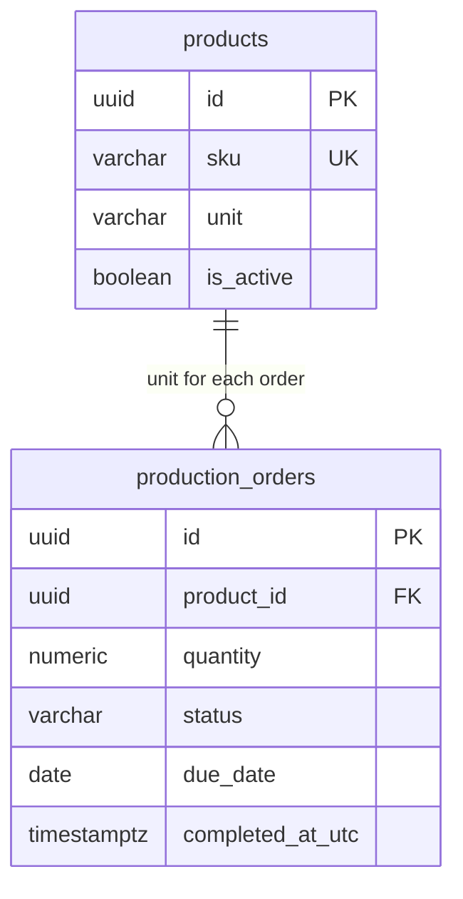

# ProductionManagementAI — Product master impact on orders and dashboard — Database Design Addendum (テーブル定義追補)

`004_DB-EXISTING-SCREENS` is a new WI-006-owned database design for the order quantity and read-query changes caused by product units. It extends, without editing, the approved [001_DB](../001/001_DB_製造指示登録・編集.md), [002_DB](../002/002_DB_製造指示一覧.md), and [003_DB](../003/003_DB_ダッシュボード.md). It consumes [004_DB](004_DB_製品マスタ.md) version 2, the approved [WI-006 screen-impact BD](../../010_basic-design/004/004_BD-EXISTING-SCREENS_製品マスタ影響.md), and [WI-006 brief](../../../../work-items/WI-006/brief.md) REQ-052, REQ-056–REQ-060.

Physical names remain `snake_case` in PostgreSQL 17; `production_orders` retains its UUID key, restrictive product FK, UTC timestamps, status values, plant-time date semantics and existing indexes. This document specifies a design and migration intent only. No schema change or query has been executed.

## Document control (改版履歴)

| Field | Value |
| --- | --- |
| Document ID | 004_DB-EXISTING-SCREENS |
| Work item | WI-006 |
| Database / schema | `production_management_ai` / `public` |
| DBMS / encoding | PostgreSQL 17 / UTF-8 |
| Created / updated | Codex, 2026-09-29 |
| Version | 1 — decimal order quantity and unit-safe dashboard queries |

| No. | Target | Change |
| --- | --- | --- |
| 1 | `production_orders.quantity` | Convert positive `integer` to exact `numeric` with range and scale checks; preserve existing values |
| 2 | Order reads and dashboard Q2–Q5 | Join the product unit, aggregate quantity only within a unit, and use order counts across units |
| 3 | Migration and recovery | State write-pause, validation, lock and rollback limits before implementation |

## Table list (テーブル一覧)

| No. | Schema | Physical name | Logical name | Overview | Indexes beyond PK | Triggers | Status |
| --- | --- | --- | --- | --- | --- | --- | --- |
| 1 | `public` | `production_orders` | Production orders | Existing order; `quantity` type and checks change in WI-006 | Existing, retained | No | Existing, in-place type conversion planned |
| 2 | `public` | `products` | Product master | Unit and active state defined in 004_DB; joined for order validation and display | Existing plus 004_DB SKU index | No | Existing, 004_DB additive changes planned |
| 3 | `public` | `production_order_number_counters` | Order-number counters | Unchanged by WI-006 | Existing | No | Existing, unchanged |

## ER diagram and relationship

The required `production_orders.product_id` still references one `products.id` with `ON DELETE RESTRICT`. A product's unit cannot change after any order references it (REQ-057, 004_DB). Consequently a historical order's quantity is always interpreted using that referenced product's unit. No quantity-unit snapshot column or new foreign key is introduced. A retired product remains joinable and readable for old orders (REQ-052).

## Table definitions (テーブル定義)

### Production orders (`production_orders`) — changed column

| Field | Value |
| --- | --- |
| Overview | One row per production order, created/edited in SCR-001 and read by SCR-002/SCR-003 |
| Estimated volume | About 15,000 rows per year for one plant; the demo database has 124 seeded orders (002_DB/003_DB) |
| Retention/deletion | Kept; WI-006 adds no order deletion |
| Usage patterns | Discrete-unit and measured-unit orders share one quantity column |
| CSV import/export | Not applicable — no order CSV import/export in WI-006 |

| Item | Physical name | Existing type | Target PostgreSQL type | Nullable | Default | Validation | Meaning |
| --- | --- | --- | --- | --- | --- | --- | --- |
| Quantity | `quantity` | `integer` | unconstrained `numeric` (no declared precision/scale) | no | none | `quantity > 0`, `quantity <= 999999999`, `scale(quantity) <= 3`; application checks integer for discrete units | Exact positive quantity in the referenced product's unit |

Unconstrained `numeric` is intentional. PostgreSQL rounds input to a declared column scale before a CHECK can see it; `numeric(12,3)` could silently accept `1.2345` as a rounded value. Unconstrained `numeric` plus `scale(quantity) <= 3` rejects that input instead, including a lexical fourth trailing decimal digit such as `1.2340`. The API also validates the submitted decimal text before persistence, so its field error is clear. `numeric` is exact; `real`/`double precision` are excluded. The range and scale checks bound the stored value despite the unconstrained type. [PostgreSQL 17 numeric type](https://www.postgresql.org/docs/17/datatype-numeric.html) explains scale coercion; [PostgreSQL 17 `scale(numeric)`](https://www.postgresql.org/docs/17/functions-math.html) defines the scale function.

| Product unit | Valid quantity | Invalid examples |
| --- | --- | --- |
| `個`, `本`, `枚`, `台`, `セット` | Integer from 1 through 999,999,999 | `0`, `1.5`, `999999999.001` |
| `kg`, `m` | Positive value at least `0.001`, at most 999,999,999, with 0–3 fractional digits | `0`, `0.0001`, `1.2345`, `999999999.001` |

The minimum measured value follows from `quantity > 0` and at most three decimal places. A cross-table CHECK cannot inspect `products.unit`; the server validates the integer/decimal distinction inside the order-write transaction after locking and reading the product row (`FOR SHARE` in 004_DB). It applies both on create and on any allowed Draft edit. If a Draft order retains an unchanged retired product, the server still validates quantity against that product's immutable unit. Product and quantity remain locked after Draft per the approved 001_BD. No floating-point conversion is allowed in API, domain, or query paths.

### Products (`products`) — read dependency

This addendum adds no `products` column. [004_DB](004_DB_製品マスタ.md) owns `unit`, `is_active`, seeded-unit mapping, the product-row transaction rule, and its migration. Order reads join `products` to obtain the unit and current product identity. SCR-002's filter includes retired products; order create/change eligibility uses `is_active`, while an unchanged historical selection may remain retired. The existing `ix_production_orders_product_id` supports the 004_DB reference-existence check.

## Index definitions (インデックス一覧)

No index is added solely for the type change or unit joins. Existing indexes are retained:

| Index | Table | Access pattern after WI-006 | Decision |
| --- | --- | --- | --- |
| `pk_production_orders` | `production_orders` | Edit/detail by ID | Retain |
| `ix_production_orders_product_id` | `production_orders` | Product filter, FK, referenced-unit lock check | Retain |
| `ix_production_orders_active_due_date` | `production_orders` | Workload, attention and top-product active set | Retain |
| `ix_production_orders_completed_at_utc` | `production_orders` | Completed week/month, rate, trend and lead time | Retain |
| `pk_products` | `products` | FK join for unit and identity | Retain |

The existing `quantity` sort in SCR-002 remains numeric, with the unit displayed alongside each row. It has no quantity index today; WI-006 does not introduce one without measured query cost. At the baseline volume, workload and top-product queries still aggregate the active set selected by the existing partial index. Re-evaluate if the active set or query cost grows materially.

## Trigger definitions (トリガー一覧)

None. The unit-dependent validation and lock sequence live in the application transaction as specified by 004_DB; no trigger or denormalized unit copy is introduced.

## Constraints

| Constraint | Type | Table.column(s) | Rule and owner |
| --- | --- | --- | --- |
| `ck_production_orders_quantity_positive` | Existing CHECK | `production_orders.quantity` | Keep `quantity > 0`. It remains valid after conversion. |
| `ck_production_orders_quantity_max` | New CHECK | `production_orders.quantity` | `quantity <= 999999999` (REQ-058). |
| `ck_production_orders_quantity_scale` | New CHECK | `production_orders.quantity` | `scale(quantity) <= 3` (REQ-058); prevents silent rounding. |
| `fk_production_orders_products_product_id` | Existing FK | `production_orders.product_id` | Required product; `ON DELETE RESTRICT` unchanged. |
| Discrete-unit integer rule | Application invariant | `production_orders.quantity` + `products.unit` | Server checks `quantity = trunc(quantity)` when unit is discrete after locking product; cannot be a row-local CHECK. |

`quantity NOT NULL` remains. The exact API validation message, decimal parsing and concurrency response are specified in the later WI-006 DD/API/FN documents. PostgreSQL special numeric values (`NaN`, infinities) are not valid business quantities; the API rejects them and the range checks reject them as out of range or invalid.

## Query and aggregation changes

The approved 003_DB defines dashboard statements Q1–Q6 inside one read-only `REPEATABLE READ` transaction. WI-006 keeps the same snapshot and plant-time windows. It changes only the fields and aggregate logic below; the exact SQL will be verified against PostgreSQL during implementation.

| Existing query / screen | WI-006 query shape | Output rule |
| --- | --- | --- |
| SCR-001 order detail and SCR-002 list | Join `products` on `product_id` and select `p.unit` with `o.quantity`; list product choices include active state | Read historical retired products; display exact decimal and unit per row |
| Q1 status counts | No quantity calculation change | Continue order counts only |
| Q2 workload buckets | Group active orders by the existing due-date bucket **and** `p.unit`; select `count(*)` and `sum(o.quantity)` per `(bucket, unit)` only | Sum per-unit counts to get each bar's order count; expose per-unit quantity subtotals for the table; never sum subtotals across units |
| Q3 overdue/due-soon rows | Add `p.unit` to each listed row; retain `count(*) OVER ()` and first-10 ordering | Row quantity carries its unit; group total remains an order count |
| Q4 top products | Group by product ID/SKU/name/unit; select `count(*) AS active_order_count` and `sum(o.quantity) AS open_quantity` **within that product**; order by count descending, SKU ascending; limit 10 | Rank across products by order count; show each product's quantity with its fixed unit |
| Q5 delivery figures | Keep week/month `count(*)` and rate/lead-time calculations; remove mixed-product `sum(quantity)` for week/month | Completed tiles show counts and time windows only |
| Q6 completion trend | No quantity calculation change | Continue 12 weekly order counts |

Q2 returns at most 70 `(bucket, unit)` rows for ten buckets and seven allowed units; the application fills missing buckets with zero counts and omits absent unit subtotals. Summing **counts** across units is valid because each order has exactly one product/unit. A quantity subtotal never crosses a unit. Q4's `sum(o.quantity)` is safe because REQ-057 fixes a product's unit after its first order. Q5's removed quantity totals are no longer returned as useful measures. The dashboard and order list do not infer `個` from a missing unit; a missing product/unit after a completed migration is an integrity failure, not an empty-unit display.

## Database role and privileges

`pmai_app` retains its existing `SELECT, INSERT, UPDATE` needed for `production_orders` and `SELECT` on `products`. It receives no DDL or DELETE. The owner role performs the type conversion and new constraints. Product write grants are specified only in 004_DB. Read-only dashboard statements remain in a read-only snapshot transaction, without extra write grants.

## API / DD mapping

| Database value | API / screen field | Design dependency |
| --- | --- | --- |
| `production_orders.quantity numeric` | Decimal JSON `quantity` | Exact value on SCR-001/SCR-002 and dashboard attention rows; preserve up to three entered fractional digits where meaningful |
| `products.unit` joined to an order | `unit` next to the quantity | All order and attention-row displays; discrete/decimal validation on writes |
| Q2 `bucket`, `unit`, `count`, per-unit `sum(quantity)` | Workload order-count bar and per-unit accessible-table entries | No cross-unit quantity total |
| Q4 `active_order_count`, per-product `open_quantity`, `unit` | Top products ordered by count, each quantity labelled with unit | Stable tie-break by SKU |
| Q5 week/month count | Completed week/month tiles | No mixed-unit quantity field |

The later WI-006 DD/API document owns exact JSON property names and compatibility behavior for clients; this DB design fixes the values' meaning and storage. The API must not parse a decimal quantity through binary floating point or an integer DTO.

## Migration impact, deployment sequence and recovery

The approved 001_DB defines `production_orders.quantity integer NOT NULL` with a positive CHECK. A direct type conversion is selected for this demo because existing values are integral, the current dataset is 124 orders, and overlapping old/new application binaries are **not** supported during this schema cutover. At the planning volume of roughly 15,000 orders/year, an `ALTER COLUMN TYPE` may rewrite or lock the table. The implementation plan must measure this on representative data and schedule a write pause; it must not claim an online migration without evidence. An additive shadow-column rollout would be needed if zero write downtime becomes a requirement, which is outside this approved design scope.

| Stage | Action | Verification / failure response |
| --- | --- | --- |
| Preflight | Back up the database. Count orders, confirm all `quantity` values are positive integers within 999,999,999, verify valid product FKs and 30 seed IDs, and check non-seed products have a reviewed unit plan | Abort on any anomaly; do not guess product units or change old quantities |
| Pause | Stop order writes and prevent overlapping old/new API versions. Apply 004_DB's product-unit backfill and constraints with the owner role | If the write pause or product preflight cannot be achieved, do not convert quantity |
| Convert | In an owner transaction, change `quantity` from `integer` to unconstrained `numeric` with `USING quantity::numeric`; keep `NOT NULL` and the positive CHECK; add max and scale CHECKs | DDL failure rolls back the transaction; migration must account for the table lock and wait time |
| Validate | Compare order count, IDs, product FKs, and every old integer quantity to its new exact numeric value; verify the new constraints and representative `0.001`, `1.234`, `1.2345`, `1.2340`, `999999999`, `999999999.001` cases | Any mismatch blocks API deployment; restore backup or forward-fix before reopening writes |
| Release | Deploy the decimal-aware API and dashboard queries after both WI-006 migrations, then reopen writes; verify old integer orders and new `kg`/`m` orders | Old binaries must not run against the new quantity contract |

The forward conversion preserves each existing integer exactly. Converting back to `integer` is safe only while **every** stored quantity is integral and in range; after a measured fractional order exists, automatic `Down` would lose data. Recovery then requires a database backup or forward fix. No destructive rollback is assumed. The design phase runs no migration, live query, or application test.
