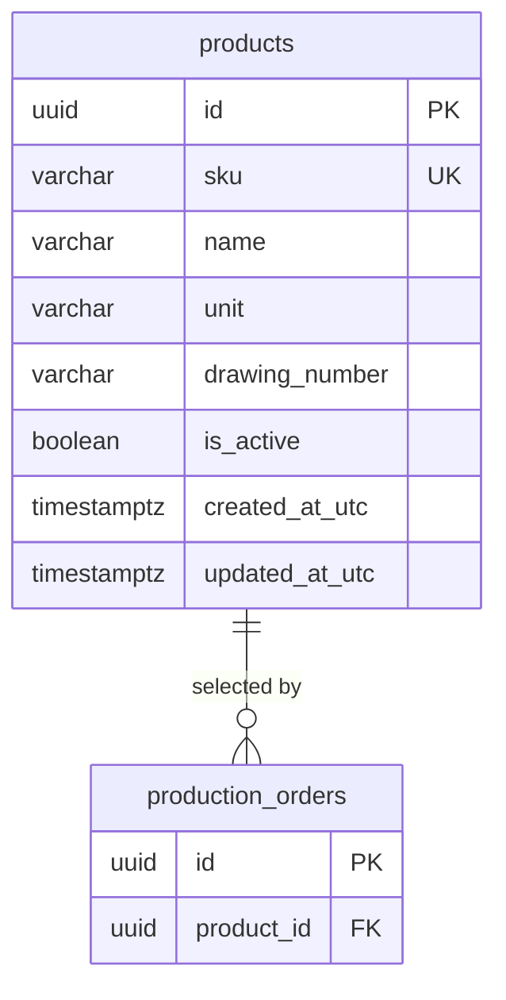

# ProductionManagementAI — Product master — Database Design Document (テーブル定義書)

`004_DB` defines the Product master side of [004_BD](../../010_basic-design/004/004_BD_製品マスタ.md), the [WI-006 brief](../../../../work-items/WI-006/brief.md) REQ-049–REQ-057, and the affected-screen [BD addendum](../../010_basic-design/004/004_BD-EXISTING-SCREENS_製品マスタ影響.md). The separately planned `004_DB-EXISTING-SCREENS_製品マスタ影響.md` will define the `production_orders.quantity` change required by REQ-058–REQ-060; approved 001_DB–003_DB files remain unchanged. Physical names are `snake_case` in PostgreSQL 17, consistent with [001_DB](../001/001_DB_製造指示登録・編集.md). UUID keys and UTC timestamps follow the existing schema.

## Document control (改版履歴)

| Field | Value |
| --- | --- |
| Document ID | 004_DB |
| Work item | WI-006 |
| Database / schema | `production_management_ai` / `public` |
| DBMS / encoding | PostgreSQL 17 / UTF-8 |
| Created / updated | Codex, 2026-09-29 |
| Version | 2 — reconciled with unit locking and WI-006-owned order/dashboard DB addendum |

| No. | Target | Change |
| --- | --- | --- |
| 1 | `products` | Add catalog fields, soft-retirement state, and optimistic concurrency use |
| 2 | `products` indexes and privileges | Add case-insensitive SKU uniqueness and runtime write grants |
| 3 | `products` transaction rules | Lock a product's unit after any order reference; coordinate with order writes and retirement |

## Table list (テーブル一覧)

| No. | Schema | Physical name | Logical name | Overview | Indexes beyond PK | Triggers | Status |
| --- | --- | --- | --- | --- | --- | --- | --- |
| 1 | `public` | `products` | Product master | One part, active or retired | Yes | No | Existing, additive changes planned |
| 2 | `public` | `production_orders` | Production order | References `products.id`; its quantity change is defined in the new WI-006 DB addendum | Yes | No | Existing; separate WI-006 addendum specifies schema change |

## ER diagram and relationships

`production_orders.product_id` remains a restrictive FK to `products.id`; retirement updates a flag and never deletes a referenced row. Renaming a product changes the current display name on historical orders; preserving a name snapshot is outside REQ-052. The `products.unit` value is the meaning of every related order quantity and becomes immutable once at least one order references the product (REQ-057). The separate DB addendum defines the quantity column and per-unit aggregations.

## Table definitions (テーブル定義)

### Product master (`products`)

| Field | Value |
| --- | --- |
| Overview | Automobile-part catalog maintained by Product master; 30 initial demo rows came from an earlier migration. |
| Estimated volume | 30 seeded rows now; growth unknown, list access is paged. |
| Retention/deletion | No physical delete in WI-006; `is_active=false` marks retirement. |
| Usage patterns | One product row type, active or retired. |
| CSV import/export | Not applicable — no catalog import/export in WI-006. |

| No. | Logical field | Physical name | PostgreSQL type | Nullable | Default | Key / validation | Notes |
| --- | --- | --- | --- | --- | --- | --- | --- |
| 1 | ID | `id` | `uuid` | no | `gen_random_uuid()` | PK | Existing; never changed on edit/retire. |
| 2 | Product code | `sku` | `varchar(50)` | no | none | Case-insensitive unique; nonblank, trimmed | Existing; immutable after insert by application contract. |
| 3 | Product name | `name` | `varchar(200)` | no | none | Nonblank | Existing; Japanese UI display value. |
| 4 | Unit | `unit` | `varchar(20)` | no after backfill | none for new rows | CHECK one of `個`, `本`, `枚`, `台`, `セット`, `kg`, `m` | New; required on create/edit. |
| 5 | Drawing number | `drawing_number` | `varchar(100)` | yes | null | Trim; blank becomes null | New; optional. |
| 6 | Active state | `is_active` | `boolean` | no | true | Retired = false | New; no restore operation in WI-006. |
| 7 | Created at UTC | `created_at_utc` | `timestamptz` | no | `now()` | Existing | Seeded values and IDs stay unchanged. |
| 8 | Updated at UTC | `updated_at_utc` | `timestamptz` | no | `now()` | Updated on edit/retire | New; backfilled to migration time for pre-existing rows. |
| 9 | Concurrency version | PostgreSQL `xmin` | system `xid` | no | database | EF row version | No physical new column; used in update/retire compare-and-swap. |

The database enforces `btrim(sku)=sku` for ordinary leading/trailing spaces, nonblank `sku`/`name`, allowed `unit`, and case-insensitive uniqueness on `lower(sku)` under the database collation. The API trims leading/trailing whitespace before storage and reports a field-specific conflict, including when the unique index rejects a concurrent create. The application does not force stored SKU letters to uppercase; it must use the database's uniqueness result rather than a divergent in-memory case comparison (DEC-002). The precise non-ASCII whitespace and case-folding behavior must be verified against the configured PostgreSQL collation during implementation; no extra SKU character ban is assumed here. `name` may contain Japanese characters. `drawing_number` is optional. `sku` immutability is reinforced by an application role grant that excludes `sku` from `UPDATE`; migrations run under the owner role.

`unit` is editable only while no production order references the product. This cross-table rule cannot be expressed as a row-local CHECK constraint. The product edit service first locks the product row with `FOR UPDATE`, checks `EXISTS (SELECT 1 FROM production_orders WHERE product_id = @id)` **after acquiring that lock**, and rejects a changed unit when a reference exists. Order creation and changed-product selection hold `FOR SHARE` on that product row through their write transaction (WI-006 DEC-006). These conflicting row locks serialize the reference check with order creation. A product name/drawing-number edit can proceed while the unit stays the same. The exact service transaction and stale-version response are owned by 004_DD-FN; no trigger is proposed.

### Production order (`production_orders`)

This document changes no `production_orders` column directly; the new WI-006 DB addendum specifies the decimal-capable `quantity` migration. Existing `product_id uuid NOT NULL` and `fk_production_orders_products_product_id` retain `ON DELETE RESTRICT`. The create flow requires an active referenced product. The update flow allows the same retired product ID already on the order, but rejects switching to any retired product. These are application rules (FN-031), not an FK change. A `SELECT … FOR SHARE` on the target product row is held inside the order-write transaction, so a concurrent retirement or unit edit cannot commit between eligibility check and order save. The existing `ix_production_orders_product_id` supports the `EXISTS` reference check.

## Index definitions (インデックス一覧)

| No. | Table | Index | Method / unique | Columns or expression | Built concurrently | Rationale |
| --- | --- | --- | --- | --- | --- | --- |
| 1 | `products` | `pk_products` | btree / yes | `id` | Existing | Primary lookup and FK target. |
| 2 | `products` | `ix_products_sku` | btree / yes | `sku` | Existing; retain during expand phase | Existing exact-SKU uniqueness. |
| 3 | `products` | `ux_products_sku_lower` | btree / yes | `lower(sku)` | Yes, on the live table, outside a migration transaction | Enforce DEC-002 case-insensitive uniqueness, including concurrent writes. |

The list query filters by active state and searches SKU/name. With only 30 known rows, the design does not add a speculative search index. Reassess with measured catalog growth; the uniqueness index helps an SKU-prefix lookup but not arbitrary name fragments.

## Trigger definitions (トリガー一覧)

None. The application sets `updated_at_utc`; `xmin` is maintained by PostgreSQL.

## Constraints

| Constraint | Type | Rule |
| --- | --- | --- |
| `pk_products` | PK | `id` unique, not null. |
| `ix_products_sku` | Existing unique index | Exact stored SKU unique. |
| `ux_products_sku_lower` | Unique expression index | `lower(sku)` unique. Migration preflight rejects existing case-insensitive duplicates. |
| `ck_products_sku_trimmed` | CHECK | `sku = btrim(sku)` and `length(sku) > 0`. |
| `ck_products_name_not_blank` | CHECK | `length(btrim(name)) > 0`. |
| `ck_products_unit` | CHECK | Unit is one of the seven approved values. |
| `fk_production_orders_products_product_id` | Existing FK | Restrict delete of a referenced product; unchanged. |

The allowed-unit CHECK validates the seven unit labels at write time. It does not inspect order rows; the transaction rule above protects unit immutability. The application role cannot update `sku`, `id`, or `created_at_utc`.

## Initial unit mapping for the 30 demo parts

The user requested a suitable unit per part rather than one default (WI-006 DEC-005). This proposed backfill is reviewable before implementation; it does not change SKU, name, ID, or any order reference.

| SKU | Part (Japanese) | Unit | SKU | Part (Japanese) | Unit |
| --- | --- | --- | --- | --- | --- |
| P-1001 | ブレーキキャリパー | 個 | P-1016 | ボディワイヤーハーネス | セット |
| P-1002 | ブレーキディスクローター | 枚 | P-1017 | ヘッドランプユニット | 台 |
| P-1003 | ブレーキパッド | 枚 | P-1018 | リレーボックス | 個 |
| P-1004 | ドライブシャフト | 本 | P-1019 | オルタネーター | 台 |
| P-1005 | 等速ジョイント | 個 | P-1020 | ECU ケース | 個 |
| P-1006 | トランスミッションケース | 個 | P-1021 | インタークーラー | 台 |
| P-1007 | ハブベアリング | 個 | P-1022 | 電動ファン | 台 |
| P-1008 | ウォーターポンプ | 台 | P-1023 | オイルフィルター | 個 |
| P-1009 | エンジンマウント | 個 | P-1024 | スロットルボディ | 個 |
| P-1010 | ラジエーター | 台 | P-1025 | ピストン | 個 |
| P-1011 | タイミングギア | 個 | P-1026 | コネクティングロッド | 本 |
| P-1012 | クラッチディスク | 枚 | P-1027 | サブフレーム | 台 |
| P-1013 | ショックアブソーバー | 本 | P-1028 | ドアパネル | 枚 |
| P-1014 | コイルスプリング | 本 | P-1029 | ドアヒンジ | 個 |
| P-1015 | エンジンワイヤーハーネス | セット | P-1030 | ボルト・ナットキット | セット |

## Database role and privileges

| Role | Privileges | Reason |
| --- | --- | --- |
| `pmai_app` | Existing `SELECT`; add `INSERT` and column-scoped `UPDATE (name, unit, drawing_number, is_active, updated_at_utc)` on `products`; no `UPDATE` on `sku`, `id`, `created_at_utc`, and no `DELETE` or DDL | Catalog create/edit/retire and existing reads; SKU immutability is defense in depth. |
| Migration owner | Owns DDL and data backfill | Schema and seed transition only. |

## API / DD mapping

| Database field | API field | Design use |
| --- | --- | --- |
| `id`, `sku`, `name`, `unit`, `drawing_number`, `is_active` | `id`, `sku`, `name`, `unit`, `drawingNumber`, `isActive` | Product master list/detail and write responses. |
| `updated_at_utc`, `xmin` | `updatedAt`, `version` | Detail, update, and retire concurrency. |
| `is_active` on existing product read | `isActive` added to `GET /api/products` rows | SCR-001 selection; SCR-002 retains full list including retired parts. |
| `unit` on existing product read | `unit` added to `GET /api/products` rows | SCR-001 quantity rule and unit display; SCR-002 unit display. |
| `unit` joined to `production_orders` | Unit on order reads and unit-keyed aggregates | SCR-001–SCR-003 impacts in the new WI-006 DB addendum and DD/API documents. |

## Migration impact and recovery

1. Preflight for duplicate `lower(sku)` under the database collation and non-seed rows requiring a unit. Abort and report before DDL if either case needs manual data remediation; do not silently invent a unit for an unknown part. Confirm the 30 expected seed IDs/SKUs and their current order FK references.
2. Add nullable `unit` and `drawing_number`, `is_active` with default true, and `updated_at_utc`; backfill each known seed ID/SKU with the table above, checking expected IDs and row count. Any non-seed product needs an explicitly chosen unit before enforcing NOT NULL.
3. Enforce `unit NOT NULL` and the CHECK constraints after data validation. Add `ux_products_sku_lower` with `CREATE UNIQUE INDEX CONCURRENTLY`, using a migration SQL command that suppresses the EF transaction. Retain the old SKU index for the expand phase. Re-run the duplicate check immediately before index creation; a concurrent conflicting insert makes index creation fail rather than weakening uniqueness. Because concurrent index creation is nontransactional, a failed build may leave an invalid index that must be inspected and removed before retry.
4. Remove `HasData(ProductSeed.All)` from the *current EF model* so future migrations do not rewrite user-edited names. The new migration must omit scaffolded `DeleteData` operations; earlier migrations still insert the 30 demo rows on a new database. Verify both upgrade and fresh migration paths against PostgreSQL.
5. Grant `pmai_app` `INSERT` and only the listed `UPDATE` columns in addition to its existing `SELECT`. Coordinate this Product master migration with the new WI-006 order-quantity migration before deploying API behavior; during an expand phase, existing integer readers continue to see the old order values without conversion loss. Deploy API behavior after owner-run migrations, consistent with the existing Compose setup.

The forward migration preserves IDs and orders. A rollback that drops new columns would lose units, drawing numbers, retirement state and update times; it requires a database backup or a forward fix, not an automatic destructive `Down`. A failed concurrent index build also needs explicit cleanup before retry. This design phase performs no migration. Unit mapping and technical seed strategy are tracked in [WI-006 DEC-005](../../../../work-items/WI-006/decisions.md).
