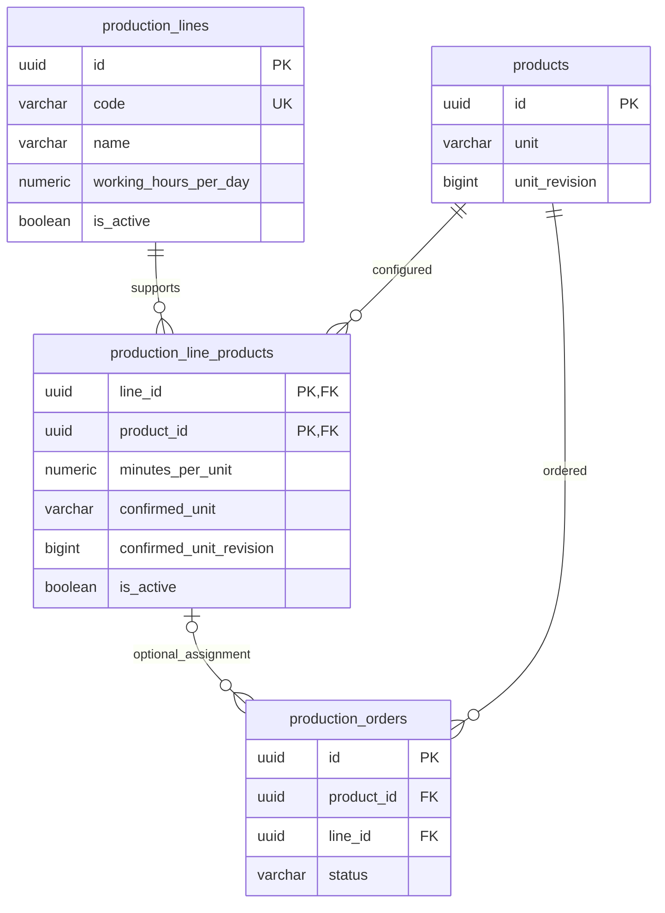

# ProductionManagementAI — Production lines — Database design

005_DB version 1; REQ-064–REQ-069; approved 005_BD version 1.

## Document control

| Field | Value |
| --- | --- |
| Document ID / version | 005_DB / 1 |
| Work item / database / schema | WI-009 / production_management_ai / public |
| DBMS / encoding | PostgreSQL 17 / UTF-8 |
| Author / created / updated | Agent / 2026-10-01 / 2026-10-01 |
| State | Submitted for review; schema and migration not implemented or executed |

| No. | Target | Work item | Change | Date | Author |
| --- | --- | --- | --- | --- | --- |
| 1 | Lines, pairs, product unit revision, order assignment | WI-009 | Initial additive design | 2026-10-01 | Agent |

Physical names use snake_case, UUID keys and UTC timestamptz audit columns,
following existing 001_DB/004_DB conventions. `xmin` is a PostgreSQL system
column mapped as EF optimistic concurrency, not a declared physical column.
[BD](../../010_basic-design/005/005_BD_生産ライン・工程.md),
[requirements](../../000_requirements/005/005_REQ_production-lines.md) and
[decisions](../../../../work-items/WI-009/decisions.md) are authoritative inputs.
Existing approved schema documents and application remain unchanged.

## 1. Table list

| No. | Schema | Physical name | Logical name | Scope / indexes / triggers | Created / changed / dropped | State |
| --- | --- | --- | --- | --- | --- | --- |
| 1 | public | production_lines | Line master | New; PK + normalized-code unique; no trigger | — / — / — | Planned |
| 2 | public | production_line_products | Supported product timing | New composite PK + product lookup; no trigger | — / — / — | Planned |
| 3 | public | products | Product master | Existing; add unit_revision and unit-change trigger; retain indexes | Existing / planned / — | Existing plus planned extension |
| 4 | public | production_orders | Production order | Existing; add nullable line_id, composite FK and partial index | Existing / planned / — | Existing plus planned extension |

Dates are not deployment dates. Existing fields not mentioned below retain their
current definition. Identity tables, counters and dashboard schema unchanged.

## 2. ER diagram and relationships

| Child | Parent | FK / cardinality | History behavior |
| --- | --- | --- | --- |
| production_line_products | production_lines | line_id -> id; many pairs per line | ON DELETE RESTRICT |
| production_line_products | products | product_id -> id; many lines per product | ON DELETE RESTRICT |
| production_orders | production_line_products | (line_id, product_id) -> (line_id, product_id); optional pair, many orders | MATCH SIMPLE, ON DELETE/UPDATE RESTRICT |
| production_orders | products | Existing product_id -> id | Existing FK retained |

`line_id IS NULL` skips the new composite FK (product_id remains NOT NULL).
When non-null, the FK ensures that the pair exists for this exact product;
line existence follows its parent FK. No redundant standalone order-line FK.
Active state/unit confirmation are eligibility rules, not FK semantics.

## 3. Table definitions

### 3.1 Line master — production_lines

One durable line, written by Admin/Operator through SCR-005. Volume unknown;
expect reference data, not a fixed production limit. No physical deletion or
reactivation endpoint. Code is unique across active and retired rows.

| No. | Logical item | Column | Type | NOT NULL | Default | Key | Validation / use |
| --- | --- | --- | --- | --- | --- | --- | --- |
| 1 | Identity | id | uuid | Yes | gen_random_uuid() | PK | App normally sends UUID v7; immutable |
| 2 | Line code | code | varchar(50) | Yes | None | Normalized UK | Trim on create, nonblank, immutable; <=50 code points |
| 3 | Line name | name | varchar(200) | Yes | None | — | Trimmed nonblank, <=200 code points |
| 4 | Hours/day | working_hours_per_day | numeric (no typmod) | Yes | None | — | >0, <=24, scale <=3 |
| 5 | Active state | is_active | boolean | Yes | true | — | Retire false; preserved history |
| 6 | Created time | created_at_utc | timestamptz | Yes | now() | — | Immutable; UTC |
| 7 | Updated time | updated_at_utc | timestamptz | Yes | now() | — | App updates on every aggregate mutation |

Concurrency: line `xmin` is the aggregate version. Every persisted pair change
must also UPDATE the parent line (updated_at_utc) in the same transaction,
even when the clock value is unchanged; xmin then changes. No duplicate application
version column. Compare submitted parent version, lock parent, recheck and commit
all parent/pair changes together. This prevents stale editors losing pair updates.

Usage patterns: one kind of row. CSV: not in scope. Seed: none; no fabricated
real lines or automatic order assignment. Disposable implementation tests may
create fixtures, but migrations do not create demo master data in this design.

### 3.2 Supported product timing — production_line_products

One durable pair per line/product, including retired pairs. Composite identity
avoids a second pair UUID and prevents duplicates. No delete/restore/re-add of
a retired pair in this scope. Product remains editable under WI-006 rules.

| No. | Logical item | Column | Type | NOT NULL | Default | Key | Validation / use |
| --- | --- | --- | --- | --- | --- | --- | --- |
| 1 | Line identity | line_id | uuid | Yes | None | PK part, FK | Immutable |
| 2 | Product identity | product_id | uuid | Yes | None | PK part, FK | Immutable |
| 3 | Minutes per unit | minutes_per_unit | numeric (no typmod) | Yes | None | — | >0, <=999999999.999, scale <=3 |
| 4 | Confirmed quantity unit | confirmed_unit | varchar(20) | Yes | None | — | Approved seven-value unit set |
| 5 | Confirmed unit revision | confirmed_unit_revision | bigint | Yes | None | — | >=0; server records locked product revision on explicit confirmation |
| 6 | Pair active state | is_active | boolean | Yes | true | — | Retire false; never remove history |
| 7 | Created time | created_at_utc | timestamptz | Yes | now() | — | Immutable; UTC |
| 8 | Updated time | updated_at_utc | timestamptz | Yes | now() | — | Current coefficient/confirmation/retirement changes |

`999999999.999` minutes is a proposed finite technical storage/API ceiling,
not a business throughput or scheduling limit. API DD must expose the same
ceiling; it comfortably fits .NET decimal. Use exact decimal, not floating point.
Unconstrained numeric plus range/scale CHECK rejects overprecision without
rounding it first. NaN and infinity fail the finite upper/lower bounds. PostgreSQL
numeric with a declared scale can round input before checks; see
[numeric documentation](https://www.postgresql.org/docs/17/datatype-numeric.html).

Eligibility requires product, line and pair active, plus confirmed_unit and
confirmed_unit_revision matching the current product. A stale pair remains
readable; explicit reconfirmation updates coefficient and both confirmed fields
under product lock. Do not derive a new coefficient by unit conversion.
Pair xmin can support persistence locks, but the API editor token is parent xmin.
No timing snapshots or historical duration recomputation. CSV/seed: none.

### 3.3 Product extension — products.unit_revision

| No. | Item | Column | Type | NOT NULL | Default | Key | Use |
| --- | --- | --- | --- | --- | --- | --- | --- |
| 1 | Unit generation | unit_revision | bigint | Yes | 0 | — | >=0; advance once per actual unit change |

The unit-change trigger increments revision even for an old application that
has no mapped revision property. Name/drawing/state edits and SET unit = unit
must not increment it. Revision prevents the ABA case: 個 -> kg -> 個 cannot
silently reactivate a previously confirmed coefficient. Read unit and revision
from the same locked row. Product unit-edit permission/reference restriction
remains WI-006's existing rule; no new role or business lock is introduced.

EF maps revision as database-generated/read-only; writes omit it and retrieve
its generated result after unit edits. Existing Product master mutation remains
valid with its current column-scoped grant. Overflow rejects the unit edit
atomically rather than wrapping. No revision reset or reusable generation ID.

### 3.4 Order extension — production_orders.line_id

| No. | Item | Column | Type | NOT NULL | Default | Key | Use |
| --- | --- | --- | --- | --- | --- | --- | --- |
| 1 | Assigned line | line_id | uuid | No | None (null) | Composite FK with product_id | Draft selection; history/read-only outside Draft |

No existing row is backfilled. Old InProgress/Completed without a line retain
null during allowed edits; Cancelled history is also kept. New Draft may omit
line, but Draft -> InProgress requires valid current eligibility. Assignment
changes outside Draft rejected in Application/Domain. A row-local CHECK such as
status <> 'InProgress' OR line_id IS NOT NULL would invalidate legacy rows,
so it is deliberately not added. Existing status/quantity/audit checks remain.

## 4. Constraint definitions

| Name | Table | Definition / responsibility |
| --- | --- | --- |
| pk_production_lines | production_lines | PRIMARY KEY (id) |
| ux_production_lines_code_lower | production_lines | UNIQUE INDEX (lower(code)), all states |
| ck_production_lines_code_trimmed | production_lines | code = btrim(code) AND length(code) > 0 |
| ck_production_lines_name_trimmed | production_lines | name = btrim(name) AND length(name) > 0 |
| ck_production_lines_hours_range | production_lines | working_hours_per_day > 0 AND working_hours_per_day <= 24 |
| ck_production_lines_hours_scale | production_lines | scale(working_hours_per_day) <= 3 |
| pk_production_line_products | production_line_products | PRIMARY KEY (line_id, product_id) |
| fk_line_products_line | production_line_products | line_id -> production_lines(id), RESTRICT |
| fk_line_products_product | production_line_products | product_id -> products(id), RESTRICT |
| ck_line_products_minutes_range | production_line_products | minutes_per_unit > 0 AND minutes_per_unit <= 999999999.999 |
| ck_line_products_minutes_scale | production_line_products | scale(minutes_per_unit) <= 3 |
| ck_line_products_confirmed_unit | production_line_products | confirmed_unit IN ('個','本','枚','台','セット','kg','m') |
| ck_line_products_confirmed_revision | production_line_products | confirmed_unit_revision >= 0 |
| ck_products_unit_revision | products | unit_revision >= 0 |
| fk_orders_line_product | production_orders | (line_id, product_id) -> production_line_products(line_id, product_id), MATCH SIMPLE, immediate, RESTRICT |

No FK on confirmed revision/unit: it would prevent the very product-unit changes
that DEC-009 permits. Cross-row active/start/locked-history validation belongs
to the locked service transaction. A CHECK must not inspect another table;
[constraint documentation](https://www.postgresql.org/docs/17/ddl-constraints.html).
Text character counts follow PostgreSQL varchar/code-point semantics; application
normalizes Unicode whitespace. Database lower(code) is authoritative for uniqueness;
API lookups/tests must use the same database comparison rather than client culture.
Case-folding follows the deployed database locale, consistent with existing SKU
normalization. 23505 from the named code index maps to a conflict, not HTTP 500.

## 5. Index list and access patterns

| Index | Table | Method / keys | Unique / predicate | Concurrent? | Rationale |
| --- | --- | --- | --- | --- | --- |
| pk_production_lines | production_lines | btree id ASC | Yes | No, new table | Identity lookup |
| ux_production_lines_code_lower | production_lines | btree lower(code) ASC | Yes, all states | No, new table | Duplicate code prevention |
| pk_production_line_products | production_line_products | btree line_id ASC, product_id ASC | Yes | No, new table | Line detail, pair lookup and FK target |
| ix_line_products_product_line | production_line_products | btree product_id ASC, line_id ASC | No | No, new table | Compatible lines by product |
| ix_orders_line_product | production_orders | btree line_id ASC, product_id ASC | No, WHERE line_id IS NOT NULL | Yes, existing table | Assigned reference/FK/history lookup |

Existing product/order indexes stay. The orders composite index covers its
leading line_id; do not add a redundant EF convention single-column index.
Small master code/name contains searches use bounded scans initially; no new
trigram/name/state index without measured need. Default stable list order: code,
then id; query paging bounded in API DD. See
[concurrent index documentation](https://www.postgresql.org/docs/17/sql-createindex.html).

## 6. Trigger list

| Trigger / function | Timing | Behavior | Security |
| --- | --- | --- | --- |
| tr_products_unit_revision / advance_product_unit_revision | BEFORE UPDATE OF unit ON products, each row | If NEW.unit IS DISTINCT FROM OLD.unit, set NEW.unit_revision = OLD.unit_revision + 1; otherwise preserve old revision | Owner creates; SECURITY INVOKER, no dynamic SQL, fixed pg_catalog search_path; no external I/O |

Function returns NEW; it only assigns the pending row and does not query/update
other tables. No timestamp, status or eligibility trigger. Migration owner
creates it; runtime gets no TRIGGER/DDL privilege and no direct unit_revision
UPDATE grant. Restore tools must preserve revisions and trigger definition.
Trigger behavior is a planned implementation, not tested SQL. References:
[CREATE TRIGGER](https://www.postgresql.org/docs/17/sql-createtrigger.html),
[trigger functions](https://www.postgresql.org/docs/17/plpgsql-trigger.html).

## 7. Transactions, locks and concurrency

Use READ COMMITTED write transactions and consistent acquisition order:
products by ascending UUID, then parent line, then pair rows by product UUID.

| Operation | Required locks / checks |
| --- | --- |
| New/changed order assignment or Draft start | FOR SHARE on target product, line and pair, held through commit; re-read current active/unit/revision; validate start, submitted order xmin and field locks |
| Line/pair aggregate edit | FOR SHARE on involved products in sorted order, then FOR UPDATE on parent line; compare submitted parent xmin, update pair rows and parent together; explicit unit confirmation uses the locked current product |
| Line retirement only | FOR UPDATE on line; compare xmin; update state/timestamp; history stays |
| Product unit edit | Existing FOR UPDATE product lock and order-reference check retained; trigger advances revision on actual change |
| Unchanged historical order edit | Preserve line/pair reference and legacy null; no new active eligibility imposed except Draft start; existing order xmin/locks remain |

FK checks alone do not protect active eligibility: retirement is a non-key UPDATE
and requires conflicting stronger locks. FOR SHARE conflicts with such updates;
[locking documentation](https://www.postgresql.org/docs/17/explicit-locking.html).
Retirement and selection serialize: if selection commits first, its reference
becomes historical; if retirement wins, fresh selection fails. Unit change and
confirmation similarly serialize. Do not acquire product lock after line lock in
an aggregate edit. Never upgrade an order's shared line lock to exclusive later.
Parent change caused only by pair edits still changes xmin. Deleted/stale parents
and zero-row concurrency updates become explicit conflict/not-found results.
Lock timeouts/deadlocks roll back; API/FN defines bounded error handling, no blind
replay of unknown committed writes. Exact lock SQL/order is detailed later.

## 8. Database roles and privileges

Owner runs migrations. pmai_app remains restricted; Admin/Operator permissions
are application policies, not separate database logins.

| Object | Runtime grants / restriction |
| --- | --- |
| production_lines | SELECT, INSERT; UPDATE(name, working_hours_per_day, is_active, updated_at_utc); no code/id/create-time UPDATE, DELETE or DDL |
| production_line_products | SELECT, INSERT; UPDATE(minutes_per_unit, confirmed_unit, confirmed_unit_revision, is_active, updated_at_utc); immutable pair keys; no DELETE/DDL |
| products | Existing grants retained; SELECT includes unit_revision; no direct UPDATE(unit_revision) |
| production_orders | Existing SELECT/INSERT/UPDATE retained; mapped INSERT/UPDATE may include nullable line_id; no DELETE/DDL |
| Trigger function | Owner-controlled creation, fixed invoker behavior; no role/password or schema privileges added |

Parameterized ORM/SQL only; do not build identifiers/query text from user values.
Per-role API checks, scope-bounded telemetry and credential-safe logs remain
required in the later API/FN design and security gate.

## 9. API / DD mapping

These are proposed persistence names, not implemented endpoints.

| Logical contract | Physical mapping | Rule / owner |
| --- | --- | --- |
| Line id/code/name/hours/state/version | production_lines plus xmin | Version token sent as opaque string; exact request in API DD |
| Supported product + time + unit confirmation | production_line_products + products(unit, unit_revision) | Current-unit confirmation explicit; server computes matched revision, not arbitrary client writes |
| Product timing validity | Compare confirmed_unit/revision to current product | Revision/string formatting avoids JavaScript integer precision loss |
| Order lineId/display | production_orders.line_id; pair -> line join | Nullable; old request compatibility/start rules defined by new order-impact DD |
| Pair edited/retired | Aggregate transaction and parent xmin | No separate independently mutable pair editor token |

## 10. Migration and recovery intent

| Planned migration | Kind | Shape | Transaction |
| --- | --- | --- | --- |
| ExpandProductionLines | Additive | Two new tables, new product revision/trigger, nullable order column and new FK/checks | Owner DDL transaction; new existing-table FK/check introduced NOT VALID as appropriate |
| IndexProductionLineAssignments | Additive | Concurrent orders index; validate new FK and product revision CHECK | Concurrent index statement outside transaction; validation in a separate supported step |

1. Before implementation/deployment, inspect existing schema, migration history,
   row counts, grants and database locale; rehearse fresh/upgrade paths on isolated
   databases. Take coordinated backup, pause writes and bound DDL lock wait.
2. Create new tables/constraints/indexes and runtime grants. Add unit_revision
   NOT NULL DEFAULT 0 and its trigger; add line_id nullable without backfill.
   Existing order identities/products/statuses/quantity remain unchanged.
3. Build the existing-orders partial index CONCURRENTLY with EF transaction
   suppression; inspect pg_index.indisvalid/indisready. Validate FK/checks and
   verify exact definitions/grants. No whole-table shadow copy or secret seed.
4. Deploy new application only after both migration stages succeed. Release the
   write pause after verifying line-free legacy reads and newly required starts.
   A legacy binary can read expanded schema but cannot enforce new starts;
   do not run mixed old/new writers after feature activation.
5. A failed concurrent build may leave an invalid index outside the migration
   transaction. Inspect definition/catalog state before owner repair/retry;
   never treat IF NOT EXISTS as evidence of a valid/correct index. Partially
   committed expand schema requires an explicit reviewed repair/forward fix.

FK validation permits legacy null assignments. Add-column/FK/trigger operations
still take DDL locks: concurrent indexing does not mean zero-downtime migration.
No migration command, DDL, database backup or rehearsal is authorized/executed in
this design revision; actual execution needs later plan approval.

Rollback: prefer forward fix or retain additive schema while rolling back the
binary under a write pause. Removing schema after real use destroys line masters,
coefficients, confirmation revisions and assignments; automatic Down must reject
that unsafe operation. Restore an agreed backup only with explicit authorization,
accepting loss of writes after that backup; replay needs a separate recovery plan.
No promise that returning the binary alone preserves new validation semantics.

## 11. Design consistency and verification plan

| Requirement | Schema/design support | Later runtime verification |
| --- | --- | --- |
| REQ-064/065 | Line fields, normalization/index, aggregate xmin | Code duplicates, role/column grants and stale edits |
| REQ-066 | Exact numeric bounds/scale, confirmed unit/revision and trigger | Overprecision/special numeric rejection; changed/back-to-original unit requires confirmation; no increment for name/unchanged-unit edits |
| REQ-067 | Retained pair keys, RESTRICT FKs, no runtime DELETE | Retired rows remain readable and old orders keep references |
| REQ-068 | Nullable composite assignment, locked eligibility/start rules | Compatible selection, legacy exceptions, retirement/reconfirmation races |
| REQ-069 | Restricted grants, concurrency and bounded transaction handling | Direct privilege denial, API roles, numeric formatting and no sensitive telemetry |

No SQL or application test run for this design. Technical choices (composite
pair key, product revision trigger, exact numeric ceiling, aggregate token and
concurrent index staging) are review proposals here. API/DD mappings and test
cases must reconcile after those documents are approved. No open business
question; no new architecture boundary. Submit 005_DB with EN/JA PDFs and wait
for explicit review before writing the main 005_DD. Approved 005_BD is unchanged.
