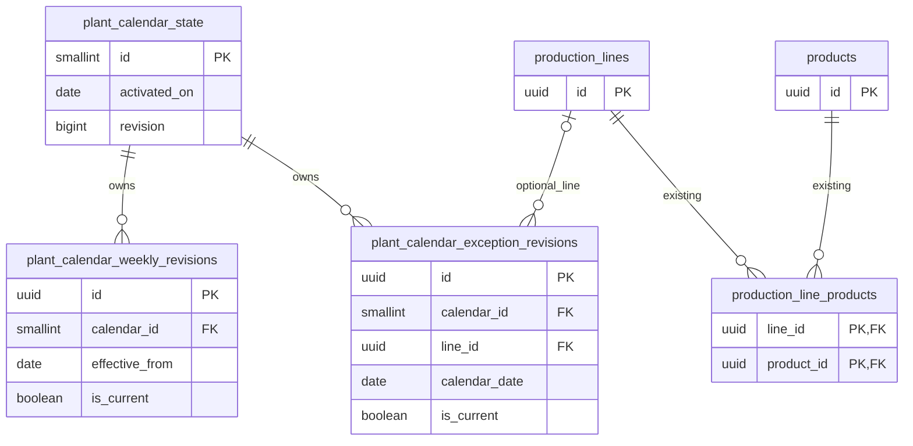

# Plant calendar — Database design (テーブル定義書)

006_DB version 1 — REQ-070–075; approved 006_BD version 1; WI-010.
Main DD/API/FN are later sequential documents, not existing contracts.

## Document control and physical conventions

| Field | Value |
| --- | --- |
| Document ID / version | 006_DB / 1 |
| System / work item | ProductionManagementAI / WI-010 |
| Database / schema / DBMS | production_management_ai / public / PostgreSQL 17 |
| Character set | UTF-8 |
| Author / created / updated | Agent / 2026-10-01 / 2026-10-02 |
| Review state | Submitted for review; schema not implemented |

| Version | Target | Change | Date | Author |
| --- | --- | --- | --- | --- |
| 1 | All | Initial additive calendar schema after BD approval | 2026-10-02 | Agent |

Use the existing snake_case names, UUID revision identities, timestamptz UTC
audit times and pk_/fk_/ck_/ux_/ix_ names established by
[005_DB](../005/005_DB_生産ライン・工程.md). Application normally supplies UUID v7;
UUID defaults use gen_random_uuid(). Dates are PostgreSQL date / .NET DateOnly,
not instants. Hours use unconstrained numeric with explicit checks. Calendar
uses its own durable bigint aggregate revision, not existing masters' xmin.

Inputs: [approved BD](../../010_basic-design/006/006_BD_稼働カレンダー.md),
[approved requirements](../../000_requirements/006/006_REQ_plant-calendar.md),
[decisions](../../../../work-items/WI-010/decisions.md),
[architecture assessment](../../../../work-items/WI-010/architecture-assessment.md).
Existing product, line, pair and order designs remain unchanged.

## Table list

| No. | Physical name / logical name | Overview | Extra indexes | Triggers | Created / changed / dropped | Status |
| --- | --- | --- | --- | --- | --- | --- |
| 1 | plant_calendar_state / Calendar state | One plant activation and global edit revision | No | No | — / — / — | Planned |
| 2 | plant_calendar_weekly_revisions / Weekly revisions | Retained weekday definitions and withdrawal markers | Yes | No | — / — / — | Planned |
| 3 | plant_calendar_exception_revisions / Date exception revisions | Plant/line definitions and removal markers | Yes | No | — / — / — | Planned |

All three tables belong to public. No table has been created. Retention is
indefinite in this feature; no purge, physical delete or CSV import/export.
Row growth follows actual edits, not calendar days. Capacity is derived and
has no table. Existing masters are referenced/read; production_orders is untouched.

## ER diagram and relationships

| Child | Parent / FK | Cardinality / behavior |
| --- | --- | --- |
| Weekly revisions | Calendar state / calendar_id | Required parent; 1:N; UPDATE/DELETE RESTRICT |
| Exception revisions | Calendar state / calendar_id | Required parent; 1:N; UPDATE/DELETE RESTRICT |
| Exception revisions | production_lines / line_id | Optional parent: null = plant scope; 1:N; UPDATE/DELETE RESTRICT |
| Existing line-product pairs | Existing line/product keys | Existing relations unchanged; used only for descriptive capacity |

## Table definitions

Column order follows the tables below; audit columns come last. All listed
columns are used. No reserved columns. A dash means no default/key. Lengths of
varchar are Unicode code points. No new user identity or credential fields.

### Calendar state — plant_calendar_state

One singleton row, initialized by owner activation; runtime only advances its
revision and update time. Fixed plant timezone records the date basis, not an
editable timezone setting. Volume exactly one row after activation.

| No. | Column / logical item | PostgreSQL type | NOT NULL | Default | Key | Validation / description |
| --- | --- | --- | --- | --- | --- | --- |
| 1 | id / Singleton identity | smallint | Yes | — | PK | Must equal 1 |
| 2 | activated_on / Coverage starts | date | Yes | — | — | Explicit owner-selected plant-local activation date; immutable |
| 3 | time_zone_id / Date basis | varchar(100) | Yes | — | — | Configured Plant:TimeZone, currently Asia/Tokyo; nonblank; immutable |
| 4 | revision / Aggregate token | bigint | Yes | 1 | — | >=1; increment once per committed calendar mutation |
| 5 | created_at_utc / Created | timestamptz | Yes | now() | — | Immutable |
| 6 | updated_at_utc / Changed | timestamptz | Yes | now() | — | Runtime sets on aggregate mutation |

Seed only during explicit activation with the first Mon–Fri weekly definition,
mask 31, revision 1, same activated_on date. No automatic earlier-date coverage.
Missing activation is unavailable, not implicit Mon–Fri. Application startup/read
must detect timezone mismatch and refuse calendar operations until an approved
operational resolution; never reinterpret saved dates in another timezone.

### Weekly revisions — plant_calendar_weekly_revisions

One retained snapshot per weekly save/withdrawal. Logical identity is
(calendar_id, effective_from); the date cannot move on correction. A new date
creates another logical definition. All historical snapshots remain readable.

| No. | Column / logical item | PostgreSQL type | NOT NULL | Default | Key | Validation / description |
| --- | --- | --- | --- | --- | --- | --- |
| 1 | id / Revision identity | uuid | Yes | gen_random_uuid() | PK | Immutable |
| 2 | calendar_id / Calendar | smallint | Yes | — | FK | References state id |
| 3 | effective_from / Start date | date | Yes | — | Current UK part | Activation or later; application validates mutation date |
| 4 | working_weekdays / Weekday bits | smallint | No | — | — | 0–127; Mon=1, Tue=2, Wed=4, Thu=8, Fri=16, Sat=32, Sun=64 |
| 5 | is_withdrawn / Withdrawal marker | boolean | Yes | false | — | True requires null weekday mask |
| 6 | is_current / Latest for date | boolean | Yes | true | Partial UK | Only mutable snapshot column; old row becomes false |
| 7 | commit_revision / Aggregate revision | bigint | Yes | — | UK part | >=1; server assigns newly committed state revision |
| 8 | created_at_utc / Recorded | timestamptz | Yes | now() | — | Immutable; no updated timestamp for preserved payload |

Normal rows require a nonnull mask; mask 0 means all weekdays closed and is valid.
Withdrawal marker stores null mask. Initial activation cannot be withdrawn.
Correction/withdrawal only applies to future effective dates; changing today's
pattern appends/replaces the definition effective today, without changing an
older effective_from row. For any queried date, choose the latest effective_from
<= date whose current row is not withdrawn. Coverage starts at activated_on.
Implicit end dates derive from the next surviving effective start, avoiding
stored overlapping intervals. Withdrawing a future definition restores its
predecessor's applicability. Recreating that future date supersedes its marker.

### Date exception revisions — plant_calendar_exception_revisions

Logical identity is (calendar_id, line_id, calendar_date); null line_id means
plant scope. One current snapshot or removal marker per identity. Line retirement
never deletes its retained reference. No exception seed data.

| No. | Column / logical item | PostgreSQL type | NOT NULL | Default | Key | Validation / description |
| --- | --- | --- | --- | --- | --- | --- |
| 1 | id / Revision identity | uuid | Yes | gen_random_uuid() | PK | Immutable |
| 2 | calendar_id / Calendar | smallint | Yes | — | FK | References state id |
| 3 | line_id / Optional line | uuid | No | — | FK / Current UK part | Null plant scope; otherwise durable line identity |
| 4 | calendar_date / Exception date | date | Yes | — | Current UK part | Activation or later; immutable scope/date |
| 5 | is_working / Override state | boolean | No | — | — | Normal row requires value; removal requires null |
| 6 | working_hours / Explicit hours | numeric, no typmod | No | — | — | Only working row: >0, <=24, scale<=3; null inherits line baseline |
| 7 | reason / Optional note | varchar(500) | No | — | — | Trim Unicode whitespace; blank -> null; plain text; <=500 code points |
| 8 | is_removed / Removal marker | boolean | Yes | false | — | True requires null state/hours/reason |
| 9 | is_current / Latest for identity | boolean | Yes | true | Partial UK | Only mutable snapshot column |
| 10 | commit_revision / Aggregate revision | bigint | Yes | — | UK part | >=1; server-generated |
| 11 | created_at_utc / Recorded | timestamptz | Yes | now() | — | Immutable |

| Pattern | is_working | working_hours | reason | Resolution |
| --- | --- | --- | --- | --- |
| Working, inherited | true | null | Optional | Current selected line baseline; plant-only hours line-dependent |
| Working, explicit | true | Positive exact value | Optional | Use explicit hours |
| Closed | false | null | Optional | Effective hours 0; never store explicit 0 |
| Removed | null | null | null | Skip marker; reveal lower-priority rule |

Updates supersede old current row and insert a snapshot. Removal appends a marker;
re-add supersedes that marker. New/edit line exception requires active line;
retired-line retained exception stays readable and can be removed today/future.
Past-date mutation is rejected; removal does not erase earlier recorded payload.
No historical master-hours or capacity claim: past calendar shows retained day
rules, and inherited hours are identified as current-setting/line-dependent.

## Constraints

| Name | Type / table | Definition / responsibility |
| --- | --- | --- |
| pk_plant_calendar_state | PK / state | (id) |
| ck_calendar_state_singleton | CHECK / state | id = 1 |
| ck_calendar_state_revision | CHECK / state | revision >= 1 |
| ck_calendar_state_zone | CHECK / state | time_zone_id = btrim(time_zone_id) AND length(time_zone_id) > 0 |
| ck_calendar_state_date | CHECK / state | activated_on BETWEEN DATE '0001-01-01' AND DATE '9999-12-31' |
| pk_calendar_weekly_revisions | PK / weekly | (id) |
| fk_calendar_weekly_state | FK / weekly | calendar_id -> state(id), RESTRICT update/delete |
| ck_calendar_weekly_date | CHECK / weekly | effective_from BETWEEN DATE '0001-01-01' AND DATE '9999-12-31' |
| ck_calendar_weekly_payload | CHECK / weekly | (is_withdrawn AND working_weekdays IS NULL) OR (NOT is_withdrawn AND working_weekdays IS NOT NULL AND working_weekdays BETWEEN 0 AND 127) |
| ck_calendar_weekly_revision | CHECK / weekly | commit_revision >= 1 |
| pk_calendar_exception_revisions | PK / exceptions | (id) |
| fk_calendar_exception_state | FK / exceptions | calendar_id -> state(id), RESTRICT update/delete |
| fk_calendar_exception_line | FK / exceptions | line_id -> production_lines(id), RESTRICT update/delete |
| ck_calendar_exception_date | CHECK / exceptions | calendar_date BETWEEN DATE '0001-01-01' AND DATE '9999-12-31' |
| ck_calendar_exception_payload | CHECK / exceptions | (is_removed AND is_working IS NULL AND working_hours IS NULL AND reason IS NULL) OR (NOT is_removed AND is_working IS NOT NULL AND (is_working OR working_hours IS NULL)) |
| ck_calendar_exception_hours | CHECK / exceptions | working_hours IS NULL OR (working_hours > 0 AND working_hours <= 24 AND scale(working_hours) <= 3) |
| ck_calendar_exception_revision | CHECK / exceptions | commit_revision >= 1 |

Named unique indexes are listed next. Explicit IS NULL/IS NOT NULL predicates
prevent SQL CHECK's null result from accepting an incomplete payload. Date bounds
also reject PostgreSQL infinity and dates unsupported by DateOnly. Range/scale
checks reject numeric NaN/infinity/overprecision; a declared numeric scale could
round before validation. See [PostgreSQL numeric types](https://www.postgresql.org/docs/17/datatype-numeric.html).
Activation bounds, today/future restrictions, initial-rule preservation,
revision assignment and master eligibility are cross-row/clock rules enforced
by the locked application transaction, not time-dependent CHECKs. See
[PostgreSQL constraints](https://www.postgresql.org/docs/17/ddl-constraints.html).

## Index definitions

All indexes planned; created/dropped dates —. Btree; new tables use normal
transactional creation, not CONCURRENTLY. No index added to an existing live table.

| Index / table | Keys in order | Unique / predicate | Query or integrity rationale |
| --- | --- | --- | --- |
| pk_plant_calendar_state / state | id ASC | Yes | Singleton lock/read |
| pk_calendar_weekly_revisions / weekly | id ASC | Yes | Revision identity |
| ux_calendar_weekly_current / weekly | calendar_id ASC, effective_from DESC | Yes; WHERE is_current | One latest row per date; effective predecessor lookup |
| ux_calendar_weekly_commit / weekly | calendar_id ASC, commit_revision ASC | Yes | One weekly snapshot per mutation; retained history |
| pk_calendar_exception_revisions / exceptions | id ASC | Yes | Revision identity |
| ux_calendar_exception_current / exceptions | calendar_id ASC, line_id ASC, calendar_date ASC | Yes, NULLS NOT DISTINCT; WHERE is_current | One latest scope/date row including plant null and removal markers; month/scope read |
| ux_calendar_exception_commit / exceptions | calendar_id ASC, commit_revision ASC | Yes | One exception snapshot per mutation; retained history |
| ix_calendar_exception_line / exceptions | line_id ASC | No; WHERE line_id IS NOT NULL | Retained line FK reference check without full history scan |

Current indexes include withdrawal/removal markers, so uniqueness cannot be
bypassed by a removed entry. Reads skip markers only after identifying the latest
snapshot. Predicate is_current is supplied literally by server queries; parameterize
user dates/IDs. See [partial indexes](https://www.postgresql.org/docs/17/indexes-partial.html).
No zero UUID sentinel for plant scope. Global aggregate lock ensures one weekly
or exception mutation per commit revision across both tables; per-table unique
indexes alone do not enforce the cross-table rule.

## Trigger definitions

None. Existing product unit-revision trigger remains unchanged. Calendar business
validation and append/supersede transitions belong to Application transactions.
No jobs, external holiday calls, database clock trigger or automatic audit purge.

## Transactions, resolution and concurrency

Calendar revision is a server-produced positive bigint, serialized as opaque
string in API design. Unlike xmin, it survives ordinary backup/restore as data;
restoring older state still requires client reset and write pause. Never accept a
client-supplied replacement revision. Overflow rejects atomically; no wrap/reset.

| Operation | Transaction / checks |
| --- | --- |
| Month, editor, history or capacity read | Read-only REPEATABLE READ transaction; capture plant clock/date once; read state/rules and current master data within one MVCC snapshot; bounded batched queries, no per-day roundtrip |
| Weekly mutation | READ COMMITTED; FOR UPDATE state id=1; compare observed revision; validate date/current target; supersede previous current row if present, insert snapshot, increment state once, commit together |
| Line exception create/edit | FOR SHARE selected line first, then FOR UPDATE calendar state; compare observed revision and current row; recheck active line/date; append and increment atomically |
| Plant exception mutation | FOR UPDATE calendar state; same observed-version/date/target checks |
| Retired-line exception removal | FOR SHARE referenced line first, then FOR UPDATE state; permit retired identity only for existing editable removal; append marker and advance revision |

Lock order is line then calendar, never calendar then line. Calendar writes do not
lock products/pairs/orders; existing master transactions never acquire calendar.
This extends existing product -> line -> pair ordering without introducing a cycle.
FOR SHARE prevents retirement during active-line validation. Read transactions
lock no masters for update; descriptive capacity reflects the read snapshot,
not a guarantee against later configuration changes. See
[transaction isolation](https://www.postgresql.org/docs/17/transaction-iso.html).

After any lock wait, re-read authoritative plant today immediately before write
validation. The operation's accepted date basis is that validation instant; clock
advancing after validation does not backdate another operation. Exact timeouts,
query/date range budgets and cancellation behavior belong to API/FN.

All mutations, including removal/re-add and correcting today's effective pattern,
use the observed global revision. Unrelated calendar edits can cause a conservative
conflict; retain draft and explicitly reload, with no automatic merge/replay.
Require actual changed payload; no-op is no persisted mutation/revision advance.
Set old is_current=false before inserting replacement under the same transaction;
unique failure rolls the whole transaction back. Never publish a gap between them.
Initial activation and first definition are one owner transaction.

Resolver: current line exception > current plant exception > latest applicable
nonwithdrawn weekly definition. Winning exception applies wholly; inherited hours
come from current line baseline, never another exception. Removed snapshots do not
win. Before activation: unavailable. Weekly/exception past rules are read-only;
retained revisions are an audit trail, not historical capacity snapshots.

Capacity uses snapshot line/product/pair active flags, matching confirmed unit and
unit_revision, exact hours × 60 / minutes_per_unit, rounded downward to whole units
or three decimals for kg/m. Closed valid pair gives 0; retired/stale/incompatible
pair is unavailable even on closed day. No mixed-unit sums, persisted capacity,
order allocation, due-date/window rewrite or order-start calendar gate.

Known conflicts/validation failures roll back and preserve UI input. Unknown commit
outcome blocks write replay; re-read aggregate revision and target/history for
reconciliation. Equal payload alone does not prove this client's save succeeded.
This design does not add an idempotency/request ledger or promise exactly-once
HTTP delivery; final API/FN must preserve honest unknown-outcome behavior.

## Database roles and privileges

| Role / object | Planned privilege | Reason / restriction |
| --- | --- | --- |
| pmai_app / state | SELECT; UPDATE(revision, updated_at_utc) | Runtime lock and advance only; no INSERT/DELETE or activation/timezone UPDATE |
| pmai_app / weekly and exceptions | SELECT, INSERT; UPDATE(is_current) | Append snapshot and supersede; no payload/key/date UPDATE or DELETE |
| pmai_app / existing masters | Existing SELECT and established grants unchanged | Read current line/product/pair; FOR SHARE line uses existing line UPDATE privilege |
| Owner / migrations | DDL, activation insert and grants | Not runtime; no new login, password, schema CREATE or superuser grant |

UUID identities need no sequence privilege. No table-wide UPDATE grant on new
tables; verify existing default privileges do not broaden grants. Backend services
must set every changed column explicitly; EF must not emit full snapshot UPDATE.
Database grants constrain payload rewriting but are not a tamper-proof audit
boundary: owner can alter rows, and runtime still depends on transaction logic.
Admin/Operator are API authorization policies, not PostgreSQL logins.
Parameterized ORM/SQL only; reasons are plain text and excluded from telemetry.

## API / DD mapping and ownership

| BD / logical contract | Physical source | Later ownership |
| --- | --- | --- |
| F-04–06 effective weekday definitions | Weekly effective_from, working_weekdays, current/withdrawn snapshots | Main DD mappings; API date and mask/weekday transport |
| F-07–11 scope/date/state/hours/reason | Exception line_id/date/payload; removal marker hidden from effective day | API limits: reason 500 code points; exact hours; target immutable |
| F-12–13 save/remove/withdraw versions | State revision plus captured target revision id | API opaque string token/errors; FN atomic transition and midnight check |
| F-03 / FN-037 state/source | Coherent weekly and plant/line resolution | FN query/precedence; SPD unavailable/read-only presentation |
| F-14–15 / FN-040 capacity | Existing current master snapshot + effective calendar | FN decimal floor and eligibility; API serialization; no historical result |
| F-16 conflict/unknown | Revision/current snapshot/retained records | API/FN honest reconciliation without blind replay |

Technical proposals here: global revision, three tables, marker snapshots,
weekday mask and 500-code-point reason bound. They fit approved business behavior;
DB review approves these choices. API/DD must preserve these bounds and ownership.
Exact supported month range, maximum returned history, payload limits and request
budgets belong to later API/FN; no unbounded all-history/month read endpoint.

## Migration impact and recovery limits

| Planned migration | Type / touched objects | Sequence / locking |
| --- | --- | --- |
| ExpandPlantCalendar | Additive: three new tables, indexes, constraints and restricted grants | Owner DDL transaction; FK references existing line key can briefly lock parent; bounded lock wait |
| Explicit calendar activation | Initialization data, same new tables | Owner transaction after timezone/date confirmation; singleton plus first weekday snapshot |

1. Inspect existing migration history, timezone configuration, grants/default grants
   and backup tooling. Rehearse fresh/upgrade on isolated databases in the later
   implementation plan; retain current product/line/order hashes/counts for comparison.
2. Take coordinated backup before approved cutover; pause relevant writes and bound
   owner DDL waits. Create additive schema and grants. No existing table column,
   index, trigger, seed, order assignment or data value changes.
3. Choose activation from configured plant-local cutover date, not machine SQL
   CURRENT_DATE or document date. Initialize once with mask 31 and revision 1.
   If activation exists, inspect it; never overwrite/reset using conflict-ignore.
4. Deploy feature only after schema/activation verification. Preserve timezone
   compatibility and legacy application reads. Old binary has no calendar editor;
   calendar-aware mixed-version writers require an explicit compatibility review.
5. Verify grants/constraints/current indexes, initial coverage and unavailable
   earlier dates. Record actual migration evidence only after authorized execution.

No live DDL, backup, SQL proof or rehearsal was run for this document. New-table
indexes need no concurrent build. Existing-line FK DDL still needs locks: additive
schema is not a zero-downtime claim. Failed owner transaction rolls back that stage;
a committed schema without activation remains unavailable until an inspected repair.

Rollback preference: pause calendar writes and disable new binary functionality,
retaining additive schema/history; existing order/master behavior remains unchanged.
Dropping calendar tables after use destroys definitions, notes and edit history.
Automatic Down must refuse destructive removal after activation; forward fix or
explicitly authorized coordinated restore is required. Restore loses writes after
the selected backup and can regress revision tokens, so reset clients and reconcile
all dependent master data. Never promise recovering individual calendar rows by
rolling back the application binary alone.

## Design consistency and later verification

| Requirement | Schema support | Later implementation verification |
| --- | --- | --- |
| REQ-070 | Activation/date bounds and coherent reads | Before activation unavailable, month batching and timezone mismatch |
| REQ-071 | Effective starts/current uniqueness/masks/withdrawal snapshots | Today replacement preserves past; future correction/withdraw/re-add; all closed |
| REQ-072 | Null-safe scope uniqueness, payload/decimal checks, retained markers | Duplicate plant null/line dates; scale/NaN/infinity; remove/re-add; past rejection |
| REQ-073 | Existing masters read in same snapshot; no capacity table | Reopening and whole override; units/generation; retired references and capacity floor |
| REQ-074 | Aggregate lock/revision and column grants | Concurrent unrelated edits conflict; retirement race; atomic rollback; unknown outcome |
| REQ-075 | No order/dashboard/schema dependency | Existing order starts, due dates and windows unchanged |

Document checks apply now; SQL and application tests are planned, not run. Full
DB/API/FN agreement and security gate occur after their sequential reviews.
No open business decision or new architecture boundary. Submit only 006_DB and
EN/JA PDFs; wait for approval before writing main 006_DD. Approved REQ/BD unchanged.
